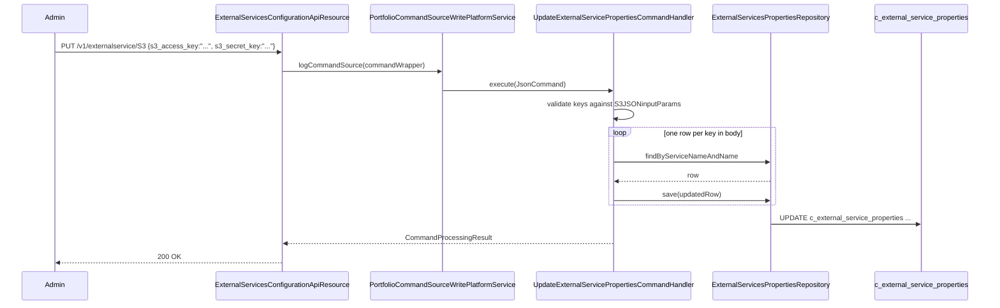

`ExternalServicesConfigurationApiResource` is the REST surface for the
per‑tenant `c_external_service_properties` table. It stores
configuration for third‑party services that Apache Fineract talks to —
S3, SMTP email, SMS gateway and the push‑notification provider — as
name/value rows that admins can edit at runtime. This page enumerates
the supported services, the per‑service keys, and the GET/PUT contract.

The resource lives at:
`fineract-provider/src/main/java/org/apache/fineract/infrastructure/configuration/api/ExternalServicesConfigurationApiResource.java`

## Class shape

```java
@Path("/v1/externalservice")
@Component
@Tag(name = "External Services", description = "External Services Configuration related to set of supported configurations for third party services like Amazon S3 and SMTP:\n" + ...)
@RequiredArgsConstructor
public class ExternalServicesConfigurationApiResource {

    private final PlatformSecurityContext context;
    private final ExternalServicesPropertiesReadPlatformService externalServicePropertiesReadPlatformService;
    private final ToApiJsonSerializer<ExternalServicesPropertiesData> toApiJsonSerializer;
    private final ApiRequestParameterHelper apiRequestParameterHelper;
    private final PortfolioCommandSourceWritePlatformService commandsSourceWritePlatformService;
    // ...
}
```

The permission resource name is `externalServiceConfiguration`. The
write path goes through `PortfolioCommandSourceWritePlatformService` so
edits are audited and maker‑checker‑eligible.

## Endpoint map

| Method | Path | Operation | Body | Permission |
| --- | --- | --- | --- | --- |
| `GET` | `/v1/externalservice/{servicename}` | List name/value pairs for one service | — | `READ_externalServiceConfiguration` |
| `PUT` | `/v1/externalservice/{servicename}` | Update one or more name/value pairs | `PutExternalServiceRequest` | Via command |

Service name is one of `S3`, `SMTP_Email_Account`, `MESSAGE_GATEWAY`,
`NOTIFICATION` (see catalog below).

## Service catalog

The supported service names and their valid keys are declared as Java
constants in
`fineract-provider/src/main/java/org/apache/fineract/infrastructure/configuration/service/ExternalServicesConstants.java`:

```java
public final class ExternalServicesConstants {

    public static final String S3_SERVICE_NAME   = "S3";
    public static final String S3_BUCKET_NAME    = "s3_bucket_name";
    public static final String S3_ACCESS_KEY     = "s3_access_key";
    public static final String S3_SECRET_KEY     = "s3_secret_key";

    public static final String SMTP_SERVICE_NAME = "SMTP_Email_Account";
    public static final String SMTP_USERNAME     = "username";
    public static final String SMTP_PASSWORD     = "password";
    public static final String SMTP_HOST         = "host";
    public static final String SMTP_PORT         = "port";
    public static final String SMTP_USE_TLS      = "useTLS";
    public static final String SMTP_FROM_EMAIL   = "fromEmail";
    public static final String SMTP_FROM_NAME    = "fromName";

    public static final String SMS_SERVICE_NAME  = "MESSAGE_GATEWAY";
    public static final String SMS_HOST          = "host_name";
    public static final String SMS_PORT          = "port_number";
    public static final String SMS_END_POINT     = "end_point";
    public static final String SMS_TENANT_APP_KEY = "tenant_app_key";

    public static final String NOTIFICATION_SERVICE_NAME = "NOTIFICATION";
    public static final String NOTIFICATION_SERVER_KEY    = "server_key";
    public static final String NOTIFICATION_GCM_END_POINT = "gcm_end_point";
    public static final String NOTIFICATION_FCM_END_POINT = "fcm_end_point";
}
```

Four services, each with its own set of valid name keys.

### S3 (`S3`)

Used by the document storage subsystem when
`fineract.content.s3.enabled=true` and by the report export pipeline.

| Key | Role |
| --- | --- |
| `s3_bucket_name` | Target S3 bucket |
| `s3_access_key` | Access key id (secret) |
| `s3_secret_key` | Secret access key (secret) |

These rows complement the static `fineract.content.s3.*` properties.
The properties pin the region/endpoint; the database rows hold the
per‑tenant credentials. See
[/core/document-management-domain](/core/document-management-domain).

### SMTP (`SMTP_Email_Account`)

Used by the email sender for password‑reset, account verification and
campaign emails.

| Key | Role |
| --- | --- |
| `username` | SMTP login user (secret) |
| `password` | SMTP login password (secret) |
| `host` | SMTP server hostname |
| `port` | SMTP server port |
| `useTLS` | `true`/`false` to enable STARTTLS |
| `fromEmail` | Default `From:` address |
| `fromName` | Default `From:` display name |

See the email/campaign domain for consumers
([campaigns/email‑configuration](/campaigns/email-configuration) in the
Wiki nav).

### SMS (`MESSAGE_GATEWAY`)

Used to forward SMS notifications through an external gateway (typically
the Mifos SMS gateway service).

| Key | Role |
| --- | --- |
| `host_name` | Gateway hostname |
| `port_number` | Gateway port |
| `end_point` | Gateway base path |
| `tenant_app_key` | Tenant‑scoped application key (secret) |

### Notification (`NOTIFICATION`)

Configures the push‑notification (FCM/GCM) integration used by the
mobile clients.

| Key | Role |
| --- | --- |
| `server_key` | FCM/GCM server key (secret) |
| `gcm_end_point` | Legacy GCM endpoint |
| `fcm_end_point` | Firebase Cloud Messaging endpoint |

## GET /v1/externalservice/{servicename}

```java
@GET
@Path("{servicename}")
@Consumes({ MediaType.APPLICATION_JSON })
@Produces({ MediaType.APPLICATION_JSON })
public String retrieveOne(@PathParam("servicename") final String serviceName,
        @Context final UriInfo uriInfo) {
    this.context.authenticatedUser().validateHasReadPermission(ExternalServiceConfigurationApiConstant.EXTERNAL_SERVICE_RESOURCE_NAME);
    final ApiRequestJsonSerializationSettings settings = this.apiRequestParameterHelper.process(uriInfo.getQueryParameters());
    final Collection<ExternalServicesPropertiesData> externalServiceNVPs = this.externalServicePropertiesReadPlatformService
            .retrieveOne(serviceName);
    return this.toApiJsonSerializer.serialize(settings, externalServiceNVPs,
            ExternalServiceConfigurationApiConstant.EXTERNAL_SERVICE_CONFIGURATION_DATA_PARAMETERS);
}
```

The response is an array of `{name, value}` pairs. Example:

```json
[
  { "name": "s3_bucket_name", "value": "fineract-prod-uploads" },
  { "name": "s3_access_key",  "value": "************" },
  { "name": "s3_secret_key",  "value": "************" }
]
```

The read service does not redact secret columns at the database level —
operators should restrict the `READ_externalServiceConfiguration`
permission to a small audit role and rely on TLS for in‑flight
protection.

## PUT /v1/externalservice/{servicename}

```java
@PUT
@Path("{servicename}")
@Consumes({ MediaType.APPLICATION_JSON })
@Produces({ MediaType.APPLICATION_JSON })
public String updateExternalServiceProperties(
        @PathParam("servicename") final String serviceName,
        @Parameter(hidden = true) final String apiRequestBodyAsJson) {
    final CommandWrapper commandRequest = new CommandWrapperBuilder()
            .updateExternalServiceProperties(serviceName)
            .withJson(apiRequestBodyAsJson).build();
    final CommandProcessingResult result = this.commandsSourceWritePlatformService.logCommandSource(commandRequest);
    return this.toApiJsonSerializer.serialize(result);
}
```

The body is a flat JSON object whose keys must match the catalog above
for the chosen service. Unknown keys are rejected by the JSON validator.

### Example: rotate S3 credentials

```http
PUT /fineract-provider/api/v1/externalservice/S3 HTTP/1.1
Authorization: Basic ...
Fineract-Platform-TenantId: default
Content-Type: application/json

{
  "s3_access_key": "<new key>",
  "s3_secret_key": "<new secret>"
}
```

Only the keys present in the body are updated. Leaving `s3_bucket_name`
out keeps the existing bucket.

### Example: enable TLS on SMTP

```http
PUT /fineract-provider/api/v1/externalservice/SMTP_Email_Account HTTP/1.1
Content-Type: application/json

{
  "host": "smtp.example.com",
  "port": "587",
  "useTLS": "true",
  "username": "<smtp user>",
  "password": "<smtp password>",
  "fromEmail": "noreply@example.com",
  "fromName": "Fineract"
}
```

`useTLS` is encoded as a string by the JSON parser; the consumer
(`PlatformEmailService` and friends) parses it with `Boolean.parseBoolean`.

### Example: SMS gateway endpoint

```http
PUT /fineract-provider/api/v1/externalservice/MESSAGE_GATEWAY HTTP/1.1
Content-Type: application/json

{
  "host_name": "sms.example.com",
  "port_number": "443",
  "end_point": "/api/v1/sms",
  "tenant_app_key": "<tenant key>"
}
```

### Example: FCM key for push notifications

```http
PUT /fineract-provider/api/v1/externalservice/NOTIFICATION HTTP/1.1
Content-Type: application/json

{
  "server_key": "<fcm server key>",
  "fcm_end_point": "https://fcm.googleapis.com/fcm/send"
}
```

## Allowed JSON keys per service

The constants file declares one enum per service that lists the legal
keys; the JSON validator uses these to reject unknown fields.

```java
public enum S3JSONinputParams {
    S3_ACCESS_KEY("s3_access_key"),
    S3_BUCKET_NAME("s3_bucket_name"),
    S3_SECRET_KEY("s3_secret_key");
}
public enum SMTPJSONinputParams {
    USERNAME("username"), PASSWORD("password"), HOST("host"),
    PORT("port"), USETLS("useTLS"),
    FROM_EMAIL("fromEmail"), FROM_NAME("fromName");
}
public enum SMSJSONinputParams {
    HASTNAME("host_name"), PORT("port_number"),
    END_POINT("end_point"), TENANT_APP_KEY("tenant_app_key");
}
public enum NotificationJSONinputParams {
    SERVER_KEY("server_key"), GCM_END_POINT("gcm_end_point"), FCM_END_POINT("fcm_end_point");
}
```

There is one shared enum across services for the row‑identifying inputs:

```java
public enum ExternalservicePropertiesJSONinputParams {
    EXTERNAL_SERVICE_ID("external_service_id"),
    NAME("name"),
    VALUE("value");
}
```

These names show up if you read the raw write‑side validation but
admins normally only need the per‑service key names above.

## Update flow



Each named key in the body becomes its own UPDATE — there is no
batch row in the table, just one row per `(service, name)` pair.

## Where these values are consumed

| Service | Consumer | Cross‑link |
| --- | --- | --- |
| `S3` | `ContentRepositoryFactory` / `S3ContentRepository` | [/core/document-management-domain](/core/document-management-domain) |
| `S3` | `ReportExportS3Service` | [Application Properties](/config/application-properties) |
| `SMTP_Email_Account` | `PlatformEmailService` | (campaigns module) |
| `MESSAGE_GATEWAY` | `SmsMessageScheduledJobService` | (campaigns module) |
| `NOTIFICATION` | `NotificationSenderService` | (notification module) |

The consumers fetch via `ExternalServicesPropertiesReadPlatformService.retrieveOne(serviceName)`
and lookup individual rows by name; they never inject the values from
properties.

## Permissions

| Permission code | Action |
| --- | --- |
| `READ_externalServiceConfiguration` | GET endpoint |
| `UPDATE_externalServiceConfiguration` | PUT endpoint |
| `UPDATE_externalServiceConfiguration_CHECKER` | Maker‑checker approve |

The casing follows the constant `EXTERNAL_SERVICE_RESOURCE_NAME =
"externalServiceConfiguration"`. Be careful — this is one of the few
permission codes in the platform that mixes camelCase into the suffix.

## Errors

| Code | Cause |
| --- | --- |
| 401 | Missing or invalid auth |
| 403 | Lacks `READ_externalServiceConfiguration` / `UPDATE_externalServiceConfiguration` |
| 404 | Unknown service name |
| 422 | Body contains a key not in the service's allowed enum |

There is no separate "row not found" 404 for PUT — if a key is valid
for the service but no row exists yet, the handler will create one.

## What does NOT live here

A few related things look like they belong but live elsewhere:

- **Static endpoint/region** — `fineract.content.s3.endpoint`,
  `fineract.content.s3.region`, `fineract.content.s3.path-style-addressing-enabled`
  are in `application.properties`. The per‑tenant keys are limited to
  the three secrets above.
- **OAuth2 client credentials** — go through Spring Security's own
  binding (`fineract.security.oauth2.client.registrations.*`), not
  `c_external_service_properties`.
- **Outbound webhook config** — the hook framework has its own tables
  (`m_hook`, `m_hook_configuration`).

## Related pages

- [Global Configuration API](/config/global-configuration-api) — the
  sibling resource for boolean / numeric feature flags.
- [Application Properties](/config/application-properties) — static S3
  / content properties.
- [/core/document-management-domain](/core/document-management-domain)
  — where the S3 credentials get consumed.
- [/core/commands-framework](/core/commands-framework) — how the PUT
  produces a command source row.
- [/security/security-services](/core/security-services) — permission
  surface around `externalServiceConfiguration`.
