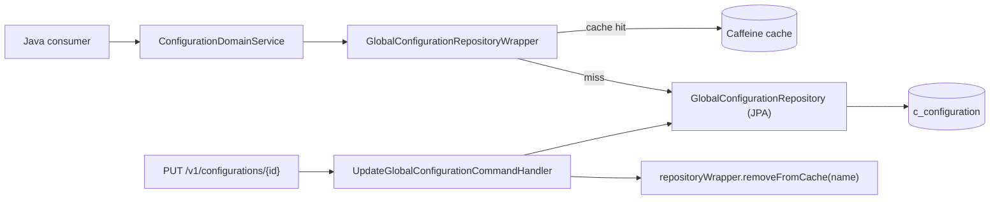

The `c_configuration` table is Apache Fineract's runtime feature‑flag
store. Each row is one `GlobalConfigurationProperty` entity keyed by a
stable `name`, and the platform reads it through
`ConfigurationDomainService` (or directly through the repository
wrapper). The names are declared as constants in
`fineract-core/src/main/java/org/apache/fineract/infrastructure/configuration/api/GlobalConfigurationConstants.java`,
which is the canonical source for what is shipped. This page groups
those names by area and tells you which Java code reads them.

To flip any of these at runtime, see
[Global Configuration API](/config/global-configuration-api). For the
entity model, see [/core/configuration-properties](/core/configuration-properties).

## Row shape

```java
@Entity
@Table(name = "c_configuration")
public class GlobalConfigurationProperty extends AbstractPersistableCustom<Long> {
    @Column(name = "name", nullable = false)         private String name;
    @Column(name = "enabled", nullable = false)      private boolean enabled;
    @Column(name = "value", nullable = true)         private Long value;
    @Column(name = "date_value", nullable = true)    private LocalDate dateValue;
    @Column(name = "string_value", nullable = true)  private String stringValue;
    @Column(name = "description", nullable = true)   private String description;
    @Column(name = "is_trap_door", nullable = false) private boolean isTrapDoor;
}
```

Five payload columns, one of which is "the" value depending on the
row:

| Column type | Example rows |
| --- | --- |
| Boolean only (`enabled`) | `maker-checker`, `allow-transactions-on-holiday`, `enable-address` |
| Numeric (`value`) | `rounding-mode`, `force-password-reset-days`, `penalty-wait-period` |
| Date (`date_value`) | `organisation-start-date` |
| String (`string_value`) | `report-export-s3-folder-name` |
| Boolean + numeric | `force-withdrawal-on-savings-account` (enabled) + `force-withdrawal-on-savings-account-limit` (value) |

The Liquibase changeset that introduces each row pre‑populates the
shipped default — values listed below are the defaults at HEAD.

## Workflow flags

Switches that control whether a request requires extra approval.

| Name | Default | Column | Consumer |
| --- | --- | --- | --- |
| `maker-checker` | `enabled=false` | boolean | `ConfigurationDomainService.isMakerCheckerEnabledForTask` → command pipeline |
| `enable-same-maker-checker` | `enabled=false` | boolean | `MakerCheckerService` — allow the same user to approve their own command |
| `max-login-retry-attempts` | `value=3` (when enabled) | numeric | `AppUserAuthenticationProvider`, locks user after N failed logins |
| `force-password-reset-days` | `value=180` (when enabled) | numeric | `AppUser` — force password reset every N days |
| `force-password-reset-on-first-login` | `enabled=false` | boolean | Login flow forces reset on first login |
| `password-reuse-check-history-count` | `value=10` | numeric | Validates new passwords against last N history entries |

## Business‑date and COB flags

The day‑close pipeline is gated by these.

| Name | Default | Column | Consumer |
| --- | --- | --- | --- |
| `enable-business-date` | `enabled=false`, **trap‑door** | boolean | `BusinessDateAspect`, `BusinessDateReadPlatformService` — switches from `LocalDate.now()` to the stored `BUSINESS_DATE` |
| `enable-automatic-cob-date-adjustment` | `enabled=true`, **trap‑door** | boolean | Loan COB worker — auto‑advance COB date |
| `enable-cob-bulk-event` | `enabled=false` | boolean | Loan COB external event publisher |
| `enable-post-reversal-txns-for-reverse-transactions` | `enabled=false` | boolean | Loan reversal pipeline — emit reverse transaction event |

See [/core/business-date](/core/business-date).

## Holiday / non‑working‑day flags

| Name | Default | Consumer |
| --- | --- | --- |
| `allow-transactions-on-non-workingday` | `enabled=false` | Transaction validators block writes on non‑working days unless enabled |
| `reschedule-repayments-on-holidays` | `enabled=false` | Holiday handler reschedules repayments off holidays |
| `allow-transactions-on-holiday` | `enabled=false` | Transaction validators block writes on holidays unless enabled |
| `reschedule-future-repayments` | `enabled=false` | Holiday handler reschedules future repayments |

## Account / number flags

| Name | Default | Column | Consumer |
| --- | --- | --- | --- |
| `custom-account-number-length` | `value=4`–`12` | numeric | `AccountNumberGenerator` — pad to N digits |
| `random-account-number` | `enabled=false` | boolean | `AccountNumberGenerator` — random instead of sequential |
| `enable-auto-generated-external-id` | `enabled=false` | boolean | `ExternalIdFactory` — generate `ExternalId` if request omits it |
| `enable-address` | `enabled=false` | boolean | Address subsystem — registers JPA mappings only when enabled |

See [/core/account-number-format](/core/account-number-format) and
[/core/external-id-and-identifiers](/core/external-id-and-identifiers).

## Money / rounding

| Name | Default | Column | Consumer |
| --- | --- | --- | --- |
| `rounding-mode` | `value=6` (HALF_EVEN) | numeric | `MoneyHelper.getRoundingMode()` — cached per tenant |
| `daily-tpt-limit` | `value=0` (when enabled) | numeric | TPT (third‑party transfer) limit per day |
| `office-opening-balances-contra-account` | `value=<account_id>` | numeric | Accounting opening balance contra GL |
| `office-specific-products-enabled` | `enabled=false` | boolean | Loan/savings product visibility by office |
| `restrict-products-to-user-office` | `enabled=false` | boolean | Sibling switch enforcing the above |

The `rounding-mode` row interpretation is documented in
[Internal Configurations API](/config/internal-configurations-api).

## Datatables / constraint approach

| Name | Default | Consumer |
| --- | --- | --- |
| `constraint-approach-for-datatables` | `enabled=false` | `ReadWriteNonCoreDataService` switches between trigger‑based and constraint‑based linkage |
| `account-mapping-for-payment-type` | `enabled=false` | Accounting service uses payment‑type to GL mapping |
| `account-mapping-for-charge` | `enabled=false` | Accounting service uses charge to GL mapping |

See [/core/dataqueries](/core/dataqueries).

## Loan flags

| Name | Default | Column | Consumer |
| --- | --- | --- | --- |
| `meetings-mandatory-for-jlg-loans` | `enabled=false` | boolean | JLG loan validator requires a meeting schedule |
| `penalty-wait-period` | `value=2` | numeric | Penalty job grace period in days |
| `grace-on-penalty-posting` | `value=0` | numeric | Days to skip before penalty accrues |
| `paymenttype-applicable-for-disbursement-charges` | `enabled=false` | boolean | Lets disbursement charges depend on payment type |
| `interest-charged-from-date-same-as-disbursal-date` | `enabled=false` | boolean | Backdate interest to disbursal date |
| `skip-repayment-on-first-day-of-month` | `enabled=false` | boolean | Repayment scheduler skips day 1 |
| `change-emi-if-repaymentdate-same-as-disbursementdate` | `enabled=false` | boolean | Adjusts first EMI when due date == disbursal date |
| `loan-reschedule-is-first-payday-allowed-on-holiday` | `enabled=false` | boolean | Reschedule may land first payday on a holiday |
| `is-interest-to-be-recovered-first-when-greater-than-emi` | `enabled=false` | boolean | Repayment allocation order tweak |
| `is-principal-compounding-disabled-for-overdue-loans` | `enabled=false` | boolean | Stops principal compounding on overdue loans |
| `backdate-penalties-enabled` | `enabled=true` | boolean | Penalty jobs may apply to past dates |
| `sub-rates` | `enabled=false` | boolean | Enables sub‑rate calculation on loans |
| `allow-backdated-transaction-before-interest-posting` | `enabled=false` | boolean | Permit backdated tx before last interest post |
| `allow-backdated-transaction-before-interest-posting-date-for-days` | `value=0` | numeric | Window in days for the above |
| `loan-arrears-delinquency-display-data` | `enabled=false` | boolean | Show extended delinquency aging buckets |
| `charge-accrual-date` | `string_value=…` | string | Selects accrual basis (`due-date` vs. `disbursement-date`, etc.) |
| `enable-immediate-charge-accrual-post-maturity` | `enabled=false` | boolean | Accrue charges immediately after maturity |
| `enable-originator-creation-during-loan-application` | `enabled=false` | boolean | Loan origination — creates originator alongside application |
| `days-before-repayment-is-due` | `value=…` | numeric | Repayment reminder lookahead |
| `days-after-repayment-is-overdue` | `value=…` | numeric | Overdue grace before delinquency mark |
| `next-payment-due-date` | `string_value=…` | string | Selects how next payment date is computed |

## Savings flags

| Name | Default | Column | Consumer |
| --- | --- | --- | --- |
| `savings-interest-posting-current-period-end` | `enabled=false`, **trap‑door** | boolean | Interest posting on last day of period instead of first day of next |
| `financial-year-beginning-month` | `value=1`, **trap‑door** | numeric | Month (1–12) for fiscal year start; drives interest posting periods |
| `fixed-deposit-transfer-interest-next-day-for-period-end-posting` | `enabled=false` | boolean | FD interest transfer timing |
| `allow-force-withdrawal-on-savings-account` | `enabled=false` | boolean | Permits forced withdrawal beyond standard rules |
| `force-withdrawal-on-savings-account-limit` | `value=…` | numeric | Limit for the above |

## Group / client flags

| Name | Default | Column | Consumer |
| --- | --- | --- | --- |
| `min-clients-in-group` | `value=5` | numeric | Group activation validation |
| `max-clients-in-group` | `value=100` | numeric | Group activation validation |
| `organisation-start-date` | `date_value=…` | date | Earliest allowed effective date across the platform |

## External assets / investor

| Name | Default | Column | Consumer |
| --- | --- | --- | --- |
| `asset-externalization-of-non-active-loans` | `enabled=false` | boolean | Investor module — allow externalising non‑active loans |
| `outstanding-interest-calculation-strategy-for-external-asset-transfer` | `string_value=…` | string | Picks interest computation strategy for transfers |
| `allowed-loan-statuses-for-external-asset-transfer` | `string_value=…` | string | CSV of permitted statuses |
| `allowed-loan-statuses-of-delayed-settlement-for-external-asset-transfer` | `string_value=…` | string | CSV of statuses allowing delayed settlement |

## Events and integrations

| Name | Default | Column | Consumer |
| --- | --- | --- | --- |
| `purge-external-events-older-than-days` | `value=30` | numeric | Purge job retention window |
| `purge-processed-commands-older-than-days` | `value=30` | numeric | Command audit purge retention |
| `external-event-batch-size` | `value=…` | numeric | Reader batch size for external event publisher |
| `report-export-s3-folder-name` | `string_value=exports` | string | Folder prefix used by the S3 report exporter |
| `enable-payment-hub-integration` | `enabled=false` | boolean | Payment Hub EE adapter |

See [/events/purge-events-job](/events/purge-events-job) and
[/events/external-event-domain](/events/external-event-domain).

## Amazon S3 row

A historical row exists under the `amazon-s3` name; the canonical
storage flag today is `fineract.content.s3.enabled` in `application.properties`,
but the database row still ships for backward compatibility.

| Name | Default | Column |
| --- | --- | --- |
| `amazon-s3` | `enabled=false` | boolean |

## Trap‑door rows summary

The following rows are seeded with `is_trap_door=true` and refuse the
public PUT once turned on. To roll them back during tests, use the
[Internal Configurations API](/config/internal-configurations-api).

- `enable-business-date`
- `enable-automatic-cob-date-adjustment`
- `savings-interest-posting-current-period-end`
- `financial-year-beginning-month`

(The exact set evolves with Liquibase changesets — the source of truth
is the `is_trap_door` column at runtime, not this list.)

## How code reads these

Two patterns dominate:

1. **Through `ConfigurationDomainService`** — most boolean flags get a
   dedicated method like `isMakerCheckerEnabledForTask(...)`,
   `isAllowTransactionsOnNonWorkingDayEnabled()`,
   `isEnableAutomaticCobDateAdjustment()`. The interface lives in
   `fineract-core/src/main/java/org/apache/fineract/infrastructure/configuration/domain/ConfigurationDomainService.java`
   and grows with the catalog.

2. **Through the repository wrapper** — for value‑bearing rows the
   consumer often does:

```java
GlobalConfigurationProperty config = repositoryWrapper.findOneByNameWithNotFoundDetection("rounding-mode");
Long value = config.getValue();
RoundingMode mode = RoundingMode.values()[value.intValue()];
```

Either path is cached in the wrapper, and writes through
`GlobalConfigurationApiResource` invalidate the right entry by name.

## Lookup index



## Adding a new flag

When you ship a new feature flag:

1. Add a `public static final String NEW_FLAG = "new-flag";` to
   `GlobalConfigurationConstants`.
2. Ship a Liquibase changeset that inserts the row with the desired
   `enabled`/`value`/`description`/`is_trap_door` defaults.
3. Add a typed accessor on `ConfigurationDomainService` (e.g.
   `boolean isNewFlagEnabled()`) and implement it in
   `ConfigurationDomainServiceJpa` so consumers don't repeat the lookup
   pattern.
4. Document the row in this page.

For non‑trap‑door numeric values, lean on
`GlobalConfigurationProperty.getValue()` directly; for booleans, prefer
the typed service for IDE‑discoverability.

## Related pages

- [Global Configuration API](/config/global-configuration-api) — list
  and update endpoints.
- [Internal Configurations API](/config/internal-configurations-api) —
  trap‑door override for tests.
- [External Services Config](/config/external-services-config) — sister
  table for service credentials.
- [/core/configuration-properties](/core/configuration-properties) —
  the entity, repository wrapper and `ConfigurationDomainService`.
- [/core/business-date](/core/business-date) — `enable-business-date`
  consumer.
- [/core/account-number-format](/core/account-number-format) —
  `custom-account-number-length` consumer.
- [/events/external-event-domain](/events/external-event-domain) —
  `purge-external-events-older-than-days`,
  `external-event-batch-size` consumers.
