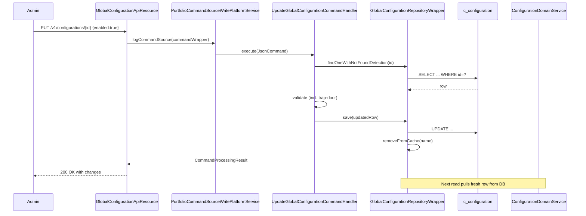

`GlobalConfigurationApiResource` is the public REST entry point that
admins use to read and flip rows in the `c_configuration` table. Every
named flag — `maker-checker`, `allow-transactions-on-holiday`,
`enable-business-date`, `rounding-mode`, the long catalog of feature
toggles — flows through this resource. This page is the operational
reference: the URI map, the trap‑door rules and how the command
pipeline wraps every write.

The class lives at:
`fineract-provider/src/main/java/org/apache/fineract/infrastructure/configuration/api/GlobalConfigurationApiResource.java`

## Class‑level annotations

```java
@Path("/v1/configurations")
@Component
@Tag(name = "Global Configuration", description = "Global configuration related to set of supported enable/disable configurations...")
@RequiredArgsConstructor
public class GlobalConfigurationApiResource {

    private static final Set<String> RESPONSE_DATA_PARAMETERS = new HashSet<>(Arrays.asList("globalConfiguration"));
    private static final String RESOURCE_NAME_FOR_PERMISSIONS = "CONFIGURATION";

    private final PlatformSecurityContext context;
    private final ConfigurationReadPlatformService readPlatformService;
    private final DefaultToApiJsonSerializer<GlobalConfigurationData> toApiJsonSerializer;
    private final DefaultToApiJsonSerializer<GlobalConfigurationPropertyData> propertyDataJsonSerializer;
    private final ApiRequestParameterHelper apiRequestParameterHelper;
    private final PortfolioCommandSourceWritePlatformService commandsSourceWritePlatformService;
    // ...
}
```

The resource sits at `/v1/configurations` (preceded by the global
context root `/fineract-provider/api`). All write paths route through
`PortfolioCommandSourceWritePlatformService`, so they become auditable
`CommandSource` rows that maker‑checker can hold for approval.

## Endpoint map

| Method | Path | Operation | Body | Permission |
| --- | --- | --- | --- | --- |
| `GET` | `/v1/configurations` | List all flags (optional `?survey=true`) | — | `READ_CONFIGURATION` |
| `GET` | `/v1/configurations/{configId}` | Read single flag by id | — | `READ_CONFIGURATION` |
| `GET` | `/v1/configurations/name/{name}` | Read single flag by name | — | `READ_CONFIGURATION` |
| `PUT` | `/v1/configurations/{configId}` | Update by id | `PutGlobalConfigurationsRequest` | Via command |
| `PUT` | `/v1/configurations/name/{configName}` | Update by name | `PutGlobalConfigurationsRequest` | Via command |

There is **no `POST`** — `c_configuration` rows are seeded by Liquibase
changesets shipped with the build. Admins can flip, not create.

## GET /v1/configurations

```java
@GET
@Consumes({ MediaType.APPLICATION_JSON })
@Produces({ MediaType.APPLICATION_JSON })
@Operation(summary = "Retrieve Global Configuration | Retrieve Global Configuration for surveys", ...)
public String retrieveConfiguration(@Context final UriInfo uriInfo,
        @DefaultValue("false") @QueryParam("survey") @Parameter(description = "survey") final boolean survey) {

    this.context.authenticatedUser().validateHasReadPermission(RESOURCE_NAME_FOR_PERMISSIONS);

    final GlobalConfigurationData configurationData = this.readPlatformService.retrieveGlobalConfiguration(survey);

    final ApiRequestJsonSerializationSettings settings = this.apiRequestParameterHelper.process(uriInfo.getQueryParameters());
    return this.toApiJsonSerializer.serialize(settings, configurationData, RESPONSE_DATA_PARAMETERS);
}
```

The optional `?survey=true` query param flips the read service to return
only the survey‑related flags rather than the full catalog. The default
(`false`) returns every row in `c_configuration`.

Response shape (one element per row):

```json
{
  "globalConfiguration": [
    {
      "id": 1,
      "name": "maker-checker",
      "enabled": false,
      "value": null,
      "dateValue": null,
      "stringValue": null,
      "description": "Enable maker-checker workflow",
      "trapDoor": false
    },
    {
      "id": 21,
      "name": "rounding-mode",
      "enabled": true,
      "value": 6,
      "trapDoor": false
    }
  ]
}
```

## GET /v1/configurations/{configId} and /name/{name}

Two convenience reads:

```java
@GET
@Path("{configId}")
public String retrieveOne(@PathParam("configId") final Long configId, @Context final UriInfo uriInfo) {
    this.context.authenticatedUser().validateHasReadPermission(RESOURCE_NAME_FOR_PERMISSIONS);
    final GlobalConfigurationPropertyData configurationData = this.readPlatformService.retrieveGlobalConfiguration(configId);
    // ...
}

@GET
@Path("name/{name}")
public String retrieveOneByName(@PathParam("name") final String name, @Context final UriInfo uriInfo) {
    this.context.authenticatedUser().validateHasReadPermission(RESOURCE_NAME_FOR_PERMISSIONS);
    final GlobalConfigurationPropertyData configurationData = this.readPlatformService.retrieveGlobalConfiguration(name);
    // ...
}
```

Use the name form whenever the calling code can hard‑code the flag —
the ids are not stable across deployments because Liquibase assigns
them in changeset order.

## PUT /v1/configurations/{configId}

```java
@PUT
@Path("{configId}")
public String updateConfiguration(@PathParam("configId") final Long configId,
        @Parameter(hidden = true) final String apiRequestBodyAsJson) {

    final CommandWrapper commandRequest = new CommandWrapperBuilder() //
            .updateGlobalConfiguration(configId) //
            .withJson(apiRequestBodyAsJson) //
            .build();

    final CommandProcessingResult result = this.commandsSourceWritePlatformService.logCommandSource(commandRequest);
    return this.toApiJsonSerializer.serialize(result);
}
```

Body example:

```json
{
  "enabled": true,
  "value": 7,
  "dateValue": "2024-01-01",
  "stringValue": "some-value"
}
```

Not every column applies to every flag. The validator
(`GlobalConfigurationDataValidator`) checks which of `enabled`, `value`,
`dateValue`, `stringValue` are meaningful for the named row.

The call goes through `CommandWrapperBuilder.updateGlobalConfiguration`,
which sets `actionName = "UPDATE"`, `entityName = "CONFIGURATION"` and
the supplied id. `PortfolioCommandSourceWritePlatformService` routes it
through the regular command pipeline, so the update is logged in
`m_portfolio_command_source` and goes through maker‑checker if the
admin has only `CHECKER_UPDATE_CONFIGURATION` permission.

Returned `CommandProcessingResult` carries the `resourceId` and a
`changes` map describing the columns that were actually updated.

## PUT /v1/configurations/name/{configName}

```java
@PUT
@Path("/name/{configName}")
public String updateConfigurationByName(@PathParam("configName") final String configName,
        @Parameter(hidden = true) final String apiRequestBodyAsJson) {

    // TODO: Would be better to support string based identifier in Commands and resolve the entity by name in the
    // service
    final GlobalConfigurationPropertyData configurationData = this.readPlatformService.retrieveGlobalConfiguration(configName);

    final CommandWrapper commandRequest = new CommandWrapperBuilder() //
            .updateGlobalConfiguration(configurationData.getId()) //
            .withJson(apiRequestBodyAsJson) //
            .build();

    final CommandProcessingResult result = this.commandsSourceWritePlatformService.logCommandSource(commandRequest);
    return this.toApiJsonSerializer.serialize(result);
}
```

The TODO comment makes the implementation strategy explicit: the
resource resolves the name to an id, then re‑uses the id‑based command.
A future cleanup will move that resolution into the command itself so
the audit row carries the name verbatim.

## Trap‑door flags

`GlobalConfigurationProperty.isTrapDoor` is a one‑way switch. The
column is set by Liquibase on rows that *must not* be flipped back once
turned on, because the data shape diverges afterwards.

```java
@Column(name = "is_trap_door", nullable = false)
private boolean isTrapDoor;
```

When the validator sees a request to disable a row whose `isTrapDoor`
is `true`, it throws `GlobalConfigurationException` (a 403 error) and
the command never executes. Examples of trap‑door rows are
`enable-business-date`, `enable-automatic-cob-date-adjustment` and the
business‑step‑configuration switches — flipping them back leaves the
platform in an inconsistent state.

The only way to override a trap‑door row is the
`InternalConfigurationsApiResource`, which is gated behind the `test`
Spring profile. See
[Internal Configurations API](/config/internal-configurations-api).

## Reading the rows from Java

Application code uses `ConfigurationDomainService` (an interface in
`fineract-core`) for typed access:

```java
// e.g. in CommandProcessingService
if (configurationDomainService.isMakerCheckerEnabledForTask(commandAction, entityName)) {
    // hold the command for approval
}
```

The implementation is backed by `GlobalConfigurationRepositoryWrapper`,
which adds a small Caffeine cache around the JPA repository. Every
write through `GlobalConfigurationApiResource.updateConfiguration`
invalidates the cache for the affected name.

## Cache invalidation flow



## Permissions

The resource declares its permission resource name as `CONFIGURATION`.
Liquibase seeds the matching permission rows in `m_permission`:

| Permission code | Action |
| --- | --- |
| `READ_CONFIGURATION` | GET endpoints |
| `UPDATE_CONFIGURATION` | PUT endpoints |
| `UPDATE_CONFIGURATION_CHECKER` | Maker‑checker approve |

Roles that should administer global configuration must be granted these
codes. See [/security/security-services](/core/security-services).

## Survey configuration variant

The optional `?survey=true` query param keys a separate set of rows
that the platform groups under "survey configuration". These are read‑
side options for the survey domain (questionnaire visibility flags).
They live in `c_configuration` like every other row, but the read
service splits them out via the `is_survey` filter so the UI can render
a different settings page.

## Searchtemplate

Some Fineract resources expose a `/searchtemplate` sibling endpoint to
populate dropdown/lookup lists. `GlobalConfigurationApiResource` does
not — the catalog is small and the UI hard‑codes the row names it knows
about. Use `GET /v1/configurations` and filter client‑side if you need
a dropdown.

## Error responses

| Code | Cause |
| --- | --- |
| 401 | Missing or invalid auth |
| 403 | User lacks `READ_CONFIGURATION` / `UPDATE_CONFIGURATION` |
| 403 | Attempt to disable a trap‑door row |
| 404 | Unknown `configId` or `name` |
| 422 | Invalid body (e.g. wrong column type for the named row) |

The trap‑door rejection surfaces as a `GlobalConfigurationException`
with code `error.msg.global.configuration.cannot.update.trap.door`.

## Walkthrough: enabling maker‑checker

```http
PUT /fineract-provider/api/v1/configurations/name/maker-checker HTTP/1.1
Authorization: Basic ...
Fineract-Platform-TenantId: default
Content-Type: application/json

{
  "enabled": true
}
```

Response:

```json
{
  "officeId": null,
  "groupId": null,
  "clientId": null,
  "loanId": null,
  "savingsId": null,
  "resourceId": 12,
  "changes": {
    "enabled": true
  }
}
```

After this call, any subsequent command that requires maker‑checker
(by hitting `ConfigurationDomainService.isMakerCheckerEnabledForTask`)
will be held for approval rather than executed inline.

## Walkthrough: changing rounding mode

`rounding-mode` is the canonical example of a "value" flag — the
`enabled` column is ignored and the `value` column carries a `RoundingMode`
ordinal.

```http
PUT /fineract-provider/api/v1/configurations/name/rounding-mode HTTP/1.1
Content-Type: application/json

{
  "value": 6
}
```

Internally the update fires `MoneyHelperInitializationService` once the
command commits, so subsequent `MoneyHelper.getRoundingMode()` calls
pick up the new mode without a restart.

## Walkthrough: setting a string value

The `report-export-s3-folder-name` row uses the `stringValue` column.

```http
PUT /fineract-provider/api/v1/configurations/name/report-export-s3-folder-name HTTP/1.1
Content-Type: application/json

{
  "enabled": true,
  "stringValue": "exports/daily"
}
```

The validator ensures the name expects a string before accepting the
update.

## Related pages

- [Feature Flags](/config/feature-flags) — the catalog of named rows
  and which code reads them.
- [External Services Config](/config/external-services-config) — the
  cousin resource for S3/SMTP/SMS/NOTIFICATION key‑value rows.
- [Instance Mode API](/config/instance-mode-api) — runtime mutation of
  `FineractProperties.mode` (separate from `c_configuration`).
- [Internal Configurations API](/config/internal-configurations-api) —
  trap‑door override for tests.
- [/core/configuration-properties](/core/configuration-properties) —
  the entity, repository wrapper and `ConfigurationDomainService` in
  detail.
- [/core/commands-framework](/core/commands-framework) — how the PUT
  becomes a command source row.
- [/security/security-services](/core/security-services) — the
  `CONFIGURATION` permission surface.
