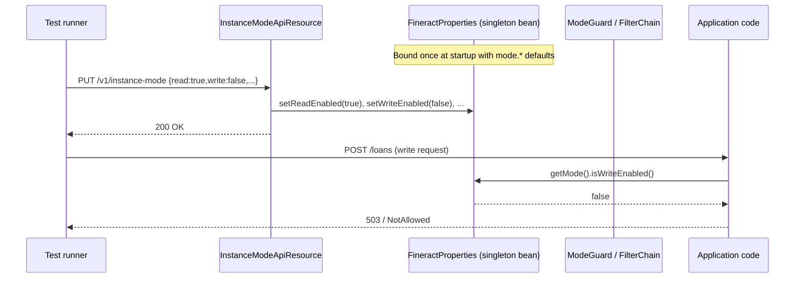

`InstanceModeApiResource` is a runtime mutation endpoint that lets
integration tests flip the four `fineract.mode.*` flags on a running
Apache Fineract JVM without restarting. It is the *only* sanctioned
path that rewrites `FineractProperties` after Spring has bound it. The
endpoint is gated behind the `test` Spring profile precisely because
mutating `@ConfigurationProperties` at runtime breaks Spring's
single‑binding model — useful for end‑to‑end tests, dangerous in
production.

The class lives at:
`fineract-provider/src/main/java/org/apache/fineract/infrastructure/instancemode/api/InstanceModeApiResource.java`

## What instance mode means

Each Fineract JVM can play any combination of four roles. The roles
come from `FineractProperties.FineractModeProperties`:

```java
@Getter @Setter
public static class FineractModeProperties {
    private boolean readEnabled;
    private boolean writeEnabled;
    private boolean batchWorkerEnabled;
    private boolean batchManagerEnabled;

    public boolean isReadOnlyMode() {
        return readEnabled && !writeEnabled && !batchWorkerEnabled && !batchManagerEnabled;
    }
}
```

| Flag | Property | Default | Role |
| --- | --- | --- | --- |
| `readEnabled` | `fineract.mode.read-enabled` | `true` | Serves GET endpoints; routes to read‑replica datasource when configured |
| `writeEnabled` | `fineract.mode.write-enabled` | `true` | Serves PUT/POST/DELETE endpoints |
| `batchWorkerEnabled` | `fineract.mode.batch-worker-enabled` | `true` | Runs Spring Batch partition workers |
| `batchManagerEnabled` | `fineract.mode.batch-manager-enabled` | `true` | Runs Spring Batch manager (job launcher, scheduler) |

The "all four true" combination is the default and matches the monolith.
Splitting a cluster into read‑only replicas, write nodes and batch
workers is done by setting different envs on each JVM at boot.

## Class shape

```java
@Profile(FineractProfiles.TEST)
@Component
@Path("/v1/instance-mode")
@Tag(name = "Instance Mode", description = "Instance mode changing API")
@RequiredArgsConstructor
@Slf4j
public class InstanceModeApiResource implements InitializingBean {

    private final FineractProperties fineractProperties;

    @Override
    @SuppressFBWarnings("SLF4J_SIGN_ONLY_FORMAT")
    public void afterPropertiesSet() throws Exception {
        log.warn("------------------------------------------------------------");
        log.warn("                                                            ");
        log.warn("DO NOT USE THIS IN PRODUCTION!");
        log.warn("Instance type changing feature is enabled");
        log.warn("DO NOT USE THIS IN PRODUCTION!");
        log.warn("                                                            ");
        log.warn("------------------------------------------------------------");
    }
    // ...
}
```

Three things to notice:

1. `@Profile(FineractProfiles.TEST)` — the bean is only registered when
   the `test` profile is active. If your JVM has not been started with
   `SPRING_PROFILES_ACTIVE=test`, this resource doesn't exist and the
   URL returns 404.
2. `implements InitializingBean` plus the loud warning banner — the
   moment the bean is constructed, the log gets a multi‑line shout to
   make it impossible to miss in a tail of any startup.
3. `FineractProperties` is injected and mutated in place, not replaced.
   Because Spring beans hold references to the same instance, the
   change is visible everywhere instantly.

## Endpoint map

| Method | Path | Operation | Body | Profile |
| --- | --- | --- | --- | --- |
| `PUT` | `/v1/instance-mode` | Rewrite all four mode flags | `ChangeInstanceModeRequest` | `test` only |

There is no GET, no per‑flag PUT, no DELETE. The body must carry all
four booleans every time; the contract is "replace the mode state".

## Request schema

```java
public class InstanceModeApiResourceSwagger {

    @ToString
    @Schema(description = "ChangeInstanceModeRequest")
    @Getter
    public static final class ChangeInstanceModeRequest {

        @Schema(required = true, example = "true")
        public boolean readEnabled;
        @Schema(required = true, example = "true")
        public boolean writeEnabled;
        @Schema(required = true, example = "true")
        public boolean batchWorkerEnabled;
        @Schema(required = true, example = "true")
        public boolean batchManagerEnabled;
    }
}
```

All four fields are required. Sending a partial body leaves the missing
flags as Jackson's default (`false`), so be explicit.

## PUT /v1/instance-mode

```java
@PUT
@Consumes({ MediaType.APPLICATION_JSON })
@Operation(summary = "Changes the Fineract instance mode", description = "")
@RequestBody(required = true, content = @Content(schema = @Schema(implementation = InstanceModeApiResourceSwagger.ChangeInstanceModeRequest.class)))
@ApiResponse(responseCode = "200", description = "OK")
@SuppressFBWarnings("SLF4J_SIGN_ONLY_FORMAT")
public Response changeMode(InstanceModeApiResourceSwagger.ChangeInstanceModeRequest request) {
    log.warn("------------------------------------------------------------");
    log.warn("                                                            ");
    log.warn("Changing instance mode according to the request parameters {}", request);
    log.warn("                                                            ");
    log.warn("------------------------------------------------------------");
    fineractProperties.getMode().setReadEnabled(request.isReadEnabled());
    fineractProperties.getMode().setWriteEnabled(request.isWriteEnabled());
    fineractProperties.getMode().setBatchWorkerEnabled(request.isBatchWorkerEnabled());
    fineractProperties.getMode().setBatchManagerEnabled(request.isBatchManagerEnabled());
    return Response.ok().build();
}
```

The body is JSON; the four setters are called in the order
read → write → batchWorker → batchManager. The endpoint returns a bare
HTTP 200 — no body, no command source row. The change is in‑memory
only and reverts on the next JVM restart.

## Constants

The shipped constants file lists the *legacy* property names, slightly
different from the live `FineractModeProperties` fields:

```java
public final class FineractInstanceModeConstants {
    public static final String FINERACT_MODE_READ_ENABLE_PROPERTY  = "fineract.mode.read-enabled";
    public static final String FINERACT_MODE_WRITE_ENABLE_PROPERTY = "fineract.mode.write-enabled";
    public static final String FINERACT_MODE_BATCH_ENABLE_PROPERTY = "fineract.mode.batch-enabled";
}
```

Note the constants only carry three keys — the older shape had a single
`batch-enabled` flag before the worker/manager split. The constants are
kept for backward compatibility but the live binding follows
`FineractModeProperties` (four flags).

## Example: make the JVM read‑only

```http
PUT /fineract-provider/api/v1/instance-mode HTTP/1.1
Authorization: Basic ...
Fineract-Platform-TenantId: default
Content-Type: application/json

{
  "readEnabled": true,
  "writeEnabled": false,
  "batchWorkerEnabled": false,
  "batchManagerEnabled": false
}
```

After this call, `FineractProperties.getMode().isReadOnlyMode()` returns
`true` and subsequent write requests fail at the read/write guard in
the filter chain.

## Example: make the JVM a batch‑only worker

```http
PUT /fineract-provider/api/v1/instance-mode HTTP/1.1
Content-Type: application/json

{
  "readEnabled": false,
  "writeEnabled": false,
  "batchWorkerEnabled": true,
  "batchManagerEnabled": false
}
```

## Example: re‑enable everything

```http
PUT /fineract-provider/api/v1/instance-mode HTTP/1.1
Content-Type: application/json

{
  "readEnabled": true,
  "writeEnabled": true,
  "batchWorkerEnabled": true,
  "batchManagerEnabled": true
}
```

## Flow



## Why this is test‑only

`FineractProperties` is a `@ConfigurationProperties` singleton. The
Spring contract is "bind once, treat as immutable". Mutating it at
runtime works because the implementation uses plain `setX` Lombok
methods rather than constructor binding — but it relies on every
consumer reading the field through `fineractProperties.getMode().is*Enabled()`
rather than caching the boolean. Most of the platform follows that rule,
but not every dependency does, and the inconsistency would make
mid‑flight mode changes flaky in production.

The `test` profile gate keeps the surface area limited to the
integration test runner, which can flip the mode between test cases to
exercise both branches of every guard.

## What is NOT here

- **Persistence** — the change does not write to any table. Restart and
  the original `fineract.mode.*` defaults come back.
- **Permission check** — `InstanceModeApiResource` does not call
  `validateHasReadPermission` or similar. The `test` profile gate is
  the only authorisation.
- **Maker‑checker** — bypassed; no command source row is created.
- **Multi‑node coordination** — the change is local to one JVM. In a
  cluster you would need to call each node.

## Production alternatives

If you need to change role per JVM in production, do it at boot, not
runtime:

```bash
# Read replica
export FINERACT_MODE_READ_ENABLED=true
export FINERACT_MODE_WRITE_ENABLED=false
export FINERACT_MODE_BATCH_WORKER_ENABLED=false
export FINERACT_MODE_BATCH_MANAGER_ENABLED=false

# Write node
export FINERACT_MODE_READ_ENABLED=false
export FINERACT_MODE_WRITE_ENABLED=true
export FINERACT_MODE_BATCH_WORKER_ENABLED=false
export FINERACT_MODE_BATCH_MANAGER_ENABLED=false

# Batch worker
export FINERACT_MODE_READ_ENABLED=false
export FINERACT_MODE_WRITE_ENABLED=false
export FINERACT_MODE_BATCH_WORKER_ENABLED=true
export FINERACT_MODE_BATCH_MANAGER_ENABLED=false
```

Then put a load balancer in front that routes GET to read replicas,
write methods to write nodes, and leaves batch workers off the public
ingress.

## Related pages

- [FineractProperties Reference](/config/fineract-properties) — the
  `FineractModeProperties` nested class.
- [Application Properties](/config/application-properties) — the four
  `fineract.mode.*` shipped defaults.
- [Internal Configurations API](/config/internal-configurations-api) —
  the sibling `test`‑profile endpoint that flips trap‑door DB rows.
- [/core/instance-mode](/core/instance-mode) — how the mode flags are
  consumed by filter and datasource routing.
- [/runtime/spring-boot-configuration](/runtime/spring-boot-configuration)
  — how the `test` profile is activated.
- [/jobs/scheduler-and-quartz](/jobs/scheduler-and-quartz) — what
  `batchManagerEnabled` actually starts.
