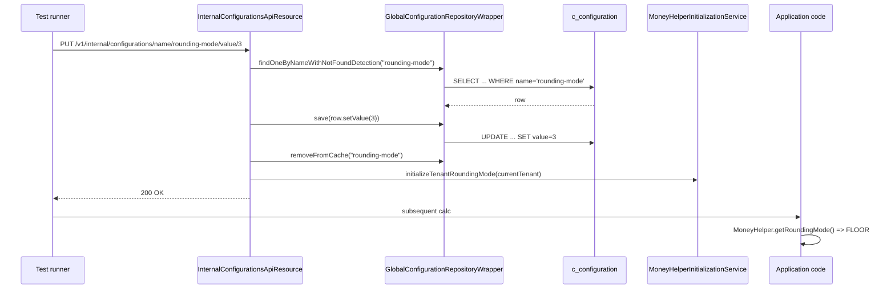

`InternalConfigurationsApiResource` is the diagnostic back door that
lets integration tests set `c_configuration` rows directly, bypassing
the trap‑door check that `GlobalConfigurationApiResource` enforces.
Like its sibling `InstanceModeApiResource`, it lives behind the `test`
Spring profile and shouts a banner on construction. This page documents
its single endpoint, its semantics and the small set of side effects
the platform attaches to specific row names.

The class lives at:
`fineract-provider/src/main/java/org/apache/fineract/infrastructure/configuration/api/InternalConfigurationsApiResource.java`

## Class shape

```java
@Profile(FineractProfiles.TEST)
@Component
@Path("/v1/internal/configurations")
@RequiredArgsConstructor
@Slf4j
public class InternalConfigurationsApiResource implements InitializingBean {

    private final GlobalConfigurationRepositoryWrapper repository;
    private final MoneyHelperInitializationService moneyHelperInitializationService;

    @Override
    @SuppressFBWarnings("SLF4J_SIGN_ONLY_FORMAT")
    public void afterPropertiesSet() throws Exception {
        log.warn("------------------------------------------------------------");
        log.warn("                                                            ");
        log.warn("DO NOT USE THIS IN PRODUCTION!");
        log.warn("Internal Config services mode is enabled");
        log.warn("DO NOT USE THIS IN PRODUCTION!");
        log.warn("                                                            ");
        log.warn("------------------------------------------------------------");
    }
    // ...
}
```

Three takeaways:

1. **Profile gate** — `@Profile(FineractProfiles.TEST)` means the bean
   only exists when the JVM is started with `SPRING_PROFILES_ACTIVE=test`.
   In any other profile the URL returns 404.
2. **Direct repository access** — the resource holds the
   `GlobalConfigurationRepositoryWrapper`, not the command pipeline.
   Writes bypass maker‑checker, audit and the trap‑door validator.
3. **Specific side effect** — the resource also holds
   `MoneyHelperInitializationService` so it can re‑initialise the
   tenant rounding mode after flipping that row.

## Endpoint map

| Method | Path | Operation | Path params | Profile |
| --- | --- | --- | --- | --- |
| `PUT` | `/v1/internal/configurations/name/{configName}/value/{configValue}` | Overwrite `value` column for the named row | `configName`, `configValue` | `test` only |

A single endpoint, with the new value encoded in the path. There is no
body, no `enabled`/`dateValue`/`stringValue` support — only the numeric
`value` column.

## PUT /v1/internal/configurations/name/{configName}/value/{configValue}

```java
@PUT
@Path("name/{configName}/value/{configValue}")
@Consumes({ MediaType.APPLICATION_JSON })
@Produces({ MediaType.APPLICATION_JSON })
@Operation(summary = "Update internal global configuration", operationId = "updateInternalGlobalConfiguration")
@SuppressFBWarnings("SLF4J_SIGN_ONLY_FORMAT")
public Response updateGlobalConfiguration(@PathParam("configName") String configName, @PathParam("configValue") Long configValue) {
    log.warn("------------------------------------------------------------");
    log.warn("                                                            ");
    log.warn("Update trap-door config: {}", configName);
    log.warn("                                                            ");
    log.warn("------------------------------------------------------------");

    final GlobalConfigurationProperty config = repository.findOneByNameWithNotFoundDetection(configName);
    config.setValue(configValue);
    repository.save(config);
    log.warn("Config {} updated to {}", config.getName(), config.getValue());
    repository.removeFromCache(config.getName());

    // Update MoneyHelper when rounding mode configuration changes
    if (GlobalConfigurationConstants.ROUNDING_MODE.equals(configName) && configValue != null) {
        FineractPlatformTenant currentTenant = ThreadLocalContextUtil.getTenant();
        if (currentTenant != null) {
            moneyHelperInitializationService.initializeTenantRoundingMode(currentTenant);
        }
    }

    return Response.status(Response.Status.OK).build();
}
```

Step by step:

1. Log a banner — the name of the row being flipped is on disk for the
   test logs.
2. Load the row by name with not‑found detection (404 if missing).
3. Overwrite the `value` Long column with the path parameter.
4. Save through the repository wrapper.
5. Invalidate the cached row by name so the next read goes to the DB.
6. If the row is `rounding-mode`, re‑initialise the per‑tenant
   `MoneyHelper` so subsequent arithmetic picks up the new mode.

## Differences vs. the public Global Configuration API

| Aspect | `GlobalConfigurationApiResource` | `InternalConfigurationsApiResource` |
| --- | --- | --- |
| Profile | Always on | `test` only |
| Path prefix | `/v1/configurations` | `/v1/internal/configurations` |
| Permission | `READ_CONFIGURATION`/`UPDATE_CONFIGURATION` | None — profile gate only |
| Maker‑checker | Yes, via `PortfolioCommandSourceWritePlatformService` | Bypassed |
| Audit row | Yes — `m_portfolio_command_source` | None |
| Trap‑door rows | Refused with 403 | Allowed |
| Columns supported | `enabled`, `value`, `dateValue`, `stringValue` | `value` only |
| Side effect for `rounding-mode` | Triggered via command handler | Triggered inline by the resource |
| Cache invalidation | Yes | Yes |

## Why a separate endpoint exists

Some `c_configuration` rows mark themselves as trap‑door (the
`is_trap_door` boolean column) because the platform refuses to flip
them back once enabled — `enable-business-date`,
`enable-automatic-cob-date-adjustment` and the business‑step switches
all behave this way. The validator rejects the public PUT when an admin
tries to disable a trap‑door row.

Integration tests, however, need to roll the state between test
cases — flip a trap‑door flag on for one test, off for the next. The
internal endpoint exists exclusively for that scenario, and the
profile gate ensures the same surface area is *not* exposed in
production.

## The `rounding-mode` side effect

The only row name with a hard‑coded follow‑up action is
`GlobalConfigurationConstants.ROUNDING_MODE = "rounding-mode"`. The
`value` column is interpreted as a `RoundingMode` ordinal
(0 = `UP`, 1 = `DOWN`, 2 = `CEILING`, 3 = `FLOOR`, 4 = `HALF_UP`,
5 = `HALF_DOWN`, 6 = `HALF_EVEN`, 7 = `UNNECESSARY`). The shipped
default is `6` (`HALF_EVEN`).

```java
if (GlobalConfigurationConstants.ROUNDING_MODE.equals(configName) && configValue != null) {
    FineractPlatformTenant currentTenant = ThreadLocalContextUtil.getTenant();
    if (currentTenant != null) {
        moneyHelperInitializationService.initializeTenantRoundingMode(currentTenant);
    }
}
```

`MoneyHelper` caches the current rounding mode per tenant in a static
field; without the re‑initialise call, subsequent arithmetic would
still use the old mode even after the DB row changed.

## Example: flip the maker‑checker row directly

```http
PUT /fineract-provider/api/v1/internal/configurations/name/maker-checker/value/1 HTTP/1.1
Authorization: Basic ...
Fineract-Platform-TenantId: default
```

The path encodes the new value (`1`) — note this hits the `value`
column, not the `enabled` boolean. For maker‑checker the operational
column is `enabled`; tests that need to actually turn maker‑checker on
should use the public endpoint instead. The internal endpoint is best
suited for value‑bearing rows.

## Example: change rounding mode to FLOOR

```http
PUT /fineract-provider/api/v1/internal/configurations/name/rounding-mode/value/3 HTTP/1.1
```

The handler sets `value=3`, invalidates the cache and re‑initialises
`MoneyHelper` for the current tenant.

## Example: change the `force-password-reset-days`

```http
PUT /fineract-provider/api/v1/internal/configurations/name/force-password-reset-days/value/30 HTTP/1.1
```

Many "numeric value" feature flags live in `c_configuration` —
`force-password-reset-days`, `penalty-wait-period`,
`max-login-retry-attempts`, `daily-tpt-limit` — and the internal
endpoint can set any of them.

## Flow



## Constraints

- **Tenant context required** — the resource calls
  `ThreadLocalContextUtil.getTenant()` for the rounding‑mode case. The
  caller must include the `Fineract-Platform-TenantId` header
  (or run inside a tenant filter chain) so the tenant slot is populated.
- **Numeric values only** — the path parameter is a `Long`. Date and
  string columns cannot be set through this endpoint; use the public
  PUT (which still goes through validation) or update the row in SQL.
- **No revert on restart** — the change is persisted to the database
  like any normal flag update. The "internal" qualifier refers to the
  audit/permission bypass, not to durability.

## Banner output

When the JVM starts with the `test` profile and this bean is wired,
the logs include both the construction banner *and* a per‑call banner:

```
WARN ... DO NOT USE THIS IN PRODUCTION!
WARN ... Internal Config services mode is enabled
WARN ... DO NOT USE THIS IN PRODUCTION!

(at each PUT)
WARN ... Update trap-door config: rounding-mode
WARN ... Config rounding-mode updated to 3
```

This is a deliberate trail so test failures involving feature flags can
be diagnosed from a log dump alone.

## Production guidance

If a row legitimately needs to be reset in production, the safest path
is a Liquibase changeset that updates the row directly in the next
deployment. The internal endpoint exists strictly for test scenarios
and is not packaged when the `test` profile is omitted.

## Related pages

- [Global Configuration API](/config/global-configuration-api) — the
  public, validated, audited surface.
- [Feature Flags](/config/feature-flags) — the catalog of named rows
  and the columns they use.
- [Instance Mode API](/config/instance-mode-api) — sibling `test`‑profile
  endpoint that mutates `FineractProperties.mode`.
- [/core/configuration-properties](/core/configuration-properties) —
  `GlobalConfigurationRepositoryWrapper` cache and
  `ConfigurationDomainService`.
- [/runtime/spring-boot-configuration](/runtime/spring-boot-configuration)
  — `test` profile activation.
- [/core/commands-framework](/core/commands-framework) — what the
  public endpoint goes through (and the internal endpoint skips).
