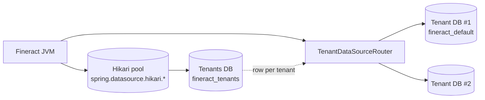
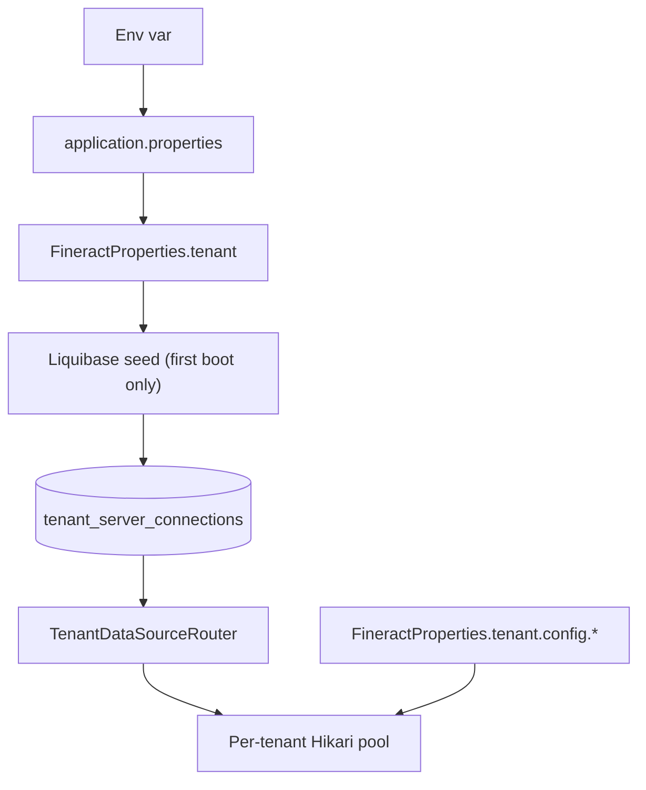

Apache Fineract runs on two database tiers: a single *tenants* database
(the bootstrap registry) and one *tenant* database per tenant routed
from it. Both tiers expose their connection details as environment
variables on top of `application.properties` so operators can deploy
without editing the JAR. This page collects those variables, ties them
to the properties they back, and explains how pool sizing is resolved
between the property file, the env var and the per‑tenant database row.

## The two tiers



1. The Hikari pool managed by Spring connects to the *tenants* database
   (typically `fineract_tenants`).
2. The tenants database holds one row per tenant identifier (`default`,
   `customer-x`, …). Each row stores the DSN to that tenant's own DB.
3. At request time, `TenantDataSourceRouter` opens a pooled connection
   to the tenant DB indicated by the `Fineract-Platform-TenantId`
   request header.

The two layers therefore have separate sets of env vars: one for the
Hikari pool (`FINERACT_HIKARI_*`), one for the *default tenant row*
that Liquibase seeds (`FINERACT_DEFAULT_TENANTDB_*`), and one optional
set for per‑tenant pool sizing (`FINERACT_CONFIG_*`).

## Tenants database (Hikari)

These keys feed `spring.datasource.hikari.*` and connect Fineract to
the registry DB.

| Property | Env var | Default | Role |
| --- | --- | --- | --- |
| `spring.datasource.hikari.driverClassName` | `FINERACT_HIKARI_DRIVER_SOURCE_CLASS_NAME` | `org.mariadb.jdbc.Driver` | JDBC driver class |
| `spring.datasource.hikari.jdbcUrl` | `FINERACT_HIKARI_JDBC_URL` | `jdbc:mariadb://localhost:3306/fineract_tenants` | Registry DB JDBC URL |
| `spring.datasource.hikari.username` | `FINERACT_HIKARI_USERNAME` | `root` | Registry DB user |
| `spring.datasource.hikari.password` | `FINERACT_HIKARI_PASSWORD` | *(set via env)* | Registry DB password |
| `spring.datasource.hikari.minimumIdle` | `FINERACT_HIKARI_MINIMUM_IDLE` | `3` | Min idle connections in pool |
| `spring.datasource.hikari.maximumPoolSize` | `FINERACT_HIKARI_MAXIMUM_POOL_SIZE` | `10` | Max connections in pool |
| `spring.datasource.hikari.idleTimeout` | `FINERACT_HIKARI_IDLE_TIMEOUT` | `60000` | Idle eviction (ms) |
| `spring.datasource.hikari.connectionTimeout` | `FINERACT_HIKARI_CONNECTION_TIMEOUT` | `20000` | Acquire timeout (ms) |
| `spring.datasource.hikari.connectionTestquery` | `FINERACT_HIKARI_TEST_QUERY` | `SELECT 1` | Validation query |
| `spring.datasource.hikari.autoCommit` | `FINERACT_HIKARI_AUTO_COMMIT` | `true` | JDBC autocommit |
| `spring.datasource.hikari.transactionIsolation` | `FINERACT_HIKARI_TRANSACTION_ISOLATION` | `TRANSACTION_REPEATABLE_READ` | TX isolation |

Driver options under `spring.datasource.hikari.dataSourceProperties[...]`:

| Property suffix | Env var | Default | Role |
| --- | --- | --- | --- |
| `cachePrepStmts` | `FINERACT_HIKARI_DS_PROPERTIES_CACHE_PREP_STMTS` | `true` | Driver prepared‑statement cache |
| `prepStmtCacheSize` | `FINERACT_HIKARI_DS_PROPERTIES_PREP_STMT_CACHE_SIZE` | `250` | Cache size |
| `prepStmtCacheSqlLimit` | `FINERACT_HIKARI_DS_PROPERTIES_PREP_STMT_CACHE_SQL_LIMIT` | `2048` | Max SQL length cached |
| `useServerPrepStmts` | `FINERACT_HIKARI_DS_PROPERTIES_USE_SERVER_PREP_STMTS` | `true` | Use server‑side prepares |
| `useLocalSessionState` | `FINERACT_HIKARI_DS_PROPERTIES_USE_LOCAL_SESSION_STATE` | `true` | Avoid round‑trips for session state |
| `rewriteBatchedStatements` | `FINERACT_HIKARI_DS_PROPERTIES_REWRITE_BATCHED_STATEMENTS` | `true` | Batched INSERT rewrite |
| `cacheResultSetMetadata` | `FINERACT_HIKARI_DS_PROPERTIES_CACHE_RESULT_SET_METADATA` | `true` | Cache `ResultSetMetadata` |
| `cacheServerConfiguration` | `FINERACT_HIKARI_DS_PROPERTIES_CACHE_SERVER_CONFIGURATION` | `true` | Cache `@@variables` |
| `elideSetAutoCommits` | `FINERACT_HIKARI_DS_PROPERTIES_ELIDE_SET_AUTO_COMMITS` | `true` | Skip redundant autocommit toggles |
| `maintainTimeStats` | `FINERACT_HIKARI_DS_PROPERTIES_MAINTAIN_TIME_STATS` | `false` | Driver time stats |
| `logSlowQueries` | `FINERACT_HIKARI_DS_PROPERTIES_LOG_SLOW_QUERIES` | `true` | Driver slow query log |
| `dumpQueriesOnException` | `FINERACT_HIKARI_DS_PROPERTIES_DUMP_QUERIES_IN_EXCEPTION` | `true` | Dump query in exception trace |

See [/runtime/datasource-and-connection-pooling](/runtime/datasource-and-connection-pooling)
for the Hikari/MariaDB driver tuning rationale.

## Default tenant row (Liquibase seed)

When the tenants DB is first created, Liquibase seeds one tenant row
from the values under `fineract.tenant.*`. These env vars only matter
on first boot; subsequent boots use the values that are persisted in
the `tenant_server_connections` table.

| Property | Env var | Default |
| --- | --- | --- |
| `fineract.tenant.host` | `FINERACT_DEFAULT_TENANTDB_HOSTNAME` | `localhost` |
| `fineract.tenant.port` | `FINERACT_DEFAULT_TENANTDB_PORT` | `3306` |
| `fineract.tenant.username` | `FINERACT_DEFAULT_TENANTDB_UID` | `root` |
| `fineract.tenant.password` | `FINERACT_DEFAULT_TENANTDB_PWD` | *(set via env)* |
| `fineract.tenant.parameters` | `FINERACT_DEFAULT_TENANTDB_CONN_PARAMS` | *(empty)* |
| `fineract.tenant.timezone` | `FINERACT_DEFAULT_TENANTDB_TIMEZONE` | `Asia/Kolkata` |
| `fineract.tenant.identifier` | `FINERACT_DEFAULT_TENANTDB_IDENTIFIER` | `default` |
| `fineract.tenant.name` | `FINERACT_DEFAULT_TENANTDB_NAME` | `fineract_default` |
| `fineract.tenant.description` | `FINERACT_DEFAULT_TENANTDB_DESCRIPTION` | `Default Demo Tenant` |
| `fineract.tenant.master-password` | `FINERACT_DEFAULT_TENANTDB_MASTER_PASSWORD` | *(set via env)* |
| `fineract.tenant.encrytion` | `FINERACT_DEFAULT_TENANTDB_ENCRYPTION` | `AES/CBC/PKCS5Padding` |

The `fineract.tenant.encrytion` key intentionally retains its
historical typo. It is the JCE transformation used to encrypt tenant
passwords stored in the registry.

### Read‑only mirror (optional)

| Property | Env var | Default |
| --- | --- | --- |
| `fineract.tenant.read-only-host` | `FINERACT_DEFAULT_TENANTDB_RO_HOSTNAME` | *(empty)* |
| `fineract.tenant.read-only-port` | `FINERACT_DEFAULT_TENANTDB_RO_PORT` | *(empty)* |
| `fineract.tenant.read-only-username` | `FINERACT_DEFAULT_TENANTDB_RO_UID` | *(empty)* |
| `fineract.tenant.read-only-password` | `FINERACT_DEFAULT_TENANTDB_RO_PWD` | *(empty)* |
| `fineract.tenant.read-only-parameters` | `FINERACT_DEFAULT_TENANTDB_RO_CONN_PARAMS` | *(empty)* |
| `fineract.tenant.read-only-name` | `FINERACT_DEFAULT_TENANTDB_RO_NAME` | *(empty)* |

Populate these when the JVM should send read traffic to a replica. The
router consults the row when `FineractProperties.getMode().isReadOnlyMode()`
returns true (i.e. when only `readEnabled` is on).

## Per‑tenant pool overrides

`fineract.tenant.config.*` overrides the per‑tenant Hikari pool sizes
that would otherwise come from the `tenant_server_connections` row. The
sentinel `-1` means "do not override".

| Property | Env var | Default | Effect |
| --- | --- | --- | --- |
| `fineract.tenant.config.min-pool-size` | `FINERACT_CONFIG_MIN_POOL_SIZE` | `-1` | `-1` ⇒ use DB row; any other value ⇒ force min idle |
| `fineract.tenant.config.max-pool-size` | `FINERACT_CONFIG_MAX_POOL_SIZE` | `-1` | `-1` ⇒ use DB row; any other value ⇒ force max pool |
| `fineract.tenant.config.rounding-mode` | `FINERACT_CONFIG_ROUNDING_MODE` | `6` | Default `RoundingMode` ordinal applied when the `rounding-mode` row has no value |

`FineractConfigProperties` exposes the sentinels through helpers:

```java
@Getter @Setter
public static class FineractConfigProperties {
    private int minPoolSize;
    private int maxPoolSize;

    public boolean isMinPoolSizeSet() { return minPoolSize != -1; }
    public boolean isMaxPoolSizeSet() { return maxPoolSize != -1; }
}
```

Callers use these helpers when building the per‑tenant Hikari config:

```java
if (config.isMaxPoolSizeSet()) {
    tenantHikariCfg.setMaximumPoolSize(config.getMaxPoolSize());
} else {
    tenantHikariCfg.setMaximumPoolSize(tenantRow.getMaxPoolSize());
}
```

This is how an operator can force a global cap on tenant pools without
touching every tenant row.

## Resolution order



Read top‑to‑bottom for the default tenant; the override branch on the
right applies the `-1` sentinels when computing per‑tenant pool sizes.

## Example: pointing at a remote MariaDB

```bash
# Tenants DB
FINERACT_HIKARI_DRIVER_SOURCE_CLASS_NAME=org.mariadb.jdbc.Driver
FINERACT_HIKARI_JDBC_URL=jdbc:mariadb://db.internal:3306/fineract_tenants
FINERACT_HIKARI_USERNAME=fineract
FINERACT_HIKARI_PASSWORD="<secret>"
FINERACT_HIKARI_MINIMUM_IDLE=5
FINERACT_HIKARI_MAXIMUM_POOL_SIZE=20

# Default tenant DB row (only used on first boot)
FINERACT_DEFAULT_TENANTDB_HOSTNAME=db.internal
FINERACT_DEFAULT_TENANTDB_PORT=3306
FINERACT_DEFAULT_TENANTDB_UID=fineract
FINERACT_DEFAULT_TENANTDB_PWD="<secret>"
FINERACT_DEFAULT_TENANTDB_NAME=fineract_default
FINERACT_DEFAULT_TENANTDB_IDENTIFIER=default
FINERACT_DEFAULT_TENANTDB_TIMEZONE=UTC
FINERACT_DEFAULT_TENANTDB_MASTER_PASSWORD="<secret>"

# Per-tenant pool override (apply same cap to every tenant)
FINERACT_CONFIG_MIN_POOL_SIZE=3
FINERACT_CONFIG_MAX_POOL_SIZE=15
```

## Example: switching to PostgreSQL

The driver class, URL prefix and validation query change. Hikari's
isolation defaults are also different.

```bash
FINERACT_HIKARI_DRIVER_SOURCE_CLASS_NAME=org.postgresql.Driver
FINERACT_HIKARI_JDBC_URL=jdbc:postgresql://db.internal:5432/fineract_tenants
FINERACT_HIKARI_TRANSACTION_ISOLATION=TRANSACTION_READ_COMMITTED
FINERACT_HIKARI_TEST_QUERY="SELECT 1"

FINERACT_DEFAULT_TENANTDB_PORT=5432
```

The MariaDB‑specific `dataSourceProperties` (cachePrepStmts etc.) are
ignored by the PostgreSQL driver, so leaving them at their defaults is
safe — they apply only when the MariaDB driver is loaded.

## Example: read‑only replica

Set up a read‑only mirror for a JVM running with `read-only` instance
mode:

```bash
FINERACT_MODE_READ_ENABLED=true
FINERACT_MODE_WRITE_ENABLED=false
FINERACT_MODE_BATCH_WORKER_ENABLED=false
FINERACT_MODE_BATCH_MANAGER_ENABLED=false

FINERACT_DEFAULT_TENANTDB_RO_HOSTNAME=db-replica.internal
FINERACT_DEFAULT_TENANTDB_RO_PORT=3306
FINERACT_DEFAULT_TENANTDB_RO_UID=fineract_ro
FINERACT_DEFAULT_TENANTDB_RO_PWD="<secret>"
FINERACT_DEFAULT_TENANTDB_RO_NAME=fineract_default
```

The router consults `read-only-*` columns once the JVM enters read‑only
mode. See [Instance Mode API](/config/instance-mode-api).

## Liquibase parameter propagation

`application.properties` also wires the tenant values into Liquibase
parameters so the changelog can use them:

```properties
spring.liquibase.parameters.fineract.tenant.identifier=${fineract.tenant.identifier}
spring.liquibase.parameters.fineract.tenant.description=${fineract.tenant.description}
spring.liquibase.parameters.fineract.tenant.timezone=${fineract.tenant.timezone}
spring.liquibase.parameters.fineract.tenant.schema-name=${fineract.tenant.name}
spring.liquibase.parameters.fineract.tenant.host=${fineract.tenant.host}
spring.liquibase.parameters.fineract.tenant.port=${fineract.tenant.port}
spring.liquibase.parameters.fineract.tenant.username=${fineract.tenant.username}
spring.liquibase.parameters.fineract.tenant.password=${fineract.tenant.password}
spring.liquibase.parameters.fineract.tenant.parameters=${fineract.tenant.parameters}
spring.liquibase.parameters.fineract.tenant.read-only-host=${fineract.tenant.read-only-host}
spring.liquibase.parameters.fineract.tenant.read-only-port=${fineract.tenant.read-only-port}
spring.liquibase.parameters.fineract.tenant.read-only-username=${fineract.tenant.read-only-username}
spring.liquibase.parameters.fineract.tenant.read-only-password=${fineract.tenant.read-only-password}
spring.liquibase.parameters.fineract.tenant.read-only-parameters=${fineract.tenant.read-only-parameters}
spring.liquibase.parameters.fineract.tenant.read-only-name=${fineract.tenant.read-only-name}
spring.liquibase.parameters.fineract.tenant.rounding-mode=${fineract.tenant.config.rounding-mode}
```

Liquibase substitutes `${fineract.tenant.identifier}` etc. into the
changelog at runtime — that is how the default tenant row gets seeded
even though Liquibase otherwise has no view into Spring properties.

## Permissions and secrets

- The Hikari user needs `ALL PRIVILEGES` on the tenants DB schema
  (Liquibase creates tables and grants on first boot).
- The per‑tenant user needs the same on the tenant schema.
- Master password (`FINERACT_DEFAULT_TENANTDB_MASTER_PASSWORD`) is the
  symmetric key used to encrypt the tenant password column. Never
  expose this in logs.
- `fineract.tenant.encrytion` sets the JCE transformation. Changing it
  after rows have been inserted breaks decryption — pick once,
  document it, and only rotate by re‑encrypting all rows offline.

## Production checklist

1. Set every `FINERACT_HIKARI_*` env var explicitly (don't rely on the
   `localhost` defaults).
2. Set `FINERACT_DEFAULT_TENANTDB_*` once for the bootstrap tenant.
3. Decide per‑tenant pool policy:
   - global cap → set `FINERACT_CONFIG_MIN_POOL_SIZE` /
     `FINERACT_CONFIG_MAX_POOL_SIZE`;
   - per‑tenant tuning → leave them at `-1`, edit
     `tenant_server_connections` rows.
4. Add a read‑only replica row only when you actually flip
   `FINERACT_MODE_*` to read‑only.
5. Rotate `FINERACT_DEFAULT_TENANTDB_MASTER_PASSWORD` only with the
   `m_tenant_password_rotate` job (see scheduler docs) — it cannot be
   changed by editing the env var alone.

## Related pages

- [Application Properties](/config/application-properties) — the full
  property file walkthrough.
- [FineractProperties Reference](/config/fineract-properties) — the
  `tenant` and `tenant.config` nested classes.
- [Instance Mode API](/config/instance-mode-api) — read‑only mode that
  activates the RO mirror.
- [/runtime/datasource-and-connection-pooling](/runtime/datasource-and-connection-pooling)
  — Hikari pool tuning rationale.
- [/core/datasource-tenant-routing](/core/datasource-tenant-routing)
  — how the router picks a tenant DB at request time.
- [/tenancy/overview](/core/datasource-tenant-routing) — multi‑tenant
  model overview.
