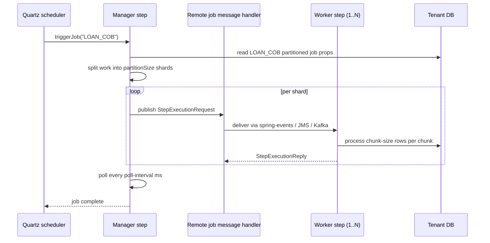

Spring Batch jobs in Apache Fineract — Loan COB, journal entry
aggregation, purge, accrual posting and the long tail of scheduled
tasks — read their tuning knobs from `application.properties` under
two trees: `fineract.partitioned-job.*` for partitioned (manager‑worker)
jobs and `fineract.job.*` for the rest of the COB‑adjacent jobs. This
page enumerates those keys, ties them to `FineractProperties` and
explains where cron schedules live (hint: not in properties — they're
in the database).

## Two trees, two purposes

| Tree | Purpose | Java type |
| --- | --- | --- |
| `fineract.partitioned-job.*` | Per‑job partition size, chunk size, thread pool, retry budget | `FineractPartitionedJob` |
| `fineract.job.*` | Stuck‑retry budget, Loan COB master switch, journal aggregation tunables | `FineractJobProperties` |

Cron strings, enabled flags and per‑tenant scheduling rules live in the
`m_job_scheduled` row owned by the Quartz scheduler — see
[/jobs/scheduler-and-quartz](/jobs/scheduler-and-quartz). Properties
tune the *execution* shape of each job; the *schedule* is database‑driven.

## Partitioned jobs

Spring Batch partitioned jobs work by having a manager step that
divides work into N partitions and dispatches them to worker beans (in
the same JVM or remote, depending on
`fineract.remote-job-message-handler.*` — see
[Kafka and JMS Properties](/config/kafka-and-jms-properties)). The
`PartitionedJobProperty` record holds the per‑job tuning:

```java
@Getter @Setter
public static class FineractPartitionedJob {
    private List<PartitionedJobProperty> partitionedJobProperties;
}

@Getter @Setter
public static class PartitionedJobProperty {
    private String jobName;
    private Integer chunkSize;
    private Integer partitionSize;
    private Integer threadPoolCorePoolSize;
    private Integer threadPoolMaxPoolSize;
    private Integer threadPoolQueueCapacity;
    private Integer retryLimit;
    private Integer pollInterval;
}
```

The properties file ships one entry, for `LOAN_COB`; each additional
partitioned job adds an indexed block.

### LOAN_COB tuning (index 0)

```properties
fineract.partitioned-job.partitioned-job-properties[0].job-name=LOAN_COB
fineract.partitioned-job.partitioned-job-properties[0].chunk-size=${LOAN_COB_CHUNK_SIZE:100}
fineract.partitioned-job.partitioned-job-properties[0].partition-size=${LOAN_COB_PARTITION_SIZE:100}
fineract.partitioned-job.partitioned-job-properties[0].thread-pool-core-pool-size=${LOAN_COB_THREAD_POOL_CORE_POOL_SIZE:5}
fineract.partitioned-job.partitioned-job-properties[0].thread-pool-max-pool-size=${LOAN_COB_THREAD_POOL_MAX_POOL_SIZE:5}
fineract.partitioned-job.partitioned-job-properties[0].thread-pool-queue-capacity=${LOAN_COB_THREAD_POOL_QUEUE_CAPACITY:20}
fineract.partitioned-job.partitioned-job-properties[0].retry-limit=${LOAN_COB_RETRY_LIMIT:5}
fineract.partitioned-job.partitioned-job-properties[0].poll-interval=${LOAN_COB_POLL_INTERVAL:500}
```

| Property suffix | Env var | Default | Role |
| --- | --- | --- | --- |
| `.job-name` | — | `LOAN_COB` | Logical job name; must match a registered `Job` bean |
| `.chunk-size` | `LOAN_COB_CHUNK_SIZE` | `100` | Spring Batch chunk size — commit boundary |
| `.partition-size` | `LOAN_COB_PARTITION_SIZE` | `100` | Number of partitions per execution |
| `.thread-pool-core-pool-size` | `LOAN_COB_THREAD_POOL_CORE_POOL_SIZE` | `5` | Worker pool core size |
| `.thread-pool-max-pool-size` | `LOAN_COB_THREAD_POOL_MAX_POOL_SIZE` | `5` | Worker pool max size |
| `.thread-pool-queue-capacity` | `LOAN_COB_THREAD_POOL_QUEUE_CAPACITY` | `20` | Worker queue capacity |
| `.retry-limit` | `LOAN_COB_RETRY_LIMIT` | `5` | Per‑chunk retry budget |
| `.poll-interval` | `LOAN_COB_POLL_INTERVAL` | `500` | Manager poll interval (ms) for partition completion |

#### Sizing rationale

`partition-size` controls how many shards the manager creates. Each
shard processes `chunk-size` rows at a time inside one transaction. So
the total in‑flight workload at peak is roughly
`partition-size × chunk-size`. The default `100 × 100 = 10 000` rows
gives the worker pool enough work to stay busy without blowing the JDBC
pool.

`thread-pool-max-pool-size` should be ≥ the number of partitions you
want to run concurrently on a single worker JVM. For LOAN_COB the
default is `5` — the manager keeps the others queued until threads
free up.

`poll-interval` is how often the manager checks whether all partitions
have completed; lower values shave milliseconds off small jobs but add
load. Leaving it at `500` ms is fine for nightly COB.

`retry-limit` is the Spring Batch retry budget per chunk. If a chunk
fails N times the partition fails — the manager records the failure
and continues with the rest. The job aggregate exit status reflects
the partition outcomes.

### Adding more partitioned jobs

A new partitioned job adds an indexed block. For a hypothetical
`PURGE_EXTERNAL_EVENTS` job:

```properties
fineract.partitioned-job.partitioned-job-properties[1].job-name=PURGE_EXTERNAL_EVENTS
fineract.partitioned-job.partitioned-job-properties[1].chunk-size=${PURGE_EXTERNAL_EVENTS_CHUNK_SIZE:500}
fineract.partitioned-job.partitioned-job-properties[1].partition-size=${PURGE_EXTERNAL_EVENTS_PARTITION_SIZE:10}
fineract.partitioned-job.partitioned-job-properties[1].thread-pool-core-pool-size=${PURGE_EXTERNAL_EVENTS_THREAD_POOL_CORE_POOL_SIZE:2}
fineract.partitioned-job.partitioned-job-properties[1].thread-pool-max-pool-size=${PURGE_EXTERNAL_EVENTS_THREAD_POOL_MAX_POOL_SIZE:2}
fineract.partitioned-job.partitioned-job-properties[1].thread-pool-queue-capacity=${PURGE_EXTERNAL_EVENTS_THREAD_POOL_QUEUE_CAPACITY:5}
fineract.partitioned-job.partitioned-job-properties[1].retry-limit=${PURGE_EXTERNAL_EVENTS_RETRY_LIMIT:3}
fineract.partitioned-job.partitioned-job-properties[1].poll-interval=${PURGE_EXTERNAL_EVENTS_POLL_INTERVAL:1000}
```

The Spring binder walks `[0]`, `[1]`, … into a `List<PartitionedJobProperty>`.
Indices must be contiguous starting at `[0]`.

## Job: stuck retry, Loan COB master, journal aggregation

```java
@Getter @Setter
public static class FineractJobProperties {
    private int stuckRetryThreshold;
    private boolean loanCobEnabled;
    private FineractJournalEntryAggregationProperties journalEntryAggregation;
}

@Getter @Setter
public static class FineractJournalEntryAggregationProperties {
    private Integer excludeRecentNDays;
    private boolean enabled;
    private Integer chunkSize;
}
```

### Stuck job retry

| Property | Env var | Default | Role |
| --- | --- | --- | --- |
| `fineract.job.stuck-retry-threshold` | `FINERACT_JOB_STUCK_RETRY_THRESHOLD` | `5` | Number of retries before a stuck job is abandoned by the scheduler |

The scheduler periodically scans for `JobExecution` rows left in a
`RUNNING` state without progress (no heartbeat). When the retry count
on the row exceeds this threshold, the scheduler marks the execution as
failed and stops retrying — preventing infinite loops on hard failures.

### Loan COB master switch

| Property | Env var | Default | Role |
| --- | --- | --- | --- |
| `fineract.job.loan-cob-enabled` | `FINERACT_JOB_LOAN_COB_ENABLED` | `true` | Master switch for the Loan COB pipeline |

When set to `false`, the COB job is unregistered and the
`InlineLoanCobApi` returns 503. Use this on read‑only or batch‑manager‑only
JVMs that should not run COB locally.

### Journal entry aggregation

| Property | Env var | Default | Role |
| --- | --- | --- | --- |
| `fineract.job.journal-entry-aggregation.enabled` | `FINERACT_JOB_JOURNAL_ENTRY_AGGREGATION_ENABLED` | `true` | Run journal aggregation job |
| `fineract.job.journal-entry-aggregation.exclude-recent-N-days` | `FINERACT_JOB_JOURNAL_ENTRY_AGGREGATION_EXCLUDE_RECENT_N_DAYS` | `1` | Skip aggregating the most recent N days |
| `fineract.job.journal-entry-aggregation.chunk-size` | `FINERACT_JOB_JOURNAL_ENTRY_AGGREGATION_CHUNK_SIZE` | `2000` | Aggregation chunk size |

```properties
fineract.job.stuck-retry-threshold=${FINERACT_JOB_STUCK_RETRY_THRESHOLD:5}
fineract.job.loan-cob-enabled=${FINERACT_JOB_LOAN_COB_ENABLED:true}
fineract.job.journal-entry-aggregation.exclude-recent-N-days=${FINERACT_JOB_JOURNAL_ENTRY_AGGREGATION_EXCLUDE_RECENT_N_DAYS:1}
fineract.job.journal-entry-aggregation.enabled=${FINERACT_JOB_JOURNAL_ENTRY_AGGREGATION_ENABLED:true}
fineract.job.journal-entry-aggregation.chunk-size=${FINERACT_JOB_JOURNAL_ENTRY_AGGREGATION_CHUNK_SIZE:2000}
```

The `exclude-recent-N-days` window protects active accounting periods
from being collapsed by the aggregator — if you aggregate today's
journal entries, end‑of‑day reports lose their granularity.

## Spring Batch baseline

`application.properties` also sets two Spring Batch defaults the
Fineract scheduler relies on:

```properties
spring.batch.initialize-schema=NEVER
spring.batch.job.enabled=false
```

- `initialize-schema=NEVER` — Liquibase owns the `BATCH_*` table schema
  in the tenant DB; Spring Batch's own initializer must not run.
- `job.enabled=false` — disables auto‑running discovered jobs on
  startup. The Quartz scheduler is what kicks them off based on the
  database cron rows.

## Where cron strings live

The Wiki sometimes references `fineract.cron.*` keys, but the property
file does **not** ship them. Cron schedules in Fineract are stored in
the database, one row per logical job in the `job` table (per tenant).
At boot, `JobRegisterService` reads each row and registers the job with
Quartz using the row's `cron_expression`, `next_run_time` and
`is_active`. Admins manage these rows through the Scheduler Jobs API
(see [/jobs/scheduler-job-api](/jobs/scheduler-job-api)).

The reasons cron lives in the database rather than properties:

1. Each tenant can have its own schedule for the same logical job.
2. Schedules need to be editable at runtime without redeploy.
3. The scheduler needs Quartz's persistent state (`QRTZ_*` tables) to
   coordinate across nodes.

A typical row looks like (no actual SQL is exposed via properties):

| `name` | `cron_expression` | `is_active` | `task_priority` |
| --- | --- | --- | --- |
| `Update loan summary` | `0 0 7 1/1 * ? *` | `true` | `5` |
| `Apply Charge To Overdue Loans` | `0 0 2 1/1 * ? *` | `true` | `5` |
| `Update Accrual Transactions` | `0 1 0 1/1 * ? *` | `true` | `5` |

The cron expressions are Quartz format (seconds + cron‑like minutes
through year). See [/jobs/scheduler-and-quartz](/jobs/scheduler-and-quartz)
for the registry, [/jobs/scheduler-job-api](/jobs/scheduler-job-api)
for the management surface.

## Per‑job retry instances (Resilience4j)

The `resilience4j.retry.instances.<name>.*` block of `application.properties`
also affects job execution — `processJobDetailForExecution` is the most
relevant instance:

```properties
resilience4j.retry.instances.processJobDetailForExecution.max-attempts=${FINERACT_PROCESS_JOB_DETAIL_RETRY_MAX_ATTEMPTS:3}
resilience4j.retry.instances.processJobDetailForExecution.wait-duration=${FINERACT_PROCESS_JOB_DETAIL_RETRY_WAIT_DURATION:1s}
resilience4j.retry.instances.processJobDetailForExecution.enable-exponential-backoff=${FINERACT_PROCESS_JOB_DETAIL_RETRY_ENABLE_EXPONENTIAL_BACKOFF:true}
resilience4j.retry.instances.processJobDetailForExecution.exponential-backoff-multiplier=${FINERACT_PROCESS_JOB_DETAIL_RETRY_EXPONENTIAL_BACKOFF_MULTIPLIER:2}
```

Other relevant instances:

| Instance | Role |
| --- | --- |
| `executeCommand` | Generic command pipeline retry |
| `processJobDetailForExecution` | Wraps job entry into a retry context |
| `recalculateInterest` | Loan interest recompute retries |
| `postInterest` | Savings interest post retries |
| `commandBusinessDateUpdate` | Business date command retries |

These tune transient‑failure recovery (typically optimistic‑lock
conflicts under concurrent COB shards).

## Worker JVM mode interaction

The `fineract.mode.batch-worker-enabled` flag must be `true` on any JVM
that should actually execute partitioned job worker steps. The manager
needs `batch-manager-enabled=true`. On a single‑node deployment both
are true and Spring events shuffle partitions in‑process. See
[Instance Mode API](/config/instance-mode-api) and
[Kafka and JMS Properties](/config/kafka-and-jms-properties#remote-job-message-handler).

## End‑to‑end shape of a partitioned job



## Tuning patterns

### Smaller chunks, more partitions

When the underlying queries are cheap and the row count is huge:

```bash
LOAN_COB_PARTITION_SIZE=400
LOAN_COB_CHUNK_SIZE=50
LOAN_COB_THREAD_POOL_CORE_POOL_SIZE=10
LOAN_COB_THREAD_POOL_MAX_POOL_SIZE=10
LOAN_COB_THREAD_POOL_QUEUE_CAPACITY=40
```

Increases parallelism and reduces transaction size — good when long
transactions hold locks.

### Larger chunks, fewer partitions

When the per‑row work is heavy and chunking overhead matters more than
parallelism:

```bash
LOAN_COB_PARTITION_SIZE=20
LOAN_COB_CHUNK_SIZE=500
LOAN_COB_THREAD_POOL_CORE_POOL_SIZE=4
LOAN_COB_THREAD_POOL_MAX_POOL_SIZE=4
```

### Bigger retry budget

When the loan portfolio has many overlapping events that trigger
optimistic‑lock conflicts:

```bash
LOAN_COB_RETRY_LIMIT=10
```

Combined with the `commandBusinessDateUpdate` and `executeCommand`
retry instances, this gives shards more headroom before bubbling up
the failure.

## Disabling a job entirely

Two options:

1. **Set the property switch** — `FINERACT_JOB_LOAN_COB_ENABLED=false`
   stops the COB pipeline from registering at all.
2. **Mark the scheduler row inactive** — set `is_active=false` on the
   `job` row through the Scheduler Jobs API. The Quartz scheduler skips
   inactive rows.

Property gating is for whole JVMs; row gating is per tenant.

## Related pages

- [Application Properties](/config/application-properties) — the raw
  file view, including the COB lines.
- [FineractProperties Reference](/config/fineract-properties) — the
  `partitionedJob` and `job` nested types.
- [Kafka and JMS Properties](/config/kafka-and-jms-properties) — the
  remote job message handler transports that move partitions.
- [Instance Mode API](/config/instance-mode-api) — `batch-worker-enabled`
  / `batch-manager-enabled` interaction.
- [/jobs/scheduler-and-quartz](/jobs/scheduler-and-quartz) — Quartz
  scheduler, cron storage and job registry.
- [/jobs/scheduler-job-api](/jobs/scheduler-job-api) — managing cron
  rows at runtime.
- [/jobs/inline-job-api](/jobs/inline-job-api) — inline Loan COB API
  gated by `fineract.job.loan-cob-enabled`.
- [/core/jobs-domain](/core/jobs-domain) — the underlying domain model.
- [/core/spring-batch-infra](/core/spring-batch-infra) — Spring Batch
  infrastructure beans.
