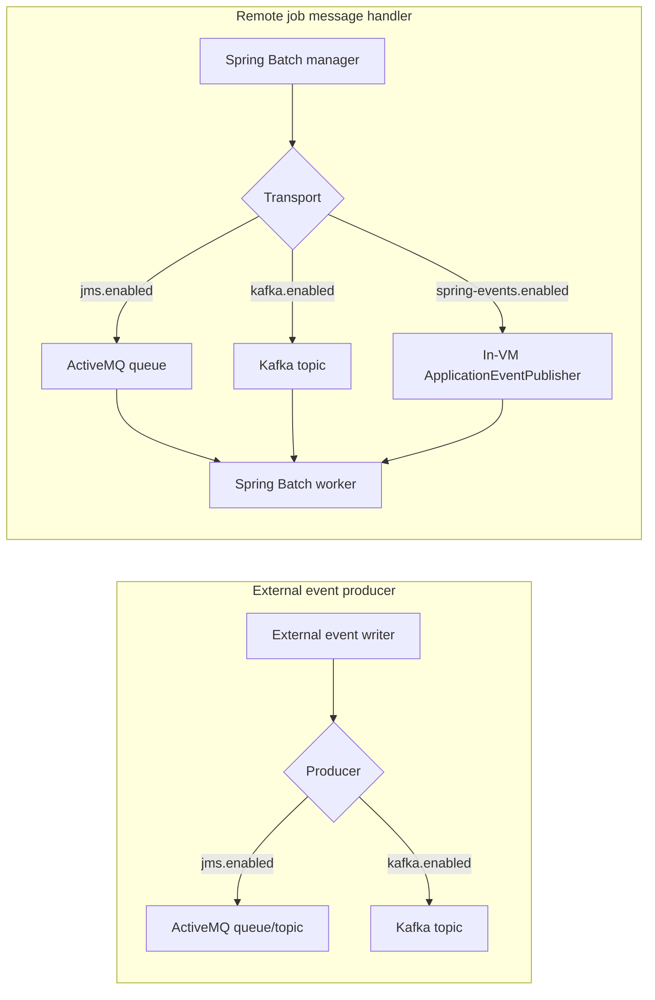

Apache Fineract talks to message brokers in two distinct subsystems:
the **external event producer** ships business events to downstream
consumers, and the **remote job message handler** carries Spring Batch
partition coordination between a manager and its worker JVMs. Both
subsystems support an in‑VM transport, JMS (ActiveMQ) and Apache Kafka,
and both are gated by mutually exclusive boolean flags. This page lays
out every property under `fineract.events.external.*` and
`fineract.remote-job-message-handler.*` and ties them to the typed
`FineractProperties` nested classes.

## The two subsystems at a glance



The two subsystems may run on the same broker but use different
queue/topic names; choose one transport per subsystem.

## External event producer

External events fire when business events (loan disbursed, repayment
posted, etc.) are persisted to `m_external_event`. A poller batches
them and forwards them through the configured producer.

### Reader pool and partitioning

| Property | Env var | Default | Role |
| --- | --- | --- | --- |
| `fineract.events.external.enabled` | `FINERACT_EXTERNAL_EVENTS_ENABLED` | `false` | Master switch (no producer runs if false) |
| `fineract.events.external.partition-size` | `FINERACT_EXTERNAL_EVENTS_PARTITION_SIZE` | `5000` | Batch read size from `m_external_event` |
| `fineract.events.external.thread-pool-core-pool-size` | `FINERACT_EVENT_TASK_EXECUTOR_CORE_POOL_SIZE` | `2` | Reader pool core |
| `fineract.events.external.thread-pool-max-pool-size` | `FINERACT_EVENT_TASK_EXECUTOR_MAX_POOL_SIZE` | `25` | Reader pool max |
| `fineract.events.external.thread-pool-queue-capacity` | `FINERACT_EVENT_TASK_EXECUTOR_QUEUE_CAPACITY` | `500` | Reader queue depth |

```java
@Getter @Setter
public static class FineractExternalEventsProperties {
    private boolean enabled;
    private FineractExternalEventsProducerProperties producer;
    private int partitionSize;
    private int threadPoolCorePoolSize;
    private int threadPoolMaxPoolSize;
    private int threadPoolQueueCapacity;
}
```

Reader pool sizing is shared with the JMS producer's own thread pool
because both reuse `FINERACT_EVENT_TASK_EXECUTOR_*` env var names; tune
them together.

### JMS producer

```properties
fineract.events.external.producer.jms.enabled=${FINERACT_EXTERNAL_EVENTS_PRODUCER_JMS_ENABLED:false}
fineract.events.external.producer.jms.async-send-enabled=${FINERACT_EXTERNAL_EVENTS_PRODUCER_JMS_ASYNC_SEND_ENABLED:false}
fineract.events.external.producer.jms.event-queue-name=${FINERACT_EXTERNAL_EVENTS_PRODUCER_JMS_QUEUE_NAME:}
fineract.events.external.producer.jms.event-topic-name=${FINERACT_EXTERNAL_EVENTS_PRODUCER_JMS_TOPIC_NAME:}
fineract.events.external.producer.jms.broker-url=${FINERACT_EXTERNAL_EVENTS_PRODUCER_JMS_BROKER_URL:tcp://127.0.0.1:61616}
fineract.events.external.producer.jms.broker-username=${FINERACT_EXTERNAL_EVENTS_PRODUCER_JMS_BROKER_USERNAME:}
fineract.events.external.producer.jms.broker-password=${FINERACT_EXTERNAL_EVENTS_PRODUCER_JMS_BROKER_PASSWORD:}
fineract.events.external.producer.jms.producer-count=${FINERACT_EXTERNAL_EVENTS_PRODUCER_JMS_PRODUCER_COUNT:1}
fineract.events.external.producer.jms.thread-pool-task-executor-core-pool-size=${FINERACT_EVENT_TASK_EXECUTOR_CORE_POOL_SIZE:10}
fineract.events.external.producer.jms.thread-pool-task-executor-max-pool-size=${FINERACT_EVENT_TASK_EXECUTOR_MAX_POOL_SIZE:100}
```

| Property | Env var | Default | Role |
| --- | --- | --- | --- |
| `…jms.enabled` | `FINERACT_EXTERNAL_EVENTS_PRODUCER_JMS_ENABLED` | `false` | Master toggle |
| `…jms.async-send-enabled` | `FINERACT_EXTERNAL_EVENTS_PRODUCER_JMS_ASYNC_SEND_ENABLED` | `false` | Use the JMS async send API |
| `…jms.event-queue-name` | `FINERACT_EXTERNAL_EVENTS_PRODUCER_JMS_QUEUE_NAME` | *(empty)* | Queue name (use queue OR topic, not both) |
| `…jms.event-topic-name` | `FINERACT_EXTERNAL_EVENTS_PRODUCER_JMS_TOPIC_NAME` | *(empty)* | Topic name |
| `…jms.broker-url` | `FINERACT_EXTERNAL_EVENTS_PRODUCER_JMS_BROKER_URL` | `tcp://127.0.0.1:61616` | ActiveMQ broker URL |
| `…jms.broker-username` | `FINERACT_EXTERNAL_EVENTS_PRODUCER_JMS_BROKER_USERNAME` | *(empty)* | Broker user |
| `…jms.broker-password` | `FINERACT_EXTERNAL_EVENTS_PRODUCER_JMS_BROKER_PASSWORD` | *(empty)* | Broker password |
| `…jms.producer-count` | `FINERACT_EXTERNAL_EVENTS_PRODUCER_JMS_PRODUCER_COUNT` | `1` | Parallel producer beans |
| `…jms.thread-pool-task-executor-core-pool-size` | `FINERACT_EVENT_TASK_EXECUTOR_CORE_POOL_SIZE` | `10` | Producer pool core |
| `…jms.thread-pool-task-executor-max-pool-size` | `FINERACT_EVENT_TASK_EXECUTOR_MAX_POOL_SIZE` | `100` | Producer pool max |

The properties bind to `FineractExternalEventsProducerJmsProperties`:

```java
@Getter @Setter
public static class FineractExternalEventsProducerJmsProperties {
    private boolean enabled;
    private String eventQueueName;
    private String eventTopicName;
    private String brokerUrl;
    private String brokerUsername;
    private String brokerPassword;
    private int producerCount;
    private boolean asyncSendEnabled;
    private int threadPoolTaskExecutorCorePoolSize;
    private int threadPoolTaskExecutorMaxPoolSize;

    public boolean isBrokerPasswordProtected() {
        return StringUtils.isNotBlank(brokerUsername) || StringUtils.isNotBlank(brokerPassword);
    }
}
```

`isBrokerPasswordProtected()` lets the connection factory decide
whether to apply credentials.

See [/events/event-producer-jms](/events/event-producer-jms).

### Kafka producer

```properties
fineract.events.external.producer.kafka.enabled=${FINERACT_EXTERNAL_EVENTS_KAFKA_ENABLED:false}
fineract.events.external.producer.kafka.timeout-in-seconds=${FINERACT_EXTERNAL_EVENTS_KAFKA_TIMEOUT_IN_SECONDS:10}
fineract.events.external.producer.kafka.topic.auto-create=${FINERACT_EXTERNAL_EVENTS_KAFKA_TOPIC_AUTO_CREATE:true}
fineract.events.external.producer.kafka.topic.name=${FINERACT_EXTERNAL_EVENTS_KAFKA_TOPIC_NAME:external-events}
fineract.events.external.producer.kafka.topic.replicas=${FINERACT_EXTERNAL_EVENTS_KAFKA_TOPIC_REPLICAS:1}
fineract.events.external.producer.kafka.topic.partitions=${FINERACT_EXTERNAL_EVENTS_KAFKA_TOPIC_PARTITIONS:10}
fineract.events.external.producer.kafka.bootstrap-servers=${FINERACT_EXTERNAL_EVENTS_KAFKA_BOOTSTRAP_SERVERS:localhost:9092}
fineract.events.external.producer.kafka.producer.extra-properties-separator=${FINERACT_EXTERNAL_EVENTS_KAFKA_PRODUCER_EXTRA_PROPERTIES_SEPARATOR:|}
fineract.events.external.producer.kafka.producer.extra-properties-key-value-separator=${FINERACT_EXTERNAL_EVENTS_KAFKA_PRODUCER_EXTRA_PROPERTIES_KEY_VALUE_SEPARATOR:=}
fineract.events.external.producer.kafka.producer.extra-properties=${FINERACT_EXTERNAL_EVENTS_KAFKA_PRODUCER_EXTRA_PROPERTIES:linger.ms=10|batch.size=16384}
fineract.events.external.producer.kafka.admin.extra-properties-separator=${FINERACT_EXTERNAL_EVENTS_KAFKA_ADMIN_EXTRA_PROPERTIES_SEPARATOR:|}
fineract.events.external.producer.kafka.admin.extra-properties-key-value-separator=${FINERACT_EXTERNAL_EVENTS_KAFKA_ADMIN_EXTRA_PROPERTIES_KEY_VALUE_SEPARATOR:=}
fineract.events.external.producer.kafka.admin.extra-properties=${FINERACT_EXTERNAL_EVENTS_KAFKA_ADMIN_EXTRA_PROPERTIES:}
```

| Property | Env var | Default | Role |
| --- | --- | --- | --- |
| `…kafka.enabled` | `FINERACT_EXTERNAL_EVENTS_KAFKA_ENABLED` | `false` | Master toggle |
| `…kafka.timeout-in-seconds` | `FINERACT_EXTERNAL_EVENTS_KAFKA_TIMEOUT_IN_SECONDS` | `10` | Send timeout |
| `…kafka.topic.auto-create` | `FINERACT_EXTERNAL_EVENTS_KAFKA_TOPIC_AUTO_CREATE` | `true` | Create topic on startup via AdminClient |
| `…kafka.topic.name` | `FINERACT_EXTERNAL_EVENTS_KAFKA_TOPIC_NAME` | `external-events` | Topic name |
| `…kafka.topic.replicas` | `FINERACT_EXTERNAL_EVENTS_KAFKA_TOPIC_REPLICAS` | `1` | Replication factor |
| `…kafka.topic.partitions` | `FINERACT_EXTERNAL_EVENTS_KAFKA_TOPIC_PARTITIONS` | `10` | Partition count |
| `…kafka.bootstrap-servers` | `FINERACT_EXTERNAL_EVENTS_KAFKA_BOOTSTRAP_SERVERS` | `localhost:9092` | Brokers list |
| `…kafka.producer.extra-properties` | `FINERACT_EXTERNAL_EVENTS_KAFKA_PRODUCER_EXTRA_PROPERTIES` | `linger.ms=10|batch.size=16384` | Encoded producer config |
| `…kafka.admin.extra-properties` | `FINERACT_EXTERNAL_EVENTS_KAFKA_ADMIN_EXTRA_PROPERTIES` | *(empty)* | Encoded admin client config |

```java
@Getter @Setter
public static class FineractExternalEventsProducerKafkaProperties {
    private boolean enabled;
    private String bootstrapServers;
    private KafkaTopicProperties topic;
    private KafkaProperties producer;
    private KafkaProperties admin;
    private int timeoutInSeconds;
}
```

See [/events/event-producer-kafka](/events/event-producer-kafka).

#### Encoded `extra-properties` strings

The Kafka properties under `producer.extra-properties` and
`admin.extra-properties` are not nested YAML maps — Fineract uses a
custom single‑string encoding driven by two separator chars:

```java
public Map<String, String> getExtraPropertiesMap() {
    Map<String, String> map = new HashMap<>();
    if (StringUtils.isNotEmpty(getExtraProperties()) && validateSeparators()) {
        String[] lines = StringUtils.split(getExtraProperties(), extraPropertiesSeparator);
        Arrays.stream(lines).forEach(line -> {
            String[] keyAndValue = StringUtils.split(line, extraPropertiesKeyValueSeparator);
            if (keyAndValue.length == 2) {
                map.put(keyAndValue[0], keyAndValue[1]);
            } else {
                log.warn("Invalid property: {}", line);
            }
        });
    }
    return map;
}
```

`validateSeparators()` requires single distinct chars. The shipped
defaults are `=` (key/value) and `|` (item). So the default value
`linger.ms=10|batch.size=16384` parses into:

```
linger.ms     => 10
batch.size    => 16384
```

This is intentionally string‑typed so env vars don't have to embed YAML
arrays.

## Remote job message handler

Spring Batch in Fineract runs manager and worker on potentially
different JVMs. The `fineract.remote-job-message-handler.*` tree picks
the transport between them. Exactly one of `spring-events.enabled`,
`jms.enabled` and `kafka.enabled` should be true.

```java
@Getter @Setter
public static class FineractRemoteJobMessageHandlerProperties {
    private FineractRemoteJobMessageHandlerSpringEventsProperties springEvents;
    private FineractRemoteJobMessageHandlerJmsProperties           jms;
    private FineractRemoteJobMessageHandlerKafkaProperties         kafka;
}
```

### Spring events (in‑VM)

The cheapest transport — no broker, no serialization. Used when the
manager and worker run in the same JVM (typical single‑node setup).

| Property | Env var | Default | Role |
| --- | --- | --- | --- |
| `fineract.remote-job-message-handler.spring-events.enabled` | `FINERACT_REMOTE_JOB_MESSAGE_HANDLER_SPRING_EVENTS_ENABLED` | `true` | Master toggle |

```java
@Getter @Setter
public static class FineractRemoteJobMessageHandlerSpringEventsProperties {
    private boolean enabled;
}
```

### JMS

```properties
fineract.remote-job-message-handler.jms.enabled=${FINERACT_REMOTE_JOB_MESSAGE_HANDLER_JMS_ENABLED:false}
fineract.remote-job-message-handler.jms.request-queue-name=${FINERACT_REMOTE_JOB_MESSAGE_HANDLER_JMS_QUEUE_NAME:JMS-request-queue}
fineract.remote-job-message-handler.jms.broker-url=${FINERACT_REMOTE_JOB_MESSAGE_HANDLER_JMS_BROKER_URL:tcp://127.0.0.1:61616}
fineract.remote-job-message-handler.jms.broker-username=${FINERACT_REMOTE_JOB_MESSAGE_HANDLER_JMS_BROKER_USERNAME:}
fineract.remote-job-message-handler.jms.broker-password=${FINERACT_REMOTE_JOB_MESSAGE_HANDLER_JMS_BROKER_PASSWORD:}
```

| Property | Env var | Default | Role |
| --- | --- | --- | --- |
| `…jms.enabled` | `FINERACT_REMOTE_JOB_MESSAGE_HANDLER_JMS_ENABLED` | `false` | Master toggle |
| `…jms.request-queue-name` | `FINERACT_REMOTE_JOB_MESSAGE_HANDLER_JMS_QUEUE_NAME` | `JMS-request-queue` | Queue for partition requests |
| `…jms.broker-url` | `FINERACT_REMOTE_JOB_MESSAGE_HANDLER_JMS_BROKER_URL` | `tcp://127.0.0.1:61616` | Broker URL |
| `…jms.broker-username` | `FINERACT_REMOTE_JOB_MESSAGE_HANDLER_JMS_BROKER_USERNAME` | *(empty)* | Broker user |
| `…jms.broker-password` | `FINERACT_REMOTE_JOB_MESSAGE_HANDLER_JMS_BROKER_PASSWORD` | *(empty)* | Broker password |

```java
@Getter @Setter
public static class FineractRemoteJobMessageHandlerJmsProperties {
    private boolean enabled;
    private String requestQueueName;
    private String brokerUrl;
    private String brokerUsername;
    private String brokerPassword;

    public boolean isBrokerPasswordProtected() {
        return StringUtils.isNotBlank(brokerUsername) || StringUtils.isNotBlank(brokerPassword);
    }
}
```

### Kafka

```properties
fineract.remote-job-message-handler.kafka.enabled=${FINERACT_REMOTE_JOB_MESSAGE_HANDLER_KAFKA_ENABLED:false}
fineract.remote-job-message-handler.kafka.topic.auto-create=${FINERACT_REMOTE_JOB_MESSAGE_HANDLER_KAFKA_TOPIC_AUTO_CREATE:true}
fineract.remote-job-message-handler.kafka.topic.name=${FINERACT_REMOTE_JOB_MESSAGE_HANDLER_KAFKA_TOPIC_NAME:job-topic}
fineract.remote-job-message-handler.kafka.topic.replicas=${FINERACT_REMOTE_JOB_MESSAGE_HANDLER_KAFKA_TOPIC_REPLICAS:1}
fineract.remote-job-message-handler.kafka.topic.partitions=${FINERACT_REMOTE_JOB_MESSAGE_HANDLER_KAFKA_TOPIC_PARTITIONS:10}
fineract.remote-job-message-handler.kafka.bootstrap-servers=${FINERACT_REMOTE_JOB_MESSAGE_HANDLER_KAFKA_BOOTSTRAP_SERVERS:localhost:9092}
fineract.remote-job-message-handler.kafka.consumer.group-id=${FINERACT_REMOTE_JOB_MESSAGE_HANDLER_KAFKA_CONSUMER_GROUPID:fineract-consumer-group-id}
```

The consumer / producer / admin all support the same encoded
`extra-properties` scheme as the external event producer.

| Property | Env var | Default | Role |
| --- | --- | --- | --- |
| `…kafka.enabled` | `FINERACT_REMOTE_JOB_MESSAGE_HANDLER_KAFKA_ENABLED` | `false` | Master toggle |
| `…kafka.topic.auto-create` | `…_KAFKA_TOPIC_AUTO_CREATE` | `true` | Auto‑create topic |
| `…kafka.topic.name` | `…_KAFKA_TOPIC_NAME` | `job-topic` | Topic name |
| `…kafka.topic.replicas` | `…_KAFKA_TOPIC_REPLICAS` | `1` | Replication factor |
| `…kafka.topic.partitions` | `…_KAFKA_TOPIC_PARTITIONS` | `10` | Partition count |
| `…kafka.bootstrap-servers` | `…_KAFKA_BOOTSTRAP_SERVERS` | `localhost:9092` | Brokers list |
| `…kafka.consumer.group-id` | `…_KAFKA_CONSUMER_GROUPID` | `fineract-consumer-group-id` | Consumer group |

```java
@Getter @Setter
public static class FineractRemoteJobMessageHandlerKafkaProperties {
    private boolean enabled;
    private String bootstrapServers;
    private KafkaTopicProperties topic;
    private KafkaConsumerProperties consumer;
    private KafkaProperties producer;
    private KafkaProperties admin;
}

@Getter @Setter
public static class KafkaConsumerProperties extends KafkaProperties {
    private String groupId;
}
```

`KafkaConsumerProperties` adds the consumer `groupId` on top of the
shared producer/admin `KafkaProperties` shape, so consumers and
producers can have independent extra‑property strings.

## Shared types

```java
@Getter @Setter
public static class KafkaTopicProperties {
    private boolean autoCreate;
    private String name;
    private int replicas;
    private int partitions;
}

@Getter @Setter
public static class KafkaProperties {
    private String extraPropertiesKeyValueSeparator;
    private String extraPropertiesSeparator;
    private String extraProperties;
    // getExtraPropertiesMap() implementation
}
```

Both subsystems share these types — knowing them once is enough to read
both `fineract.events.external.producer.kafka.*` and
`fineract.remote-job-message-handler.kafka.*`.

## Combined deployment examples

### Single‑node, in‑VM, no broker

The default shipped configuration. Nothing to change:

```bash
# everything false except spring-events for job coordination
FINERACT_EXTERNAL_EVENTS_ENABLED=false
FINERACT_REMOTE_JOB_MESSAGE_HANDLER_SPRING_EVENTS_ENABLED=true
FINERACT_REMOTE_JOB_MESSAGE_HANDLER_JMS_ENABLED=false
FINERACT_REMOTE_JOB_MESSAGE_HANDLER_KAFKA_ENABLED=false
```

### ActiveMQ for both subsystems

```bash
# External event producer -> JMS topic
FINERACT_EXTERNAL_EVENTS_ENABLED=true
FINERACT_EXTERNAL_EVENTS_PRODUCER_JMS_ENABLED=true
FINERACT_EXTERNAL_EVENTS_PRODUCER_JMS_TOPIC_NAME=fineract.external-events
FINERACT_EXTERNAL_EVENTS_PRODUCER_JMS_BROKER_URL=tcp://amq.internal:61616
FINERACT_EXTERNAL_EVENTS_PRODUCER_JMS_BROKER_USERNAME=fineract
FINERACT_EXTERNAL_EVENTS_PRODUCER_JMS_BROKER_PASSWORD="<secret>"
FINERACT_EXTERNAL_EVENTS_PRODUCER_JMS_PRODUCER_COUNT=4
FINERACT_EXTERNAL_EVENTS_PRODUCER_JMS_ASYNC_SEND_ENABLED=true

# Remote job handler -> separate JMS queue on same broker
FINERACT_REMOTE_JOB_MESSAGE_HANDLER_SPRING_EVENTS_ENABLED=false
FINERACT_REMOTE_JOB_MESSAGE_HANDLER_JMS_ENABLED=true
FINERACT_REMOTE_JOB_MESSAGE_HANDLER_JMS_QUEUE_NAME=fineract.jobs
FINERACT_REMOTE_JOB_MESSAGE_HANDLER_JMS_BROKER_URL=tcp://amq.internal:61616
FINERACT_REMOTE_JOB_MESSAGE_HANDLER_JMS_BROKER_USERNAME=fineract
FINERACT_REMOTE_JOB_MESSAGE_HANDLER_JMS_BROKER_PASSWORD="<secret>"
```

### Kafka for both subsystems

```bash
# External events
FINERACT_EXTERNAL_EVENTS_ENABLED=true
FINERACT_EXTERNAL_EVENTS_KAFKA_ENABLED=true
FINERACT_EXTERNAL_EVENTS_KAFKA_BOOTSTRAP_SERVERS=kafka1.internal:9092,kafka2.internal:9092
FINERACT_EXTERNAL_EVENTS_KAFKA_TOPIC_NAME=fineract.external-events
FINERACT_EXTERNAL_EVENTS_KAFKA_TOPIC_REPLICAS=3
FINERACT_EXTERNAL_EVENTS_KAFKA_TOPIC_PARTITIONS=12
FINERACT_EXTERNAL_EVENTS_KAFKA_TOPIC_AUTO_CREATE=false
FINERACT_EXTERNAL_EVENTS_KAFKA_PRODUCER_EXTRA_PROPERTIES="linger.ms=20|batch.size=32768|acks=all|compression.type=snappy"

# Remote job handler
FINERACT_REMOTE_JOB_MESSAGE_HANDLER_SPRING_EVENTS_ENABLED=false
FINERACT_REMOTE_JOB_MESSAGE_HANDLER_KAFKA_ENABLED=true
FINERACT_REMOTE_JOB_MESSAGE_HANDLER_KAFKA_BOOTSTRAP_SERVERS=kafka1.internal:9092,kafka2.internal:9092
FINERACT_REMOTE_JOB_MESSAGE_HANDLER_KAFKA_TOPIC_NAME=fineract.jobs
FINERACT_REMOTE_JOB_MESSAGE_HANDLER_KAFKA_CONSUMER_GROUPID=fineract-jobs-cluster-a
FINERACT_REMOTE_JOB_MESSAGE_HANDLER_KAFKA_CONSUMER_EXTRA_PROPERTIES="max.poll.records=10|session.timeout.ms=45000"
```

### Mixed: Kafka events, in‑VM jobs

```bash
FINERACT_EXTERNAL_EVENTS_ENABLED=true
FINERACT_EXTERNAL_EVENTS_KAFKA_ENABLED=true
FINERACT_EXTERNAL_EVENTS_KAFKA_BOOTSTRAP_SERVERS=kafka.internal:9092

FINERACT_REMOTE_JOB_MESSAGE_HANDLER_SPRING_EVENTS_ENABLED=true
FINERACT_REMOTE_JOB_MESSAGE_HANDLER_JMS_ENABLED=false
FINERACT_REMOTE_JOB_MESSAGE_HANDLER_KAFKA_ENABLED=false
```

## Topic creation policy

For both subsystems, `topic.auto-create=true` (the default) lets
Fineract issue a `CreateTopicsRequest` against the Kafka cluster on
boot using the `admin` extra‑properties. In production, set
`topic.auto-create=false` and provision the topic with the operator's
preferred tool — Fineract will still verify the topic exists at
startup.

## JMS health probe

Set `management.health.jms.enabled=true` to expose a JMS health
indicator on the `/actuator/health` endpoint when either subsystem uses
JMS:

```properties
management.health.jms.enabled=${FINERACT_MANAGEMENT_HEALTH_JMS_ENABLED:false}
```

When enabled, the indicator opens a session against the configured
broker and reports `UP`/`DOWN` accordingly.

## Producer counts and ordering

`fineract.events.external.producer.jms.producer-count` lets the JMS
publisher run multiple producer beans in parallel. Each gets its own
`MessageProducer`, but they share the same connection factory. Use this
when a single producer is the bottleneck — bear in mind that ordering
guarantees no longer hold across parallel producers, so use it only
when consumers can tolerate re‑ordering.

## Connection factory credentials

`isBrokerPasswordProtected()` is the runtime check the JMS factory uses
to decide whether to apply the configured credentials. Leaving both
`broker-username` and `broker-password` empty produces an
unauthenticated connection — only safe for local dev brokers.

## Related pages

- [Application Properties](/config/application-properties) — the raw
  file walkthrough.
- [FineractProperties Reference](/config/fineract-properties) — the
  `events` and `remoteJobMessageHandler` nested classes.
- [Job Properties](/config/job-properties) — partitioned job tuning.
- [/events/event-producer-jms](/events/event-producer-jms) — JMS
  producer wiring and message format.
- [/events/event-producer-kafka](/events/event-producer-kafka) — Kafka
  producer wiring and topic layout.
- [/events/external-event-domain](/events/external-event-domain) — the
  reader pipeline that feeds the producers.
- [/jobs/scheduler-and-quartz](/jobs/scheduler-and-quartz) — Spring
  Batch manager/worker coordination consumers of
  `fineract.remote-job-message-handler.*`.
