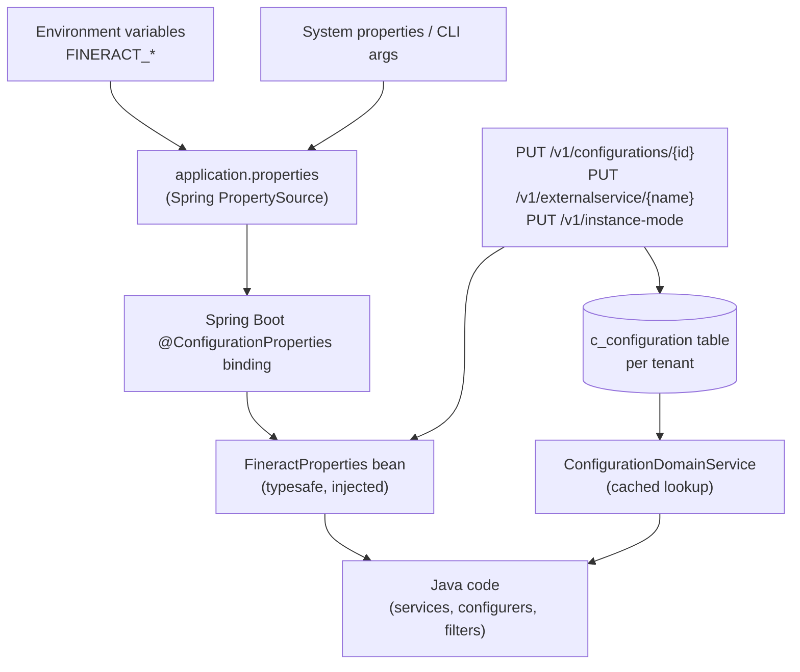
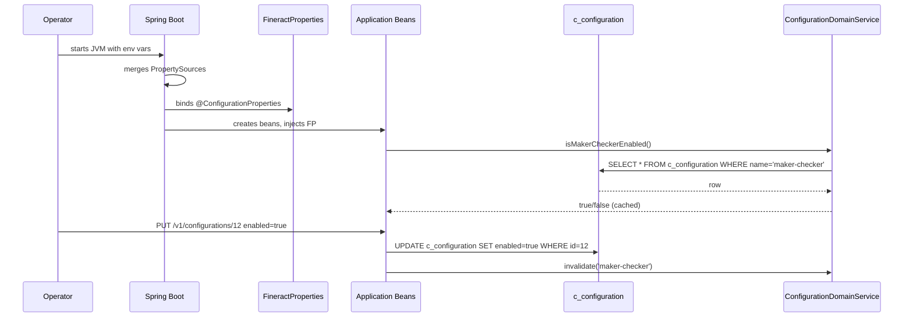

Apache Fineract reads its configuration from three layered sources that
together decide what the server looks like at runtime. The same key can
appear in several places — an `application.properties` line, an environment
variable that overrides it, a typed `@ConfigurationProperties` bean built
from those properties, and a database row in `c_configuration` that
fronts a runtime feature flag. This page explains how those layers fit
together and which page in this group covers each one.

## The three layers

| Layer | Where it lives | Read at | Mutable at runtime? | Audience |
| --- | --- | --- | --- | --- |
| Spring property source | `fineract-provider/src/main/resources/application.properties` plus env vars | Startup, before bean creation | No (requires restart) | Operators |
| `FineractProperties` | `org.apache.fineract.infrastructure.core.config.FineractProperties` | Bound at startup, injected as bean | Only via internal/test APIs (e.g. `InstanceModeApiResource`) | Java code |
| `GlobalConfigurationProperty` | `c_configuration` table per tenant | Lazy + cached lookup by name/id | Yes via `PUT /v1/configurations/{id}` | Admins, business users |

The first two layers are JVM‑wide. The third one is per‑tenant, because
each tenant database has its own `c_configuration` table populated by
Liquibase changelogs.

## Layered resolution flow



Read top‑to‑bottom: env vars feed Spring property sources, those feed
`FineractProperties`, and Java code mixes the typesafe bean with calls
to `ConfigurationDomainService`. The REST APIs on the right‑hand side
let admins mutate the database flags (and, in test profile, the in‑memory
`FineractProperties.mode` state) without a redeploy.

## When to use which layer

The three layers are not interchangeable. The codebase follows clear
conventions about where each kind of switch belongs.

### application.properties / env vars

Use this layer for anything that affects bean wiring, security, JDBC
connections, thread pools, message broker URLs, server port, SSL, or
external infrastructure. These values are needed before the application
context is ready and cannot be changed without a restart. They are read
once, by Spring, and turned into bean properties.

Examples from `application.properties`:

```properties
server.port=${FINERACT_SERVER_PORT:8443}
spring.datasource.hikari.maximumPoolSize=${FINERACT_HIKARI_MAXIMUM_POOL_SIZE:10}
fineract.security.cors.enabled=${FINERACT_SECURITY_CORS_ENABLED:true}
fineract.mode.read-enabled=${FINERACT_MODE_READ_ENABLED:true}
```

See [Application Properties Reference](/config/application-properties)
for a section‑by‑section walkthrough and
[JDBC Environment Variables](/config/jdbc-env-variables) for the tenant
datasource subset.

### FineractProperties

Use this layer when Java code needs the same value many times and you
want compile‑time safety. `FineractProperties` is the only
`@ConfigurationProperties(prefix = "fineract")` bean in the platform; it
holds nested static classes for tenant, mode, security, events, jobs,
cache and more. Everything under the `fineract.*` namespace ends up
here.

```java
@ConfigurationProperties(prefix = "fineract")
public class FineractProperties {
    private String nodeId;
    private FineractTenantProperties tenant;
    private FineractModeProperties mode;
    private FineractSecurityProperties security;
    private FineractPartitionedJob partitionedJob;
    private FineractRemoteJobMessageHandlerProperties remoteJobMessageHandler;
    private FineractEventsProperties events;
    // ...
}
```

See [FineractProperties Reference](/config/fineract-properties) for the
full nested‑class hierarchy.

### GlobalConfigurationProperty

Use this layer for behaviour switches that admins must be able to flip
at runtime without redeploying, such as `maker-checker`,
`allow-transactions-on-holiday`, `enable-business-date`, `rounding-mode`.
The entity lives in `fineract-core`:

```java
@Entity
@Table(name = "c_configuration")
public class GlobalConfigurationProperty extends AbstractPersistableCustom<Long> {
    @Column(name = "name", nullable = false)    private String name;
    @Column(name = "enabled", nullable = false) private boolean enabled;
    @Column(name = "value")                     private Long value;
    @Column(name = "date_value")                private LocalDate dateValue;
    @Column(name = "string_value")              private String stringValue;
    @Column(name = "description")               private String description;
    @Column(name = "is_trap_door", nullable = false) private boolean isTrapDoor;
}
```

The `is_trap_door` flag marks one‑way switches: once enabled, the row
cannot be flipped back through the normal `GlobalConfigurationApiResource`.
Trap‑door flags exist precisely because some changes (e.g. activating
business date, switching account‑number strategy) are not safely
reversible while data is live.

See [Global Configuration API](/config/global-configuration-api),
[Feature Flags](/config/feature-flags) and
[/core/configuration-properties](/core/configuration-properties) for the
detailed catalog.

## Cross‑layer interactions

Some configuration crosses layer boundaries on purpose. A few patterns
recur in the code:

| Pattern | Example | Where it lives |
| --- | --- | --- |
| Default in properties, override in DB | `fineract.tenant.config.min-pool-size` (-1 means "use DB") | `FineractConfigProperties.isMinPoolSizeSet()` |
| Property mirrored in DB row | `rounding-mode` flag mirrors `fineract.tenant.config.rounding-mode` | `MoneyHelperInitializationService` |
| Runtime mutation of typesafe bean | `PUT /v1/instance-mode` updates `FineractProperties.mode.*` | `InstanceModeApiResource` (test profile only) |
| External service secrets in DB | S3, SMTP, SMS, NOTIFICATION key/value rows in `c_external_service_properties` | `ExternalServicesConfigurationApiResource` |

`FineractConfigProperties` shows the override pattern explicitly:

```java
@Getter
@Setter
public static class FineractConfigProperties {
    private int minPoolSize;
    private int maxPoolSize;

    public boolean isMinPoolSizeSet() { return minPoolSize != -1; }
    public boolean isMaxPoolSizeSet() { return maxPoolSize != -1; }
}
```

A `-1` sentinel in the property means "the DB row wins". Any other value
takes precedence over what is persisted per tenant. This is how operators
can force a pool size at deployment time without editing tenant tables.

## The configuration cookbook

Use the pages in this group in roughly this order when bringing up a new
environment.

1. [Application Properties](/config/application-properties) — pick the
   sections that match your deployment (datasource, server, security,
   events).
2. [JDBC Environment Variables](/config/jdbc-env-variables) — point
   Fineract at your tenants database and tenant DB host.
3. [CORS and Security Properties](/config/cors-security-properties) —
   enable OAuth2/2FA, list allowed CORS origins, configure HSTS.
4. [FineractProperties Reference](/config/fineract-properties) — read
   the typesafe view if you are writing Java code that consumes config.
5. [Kafka and JMS Properties](/config/kafka-and-jms-properties) — wire
   the external event bus and remote job message handler.
6. [Job Properties](/config/job-properties) — tune partition counts,
   chunk size and per‑job retry limits for Spring Batch.
7. [Global Configuration API](/config/global-configuration-api) — list
   and flip per‑tenant flags.
8. [External Services Config](/config/external-services-config) — set
   S3, SMTP, SMS or NOTIFICATION values.
9. [Feature Flags](/config/feature-flags) — reference catalog of named
   `c_configuration` rows, mapped to the Java code that reads them.
10. [Instance Mode API](/config/instance-mode-api) — flip read/write/batch
    roles at runtime (test profile only).
11. [Internal Configurations API](/config/internal-configurations-api) —
    advanced trap‑door overrides for diagnostics and tests.

## How configuration loading sequences

Spring Boot walks the property sources in order: command‑line args win
over `SPRING_APPLICATION_JSON`, which wins over OS env vars, which win
over `application.properties`. Inside `application.properties`, every
line in Fineract uses the `${VAR:default}` form so any operator can
override any value with an env var without editing the file.

```properties
server.port=${FINERACT_SERVER_PORT:8443}
fineract.node-id=${FINERACT_NODE_ID:1}
fineract.tenant.host=${FINERACT_DEFAULT_TENANTDB_HOSTNAME:localhost}
```

Once Spring has the merged property source, it binds `FineractProperties`
once. After that, the bean is immutable from the application's point of
view — only `InstanceModeApiResource` and a few internal endpoints
mutate it, and they exist behind the `test` Spring profile.

The DB‑backed layer behaves differently: rows in `c_configuration` are
read lazily and cached. The repository wrapper invalidates its cache on
write, and updates that occur through `PUT /v1/configurations/{id}` go
through a command (`UPDATE_GLOBAL_CONFIGURATION`) so they are auditable
and replayable.



## What does NOT live in configuration

A few categories of state look like configuration but are managed
elsewhere:

- **Code values** — currency codes, payment types, fund sources and
  similar enumerations live in `m_code` / `m_code_value`. See
  [/core/codes](/core/codes).
- **Permissions and roles** — `m_permission`, `m_role`, `m_role_permission`.
  See [/security/security-services](/core/security-services).
- **Job schedules** — Quartz `JobDetail` rows plus cron expressions on
  the `m_scheduled_email_messages_outbound` and `job` tables. See
  [/jobs/scheduler-and-quartz](/jobs/scheduler-and-quartz).
- **Tenant database connection** — the *bootstrap* tenants table on the
  Hikari datasource has its own connection row per tenant. See
  [/tenancy/overview](/tenancy/overview).

Keep these separate from this group's pages: they are not properties or
flags, even though they configure platform behaviour.

## Reading the source

When you need to know which property a feature checks, follow this
sequence:

1. Search `application.properties` for a `fineract.<area>.*` key — the
   default value tells you the shipped behaviour.
2. Search `FineractProperties` for a field name that matches — the
   nested‑class name (e.g. `FineractModeProperties`, `CorsProperties`)
   tells you which subsystem owns it.
3. If you cannot find a property, search `GlobalConfigurationConstants`
   for a string constant — that is the runtime flag name. Then grep for
   that constant to find the consumer.

For example, "maker‑checker on/off" is not in `application.properties`;
it is `GlobalConfigurationConstants.MAKER_CHECKER = "maker-checker"`,
consumed via `ConfigurationDomainService.isMakerCheckerEnabledForTask(...)`.

## Related pages

- [/runtime/spring-boot-configuration](/runtime/spring-boot-configuration)
  — Spring Boot bootstrap, profile activation, property source order.
- [/core/configuration-properties](/core/configuration-properties) — the
  `GlobalConfigurationProperty` entity and `ConfigurationDomainService`
  surface in detail.
- [/runtime/datasource-and-connection-pooling](/runtime/datasource-and-connection-pooling)
  — Hikari pool settings.
- [/security/cors-and-hsts](/security/cors-and-hsts) — CORS filter
  behaviour driven by `fineract.security.cors.*`.
- [/jobs/spring-batch-manager-worker](/jobs/scheduler-and-quartz) — Spring
  Batch partitioned job tuning driven by `fineract.partitioned-job.*`.
- [/events/event-producer-jms](/events/event-producer-jms) and
  [/events/event-producer-kafka](/events/event-producer-kafka) — external
  event bus selection driven by `fineract.events.external.producer.*`.
- [/tenancy/overview](/core/datasource-tenant-routing) — multi‑tenant
  routing fed by `fineract.tenant.*`.
