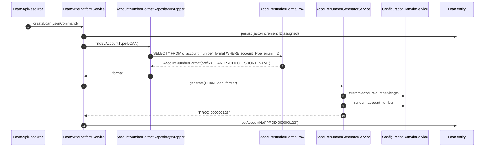

Account numbers in Apache Fineract are not just auto‑incrementing keys; they
are configurable per entity type (client, loan, savings, share, etc.) with a
prefix that can be drawn from the entity itself (office name, product short
name, client type) or a free‑form string. The `infrastructure.accountnumberformat`
package owns the entity, the prefix enum, the lookup interface and the
service contract. This page is the reference for that package and the
`AccountNumberFormatRepositoryWrapper` that lives in `fineract-provider`.

## Layout

```text
infrastructure/accountnumberformat/
├── data/
│   └── AccountNumberFormatData.java
├── domain/
│   ├── AccountNumberFormat.java
│   ├── AccountNumberFormatEnumerations.java
│   ├── AccountNumberFormatLookup.java
│   ├── AccountNumberFormatRepository.java
│   └── EntityAccountType.java
└── service/
    ├── AccountNumberFormatConstants.java
    └── AccountNumberGeneratorService.java
```

## `EntityAccountType` — what owns an account number

```java
public enum EntityAccountType {
    CLIENT              (1, "accountType.client"),
    LOAN                (2, "accountType.loan"),
    SAVINGS             (3, "accountType.savings"),
    CENTER              (4, "accountType.center"),
    GROUP               (5, "accountType.group"),
    SHARES              (6, "accountType.shares"),
    WORKING_CAPITAL_LOAN(7, "accountType.workingCapitalLoan");

    private final Integer value;
    private final String  code;
}
```

The integer values are the persisted discriminator stored in
`c_account_number_format.account_type_enum` and are reused throughout the
platform (loan creation, savings creation, share account workflows) when the
generator needs to know which row to load.

Helper booleans like `isClientAccount()`, `isLoanAccount()`,
`isSavingsAccount()`, `isCenterAccount()`, `isGroupAccount()` are provided
for the few code paths that branch on type without going through the
generator.

## `AccountNumberPrefixType` — what to put in front

Declared as a nested enum on `AccountNumberFormatEnumerations`. The
integer ranges are intentional — the hundreds digit identifies the entity
family the prefix is relevant for:

| Enum | `value` | Source for the prefix |
| --- | --- | --- |
| `OFFICE_NAME` | `1` | The owning office's name. Works for every entity type. |
| `CLIENT_TYPE` | `101` | The `client_type` code value on the client (client accounts only). |
| `LOAN_PRODUCT_SHORT_NAME` | `201` | The loan product's `short_name` column (loan accounts only). |
| `SAVINGS_PRODUCT_SHORT_NAME` | `301` | The savings product's `short_name` column (savings accounts only). |
| `PREFIX_SHORT_NAME` | `401` | A free‑form `prefix_character` column stored on the format row. |

`AccountNumberFormatEnumerations` also publishes immutable sets that
declare which prefix types are valid per entity:

```java
public static final Set<AccountNumberPrefixType> accountNumberPrefixesForClientAccounts =
        Set.of(OFFICE_NAME, CLIENT_TYPE, PREFIX_SHORT_NAME);

public static final Set<AccountNumberPrefixType> accountNumberPrefixesForLoanAccounts =
        Set.of(OFFICE_NAME, LOAN_PRODUCT_SHORT_NAME, PREFIX_SHORT_NAME);

public static final Set<AccountNumberPrefixType> accountNumberPrefixesForSavingsAccounts =
        Set.of(OFFICE_NAME, SAVINGS_PRODUCT_SHORT_NAME, PREFIX_SHORT_NAME);

public static final Set<AccountNumberPrefixType> accountNumberPrefixesForCenters =
        Set.of(OFFICE_NAME);
```

Validators on the API resource consult these sets to reject incompatible
combinations — e.g. picking `LOAN_PRODUCT_SHORT_NAME` for a savings account.

### Compatibility matrix

| Entity / Prefix | `OFFICE_NAME` | `CLIENT_TYPE` | `LOAN_PRODUCT_SHORT_NAME` | `SAVINGS_PRODUCT_SHORT_NAME` | `PREFIX_SHORT_NAME` |
| --- | :---: | :---: | :---: | :---: | :---: |
| `CLIENT` | ✓ | ✓ |  |  | ✓ |
| `LOAN` | ✓ |  | ✓ |  | ✓ |
| `SAVINGS` | ✓ |  |  | ✓ | ✓ |
| `CENTER` | ✓ |  |  |  |  |
| `GROUP` | ✓ |  |  |  |  |
| `SHARES` | ✓ |  |  |  | ✓ |

## `AccountNumberFormat` — the entity

```java
@Entity
@Table(name = AccountNumberFormatConstants.ACCOUNT_NUMBER_FORMAT_TABLE_NAME,
       uniqueConstraints = { @UniqueConstraint(columnNames = { ACCOUNT_TYPE_ENUM_COLUMN_NAME },
                                               name = ACCOUNT_TYPE_UNIQUE_CONSTRAINT_NAME) })
public class AccountNumberFormat extends AbstractPersistableCustom<Long> {

    @Column(name = ACCOUNT_TYPE_ENUM_COLUMN_NAME, nullable = false)
    private Integer accountTypeEnum;

    @Column(name = PREFIX_TYPE_ENUM_COLUMN_NAME, nullable = true)
    private Integer prefixEnum;

    @Column(name = PREFIX_CHARACTER_COLUMN_NAME, nullable = true)
    private String prefixCharacter;

    public AccountNumberFormat(EntityAccountType entityAccountType,
                               AccountNumberPrefixType prefixType, String prefixCharacter) {
        this.accountTypeEnum = entityAccountType.getValue();
        if (prefixType != null) this.prefixEnum = prefixType.getValue();
        this.prefixCharacter = prefixCharacter;
    }

    public EntityAccountType getAccountType() { return EntityAccountType.fromInt(this.accountTypeEnum); }
    public Integer getPrefixEnum()             { return this.prefixEnum; }
    public String  getPrefixCharacter()        { return this.prefixCharacter; }
}
```

Properties:

- The table is **`c_account_number_format`**.
- There is at most **one row per `accountTypeEnum`** — the
  `account_type_enum` unique constraint enforces it.
- `prefixEnum` is nullable. When null, the generator uses just the
  formatted internal ID with no prefix.
- `prefixCharacter` only matters for `PREFIX_SHORT_NAME`; for other prefix
  types it can be `null`.

The class extends `AbstractPersistableCustom<Long>` (no audit columns —
this is configuration, not transactional data).

## `AccountNumberFormatRepository`

A Spring Data JPA repository that adds the obvious lookup:

```java
public interface AccountNumberFormatRepository extends JpaRepository<AccountNumberFormat, Long> {
    AccountNumberFormat findOneByAccountTypeEnum(Integer accountTypeEnum);
}
```

## `AccountNumberFormatLookup` & `AccountNumberFormatRepositoryWrapper`

The lookup contract is defined in `fineract-core`:

```java
public interface AccountNumberFormatLookup {
    AccountNumberFormat findByAccountType(EntityAccountType entityAccountType);
}
```

The wrapper that implements it ships in `fineract-provider` because it
references the not‑found exception that exists outside `fineract-core`:

```java
@Repository
public class AccountNumberFormatRepositoryWrapper implements AccountNumberFormatLookup {

    private final AccountNumberFormatRepository repository;

    @Override
    public AccountNumberFormat findByAccountType(final EntityAccountType entityAccountType) {
        return this.repository.findOneByAccountTypeEnum(entityAccountType.getValue());
    }

    public AccountNumberFormat findOneWithNotFoundDetection(final Long id) {
        return this.repository.findById(id)
                .orElseThrow(() -> new AccountNumberFormatNotFoundException(id));
    }

    public void save(final AccountNumberFormat accountNumberFormat)        { this.repository.save(accountNumberFormat); }
    public void saveAndFlush(final AccountNumberFormat accountNumberFormat){ this.repository.saveAndFlush(accountNumberFormat); }
    public void delete(final AccountNumberFormat accountNumberFormat)      { this.repository.delete(accountNumberFormat); }
}
```

| Method | Purpose |
| --- | --- |
| `findByAccountType(EntityAccountType)` | Returns the configured format for the entity type. `null` if none configured (the caller falls back to the default numeric format). |
| `findOneWithNotFoundDetection(Long id)` | Used by the `accountNumberFormats/{id}` REST endpoint; throws `AccountNumberFormatNotFoundException` → 404. |
| `save` / `saveAndFlush` / `delete` | Standard repository operations exposed to the write service. |

## `AccountNumberGeneratorService` — the contract

The generator interface lives in `fineract-core`. The implementation
(`AccountNumberGeneratorServiceImpl`) is in `fineract-provider` because it
needs Velocity templating and the per‑entity field extractors:

```java
public interface AccountNumberGeneratorService {
    String generate(EntityAccountType type, Object entity, AccountNumberFormat format);
}
```

The implementation:

1. Reads the entity's auto‑increment ID and formats it to the configured
   width (default 9 zero‑padded digits; overridable via the
   `custom-account-number-length` global configuration property — see
   [configuration properties](/core/configuration-properties)).
2. If `random-account-number` is on, generates a random N‑digit string
   instead of the sequential ID.
3. Resolves the prefix:
   - `OFFICE_NAME` → the entity's office's name, uppercased.
   - `CLIENT_TYPE` → the client's `client_type` code‑value `code` field.
   - `LOAN_PRODUCT_SHORT_NAME` / `SAVINGS_PRODUCT_SHORT_NAME` → the
     product's `short_name` column.
   - `PREFIX_SHORT_NAME` → the literal `prefixCharacter` from the format row.
4. Concatenates `<prefix><formatted_id>` and returns it.

If no `AccountNumberFormat` exists for the entity type, the prefix is
omitted and the formatted ID is returned alone.

## API constants

`AccountNumberFormatConstants` holds the JSON parameter and column‑name
constants:

```java
public static final String ENTITY_NAME = "accountNumberFormat";
public static final String resourceRelativeURL = "/v1/accountnumberformats";

public static final String idParamName              = "id";
public static final String accountTypeParamName     = "accountType";
public static final String prefixTypeParamName      = "prefixType";
public static final String prefixCharacterParamName = "prefixCharacter";

public static final String accountTypeOptionsParamName = "accountTypeOptions";
public static final String prefixTypeOptionsParamName  = "prefixTypeOptions";

public static final String EXCEPTION_DUPLICATE_ACCOUNT_TYPE =
        "error.msg.account.number.format.duplicate.account.type";
public static final String EXCEPTION_ACCOUNT_NUMBER_FORMAT_NOT_FOUND =
        "error.msg.account.number.format.id.invalid";

public static final String ACCOUNT_NUMBER_FORMAT_TABLE_NAME = "c_account_number_format";
public static final String ACCOUNT_TYPE_ENUM_COLUMN_NAME    = "account_type_enum";
public static final String PREFIX_TYPE_ENUM_COLUMN_NAME     = "prefix_type_enum";
public static final String PREFIX_CHARACTER_COLUMN_NAME     = "prefix_character";
public static final String ACCOUNT_TYPE_UNIQUE_CONSTRAINT_NAME = "account_type_enum";
```

The REST resource itself (`AccountNumberFormatsApiResource`) lives in
`fineract-provider` and exposes the standard CRUD endpoints under
`/v1/accountnumberformats`. The duplicate‑type validation surfaces as a
`PlatformDataIntegrityException` via the unique constraint and is mapped to
`403 Forbidden`.

## End‑to‑end: creating a loan with a formatted account number



If `random-account-number` is enabled, step 8 returns a random
zero‑padded string instead of the sequential one. If no format row exists,
the prefix portion is omitted entirely.

## Read DTO

`AccountNumberFormatData` is the read DTO used by template endpoints. It
carries:

| Field | Source |
| --- | --- |
| `id` | Row id |
| `accountType` | `EnumOptionData` (id, code, value) for the entity type |
| `prefixType` | `EnumOptionData` for the prefix type (nullable) |
| `prefixCharacter` | The literal prefix string for `PREFIX_SHORT_NAME` |
| `accountTypeOptions` | Template only — every `EntityAccountType` |
| `prefixTypeOptions` | Template only — the prefix set valid for the selected entity type (e.g. `accountNumberPrefixesForLoanAccounts`) |

## Related pages

<CardGroup cols={2}>
  <Card title="Configuration properties" href="/core/configuration-properties">
    `custom-account-number-length` and `random-account-number` flags that drive the generator.
  </Card>
  <Card title="Codes" href="/core/codes">
    `CLIENT_TYPE` prefix reads from the `ClientType` code values.
  </Card>
  <Card title="Persistence & JPA" href="/core/persistence-and-jpa">
    `AbstractPersistableCustom<Long>` — the base class for `AccountNumberFormat`.
  </Card>
  <Card title="Infrastructure core inventory" href="/core/infrastructure-core">
    Full subpackage map.
  </Card>
</CardGroup>
