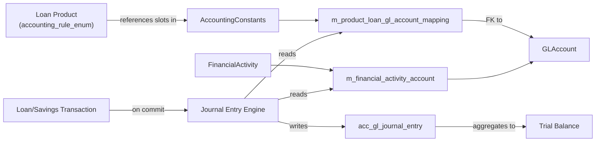

The `accounting/` subtree in `fineract-core` defines the **chart of accounts contract** every product uses: the GL account tree with type/usage discriminators, the credit/debit journal entry enum, the named "financial activities" that map system events to accounts (e.g. "Asset Transfer Cash"), and the product-to-account mapping DTOs that turn a loan or savings product configuration into the right GL accounts at posting time. The journal-entry runtime — the engine that takes a domain transaction and emits balanced double-entry rows — lives in `fineract-accounting`. This page is the reference for the shared types.

<Note>
Fineract supports **three accounting modes** per product (Cash, Accrual Periodic, Accrual Upfront) plus `NONE`. The mode is captured by `AccountingRuleType` on the product, and the rest of the accounting machinery branches on it.
</Note>

## Subpackage map

| Package                                     | Purpose                                                                |
| ------------------------------------------- | ---------------------------------------------------------------------- |
| `accounting/common`                         | Constants and enums: `AccountingRuleType`, `AccountingConstants`, `AccountingEnumerations` |
| `accounting/glaccount`                      | The GL account tree (`GLAccount`), its type/usage enums, mappers       |
| `accounting/journalentry`                   | The journal entry type enum + DTOs                                     |
| `accounting/financialactivityaccount`       | "Financial activity" → GL mapping data                                 |
| `accounting/producttoaccountmapping`        | Per-product GL mapping DTOs (charge / payment-type / advanced)        |

## `AccountingRuleType` — product accounting mode

```java
public enum AccountingRuleType {
    NONE             (1, "accountingRuleType.none",                "No accounting"),
    CASH_BASED       (2, "accountingRuleType.cash",                "Cash based accounting"),
    ACCRUAL_PERIODIC (3, "accountingRuleType.accrual.periodic",    "Periodic accrual accounting"),
    ACCRUAL_UPFRONT  (4, "accountingRuleType.accrual.upfront",     "Upfront accrual accounting");

    public Integer getValue();
    public String getCode();
    public String getDescription();
}
```

Stored as `accounting_rule_enum` on product tables (`m_product_loan`, `m_savings_product`). At transaction time the journal entry engine reads this value and dispatches to the matching `AccountingProcessor`:

- **`NONE`** — no journal entries are written. Useful for sandbox products.
- **`CASH_BASED`** — entries only on cash movement (disbursement, repayment, deposit, withdrawal).
- **`ACCRUAL_PERIODIC`** — interest and fee accruals posted periodically (via the `ADD_PERIODIC_ACCRUAL_ENTRIES` job); cash entries on actual movement.
- **`ACCRUAL_UPFRONT`** — interest/fee receivables posted upfront at disbursement; cash entries reduce the receivable as paid.

## `AccountingConstants` — slot definitions

```java
public final class AccountingConstants {

    public enum CashAccountsForLoan {
        FUND_SOURCE(1),
        LOAN_PORTFOLIO(2),
        INTEREST_ON_LOANS(3),
        INCOME_FROM_FEES(4),
        INCOME_FROM_PENALTIES(5),
        LOSSES_WRITTEN_OFF(6),
        TRANSFERS_SUSPENSE(8),
        OVERPAYMENT(9);
        // ...
    }

    public enum AccrualAccountsForLoan { /* ... */ }
    public enum CashAccountsForSavings { /* ... */ }
    public enum AccrualAccountsForSavings { /* ... */ }
    public enum FinancialActivity { /* ... */ }
}
```

Each enum captures the **slots** a given product/accounting-mode combination must fill. When a product is configured the operator maps each slot to a real `GLAccount` (e.g. `LOAN_PORTFOLIO` → "1101 Loans Receivable"). The journal entry engine looks up the slot, finds the mapped account, and posts the entry there.

The `FinancialActivity` enum captures **organisation-wide** slots not tied to a specific product (e.g. inter-branch transfer suspense). See "Financial activity accounts" below.

## `GLAccount` — the chart of accounts node

```java
@Entity
@Table(name = "acc_gl_account")
public class GLAccount extends AbstractPersistableCustom<Long> { /* ... */ }
```

Self-referential tree with: `name`, `glCode` (institution's account number), `parent`, `hierarchy` (materialised path like `.1.4.7.`), `type` (`GLAccountType`), `usage` (`GLAccountUsage`), `manualEntriesAllowed`, `disabled`, `description`, and `tagId` (FK to a `CodeValue` for free-form tagging).

### `GLAccountType`

```java
public enum GLAccountType {
    ASSET    (1, "accountType.asset"),
    LIABILITY(2, "accountType.liability"),
    EQUITY   (3, "accountType.equity"),
    INCOME   (4, "accountType.income"),
    EXPENSE  (5, "accountType.expense");
}
```

The five primary account categories. Trial-balance reports group by these.

### `GLAccountUsage`

```java
public enum GLAccountUsage {
    DETAIL(1, "accountUsage.detail"),
    HEADER(2, "accountUsage.header");
}
```

Tree role:

- **HEADER** accounts can have children but cannot themselves receive journal entries (they're rollups).
- **DETAIL** accounts are leaves that accept postings; they may have no children.

This separation prevents posting against a summary node by mistake.

### Repositories

| Class                                     | Purpose                                                       |
| ----------------------------------------- | ------------------------------------------------------------- |
| `GLAccountRepository`                     | Spring Data CRUD                                              |
| `GLAccountRepositoryWrapper`              | Null-safe accessors throwing `GLAccountNotFoundException`     |
| `GlAccountMapper`, `GlAccountTypeMapper`, `GlAccountUsageMapper` | EnumOptionData converters                  |

### Input parameter constants

```java
public enum GLAccountJsonInputParams {
    ID("id"), NAME("name"), PARENT_ID("parentId"), GL_CODE("glCode"),
    DISABLED("disabled"), MANUAL_ENTRIES_ALLOWED("manualEntriesAllowed"),
    TYPE("type"), USAGE("usage"), DESCRIPTION("description"), TAGID("tagId");
}
```

Used by the create/update handler to whitelist allowed fields and avoid "extra parameter" rejections from `JsonCommand.checkForUnsupportedParameters`.

## `JournalEntryType` — debit/credit

```java
public enum JournalEntryType {
    CREDIT(1, "journalEntryType.credit"),
    DEBIT (2, "journalEntrytType.debit");   // note: typo preserved
}
```

Stored as `journal_entry_type` on `acc_gl_journal_entry`. Every transaction emits a balanced set of entries: total debits equal total credits, per currency, per office.

<Warning>
The credit code is `"journalEntryType.credit"` but the debit code is `"journalEntrytType.debit"` (extra `t`). This typo ships in production and changing it would break localization keys. Translation file editors must use the exact strings.
</Warning>

## Financial activity accounts

`FinancialActivityData` is the read-side DTO for the rows that connect a `FinancialActivity` enum value (e.g. `ASSET_TRANSFER` = "Asset Transfer Cash") to a real `GLAccount`. These are organisation-wide mappings, not per-product: when a journal entry needs the asset-transfer suspense account, the engine looks here, regardless of which product triggered the transfer.

The persistence side (`FinancialActivityAccount` entity, repository, exception) lives in `fineract-accounting`. The DTO in core lets read services compile against the contract.

```java
public class FinancialActivityData {
    private final Integer id;
    private final String financialActivityName;
    private final GLAccountData glAccountData;
    // ...
}
```

## Product-to-account mapping DTOs

When an operator creates a Loan or Savings product they specify which GL account to use for each accounting slot. The DTOs in `accounting/producttoaccountmapping/data/`:

| DTO                                     | Maps                                                              |
| --------------------------------------- | ----------------------------------------------------------------- |
| `ChargeToGLAccountMapper`               | Per-charge GL account (e.g. "Loan Fee 1" → Income/Fees 4102)     |
| `PaymentTypeToGLAccountMapper`          | Per-payment-type cash/bank account (e.g. "Mobile money" → 1051) |
| `ClassificationToGLAccountData`         | Per-loan-classification accounts (NPA buckets → separate ledgers)|
| `AdvancedMappingToExpenseAccountData`   | Per-charge expense account for accrual / write-off paths        |

The product-write platform service in `fineract-accounting` reads these DTOs from `JsonCommand` payloads and persists the corresponding `ProductToGLAccountMapping` rows. At posting time the journal-entry engine does the reverse lookup.

`AdvancedMappingtDTO` (in `journalentry/data/`) is a discriminator-only wrapper used by the advanced mapping editor in the admin UI to switch between the four mapping kinds above.

## Cross-section interaction



## Day-in-the-life: a loan disbursement (cash-based)

1. `LoanDisbursalBusinessEvent` is published in-VM (see [business events](/core/event-business)).
2. The accounting engine resolves the loan's product → `accounting_rule_enum = CASH_BASED`.
3. It looks up the slot mappings:
   - `LOAN_PORTFOLIO` slot → GL account `1101 Loans Receivable`.
   - `FUND_SOURCE` slot → GL account `1001 Cash`.
4. It writes two `JournalEntry` rows for the same transaction id, same office, same currency:
   - Debit `1101 Loans Receivable` $1000
   - Credit `1001 Cash` $1000
5. Balance check: total debits = total credits = $1000. Posted.

For `ACCRUAL_*` rules the same flow happens but with more accounts in play (interest receivables, fee income accruals).

## Helpful constants

`AccountingConstants` also exposes:

- **`FUND_SOURCE_INDEX`**, `LOAN_PORTFOLIO_INDEX` etc. — integer slot ids used in mapping rows.
- **Maps of slot → human-readable label** for the admin UI.

## Cross-references

<CardGroup cols={2}>
  <Card title="Accounting Runtime" icon="calculator" href="/accounting/overview">
    The journal entry engine, COB posting jobs, trial balance, accruals.
  </Card>
  <Card title="Loan Overview" icon="hand-holding-dollar" href="/loan/overview">
    Loan products and which accounting slots they use.
  </Card>
  <Card title="Savings Overview" icon="piggy-bank" href="/savings/overview">
    Savings products and `CashAccountsForSavings` slots.
  </Card>
  <Card title="Organisation Shared" icon="building" href="/core/organisation-shared-domain">
    Every journal entry is tagged with an `Office` and uses `MonetaryCurrency`.
  </Card>
</CardGroup>
