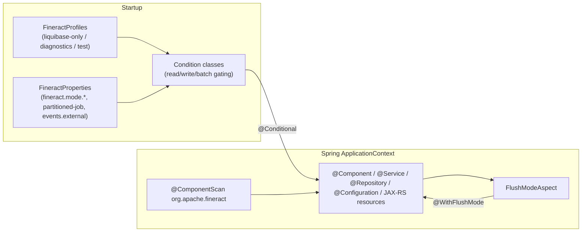

Apache Fineract uses a small but precise AOP and conditional‑configuration
layer to keep cross‑cutting behaviour off the main code paths. This page
documents the `infrastructure.core.annotation`, `infrastructure.core.aop`,
`infrastructure.core.component`, `infrastructure.core.condition` and
`infrastructure.core.boot` packages, which together drive which beans
instantiate, which methods run with adjusted flush modes, and which JVM
"mode" (read / write / batch‑manager / batch‑worker) a particular deployment
is allowed to operate in.

## `infrastructure.core.boot` — profile constants

```java
public final class FineractProfiles {
    public static final String LIQUIBASE_ONLY = "liquibase-only";
    public static final String DIAGNOSTICS    = "diagnostics";
    public static final String TEST           = "test";

    private FineractProfiles() {}
}
```

Three Spring profiles the platform cares about:

| Profile | Purpose |
| --- | --- |
| `liquibase-only` | The JVM should only run Liquibase migrations and exit. Used as a Kubernetes init container. Enabled by `FineractLiquibaseOnlyApplicationCondition`. |
| `diagnostics` | Enables the performance‑measurement aspects/utilities under `infrastructure.core.diagnostics.performance`. |
| `test` | Adjusts beans for integration tests (uses in‑memory replacements, disables external integrations). |

The constants are referenced throughout the platform; do not hardcode the
profile strings.

## `infrastructure.core.annotation` and `infrastructure.core.aop`

A single annotation/aspect pair lives here today.

### `@WithFlushMode`

```java
@Target({ ElementType.METHOD, ElementType.TYPE })
@Retention(RetentionPolicy.RUNTIME)
public @interface WithFlushMode {
    FlushModeType value() default FlushModeType.AUTO;
}
```

Apply to a method or a class to declare the JPA `FlushModeType` the body
should run with. Method‑level wins over class‑level. The default
`FlushModeType.AUTO` makes the annotation effectively a no‑op — use
`COMMIT` to suppress automatic flushes between queries within a
transaction.

### `FlushModeAspect`

```java
@Aspect
@Component
@Order  // = Ordered.LOWEST_PRECEDENCE → runs after @Transactional
@RequiredArgsConstructor
public class FlushModeAspect {

    private final FlushModeHandler flushModeHandler;

    @Around("@within(withFlushMode) || @annotation(withFlushMode)")
    public Object manageFlushMode(ProceedingJoinPoint joinPoint, WithFlushMode withFlushMode) {
        WithFlushMode effectiveAnnotation = getEffectiveAnnotation(joinPoint, withFlushMode);
        if (effectiveAnnotation == null) {
            return jointPointProceed(joinPoint);
        }

        FlushModeType flushMode = effectiveAnnotation.value();
        boolean hasActiveTransaction = TransactionSynchronizationManager.isActualTransactionActive();

        if (!hasActiveTransaction) {
            // logs a debug warn and proceeds without changing flush mode
            return jointPointProceed(joinPoint);
        }

        return flushModeHandler.withFlushMode(flushMode, () -> jointPointProceed(joinPoint));
    }
    // ...
}
```

Two important properties:

1. **Ordering**: the aspect is declared with `@Order` (defaulting to
   `Ordered.LOWEST_PRECEDENCE`) so it runs **inside** the transaction
   opened by `@Transactional`. Setting the flush mode without an active
   transaction would be a no‑op.
2. **Effective annotation lookup**: a method may inherit the annotation from
   its class. The aspect uses
   `AnnotationUtils.findAnnotation(targetClass, WithFlushMode.class)` so
   class‑level declarations work after Spring's CGLIB proxying.

The aspect delegates to `FlushModeHandler` (documented under
[persistence & JPA](/core/persistence-and-jpa)) which saves the original
flush mode and restores it in a `finally`.

## `infrastructure.core.component`

| Class | Role |
| --- | --- |
| `FetcherRule<P, R>` | Generic `(Predicate<P>, Function<P, R>)` pair. Lets a service express "if these params match, run this fetch". |

`FetcherRule` is intentionally tiny:

```java
@RequiredArgsConstructor
public class FetcherRule<P, R> {
    private final Predicate<P>  condition;
    private final Function<P, R> action;
    public boolean matches(P params) { return condition.test(params); }
    public R       execute(P params) { return action.apply(params); }
}
```

It is used by data‑enricher chains and strategy lists where ordered rule
evaluation is preferred over `if/else if/else` ladders. Inject a
`List<FetcherRule<P, R>>` (Spring will autowire all matching beans), iterate
to find the first match, and call `execute`.

## `infrastructure.core.condition`

Spring's `Condition` SPI is the mechanism the platform uses to gate beans
on **JVM mode** (read / write / batch), on **profile** (`liquibase-only`)
and on validated configuration. Every class implements
`org.springframework.context.annotation.Condition`.

### Mode‑based conditions

All four mode flags read the same root properties on `FineractProperties`,
defaulting to `true` when missing:

- `fineract.mode.read-enabled`
- `fineract.mode.write-enabled`
- `fineract.mode.batch-manager-enabled`
- `fineract.mode.batch-worker-enabled`

| Class | True when |
| --- | --- |
| `EnableFineractEventListenerCondition` | All of read/write/batch are on **OR** at least one of read/write/batch‑worker is on without the others, depending on the partition. In practice: "this JVM is allowed to listen to events." |
| `EnableFineractEventsCondition` | The JVM is allowed to emit events — write or batch mode without read‑only. |
| `FineractWebApplicationCondition` | The JVM serves web traffic (read‑enabled and/or write‑enabled). |
| `FineractModeValidationCondition` | Fails the context when **all** mode flags are off (a misconfiguration). |
| `FineractRemoteJobMessageHandlerCondition` | True when batch‑manager or batch‑worker is on — needed for the JMS/Kafka step partition handlers. |
| `FineractPartitionJobConfigValidationCondition` | True when the partitioned‑job config (`fineract.partitioned-job`) is invalid. Used to surface misconfiguration at startup. |

### Property / profile conditions

| Class | Behaviour |
| --- | --- |
| `ProfileCondition` (abstract) | Exposes `matches(List<String> activeProfiles)` to subclasses. |
| `PropertiesCondition` (abstract) | Exposes `matches(FineractProperties properties)` to subclasses, after binding properties through `SpringPropertiesFactory`. |
| `FineractLiquibaseOnlyApplicationCondition` | `activeProfiles.contains("liquibase-only")` — true in the migration‑only container. |
| `FineractExternalEventConfigCondition` | True when `fineract.events.external.partition-size` is out of bounds (`<1` or `>25000`); used to *block* dependent beans from registering. |
| `FineractValidationCondition` | Aggregate validation condition that combines the above to fail fast on misconfiguration. |
| `SpringPropertiesFactory` | Helper that builds a `FineractProperties` instance ahead of bean registration so conditions can read configuration. |

### Usage pattern

The pattern is consistent across the codebase. A `@Configuration` class adds
`@Conditional(...)` to suppress bean registration:

```java
@Bean
@Conditional(FineractWebApplicationCondition.class)
public Filter myWebFilter() { … }

@Bean
@Conditional(EnableFineractEventsCondition.class)
public ExternalEventProducer externalEventProducer() { … }

@Bean
@Conditional(FineractLiquibaseOnlyApplicationCondition.class)
public LiquibaseRunner liquibaseRunner() { … }
```

`fineract-provider`'s configuration packages then layer these conditions so
the same WAR can boot as a web JVM, a batch worker, a batch manager or a
migration init container by simply flipping properties.

## Component scanning

`fineract-provider`'s `@SpringBootApplication` declares
`@ComponentScan(basePackages = "org.apache.fineract")` so every
`@Component`/`@Service`/`@Repository`/`@RestController` (or, more often,
JAX‑RS `@Path` bean) in `fineract-core`, `fineract-loan`, `fineract-savings`,
`fineract-progressive-loan`, `fineract-investor` and
`fineract-document` joins the same `ApplicationContext`. The conditions
above are what keep that wide scan honest — beans appear or stay out based
on the running JVM's mode and profile.

### What gets scanned

- **`@Component` / `@Service`**: pretty much every class in
  `infrastructure.core.serialization`,
  `infrastructure.core.service`, `infrastructure.core.exceptionmapper`,
  `infrastructure.cache`, `infrastructure.businessdate`,
  `infrastructure.codes`, `infrastructure.configuration`. The JSON helpers,
  exception mappers and tenant resolvers all use stereotype annotations and
  are discovered automatically.
- **`@Repository`**: Spring Data JPA repositories under `*/domain/*` —
  `PlatformCacheRepository`, `CodeRepository`, `CodeValueRepository`,
  `GlobalConfigurationRepository`, `BusinessDateRepository`,
  `AccountNumberFormatRepository`.
- **JAX‑RS resources**: `@Component` plus a `@Path("/v1/...")` —
  `CacheApiResource`, `BusinessDateApiResource`, `CodesApiResource`,
  `CodeValuesApiResource`, `GlobalConfigurationApiResource`. Jersey is
  configured in `fineract-provider` to pick them up via
  `ResourceConfig.packages("org.apache.fineract")`.
- **`@Configuration` + `@ConditionalOnXxx`**: most `fineract-core` config
  classes (e.g. `PlatformCacheConfiguration`, `MapstructMapperConfig`) are
  unconditional. Mode/profile gating is applied at the `@Bean` level rather
  than the class level so the same `@Configuration` can produce conditional
  and unconditional beans.

### What is **not** auto‑discovered

- `AuditorAwareImpl` lives in `fineract-provider` because it depends on
  `AppUser`. It is registered explicitly in the JPA configuration via
  `@EnableJpaAuditing(auditorAwareRef = "auditorAware")`.
- `ExternalIdConverter` is `@Converter(autoApply = true)` and is picked up
  by EclipseLink via the persistence unit scanner, not by Spring component
  scan.

## Summary



## Related pages

<CardGroup cols={2}>
  <Card title="Persistence & JPA" href="/core/persistence-and-jpa">
    `FlushModeHandler`, `ExtendedJpaTransactionManager` — what `FlushModeAspect` delegates to.
  </Card>
  <Card title="Infrastructure core inventory" href="/core/infrastructure-core">
    The full class list for `condition/`, `config/`, `aop/`, `annotation/`.
  </Card>
  <Card title="Jobs overview" href="/jobs/overview">
    Where `EnableFineractEventsCondition` and the batch‑mode gates come into play.
  </Card>
  <Card title="Configuration properties" href="/core/configuration-properties">
    Persisted flags that complement the boot‑time `FineractProperties` flags above.
  </Card>
</CardGroup>
