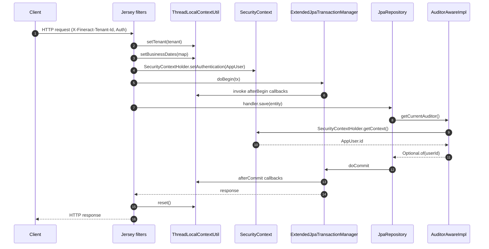

Every write in Apache Fineract leaves a paper trail: who did it, when, under
which tenant, with which business date, and inside which action context
(default vs close‑of‑business). The shared machinery for that audit trail and
the per‑request thread‑local state lives in `infrastructure.core.domain`
(with a small piece — `AuditorAwareImpl` — in `fineract-provider` because it
depends on `AppUser`). This page is the reference for that surface.

## The audit columns

`AbstractAuditableCustom` extends `AbstractPersistableCustom<Long>` and adds
four columns that Spring Data's `AuditingEntityListener` populates on every
insert/update:

```java
@MappedSuperclass
public abstract class AbstractAuditableCustom extends AbstractPersistableCustom<Long>
        implements Auditable<Long, Long, LocalDateTime> {

    @Column(name = "createdby_id")
    private Long createdBy;

    @Column(name = "created_date")
    private LocalDateTime createdDate;

    @Column(name = "lastmodifiedby_id")
    private Long lastModifiedBy;

    @Column(name = "lastmodified_date")
    private LocalDateTime lastModifiedDate;

    // Getters return Optional<...> as required by Spring Data's Auditable
}
```

Most Mifos‑era tables (everything created up to and including the original
Mifos X migration) use this base. Newer tables use
`AbstractAuditableWithUTCDateTimeCustom<T>` which stores the dates as
`OffsetDateTime` in UTC against the columns `createdby_id`,
`created_on_utc`, `lastmodifiedby_id`, `lastmodified_on_utc`.

### `AuditorAwareImpl`

The `createdBy` / `lastModifiedBy` columns are populated by
`AuditorAwareImpl`, which sits in
`fineract-provider/src/main/java/org/apache/fineract/infrastructure/core/domain/AuditorAwareImpl.java`
because it has to resolve the `AppUser` from the Spring Security context:

```java
public class AuditorAwareImpl implements AuditorAware<Long> {

    @Override
    public Optional<Long> getCurrentAuditor() {
        Optional<Long> currentUserId;
        final SecurityContext securityContext = SecurityContextHolder.getContext();
        if (securityContext != null) {
            final Authentication authentication = securityContext.getAuthentication();
            if (authentication != null && authentication.getPrincipal() instanceof AppUser) {
                currentUserId = Optional.ofNullable(((AppUser) authentication.getPrincipal()).getId());
            } else {
                currentUserId = retrieveSuperUser();
            }
        } else {
            currentUserId = retrieveSuperUser();
        }
        return currentUserId;
    }

    private Optional<Long> retrieveSuperUser() {
        return Optional.of(ADMIN_USER_ID);
    }
}
```

Key behaviours:

- The Spring Security `Authentication.getPrincipal()` must be an `AppUser`
  for the real user ID to be used. The platform's
  `PlatformUserDetailsService` always returns `AppUser`, so this is the
  normal path.
- When there is no authentication (Spring Batch jobs, internal scheduled
  tasks, the COB pipeline started by `BusinessDateUpdateHandler`), the
  fall‑back is `AppUserConstants.ADMIN_USER_ID`. A `TODO` in the source
  marks this as a slot for a future "system user" with a dedicated ID.
- The class is registered as the auditor in
  `fineract-provider`'s `@EnableJpaAuditing(auditorAwareRef = "...")`
  configuration.

The audit date itself is provided by Spring Data's
`DateTimeProvider`. Fineract registers a custom provider that calls
`DateUtils.getAuditOffsetDateTime()` (for the UTC variant) and
`DateUtils.getLocalDateTimeOfTenant()` (for the `LocalDateTime` variant) so
both audit superclasses get tenant‑locale‑aware timestamps.

## `ThreadLocalContextUtil`

The thread‑local context is the seam between an inbound HTTP request and
everything the platform needs to know about that request — current tenant,
data‑source qualifier, auth token, the per‑request business‑date map and
the action context.

```java
public final class ThreadLocalContextUtil {

    public static final String CONTEXT_TENANTS = "tenants";

    private static final ThreadLocal<String>                            contextHolder       = new ThreadLocal<>();
    private static final ThreadLocal<FineractPlatformTenant>            tenantContext       = new ThreadLocal<>();
    private static final ThreadLocal<String>                            authTokenContext    = new ThreadLocal<>();
    private static final ThreadLocal<HashMap<BusinessDateType, LocalDate>> businessDateContext = new ThreadLocal<>();
    private static final ThreadLocal<ActionContext>                     actionContext       = new ThreadLocal<>();

    public static FineractPlatformTenant getTenant() { return tenantContext.get(); }
    public static void setTenant(FineractPlatformTenant tenant) { tenantContext.set(tenant); }
    public static void clearTenant() { tenantContext.remove(); }
    // ... data source context, auth token, business dates ...

    public static LocalDate getBusinessDate() {
        BusinessDateType businessDateType = getActionContext().getBusinessDateType();
        return getBusinessDateByType(businessDateType);
    }

    public static ActionContext getActionContext() {
        return actionContext.get() == null ? ActionContext.DEFAULT : actionContext.get();
    }

    public static FineractContext getContext() {
        return new FineractContext(getDataSourceContext(), getTenant(), getAuthToken(),
                                   getBusinessDates(), getActionContext());
    }

    public static void init(FineractContext fineractContext) {
        Assert.notNull(fineractContext, "FineractContext cannot be null during synchronisation!");
        setDataSourceContext(fineractContext.getContextHolder());
        setTenant(fineractContext.getTenantContext());
        setAuthToken(fineractContext.getAuthTokenContext());
        setBusinessDates(fineractContext.getBusinessDateContext());
        setActionContext(fineractContext.getActionContext());
    }

    public static void reset() {
        contextHolder.remove();
        tenantContext.remove();
        authTokenContext.remove();
        businessDateContext.remove();
        actionContext.remove();
    }
}
```

### What each slot is for

| Slot | Set by | Read by |
| --- | --- | --- |
| `tenantContext` | `TenantAwareBasicAuthenticationFilter` / `TenantHeaderFilter` after looking up the tenant via `JdbcTenantDetailsService` | `RoutingDataSource`, every read service that needs the tenant identifier, MDC logging, audit |
| `contextHolder` (data source key) | `RoutingDataSource` after tenant resolution | Migration tooling and the multi‑DB read split |
| `authTokenContext` | Authentication filter (the raw token string for `Fineract-Platform-AuthToken`) | Outbound integrations that need to forward the user's token (PHEE, webhook subscribers) |
| `businessDateContext` | `BusinessDateInitFilter` (and `BusinessDateWritePlatformService` when it mutates the dates) | Every domain method that needs "today" for accruals, schedules, charges; cached invariantly per request |
| `actionContext` | Default `ActionContext.DEFAULT`; switched to `COB` by `LoanCOBManager`/`COBBusinessStepService` during overnight processing | `getBusinessDate()` to pick `BUSINESS_DATE` vs `COB_DATE` |

`Assert.notNull(businessDateContext.get(), "Business dates cannot be null!")`
makes the API explicit: any code path that reads the business date **must**
have run inside a filter that initialised it. The COB filter, the standard
JAX‑RS filter chain and the Spring Batch step listener all do this.

### `getBusinessDate()` — the central read

```java
public static LocalDate getBusinessDate() {
    BusinessDateType businessDateType = getActionContext().getBusinessDateType();
    return getBusinessDateByType(businessDateType);
}
```

The action context drives the lookup:

- `ActionContext.DEFAULT` → `BusinessDateType.BUSINESS_DATE` → "today" as
  configured by the tenant.
- `ActionContext.COB` → `BusinessDateType.COB_DATE` → the close‑of‑business
  date being processed by the overnight pipeline.

This is why a single piece of domain code can be reused both online
(`BUSINESS_DATE`) and during COB processing (`COB_DATE`) without
parameterising on a date — it asks `DateUtils.getBusinessLocalDate()` and
gets the right answer for the context it is in.

## `ActionContext`

```java
@Getter
@AllArgsConstructor
public enum ActionContext {
    DEFAULT(0, "Default context",          BusinessDateType.BUSINESS_DATE),
    COB(1,     "Close of Business context", BusinessDateType.COB_DATE);

    private final int              order;
    private final String           description;
    private final BusinessDateType businessDateType;
}
```

The `businessDateType` field is the key linkage to
`ThreadLocalContextUtil.getBusinessDate()` shown above. Code that needs to
explicitly flip context wraps a block in:

```java
ActionContext previous = ThreadLocalContextUtil.getActionContext();
ThreadLocalContextUtil.setActionContext(ActionContext.COB);
try {
    // run COB business step
} finally {
    ThreadLocalContextUtil.setActionContext(previous);
}
```

That pattern is what the COB pipeline uses for every step.

## `FineractContext`

`FineractContext` is the **immutable snapshot** of the thread‑local state.
The class is `@Jacksonized @Builder` and serializable, which makes it safe to
ship across thread/process boundaries.

```java
@AllArgsConstructor @Jacksonized @Builder @Getter @EqualsAndHashCode
public class FineractContext implements Serializable {
    private final String                                contextHolder;
    private final FineractPlatformTenant                tenantContext;
    private final String                                authTokenContext;
    private final HashMap<BusinessDateType, LocalDate>  businessDateContext;
    private final ActionContext                         actionContext;
}
```

Use cases:

1. **Async execution**: a service captures
   `ThreadLocalContextUtil.getContext()` on the request thread, hands the
   snapshot to a `@Async` method, which calls
   `ThreadLocalContextUtil.init(snapshot)` at the top and
   `ThreadLocalContextUtil.reset()` in a `finally`.
2. **Spring Batch**: `ContextHolder` (also in `domain/`) wraps that
   capture/restore in a step listener so partitioned and remote chunks see
   the same tenant + business date as the launcher.
3. **Message handlers**: external event listeners propagate the snapshot
   so consumers run under the same tenant.

`ContextHolder` is the helper class — it captures, runs, and resets in a
single method. Most async code paths go through `ContextHolder` rather than
calling `ThreadLocalContextUtil.init / reset` by hand.

## `BatchRequestContextHolder`

The Fineract batch API (`/batches`) wraps several sub‑requests into one HTTP
call. `BatchRequestContextHolder` tracks two pieces of per‑thread state
needed during that processing:

```java
public final class BatchRequestContextHolder {

    private static final ThreadLocal<Map<String, Object>>          batchAttributes      = new ThreadLocal<>();
    private static final ThreadLocal<Optional<TransactionStatus>>  batchTransaction     = ThreadLocal.withInitial(Optional::empty);
    private static final ThreadLocal<Boolean>                      isEnclosingTransaction = new ThreadLocal<>();

    public static boolean    isBatchRequest()              { return batchAttributes.get() != null; }
    public static Map<String, Object> getRequestAttributes() { return batchAttributes.get(); }
    public static void       setRequestAttributes(Map<String, Object> m) { batchAttributes.set(m); }
    public static void       resetRequestAttributes()      { batchAttributes.remove(); }

    public static boolean    isEnclosingTransaction()      { return Boolean.TRUE.equals(isEnclosingTransaction.get()); }
    // ...
}
```

Three behaviours worth knowing:

- **`isBatchRequest()`** drives `FineractRequestContextHolder` to look up
  attributes from the batch map instead of the underlying `HttpServletRequest`.
- **`isEnclosingTransaction`** signals to per‑sub‑request services that they
  must join the batch transaction, not open their own. When `true`, write
  services skip `@Transactional(REQUIRES_NEW)` semantics and run inside the
  enclosing transaction the batch dispatcher started.
- **`batchTransaction`** holds the optional `TransactionStatus` of that
  enclosing transaction so the dispatcher can roll back the whole batch on a
  sub‑request failure.

## `FineractRequestContextHolder`

`FineractRequestContextHolder` is the high‑level façade that lets any code
read a request attribute regardless of whether it is running inside a
"normal" request, a batch request or an `ApplicationEvent`:

```java
@Component
public final class FineractRequestContextHolder {

    public Object getAttribute(String key, HttpServletRequest request) {
        if (request != null) {
            return request.getAttribute(key);
        } else if (isBatchRequest()) {
            return Optional.ofNullable(BatchRequestContextHolder.getRequestAttributes())
                    .map(attributes -> attributes.get(key)).orElse(null);
        } else if (RequestContextHolder.getRequestAttributes() != null) {
            return Optional.ofNullable(RequestContextHolder.getRequestAttributes())
                    .map(r -> r.getAttribute(key, RequestAttributes.SCOPE_REQUEST)).orElse(null);
        }
        return null;
    }
}
```

The lookup order is:

1. The supplied `HttpServletRequest`, if any.
2. The batch attribute map.
3. The Spring `RequestContextHolder` for the current thread.

This is the bean filters use to record `idempotencyKey`, `correlationId`,
`originalRequestBody` and the cached idempotency response — the lookup just
works regardless of whether the calling thread is processing a top‑level
request or a batch sub‑request.

## End‑to‑end audit + context flow



The sequence makes three properties visible:

- The tenant is set **before** the transaction begins so the very first SQL
  statement routes correctly.
- The audit columns are populated **during** `flush`, before the commit, by
  Spring Data's `AuditingEntityListener` reading from
  `AuditorAwareImpl`.
- The thread‑local state is `reset()` only **after** the response is written
  — and explicitly in a `finally` so a thrown exception still clears it.

## Audit utility classes

| Class | Purpose |
| --- | --- |
| `AuditableFieldsConstants` | Column‑name constants (`createdby_id`, `created_on_utc`, …). |
| `ContextHolder` | Snapshot/restore wrapper used by async tasks and Spring Batch step listeners. |
| `MDCWrapper` | SLF4J `MDC` wrapper that survives async tasks; `CorrelationHeaderFilter` writes `correlationId`, `tenantId` and `userId` into it. |
| `TenantIdentifierLoggingConverter` | Logback converter that surfaces `%X{tenantId}` in log patterns. |

## Common pitfalls

<AccordionGroup>
  <Accordion title="Forgetting to reset on a custom thread">
    If you spawn your own thread (a plain `ExecutorService`, not a
    Spring‑managed `@Async` executor), capture
    `ThreadLocalContextUtil.getContext()` on the request thread and call
    `init` / `reset` on the worker. Failing to `reset` leaks tenant state
    between unrelated tasks scheduled on the same pool.
  </Accordion>
  <Accordion title="Reading business date before initialisation">
    `getBusinessDates()` throws `IllegalArgumentException` if the slot is
    null. In tests, initialise it via a `@BeforeEach` that calls
    `ThreadLocalContextUtil.setBusinessDates(...)` or use the platform's
    test base class which already does so.
  </Accordion>
  <Accordion title="Using AuditorAwareImpl outside the Spring container">
    Unit tests must either mock `SecurityContextHolder` or accept that
    `AuditorAwareImpl` will fall back to `ADMIN_USER_ID`. The latter is the
    normal behaviour for batch jobs.
  </Accordion>
  <Accordion title="Action context bleed">
    Code that sets `ActionContext.COB` must restore the previous value in a
    `finally`. Otherwise subsequent operations on the same thread will read
    `COB_DATE` when they actually need `BUSINESS_DATE`.
  </Accordion>
</AccordionGroup>

## Related pages

<CardGroup cols={2}>
  <Card title="Business date" href="/core/business-date">
    The persisted `BusinessDate` rows that back the per-thread map.
  </Card>
  <Card title="DataSource & tenant routing" href="/core/datasource-tenant-routing">
    How the tenant slot drives `RoutingDataSource`.
  </Card>
  <Card title="Persistence & JPA" href="/core/persistence-and-jpa">
    `AbstractAuditableCustom` and `ExtendedJpaTransactionManager` callbacks.
  </Card>
  <Card title="Jobs overview" href="/jobs/overview">
    Spring Batch step listeners that propagate `FineractContext` across chunks.
  </Card>
</CardGroup>
