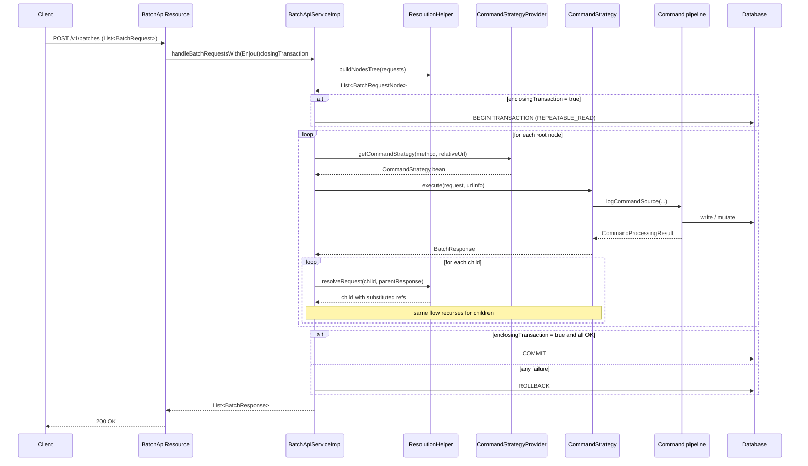

The **Batch API** lets a client send a JSON array of logical HTTP requests in one round-trip and get back an array of logical responses. Inside the server those requests pass through dependency resolution (so a `POST /loans` whose body needs a `clientId` from a preceding `POST /clients` works), a per-request `CommandStrategy` dispatcher, and optionally a single enclosing JPA transaction so a failure anywhere rolls everything back. This page is the reference for the `batch/` package in `fineract-core` — the domain types, command-strategy resolver, JSON-path dependency resolution, and the relationship to the [synchronous command pipeline](/core/commands-framework).

<Note>
Batch is a **JSON-over-HTTP** facade. It does **not** open new TCP connections inside the JVM — every sub-request is dispatched to a `CommandStrategy` bean that delegates to the same handler `POST /v1/clients` would call. There is no proxy hop, no servlet recursion.
</Note>

## Package layout

| Subpackage              | Purpose                                                                |
| ----------------------- | ---------------------------------------------------------------------- |
| `batch/api`             | `BatchApiResource` — the public `/v1/batches` JAX-RS endpoint         |
| `batch/command`         | `CommandStrategy`, `CommandStrategyProvider`, `CommandContext`, registry |
| `batch/domain`          | `BatchRequest`, `BatchResponse`, `Header` value types                  |
| `batch/exception`       | `BatchReferenceInvalidException`, `ErrorInfo`                          |
| `batch/serialization`   | `BatchRequestJsonHelper` (Gson-based parser)                          |
| `batch/service`         | `BatchApiService` interface + `BatchApiServiceImpl`, `ResolutionHelper`, `BatchExecutionException` |

## `BatchRequest` and `BatchResponse`

```java
@Data @NoArgsConstructor @Accessors(chain = true)
public class BatchRequest {
    private Long requestId;
    private String relativeUrl;
    private String method;       // GET / POST / PUT / DELETE
    private Set<Header> headers;
    private Long reference;      // requestId of the parent (dependency)
    private String body;
}

@Data @NoArgsConstructor @Accessors(chain = true)
public class BatchResponse {
    private Long requestId;
    private Integer statusCode;
    private Set<Header> headers;
    private String body;
}

@Data @AllArgsConstructor @NoArgsConstructor
public class Header { private String name; private String value; }
```

- **`requestId`** is the client-assigned id used for dependency wiring.
- **`reference`** is the `requestId` of the parent — null for roots. Forward references are illegal.
- **`relativeUrl`** is everything after `/v1/` (e.g. `clients`, `loans/4/approve?command=approve`).
- **`body`** is a JSON string. `$.path` expressions in the body are resolved against the parent response.

`BatchResponse.statusCode` mirrors HTTP. `body` is the JSON response — opaque to the framework.

## `BatchApiResource`

```java
@Path("/v1/batches")
public class BatchApiResource {

    @POST
    public List<BatchResponse> handleBatchRequests(
            @QueryParam("enclosingTransaction") @DefaultValue("false") boolean enclosingTransaction,
            @Context UriInfo uriInfo,
            List<BatchRequest> requests) { ... }
}
```

The query parameter `enclosingTransaction` toggles the two execution modes:

- **`false` (default)** — each root request runs in its own transaction. Successful sub-requests stay even if a later one fails.
- **`true`** — every sub-request shares one `REPEATABLE_READ` transaction; any failure rolls back the lot.

Read-only filter: the resource itself iterates the request list and applies `PlatformSecurityContext` checks plus the [instance-mode](/core/instance-mode) policy. A read-only instance accepts a batch containing only `GET` sub-requests but throws `InvalidInstanceTypeMethodException` if any sub-request mutates.

## Header value type

`Header` is a name/value pair. Some sub-requests carry custom headers (e.g. `Idempotency-Key`). The framework passes them through to the underlying handler so the synchronous command pipeline can pick them up via `FineractRequestContextHolder`.

## `CommandContext` and `CommandStrategyProvider`

A `CommandStrategy` is bound to `(method, resource regex)`. Selection happens through `CommandStrategyProvider`:

```java
@Component
public class CommandStrategyProvider {

    private final ApplicationContext applicationContext;
    private static final Map<CommandContext, String> commandStrategies = new ConcurrentHashMap<>();
    // regex helpers for query params, command params, UUID-like params, etc.
}
```

`CommandContext` is the key:

```java
@Getter
public final class CommandContext {
    private final String resource;  // regex pattern
    private final String method;

    public static Builder resource(String resource) { return new Builder(resource); }
    // .method("POST").build()
}
```

The provider holds a `Map<CommandContext, String>` mapping context → bean name. Construction time wires:

```java
CommandStrategyProvider.commandStrategies.put(
    CommandContext.resource("clients" + OPTIONAL_QUERY_PARAM_REGEX).method(POST).build(),
    "createClientCommandStrategy");
```

`CommandStrategyUtils.isResourceVersioned(...)` strips off `/v1/` prefix and any version suffix before matching, so strategies don't need to think about API versioning.

`UnknownCommandStrategy` is the fallback when no entry matches — it returns a `404` `BatchResponse` for the offending sub-request.

## `CommandStrategy` interface

```java
public interface CommandStrategy {
    BatchResponse execute(BatchRequest batchRequest, UriInfo uriInfo);
}
```

A strategy:

1. Parses path parameters and query strings.
2. Optionally builds a `CommandWrapper` via `CommandWrapperBuilder`.
3. Calls the right write-platform service (typically through `PortfolioCommandSourceWritePlatformService.logCommandSource(...)`).
4. Wraps the resulting `CommandProcessingResult` in a `BatchResponse`.

For example, `CreateClientCommandStrategy` (in `fineract-provider`) calls `clientWritePlatformService.createClient(...)` directly and returns a `BatchResponse(200, {"resourceId": id})`.

## `CommandHandlerRegistry` — generic dispatch helper

```java
@RequiredArgsConstructor
public final class CommandHandlerRegistry<K, P1, P2, R> {

    private final Map<K, BiFunction<P1, P2, R>> handlers;

    public void register(K key, BiFunction<P1, P2, R> handler) { handlers.put(key, handler); }

    public R execute(K key, P1 param1, P2 param2, RuntimeException ex) {
        return handlers.getOrDefault(key, (p1, p2) -> { throw ex; }).apply(param1, param2);
    }
}
```

A typed helper used by strategies that need a small per-action switch (e.g. `POST /loans/{id}?command=approve|reject|disburse`). Lets a single strategy class register multiple `command` values without an `if/else` chain.

## Dependency resolution — `ResolutionHelper`

`buildNodesTree` converts the flat request list into a forest of `BatchRequestNode`:

```java
public static class BatchRequestNode {
    private BatchRequest request;
    private final List<BatchRequestNode> childRequests = new ArrayList<>();
    // accessors
}

public List<BatchRequestNode> buildNodesTree(List<BatchRequest> requests) {
    List<BatchRequestNode> rootNodes = new ArrayList<>();
    for (BatchRequest request : requests) {
        if (request.getReference() == null) {
            rootNodes.add(new BatchRequestNode(request));
        } else {
            if (!addDependingRequest(request, rootNodes)) {
                throw new BatchReferenceInvalidException(request.getReference());
            }
        }
    }
    return rootNodes;
}
```

A child whose `reference` doesn't match any earlier-listed root throws `BatchReferenceInvalidException` — there are no forward references.

Once the tree is built, each child is **resolved** against its parent's response before dispatch:

```java
public BatchRequest resolveRequest(BatchRequest request, BatchResponse parentResponse) {
    ReadContext responseCtx = JsonPath.parse(parentResponse.getBody());

    // 1. Walk the request body JSON; for each "$.foo" string, replace with JsonPath read.
    // 2. Walk the relativeUrl path segments; replace any "$.foo" with the path read.
    return request;
}
```

JsonPath syntax (`$.resourceId`, `$.officeId`) lets the client reference any field in the parent body. Example:

```json
[
  { "requestId": 1, "method": "POST", "relativeUrl": "clients",
    "body": "{\"officeId\": 1, \"firstname\": \"Ada\", \"active\": false}" },

  { "requestId": 2, "reference": 1, "method": "POST", "relativeUrl": "clients/$.resourceId?command=activate",
    "body": "{\"activationDate\": \"2024-01-15\"}" }
]
```

The framework resolves `$.resourceId` against request 1's response body before dispatching request 2.

`resolveDependentVariables` is fully recursive — objects, arrays, and primitives are all walked. Null values are passed through unchanged.

## `BatchApiService` — the orchestrator

```java
public interface BatchApiService {

    List<BatchResponse> handleBatchRequestsWithoutEnclosingTransaction(List<BatchRequest> requestList, UriInfo uriInfo);

    List<BatchResponse> handleBatchRequestsWithEnclosingTransaction(List<BatchRequest> requestList, UriInfo uriInfo);
}
```

`BatchApiServiceImpl` is the concrete implementation. Two modes:

### Without enclosing transaction

```java
private List<BatchResponse> handleBatchRequests(List<BatchRequest> requestList, UriInfo uriInfo, boolean enclosingTransaction) {
    BatchRequestContextHolder.setIsEnclosingTransaction(enclosingTransaction);
    try {
        return enclosingTransaction
            ? callInTransaction(Function.identity()::apply, () -> handleRequestNodes(requestList, uriInfo))
            : handleRequestNodes(requestList, uriInfo);
    } finally {
        BatchRequestContextHolder.resetIsEnclosingTransaction();
    }
}
```

`BatchRequestContextHolder.isEnclosingTransaction()` is the flag the command pipeline reads to **disable** its retry behaviour (see [commands framework](/core/commands-framework#synchronouscommandprocessingservice)). Retrying inside a single shared transaction would re-execute every prior sub-command.

### With enclosing transaction

```java
TransactionTemplate transactionTemplate = new TransactionTemplate(transactionManager);
transactionTemplate.setIsolationLevel(TransactionDefinition.ISOLATION_REPEATABLE_READ);
```

A single `REPEATABLE_READ` transaction wraps the whole batch. Failures bubble up as `BatchExecutionException` carrying the offending `BatchRequest`:

```java
@Getter
public class BatchExecutionException extends RuntimeException {

    private final BatchRequest request;

    public BatchExecutionException(BatchRequest request, RuntimeException ex) {
        super("Error executing batch request: " + request, ex);
        this.request = request;
    }
}
```

The retry helper `RetryConfigurationAssembler.getRetryConfigurationForBatchApiWithEnclosingTransaction()` lets the whole batch be retried on `ConcurrencyFailureException` — the entire transaction is restarted from the first sub-request, dependency resolution is re-run.

## End-to-end flow



## Filters and preprocessors

```java
private final List<BatchFilter> batchFilters;
private final List<BatchRequestPreprocessor> batchPreprocessors;
```

Both lists are auto-wired Spring beans. `BatchFilter` runs **around** sub-request dispatch — it can wrap a strategy, short-circuit, or post-process. `BatchRequestPreprocessor` runs once per request before dispatch — used for header propagation, tenant resolution, and similar cross-cutting concerns. Filters compose via `BatchCallHandler` which chains the next filter in front of the actual strategy call.

## Error handling — `ErrorInfo`

```java
@Data @NoArgsConstructor @AllArgsConstructor
public class ErrorInfo {
    private Integer statusCode;
    private Integer errorCode;
    private String message;
}
```

When a sub-request throws, the dispatcher catches it through `ErrorHandler`, builds an `ErrorInfo`, and writes it into the corresponding `BatchResponse.body`. The HTTP status of the surrounding batch call stays 200 — clients must read each sub-response.

In `enclosingTransaction = true` mode the dispatcher still records the error in the response **and** throws `BatchExecutionException` so the transaction rolls back.

## Idempotency

Each sub-request can carry its own `Idempotency-Key` header. The strategy turns it into a `CommandWrapper.idempotencyKey` and the [command pipeline](/core/commands-framework#idempotencykeygenerator-and-idempotencykeyresolver) takes care of the rest. Calling the same batch twice with the same idempotency keys returns the cached results without re-executing — useful for client retries.

## Performance notes

- **`enclosingTransaction = true`** is the safest mode but holds a `REPEATABLE_READ` lock for the duration of the batch. Don't put many slow operations in one batch.
- **Dependency depth** is unbounded but each level adds JSON-path parsing overhead. Two-to-three levels is typical.
- **Concurrent batches** are isolated per HTTP request thread; `BatchRequestContextHolder` uses `ThreadLocal` so two batches don't see each other.

<Warning>
`relativeUrl` interpolation uses `JsonPath` and is case-sensitive. A `$.ResourceId` (wrong case) silently produces an empty match and you get a malformed URL. Use lowercase property names consistently.
</Warning>

## Cross-references

<CardGroup cols={2}>
  <Card title="Commands Framework" icon="terminal" href="/core/commands-framework">
    Each batch sub-request ultimately flows through this pipeline.
  </Card>
  <Card title="Command Overview" icon="diagram-project" href="/command/overview">
    Higher-level architecture diagram including batch.
  </Card>
  <Card title="Instance Mode" icon="sliders" href="/core/instance-mode">
    Why `/v1/batches` is on the universal exception list and how read-only enforcement works.
  </Card>
  <Card title="Hooks" icon="link" href="/core/hooks">
    Each successful sub-command publishes a `HookEvent`, so batches generate one hook event per successful child.
  </Card>
</CardGroup>
