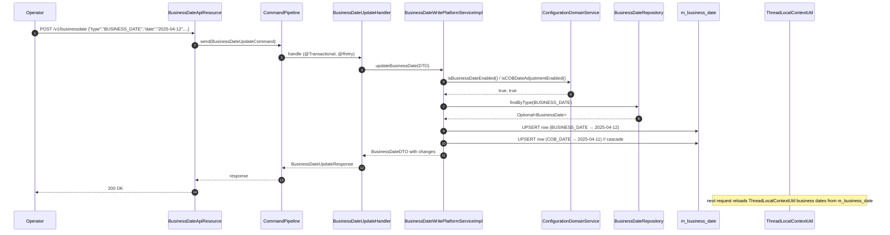

Apache Fineract separates "today" into two distinct, tenant‑configurable
clocks: **`BUSINESS_DATE`** (the date the bank is operating on) and
**`COB_DATE`** (the date the overnight close‑of‑business pipeline is
currently processing). The `infrastructure.businessdate` package owns the
persisted rows, the REST API, the command handler and the read service for
both. This page is the reference for that package.

## Layout

```text
infrastructure/businessdate/
├── api/
│   └── BusinessDateApiResource.java
├── command/
│   └── BusinessDateUpdateCommand.java
├── data/
│   ├── api/
│   │   ├── BusinessDateResponse.java
│   │   ├── BusinessDateUpdateRequest.java
│   │   └── BusinessDateUpdateResponse.java
│   └── service/
│       └── BusinessDateDTO.java
├── domain/
│   ├── BusinessDate.java
│   ├── BusinessDateRepository.java
│   └── BusinessDateType.java
├── exception/
│   ├── BusinessDateActionException.java
│   └── BusinessDateNotFoundException.java
├── handler/
│   └── BusinessDateUpdateHandler.java
├── mapper/
│   └── BusinessDateMapper.java
├── service/
│   ├── BusinessDateReadPlatformService.java
│   ├── BusinessDateReadPlatformServiceImpl.java
│   ├── BusinessDateWritePlatformService.java
│   └── BusinessDateWritePlatformServiceImpl.java
└── validation/
```

## `BusinessDateType` — the discriminator

```java
@AllArgsConstructor @Getter
public enum BusinessDateType {

    BUSINESS_DATE(1, "Business Date"),
    COB_DATE     (2, "Close of Business Date");

    private final Integer id;
    private final String  description;

    public String getName() { return name(); }
}
```

| Type | `id` | Meaning |
| --- | --- | --- |
| `BUSINESS_DATE` | `1` | The "logical today" for online transactions. Set by operators or by automated date‑shift jobs. |
| `COB_DATE` | `2` | The date the overnight COB pipeline is currently processing — usually `BUSINESS_DATE - 1`. |

The same enum appears on
[`ActionContext`](/core/auditing-and-context) — `ActionContext.DEFAULT`
maps to `BUSINESS_DATE`, `ActionContext.COB` maps to `COB_DATE`. That is
the seam that lets a single domain method query
`ThreadLocalContextUtil.getBusinessDate()` and get the right value for the
calling context.

## `BusinessDate` — the entity

```java
@Entity
@Table(name = "m_business_date",
       uniqueConstraints = { @UniqueConstraint(name = "uq_business_date_type", columnNames = { "type" }) })
public class BusinessDate extends AbstractAuditableWithUTCDateTimeCustom<Long> {

    @Enumerated(EnumType.STRING)
    @Column(name = "type")
    private BusinessDateType type;

    @Column(name = "date", columnDefinition = "DATE")
    private LocalDate date;

    @Version
    private Long version;

    public static BusinessDate instance(@NotNull BusinessDateType businessDateType, @NotNull LocalDate date) {
        return new BusinessDate().setType(businessDateType).setDate(date);
    }
}
```

Observations:

- **`m_business_date`** holds at most one row per `type` per tenant
  database (`uq_business_date_type`).
- The `date` is a SQL `DATE` — no time component.
- The class extends `AbstractAuditableWithUTCDateTimeCustom<Long>` so the
  audit columns are `created_on_utc` and `lastmodified_on_utc`.
- `@Version` adds optimistic locking — concurrent date adjustments are
  serialised by the version column.
- `BusinessDate.instance(type, date)` is the canonical factory.

## `BusinessDateRepository`

A standard Spring Data JPA repository with one extra finder:

```java
public interface BusinessDateRepository
        extends JpaRepository<BusinessDate, Long>, JpaSpecificationExecutor<BusinessDate> {

    Optional<BusinessDate> findByType(BusinessDateType type);
}
```

`findByType` is what every business‑date read path calls — there is only
ever zero or one row per type.

## `BusinessDateApiResource`

```java
@Path("/v1/businessdate")
@Component
@Tag(name = "Business Date Management", description = "...")
public class BusinessDateApiResource {

    private final BusinessDateReadPlatformService readPlatformService;
    private final CommandPipeline                 commandPipeline;
    private final BusinessDateMapper              businessDateMapper;

    @GET
    public List<BusinessDateResponse> getBusinessDates() {
        return businessDateMapper.mapFetchResponse(this.readPlatformService.findAll());
    }

    @GET
    @Path("{type}")
    public BusinessDateResponse getBusinessDate(@PathParam("type") final String type) {
        return businessDateMapper.mapFetchResponse(this.readPlatformService.findByType(type));
    }

    @POST
    public BusinessDateUpdateResponse updateBusinessDate(@Valid BusinessDateUpdateRequest request) {
        final BusinessDateUpdateCommand command = new BusinessDateUpdateCommand();
        command.setPayload(request);
        final Supplier<BusinessDateUpdateResponse> response = commandPipeline.send(command);
        return response.get();
    }
}
```

| Method | Path | Behaviour |
| --- | --- | --- |
| `GET` | `/v1/businessdate` | Returns all business dates currently configured. |
| `GET` | `/v1/businessdate/{type}` | Returns the row for one type (`BUSINESS_DATE` or `COB_DATE`). |
| `POST` | `/v1/businessdate` | Updates a date. Dispatches via the command pipeline so the change is auditable. |

The `POST` payload is `BusinessDateUpdateRequest{type, date, dateFormat, locale}` (typed,
Jakarta‑bean‑validated).

## `BusinessDateUpdateHandler`

```java
@Component
@RequiredArgsConstructor
public class BusinessDateUpdateHandler
        implements CommandHandler<BusinessDateUpdateRequest, BusinessDateUpdateResponse> {

    private final BusinessDateWritePlatformService businessDateWritePlatformService;
    private final BusinessDateMapper businessDateMapper;

    @Retry(name = "commandBusinessDateUpdate", fallbackMethod = "fallback")
    @Transactional
    @Override
    public BusinessDateUpdateResponse handle(Command<BusinessDateUpdateRequest> command) {
        BusinessDateDTO businessDateDto = businessDateMapper.mapUpdateRequest(command.getPayload());
        businessDateDto = businessDateWritePlatformService.updateBusinessDate(businessDateDto);
        return businessDateMapper.mapUpdateResponse(businessDateDto);
    }
    // ...
}
```

Three behaviours:

1. The handler is `@Transactional` so the row update and the cascading COB
   update (described below) commit atomically.
2. The Resilience4j `@Retry(name = "commandBusinessDateUpdate")` retries
   transient failures (`@Version` conflicts under concurrent edits).
3. The handler converts the API request into a `BusinessDateDTO`, delegates
   the actual logic to `BusinessDateWritePlatformService`, and maps the
   resulting DTO back to the response.

## `BusinessDateWritePlatformServiceImpl`

The write service holds the policy: enabled flags, COB cascade, optimistic
update.

```java
private void adjustDate(BusinessDateDTO businessDateDto) {
    boolean isCOBDateAdjustmentEnabled = configurationDomainService.isCOBDateAdjustmentEnabled();
    boolean isBusinessDateEnabled       = configurationDomainService.isBusinessDateEnabled();

    if (!isBusinessDateEnabled) {
        log.error("Business date functionality is not enabled!");
        throw new BusinessDateActionException("business.date.is.not.enabled",
                "Business date functionality is not enabled");
    }
    updateOrCreateBusinessDate(businessDateDto);

    if (isCOBDateAdjustmentEnabled && BusinessDateType.BUSINESS_DATE.equals(businessDateDto.getType())) {
        BusinessDateDTO res = BusinessDateDTO.builder()
                .type(BusinessDateType.COB_DATE)
                .description(BusinessDateType.COB_DATE.getDescription())
                .date(businessDateDto.getDate().minusDays(1))
                .build();
        updateOrCreateBusinessDate(res);
        businessDateDto.addAllChanges(res.getChanges());
    }
}
```

Key rules:

| Configuration flag | Effect |
| --- | --- |
| `enable-business-date` (off by default) | Required for any business‑date row to be created or mutated. When off, every call throws `BusinessDateActionException`. |
| `enable-automatic-cob-date-adjustment` | When on, setting `BUSINESS_DATE` to *X* also sets `COB_DATE` to *X − 1 day* in the same transaction. |

Both flags are persisted `GlobalConfigurationProperty` rows — see
[configuration properties](/core/configuration-properties).

### `increaseDateByTypeByOneDay` — the job entry point

```java
@Override
public void increaseDateByTypeByOneDay(BusinessDateType businessDateType) throws JobExecutionException {
    Optional<BusinessDate> businessDateEntity = repository.findByType(businessDateType);

    LocalDate businessDate = businessDateEntity.map(BusinessDate::getDate)
                                               .orElse(DateUtils.getLocalDateOfTenant());
    businessDate = businessDate.plusDays(1);
    try {
        BusinessDateDTO response = BusinessDateDTO.builder()
                .type(businessDateType)
                .description(businessDateType.getDescription())
                .date(businessDate)
                .build();
        adjustDate(response);
    } catch (PlatformApiDataValidationException | AbstractPlatformDomainRuleException e) {
        // log per error, collect into exceptions list
    } catch (Exception e) {
        // generic catch, collected
    }
    if (!exceptions.isEmpty()) {
        throw new JobExecutionException(exceptions);
    }
}
```

This is the call the **scheduler** invokes — see the
[Increase Business Date by 1 day](/jobs/overview) job. The fall‑back when
no row exists is `DateUtils.getLocalDateOfTenant()` (i.e. wall‑clock in
the tenant's IANA timezone), then `+1`.

## Read service

`BusinessDateReadPlatformServiceImpl` provides:

- `findAll()` — returns every persisted `BusinessDate`.
- `findByType(String type)` — case‑insensitive string match against the
  enum name (`BUSINESS_DATE` / `COB_DATE`). Throws
  `BusinessDateNotFoundException` if no row exists, mapped to `404` via
  [`PlatformResourceNotFoundExceptionMapper`](/core/exception-mappers).

The mapper (`BusinessDateMapper`, MapStruct) turns the entity into
`BusinessDateResponse{type, description, date}`.

## How domain code reads the business date

Domain code does **not** load the entity. It reads
`ThreadLocalContextUtil.getBusinessDate()` (or
`getBusinessDateByType(BusinessDateType)`). The map of dates is populated
by `BusinessDateInitFilter` at the start of every request and refreshed by
the COB pipeline as it advances:

```java
ThreadLocalContextUtil.setBusinessDates(repository.findAll().stream()
        .collect(Collectors.toMap(BusinessDate::getType, BusinessDate::getDate, (a, b) -> a, HashMap::new)));
```

The combination of `ActionContext` and the business‑date map is what lets
the same loan‑accrual code run on demand for an online transaction
(`BUSINESS_DATE`) and again during overnight processing (`COB_DATE`)
without any change to the call site.

## The two jobs that mutate `BusinessDate`

Two scheduled jobs in `fineract-provider` mutate these rows:

| Job name | Behaviour |
| --- | --- |
| `Increase Business Date by 1 day` | Calls `increaseDateByTypeByOneDay(BUSINESS_DATE)`. If `enable-automatic-cob-date-adjustment` is on, `COB_DATE` is also advanced by one day. |
| `Increase COB Date by 1 day` | Calls `increaseDateByTypeByOneDay(COB_DATE)`. Used in deployments that want `COB_DATE` to advance independently of `BUSINESS_DATE`. |

Both jobs are wired through the standard Spring Batch / scheduled‑job
machinery — see [jobs overview](/jobs/overview).

## End‑to‑end sequence: operator changes the business date



## Exceptions

| Exception | Status | Trigger |
| --- | --- | --- |
| `BusinessDateActionException` | `403` (via `PlatformDomainRuleExceptionMapper`) | Business‑date functionality disabled, or a validation rule failed at update time. |
| `BusinessDateNotFoundException` | `404` | `GET /v1/businessdate/{type}` for a non‑existent type. |
| `PlatformApiDataValidationException` | `400` | Required parameter missing / malformed (`type`, `date`, etc.). |

## Operational rules of thumb

<AccordionGroup>
  <Accordion title="Always enable business date before COB">
    `enable-business-date` is the master switch. The COB pipeline
    requires it; the COB job will refuse to run if it is off.
  </Accordion>
  <Accordion title="COB cascade is optional">
    `enable-automatic-cob-date-adjustment` is what couples
    `BUSINESS_DATE` and `COB_DATE`. Turn it off when you want to advance
    them independently (some processing windows keep COB pinned while
    BUSINESS_DATE moves forward to catch up).
  </Accordion>
  <Accordion title="Manual adjustment requires maker-checker">
    The `POST /v1/businessdate` endpoint flows through the command
    pipeline, so it can be subjected to maker‑checker if the global
    configuration `maker-checker` flag is on.
  </Accordion>
  <Accordion title="Tests should set business dates explicitly">
    Integration tests pin both dates via
    `ThreadLocalContextUtil.setBusinessDates(...)` to make timing
    deterministic. Live `findAll()` is loaded only by the production
    filter / job listener.
  </Accordion>
</AccordionGroup>

## Related pages

<CardGroup cols={2}>
  <Card title="Auditing & context" href="/core/auditing-and-context">
    `ActionContext`, `ThreadLocalContextUtil.getBusinessDate()` and how the map is consumed.
  </Card>
  <Card title="Configuration properties" href="/core/configuration-properties">
    `enable-business-date` and `enable-automatic-cob-date-adjustment` flags.
  </Card>
  <Card title="Jobs overview" href="/jobs/overview">
    Scheduled jobs that call `increaseDateByTypeByOneDay`.
  </Card>
  <Card title="Command pipeline" href="/command/overview">
    How `BusinessDateUpdateCommand` is routed.
  </Card>
</CardGroup>
