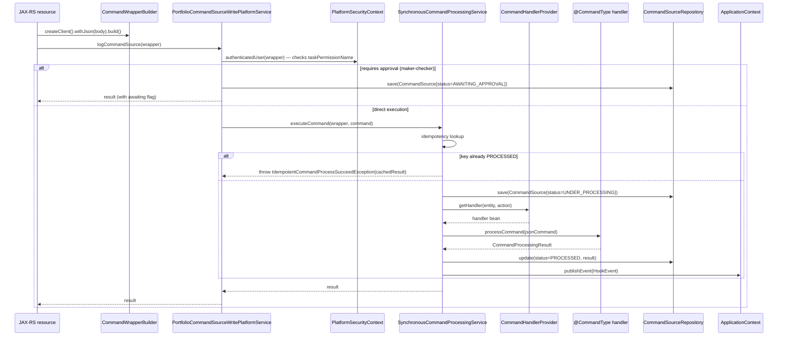
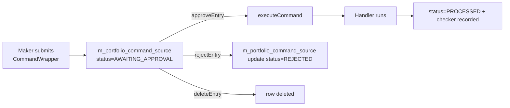

Every mutating call in Fineract — create a client, approve a loan, post a journal entry — passes through the **command pipeline**. The pipeline wraps the request in a `CommandWrapper`, persists a `CommandSource` row (the audit trail), resolves an idempotency key, finds the `@CommandType`-annotated handler that knows how to mutate the right aggregate, retries on optimistic-lock failures, and publishes hook events on success. This page is the reference for the fineract-core types that make it work: the builder pattern that constructs commands, the JPA entity that stores them, the handler SPI, and the synchronous processor that ties everything together.

<Note>
The pipeline is **synchronous and transactional** by default. The HTTP request thread runs the handler, commits, and returns the result to the caller. Asynchronous fan-out happens via the [external events outbox](/core/event-external) and the [hooks event](/core/hooks) — both are durable and run after commit.
</Note>

## Package layout

| Subpackage                              | Purpose                                                              |
| --------------------------------------- | -------------------------------------------------------------------- |
| `commands/annotation`                   | `@CommandType` annotation — entity + action                          |
| `commands/configuration`                | `RetryConfigurationAssembler` — resilience4j Retry registry          |
| `commands/domain`                       | `CommandWrapper`, `CommandSource`, `CommandSourceRepository`        |
| `commands/exception`                    | `UnsupportedCommandException`, `CommandNotFoundException`, etc.     |
| `commands/handler`                      | `NewCommandSourceHandler` — the SPI handlers implement              |
| `commands/jobs`                         | `PurgeProcessedCommandsTasklet` — drains the audit table            |
| `commands/provider`                     | `CommandHandlerProvider` — entity+action → handler resolver         |
| `commands/service`                      | `CommandWrapperBuilder`, `SynchronousCommandProcessingService`, idempotency |

## `CommandWrapper` — the request envelope

```java
public class CommandWrapper {

    private final Long commandId;
    private final Long officeId, groupId, clientId, loanId, savingsId;
    private final String actionName;
    private final String entityName;
    private final String taskPermissionName;     // actionName + "_" + entityName
    private final Long entityId;
    private final Long subentityId;
    private final String href;                   // resource GET URL (for hooks)
    private final String json;                   // request body
    private final String transactionId;
    private final Long productId, creditBureauId, organisationCreditBureauId;
    private final String jobName;
    private final ExternalId loanExternalId;
    private final Set<String> sanitizeJsonKeys;  // fields to mask in audit table
    private final String idempotencyKey;
    private Long templateId;
    // ...
}
```

Three creation paths:

| Static factory                                                                       | Purpose                                                  |
| ------------------------------------------------------------------------------------ | -------------------------------------------------------- |
| `CommandWrapper.wrap(action, entity, resourceId, subresourceId)`                     | Used by maker-checker to recreate a wrapper from `CommandSource` |
| `CommandWrapper.fromExistingCommand(commandId, action, entity, ...)`                 | Reload-and-retry path                                    |
| Full constructor (via `CommandWrapperBuilder.build()`)                                | The everyday path                                        |

`taskPermissionName` is the key Spring Security checks: `CREATE_CLIENT`, `APPROVE_LOAN`, etc. The pattern is rigid because permission rows in `m_permission` (see [users domain](/core/useradministration-domain)) use the same convention.

`sanitizeJsonKeys` lists JSON field names that should be replaced with `***` when persisted to `m_portfolio_command_source.command_as_json`. Used for passwords, encryption keys, and PII.

## `CommandWrapperBuilder` — the fluent API

```java
public class CommandWrapperBuilder {

    public CommandWrapper build()                       { /* assemble */ }
    public CommandWrapper build(String idempotencyKey)  { /* assemble with key */ }

    public CommandWrapperBuilder createClient()   { this.actionName="CREATE"; this.entityName="CLIENT"; this.href="/clients/template"; return this; }
    public CommandWrapperBuilder updateClient(Long clientId) { ... }
    public CommandWrapperBuilder deleteClient(Long clientId) { ... }
    public CommandWrapperBuilder approveLoan(Long loanId)    { ... }
    // ... one method per (entity, action) combination
    public CommandWrapperBuilder withJson(String json) { this.json = json; return this; }
}
```

Resource classes use it like this:

```java
@POST
@Path("/")
public String create(String apiRequestBodyAsJson) {
    final CommandWrapper commandRequest = new CommandWrapperBuilder()
            .createClient()
            .withJson(apiRequestBodyAsJson)
            .build();
    return toApiJsonSerializer.serialize(
        commandSourceWritePlatformService.logCommandSource(commandRequest));
}
```

The fluent factories make the call site read like English (`createClient`, `withJson`, `build`) and ensure the right `entityName`, `actionName`, and default `href` are always set together — leaving them out of sync would break hook lookups.

## `CommandSource` — the audit row

```java
@Entity @Table(name = "m_portfolio_command_source")
public class CommandSource extends AbstractPersistableCustom<Long> {

    @Column(name = "action_name", length = 100) private String actionName;
    @Column(name = "entity_name", length = 100) private String entityName;
    @Column(name = "office_id")                 private Long officeId;
    @Column(name = "group_id")                  private Long groupId;
    @Column(name = "client_id")                 private Long clientId;
    @Column(name = "loan_id")                   private Long loanId;
    @Column(name = "savings_account_id")        private Long savingsId;
    @Column(name = "api_get_url", length = 100) private String resourceGetUrl;
    @Column(name = "resource_id")               private Long resourceId;
    @Column(name = "subresource_id")            private Long subResourceId;
    @Column(name = "command_as_json", length = 1000) private String commandAsJson;
    @ManyToOne @JoinColumn(name = "maker_id", nullable = false) private AppUser maker;
    @Column(name = "made_on_date_utc", nullable = false)    private OffsetDateTime madeOnDate;
    @Column(name = "checked_on_date_utc")                   private OffsetDateTime checkedOnDate;
    // also: checker, processing_result_enum, status, idempotency_key, result, ip, external_id
}
```

Every successfully-executed mutation writes one row. Fields to call out:

- **`commandAsJson`** — the (possibly sanitized) request body. The 1000-char limit is a historical column type; for very large payloads the body is truncated.
- **`status`** (`CommandProcessingResultType` enum) — `UNDER_PROCESSING`, `PROCESSED`, `ERROR`, `AWAITING_APPROVAL`.
- **`idempotency_key`** — the key the caller supplied or one generated by `IdempotencyKeyGenerator`. Unique per `(entity_name, action_name)`.
- **`result`** — JSON-serialised `CommandProcessingResult` (for replay).
- **`maker`** / **`checker`** — `AppUser` references implementing the four-eyes (maker-checker) workflow.
- **`made_on_date_utc`** / **`checked_on_date_utc`** — audit timestamps.

`CommandSourceRepository` is a plain `JpaRepository<CommandSource, Long>` with custom finders for the maker-checker UI and for idempotency lookups.

## `@CommandType` — the handler annotation

```java
@Retention(RetentionPolicy.RUNTIME)
@Target(ElementType.TYPE)
@Documented
public @interface CommandType {
    String entity();
    String action();
}
```

A handler declares which `(entity, action)` pair it processes:

```java
@Service
@CommandType(entity = "CLIENT", action = "CREATE")
public class CreateClientCommandHandler implements NewCommandSourceHandler {

    private final ClientWritePlatformService clientService;

    @Override
    public CommandProcessingResult processCommand(JsonCommand command) {
        return clientService.createClient(command);
    }
}
```

The annotation is `@Documented` so it shows up in generated Javadoc — important because the pair is the closest thing Fineract has to a public command contract.

## `NewCommandSourceHandler` — the handler SPI

```java
public interface NewCommandSourceHandler {
    CommandProcessingResult processCommand(JsonCommand command);
}
```

A handler:

1. Receives a `JsonCommand` (the [request envelope](/core/json-command) — already parsed, with maker, business date, and parsed JSON).
2. Calls the relevant write platform service.
3. Returns a `CommandProcessingResult` whose `resourceId` is the affected aggregate's primary key.

Handlers **must not** be `@Transactional` themselves — the pipeline opens the transaction. They **must** be idempotent enough to re-run if the optimistic-lock retry kicks in (any change must be derivable from the input and current state, not from previous handler invocations).

## `CommandHandlerProvider` — the resolver

```java
@Component
public class CommandHandlerProvider implements ApplicationContextAware, InitializingBean {

    private final HashMap<String, String> registeredHandlers = new HashMap<>();

    @Override
    public void afterPropertiesSet() {
        for (String beanName : applicationContext.getBeanNamesForAnnotation(CommandType.class)) {
            CommandType ct = applicationContext.findAnnotationOnBean(beanName, CommandType.class);
            registeredHandlers.put(ct.entity() + "|" + ct.action(), beanName);
        }
    }

    public NewCommandSourceHandler getHandler(String entity, String action) {
        String key = entity + "|" + action;
        if (!registeredHandlers.containsKey(key)) {
            throw new UnsupportedCommandException(key);
        }
        return (NewCommandSourceHandler) applicationContext.getBean(registeredHandlers.get(key));
    }
}
```

Startup scan: `beanFactory.getBeanNamesForAnnotation(CommandType.class)` finds every annotated bean. The `entity|action` string is the lookup key. Any (entity, action) pair without a handler results in `UnsupportedCommandException("ENTITY|ACTION")` — useful for catching typos in `CommandWrapperBuilder` methods.

## `IdempotencyKeyGenerator` and `IdempotencyKeyResolver`

```java
@Component
public class IdempotencyKeyGenerator {
    public String create() { return UUID.randomUUID().toString(); }
}

@Component @RequiredArgsConstructor
public class IdempotencyKeyResolver {

    private final FineractRequestContextHolder ctx;
    private final IdempotencyKeyGenerator gen;

    public String resolve(CommandWrapper wrapper) {
        return Optional.ofNullable(wrapper.getIdempotencyKey())
                .orElseGet(() -> getAttribute()
                        .orElseGet(gen::create));
    }

    private Optional<String> getAttribute() {
        return Optional.ofNullable(ctx.getAttribute(
                SynchronousCommandProcessingService.IDEMPOTENCY_KEY_ATTRIBUTE))
                .map(String::valueOf);
    }
}
```

Resolution order:

1. **Wrapper-provided key** — the caller asked to use a specific key via `CommandWrapperBuilder.build(key)`.
2. **Request-scope attribute** — the inbound HTTP filter parsed an `Idempotency-Key` header and stored it.
3. **Generated UUID** — last resort.

The resolved key is written to `CommandSource.idempotency_key`. If the same key reappears the pipeline short-circuits — see "Replay" below.

## `CommandSourceService` — persistence + idempotency check

`CommandSourceService` wraps the `CommandSourceRepository` with two-phase, `REQUIRES_NEW + REPEATABLE_READ` transactions so the audit row's status changes are visible across the main command's retries:

```java
@Component @RequiredArgsConstructor
public class CommandSourceService {

    public static final String COMMAND_MASK_VALUE = "***";
    public static final String COMMAND_SANITIZE_ALL = "SANITIZE_ALL";

    private final ConfigurationDomainService configurationDomainService;
    private final CommandSourceRepository commandSourceRepository;
    private final ErrorHandler errorHandler;
    private final FromJsonHelper fromApiJsonHelper;

    @Transactional(propagation = REQUIRES_NEW, isolation = REPEATABLE_READ)
    public CommandSource saveInitialCommandSource(...) { ... }

    @Transactional(propagation = REQUIRES_NEW)
    public CommandSource saveFinishedCommandSource(CommandSource source,
                                                  CommandProcessingResult result) { ... }

    public CommandSource getCommandSource(Long commandId) { ... }
}
```

The two-phase persistence is critical: the **initial** record (with `status = UNDER_PROCESSING`) is committed in its own transaction so a concurrent request with the same idempotency key sees it and waits / errors. The **finished** record updates the same row to `PROCESSED` or `ERROR` after the main transaction commits.

## `SynchronousCommandProcessingService` — the main loop

```java
@Service @Slf4j @RequiredArgsConstructor
public class SynchronousCommandProcessingService implements CommandProcessingService {

    public static final String IDEMPOTENCY_KEY_STORE_FLAG = "idempotencyKeyStoreFlag";
    public static final String IDEMPOTENCY_KEY_ATTRIBUTE  = "IdempotencyKeyAttribute";
    public static final String COMMAND_SOURCE_ID          = "commandSourceId";

    private final PlatformSecurityContext context;
    private final CommandHandlerProvider commandHandlerProvider;
    private final IdempotencyKeyResolver idempotencyKeyResolver;
    private final CommandSourceService commandSourceService;
    private final RetryConfigurationAssembler retryConfigurationAssembler;
    // ...

    @Override
    public CommandProcessingResult executeCommand(CommandWrapper wrapper,
                                                  JsonCommand command,
                                                  boolean isApprovedByChecker) {
        return retryWrapper(() -> {
            // 1. resolve commandId / idempotency key (handle retry of prior failure)
            // 2. fetch handler via CommandHandlerProvider.getHandler(...)
            // 3. persist UNDER_PROCESSING row
            // 4. handler.processCommand(command)
            // 5. update row to PROCESSED with result
            // 6. publishEvent(new HookEvent(...))
            // 7. return CommandProcessingResult
        });
    }

    private CommandProcessingResult retryWrapper(Supplier<CommandProcessingResult> supplier) {
        if (!BatchRequestContextHolder.isEnclosingTransaction()) {
            return retryConfigurationAssembler
                .getRetryConfigurationForExecuteCommand()
                .executeSupplier(supplier);
        }
        return supplier.get();
    }
}
```

Key behaviours:

- **Retry wrapper** — wraps the handler call in a resilience4j `Retry` configured via `RetryConfigurationAssembler.getRetryConfigurationForExecuteCommand()`. The default retries on `OptimisticLockingFailureException` and `JpaSystemException` up to a configurable limit. **Disabled** when running inside a batch enclosing transaction (the [Batch API](/core/batch-api-internals) `enclosingTransaction=true` mode), because retries would re-execute every sub-command.
- **Idempotency short-circuit** — if the wrapper's key already maps to a `PROCESSED` row, throw `IdempotentCommandProcessSucceedException` carrying the cached result (so the API returns the original response). If it maps to `ERROR`, throw `IdempotentCommandProcessFailedException`. If `UNDER_PROCESSING`, throw `IdempotentCommandProcessUnderProcessingException` (client should poll/retry).
- **Hook publishing** — `applicationContext.publishEvent(new HookEvent(...))` after the main transaction commits. The [hooks](/core/hooks) processor picks it up asynchronously.

## `PortfolioCommandSourceWritePlatformService` — the public API

The interface API resources call:

```java
public interface PortfolioCommandSourceWritePlatformService {

    CommandProcessingResult logCommandSource(CommandWrapper commandRequest);

    CommandProcessingResult approveEntry(Long id);
    Long rejectEntry(Long id);
    Long deleteEntry(Long makerCheckerId);
}
```

`logCommandSource(...)` is the everyday call. It:

1. Resolves the authenticated user (`context.authenticatedUser(commandWrapper)` — also enforces the `taskPermissionName`).
2. Decides if the command requires maker-checker approval (consults `Permission.canMakerChecker`).
3. Either dispatches to `executeCommand(...)` directly **or** persists a `CommandSource` with `status = AWAITING_APPROVAL` and returns.

The `approveEntry` / `rejectEntry` / `deleteEntry` endpoints work the queued rows in the second case.

## End-to-end command flow



## Maker-checker workflow



`CommandNotAwaitingApprovalException` is thrown by `approveEntry` if the row is not in `AWAITING_APPROVAL` status. `RollbackTransactionNotApprovedException` is thrown when an approve action discovers downstream validation refused the command — the audit row stays in `AWAITING_APPROVAL` so the maker can correct and resubmit.

## Purge Processed Commands

`PurgeProcessedCommandsTasklet` (registered by `PurgeProcessedCommandsConfig`) drains old `PROCESSED` rows on a schedule, keeping the audit table bounded:

- Job: `JobName.PURGE_PROCESSED_COMMANDS` → "Purge Processed Commands"
- Step: `StepName.PURGE_PROCESSED_COMMANDS_STEP`
- Retention is read from the platform configuration table (`c_purge_command_source_days` or similar).

## Resilience4j retry configuration

```java
@Service
public class RetryConfigurationAssembler {

    public static final String EXECUTE_COMMAND = "executeCommand";
    public static final String BATCH_RETRY = "batchRetry";
    public static final String COMMAND_RESULT_PERSISTENCE = "commandResultPersistence";

    public Retry getRetryConfigurationForExecuteCommand() { ... }
}
```

Three registered Retry instances:

| Name                          | Used in                                                       |
| ----------------------------- | ------------------------------------------------------------- |
| `executeCommand`              | The main handler dispatch loop                                |
| `batchRetry`                  | Each sub-request of the [Batch API](/core/batch-api-internals) |
| `commandResultPersistence`    | The `saveFinishedCommandSource` write — re-tries if a transient DB error happens during the result write |

Properties under `fineract.retry.instances.*` (max attempts, backoff, exception list).

## Exceptions cheat-sheet

| Exception                                          | Meaning                                                        | HTTP    |
| -------------------------------------------------- | -------------------------------------------------------------- | ------- |
| `UnsupportedCommandException`                      | No `@CommandType` bean matches `entity|action`                | 400     |
| `CommandNotFoundException`                         | Command id refers to nothing in `m_portfolio_command_source`   | 404     |
| `CommandNotAwaitingApprovalException`              | `approveEntry` on a non-`AWAITING_APPROVAL` row                | 400     |
| `RollbackTransactionNotApprovedException`          | Validation refused on approval; row kept                       | 403     |
| `CommandResultPersistenceException`                | Could not persist the finished `CommandSource` row            | 500     |
| `IdempotentCommandProcess{Succeed,Failed,UnderProcessing}Exception` | Duplicate idempotency key — carries the prior outcome | 200/4xx |

## Cross-references

<CardGroup cols={2}>
  <Card title="Command Pipeline Implementation" icon="terminal" href="/command/overview">
    Async commands, queues, and command bus (fineract-provider extras).
  </Card>
  <Card title="Batch API" icon="list-check" href="/core/batch-api-internals">
    Re-uses this pipeline per sub-request; understands `enclosingTransaction`.
  </Card>
  <Card title="Hooks" icon="link" href="/core/hooks">
    `HookEvent` is published from `SynchronousCommandProcessingService`.
  </Card>
  <Card title="Users Domain" icon="user" href="/core/useradministration-domain">
    `Permission.canMakerChecker` drives the maker-checker branch.
  </Card>
</CardGroup>
