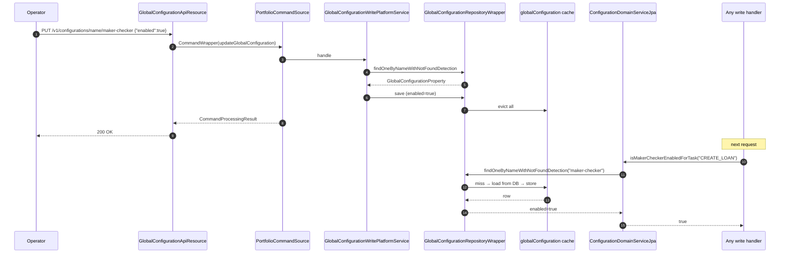

Apache Fineract persists most of its tenant‑level behaviour switches in a
single table called `c_configuration`. The `infrastructure.configuration`
package owns the entity, the repository wrapper, the read service and the
`ConfigurationDomainService` interface that the rest of the platform calls
when it needs to ask "is this feature on?". This page is the reference for
that package and lists every flag the platform ships with.

## Layout

`fineract-core` side:

```text
infrastructure/configuration/
├── api/
│   ├── GlobalConfigurationApiConstant.java
│   └── GlobalConfigurationConstants.java
├── data/
│   ├── GlobalConfigurationData.java
│   ├── GlobalConfigurationDataValidator.java
│   └── GlobalConfigurationPropertyData.java
├── domain/
│   ├── ConfigurationDomainService.java
│   ├── GlobalConfigurationProperty.java
│   ├── GlobalConfigurationRepository.java
│   └── GlobalConfigurationRepositoryWrapper.java
├── exception/
│   ├── GlobalConfigurationException.java
│   └── GlobalConfigurationPropertyNotFoundException.java
└── service/
    ├── ConfigurationReadPlatformService.java
    ├── GlobalConfigurationValidationService.java
    ├── MoneyHelperInitializationService.java
    ├── MoneyHelperStartupInitializationService.java
    └── TemporaryConfigurationServiceContainer.java
```

The REST resource (`GlobalConfigurationApiResource`) and the write service
implementation live in `fineract-provider` because they need
`PortfolioCommandSourceWritePlatformService`. The
`ConfigurationDomainServiceJpa` implementation also lives in
`fineract-provider`.

## `GlobalConfigurationProperty` — the row shape

```java
@Entity
@Table(name = "c_configuration")
public class GlobalConfigurationProperty extends AbstractPersistableCustom<Long> {

    @Column(name = "name", nullable = false)   private String     name;
    @Column(name = "enabled", nullable = false) private boolean    enabled;
    @Column(name = "value", nullable = true)    private Long       value;
    @Column(name = "date_value", nullable = true) private LocalDate  dateValue;
    @Column(name = "string_value", nullable = true) private String   stringValue;
    @Column(name = "description", nullable = true) private String   description;
    @Column(name = "is_trap_door", nullable = false) private boolean isTrapDoor;

    public GlobalConfigurationPropertyData toData() { … }
}
```

Each row carries:

| Column | Purpose |
| --- | --- |
| `name` | The unique flag identifier — one of the `GlobalConfigurationConstants` strings below. |
| `enabled` | The on/off switch. Most flags only consult this. |
| `value` | Numeric payload (e.g. `password-live-time` = 90 days, `daily-tpt-limit`). |
| `date_value` | Date payload (`organisation-start-date`). |
| `string_value` | Free‑form payload (currency list, S3 folder name). |
| `description` | Human‑readable explanation, shown on the admin UI. |
| `is_trap_door` | When `true` the flag can only be **enabled** from the API; it cannot be disabled. Used for one‑way migrations like "moved to UTC audit". |

`c_configuration` is a per‑tenant table — every tenant DB carries its own
copy seeded from Liquibase changelogs.

## `GlobalConfigurationConstants` — the catalog

Every constant in this class is the canonical `name` value of one
`c_configuration` row. There are currently **65** constants. The full
catalog (grouped for readability):

### Maker‑checker and security

| Constant | `c_configuration.name` |
| --- | --- |
| `MAKER_CHECKER` | `maker-checker` |
| `ENABLE_SAME_MAKER_CHECKER` | `enable-same-maker-checker` |
| `FORCE_PASSWORD_RESET_DAYS` | `force-password-reset-days` |
| `MAX_LOGIN_RETRY_ATTEMPTS` | `max-login-retry-attempts` |
| `PASSWORD_REUSE_CHECK_HISTORY_COUNT` | `password-reuse-check-history-count` |
| `FORCE_PASSWORD_RESET_ON_FIRST_LOGIN` | `force-password-reset-on-first-login` |

### File / object storage

| Constant | `c_configuration.name` |
| --- | --- |
| `AMAZON_S3` | `amazon-s3` |
| `REPORT_EXPORT_S3_FOLDER_NAME` | `report-export-s3-folder-name` |

### Schedule / repayment behaviour

| Constant | `c_configuration.name` |
| --- | --- |
| `RESCHEDULE_FUTURE_REPAYMENTS` | `reschedule-future-repayments` |
| `RESCHEDULE_REPAYMENTS_ON_HOLIDAYS` | `reschedule-repayments-on-holidays` |
| `ALLOW_TRANSACTIONS_ON_HOLIDAY` | `allow-transactions-on-holiday` |
| `ALLOW_TRANSACTIONS_ON_NON_WORKING_DAY` | `allow-transactions-on-non-workingday` |
| `LOAN_RESCHEDULE_IS_FIRST_PAYDAY_ALLOWED_ON_HOLIDAY` | `loan-reschedule-is-first-payday-allowed-on-holiday` |
| `SKIP_REPAYMENT_ON_FIRST_DAY_OF_MONTH` | `skip-repayment-on-first-day-of-month` |
| `CHANGE_EMI_IF_REPAYMENT_DATE_SAME_AS_DISBURSEMENT_DATE` | `change-emi-if-repaymentdate-same-as-disbursementdate` |
| `INTEREST_CHARGED_FROM_DATE_SAME_AS_DISBURSAL_DATE` | `interest-charged-from-date-same-as-disbursal-date` |
| `DAYS_BEFORE_REPAYMENT_IS_DUE` | `days-before-repayment-is-due` |
| `DAYS_AFTER_REPAYMENT_IS_OVERDUE` | `days-after-repayment-is-overdue` |
| `NEXT_PAYMENT_DUE_DATE` | `next-payment-due-date` |

### Datatables and constraint approach

| Constant | `c_configuration.name` |
| --- | --- |
| `CONSTRAINT_APPROACH_FOR_DATATABLES` | `constraint-approach-for-datatables` |

### Penalties and accrual

| Constant | `c_configuration.name` |
| --- | --- |
| `PENALTY_WAIT_PERIOD` | `penalty-wait-period` |
| `GRACE_ON_PENALTY_POSTING` | `grace-on-penalty-posting` |
| `BACKDATE_PENALTIES_ENABLED` | `backdate-penalties-enabled` |
| `CHARGE_ACCRUAL_DATE` | `charge-accrual-date` |
| `ENABLE_IMMEDIATE_CHARGE_ACCRUAL_POST_MATURITY` | `enable-immediate-charge-accrual-post-maturity` |
| `ALLOW_BACKDATED_TRANSACTION_BEFORE_INTEREST_POSTING` | `allow-backdated-transaction-before-interest-posting` |
| `ALLOW_BACKDATED_TRANSACTION_BEFORE_INTEREST_POSTING_DATE_FOR_DAYS` | `allow-backdated-transaction-before-interest-posting-date-for-days` |

### Savings

| Constant | `c_configuration.name` |
| --- | --- |
| `SAVINGS_INTEREST_POSTING_CURRENT_PERIOD_END` | `savings-interest-posting-current-period-end` |
| `FIXED_DEPOSIT_TRANSFER_INTEREST_NEXT_DAY_FOR_PERIOD_END_POSTING` | `fixed-deposit-transfer-interest-next-day-for-period-end-posting` |
| `FORCE_WITHDRAWAL_ON_SAVINGS_ACCOUNT` | `allow-force-withdrawal-on-savings-account` |
| `FORCE_WITHDRAWAL_ON_SAVINGS_ACCOUNT_LIMIT` | `force-withdrawal-on-savings-account-limit` |

### Organisation / accounting

| Constant | `c_configuration.name` |
| --- | --- |
| `FINANCIAL_YEAR_BEGINNING_MONTH` | `financial-year-beginning-month` |
| `OFFICE_SPECIFIC_PRODUCTS_ENABLED` | `office-specific-products-enabled` |
| `RESTRICT_PRODUCTS_TO_USER_OFFICE` | `restrict-products-to-user-office` |
| `OFFICE_OPENING_BALANCES_CONTRA_ACCOUNT` | `office-opening-balances-contra-account` |
| `ROUNDING_MODE` | `rounding-mode` |
| `ORGANISATION_START_DATE` | `organisation-start-date` |
| `PAYMENT_TYPE_APPLICABLE_FOR_DISBURSEMENT_CHARGES` | `paymenttype-applicable-for-disbursement-charges` |
| `ACCOUNT_MAPPING_FOR_PAYMENT_TYPE` | `account-mapping-for-payment-type` |
| `ACCOUNT_MAPPING_FOR_CHARGE` | `account-mapping-for-charge` |
| `DAILY_TPT_LIMIT` | `daily-tpt-limit` |
| `SUB_RATES` | `sub-rates` |

### Group / center

| Constant | `c_configuration.name` |
| --- | --- |
| `MIN_CLIENTS_IN_GROUP` | `min-clients-in-group` |
| `MAX_CLIENTS_IN_GROUP` | `max-clients-in-group` |
| `MEETINGS_MANDATORY_FOR_JLG_LOANS` | `meetings-mandatory-for-jlg-loans` |

### External identifiers and integration

| Constant | `c_configuration.name` |
| --- | --- |
| `ENABLE_ADDRESS` | `enable-address` |
| `ENABLE_AUTO_GENERATED_EXTERNAL_ID` | `enable-auto-generated-external-id` |
| `ENABLE_PAYMENT_HUB_INTEGRATION` | `enable-payment-hub-integration` |

### Account numbers

| Constant | `c_configuration.name` |
| --- | --- |
| `CUSTOM_ACCOUNT_NUMBER_LENGTH` | `custom-account-number-length` |
| `RANDOM_ACCOUNT_NUMBER` | `random-account-number` |

### Loan / IS / interest

| Constant | `c_configuration.name` |
| --- | --- |
| `IS_INTEREST_TO_BE_RECOVERED_FIRST_WHEN_GREATER_THAN_EMI` | `is-interest-to-be-recovered-first-when-greater-than-emi` |
| `IS_PRINCIPAL_COMPOUNDING_DISABLED_FOR_OVERDUE_LOANS` | `is-principal-compounding-disabled-for-overdue-loans` |
| `LOAN_ARREARS_DELINQUENCY_DISPLAY_DATA` | `loan-arrears-delinquency-display-data` |
| `ENABLE_ORIGINATOR_CREATION_DURING_LOAN_APPLICATION` | `enable-originator-creation-during-loan-application` |

### Business date and COB

| Constant | `c_configuration.name` |
| --- | --- |
| `ENABLE_BUSINESS_DATE` | `enable-business-date` |
| `ENABLE_AUTOMATIC_COB_DATE_ADJUSTMENT` | `enable-automatic-cob-date-adjustment` |
| `ENABLE_COB_BULK_EVENT` | `enable-cob-bulk-event` |

### External events / external asset transfer

| Constant | `c_configuration.name` |
| --- | --- |
| `ENABLE_POST_REVERSAL_TXNS_FOR_REVERSE_TRANSACTIONS` | `enable-post-reversal-txns-for-reverse-transactions` |
| `PURGE_EXTERNAL_EVENTS_OLDER_THAN_DAYS` | `purge-external-events-older-than-days` |
| `EXTERNAL_EVENT_BATCH_SIZE` | `external-event-batch-size` |
| `PURGE_PROCESSED_COMMANDS_OLDER_THAN_DAYS` | `purge-processed-commands-older-than-days` |
| `ASSET_EXTERNALIZATION_OF_NON_ACTIVE_LOANS` | `asset-externalization-of-non-active-loans` |
| `ASSET_OWNER_TRANSFER_OUTSTANDING_INTEREST_CALCULATION_STRATEGY` | `outstanding-interest-calculation-strategy-for-external-asset-transfer` |
| `ALLOWED_LOAN_STATUSES_FOR_EXTERNAL_ASSET_TRANSFER` | `allowed-loan-statuses-for-external-asset-transfer` |
| `ALLOWED_LOAN_STATUSES_OF_DELAYED_SETTLEMENT_FOR_EXTERNAL_ASSET_TRANSFER` | `allowed-loan-statuses-of-delayed-settlement-for-external-asset-transfer` |

(Total: 65 properties. The list above mirrors `GlobalConfigurationConstants`.)

### How a flag is read

`ConfigurationDomainService` exposes one method per flag. The pattern is
consistent:

```java
public interface ConfigurationDomainService {
    boolean isMakerCheckerEnabledForTask(String taskPermissionCode);
    boolean isBusinessDateEnabled();
    boolean isCOBDateAdjustmentEnabled();
    boolean isExternalIdAutoGenerationEnabled();
    boolean isSameMakerCheckerEnabled();
    boolean isAmazonS3Enabled();
    boolean isRescheduleFutureRepaymentsEnabled();
    boolean allowTransactionsOnHolidayEnabled();
    Long    retrievePenaltyWaitPeriod();
    Long    retrievePasswordLiveTime();
    Integer retrieveFinancialYearBeginningMonth();
    int     getRoundingMode();
    LocalDate retrieveOrganisationStartDate();
    void      updateCache(CacheType cacheType);
    // …
}
```

The JPA implementation lives in `fineract-provider`. It:

1. Reads the row via `GlobalConfigurationRepositoryWrapper`.
2. Returns `enabled` (boolean flags), `value` (numeric), `dateValue` (dates)
   or `stringValue` (free‑form) depending on what the caller asks for.
3. Caches the result under `globalConfiguration` so subsequent calls in the
   same request hit memory.

## `GlobalConfigurationRepositoryWrapper`

The wrapper adds null safety and exception mapping:

```java
@Service
public class GlobalConfigurationRepositoryWrapper {

    private final GlobalConfigurationRepository repository;

    @Cacheable(value = "globalConfiguration", key = "#name")
    public GlobalConfigurationProperty findOneByNameWithNotFoundDetection(String name) {
        return repository.findOneByName(name)
                .orElseThrow(() -> new GlobalConfigurationPropertyNotFoundException(name));
    }

    @CacheEvict(value = "globalConfiguration", allEntries = true)
    public GlobalConfigurationProperty save(GlobalConfigurationProperty entity) {
        return repository.save(entity);
    }
}
```

Two important pieces:

- `@Cacheable(value = "globalConfiguration")` puts the lookup behind the
  cache so domain code can call
  `isXxxEnabled()` without worrying about per‑request hot paths.
- The write service evicts the entire cache on each save — there is no
  per‑entry invalidation because the volume is tiny (sub‑hundred rows).

## `GlobalConfigurationApiResource`

The REST resource lives at `/v1/configurations`. It exposes `GET`/`PUT`
endpoints for both name‑ and id‑based access:

| Method | Path | Behaviour |
| --- | --- | --- |
| `GET` | `/v1/configurations` | List every flag with its current value. |
| `GET` | `/v1/configurations/{id}` | One flag by PK. |
| `GET` | `/v1/configurations/name/{name}` | One flag by `name`. |
| `PUT` | `/v1/configurations/{id}` | Update the flag (subject to maker‑checker if the `maker-checker` flag is on). |
| `PUT` | `/v1/configurations/name/{name}` | Same, by name. |

Every PUT routes through `PortfolioCommandSourceWritePlatformService` so
the change is audited and replayable. The validator
`GlobalConfigurationDataValidator` enforces that "trap door" flags can only
be flipped on, never off.

## Trap‑door flags

`is_trap_door = true` means the flag can be enabled but not disabled
through the API. This is a safety mechanism for one‑way migrations:
once a tenant is on (say) UTC audit timestamps, it does not roll back.
The validator rejects any PUT that would set `enabled = false` on a
trap‑door row.

## Money helper initialisation

Three classes — `MoneyHelperInitializationService`,
`MoneyHelperStartupInitializationService`, `TemporaryConfigurationServiceContainer` —
exist to bootstrap the rounding‑mode portion of the platform's `Money`
arithmetic. The flow is:

1. At startup, `MoneyHelperStartupInitializationService` reads
   `rounding-mode` for every tenant via the temporary service container
   (the cache and DataSource may not be wired yet for the main bean graph).
2. For each tenant, `MoneyHelperInitializationService` calls
   `MoneyHelper.setRoundingMode(modeValue)`.
3. Subsequent flag changes via the API call `updateCache(CacheType)` on
   `ConfigurationDomainService` to invalidate the cached value and
   re‑initialise the rounding mode if it changed.

This is why `TomcatJdbcDataSourcePerTenantService` triggers
`MoneyHelperInitializationService` once per tenant when it first builds a
pool — the rounding mode has to be set before any business operation runs.

## End‑to‑end: turning maker‑checker on



## Adding a new global flag

<Steps>
  <Step title="Add the constant">
    Append a `public static final String NEW_FLAG = "new-flag-name";` to
    `GlobalConfigurationConstants`.
  </Step>
  <Step title="Seed it in Liquibase">
    Add a Liquibase changeset under
    `fineract-provider/src/main/resources/db/changelog/tenant/parts/` that
    inserts a row into `c_configuration` with the canonical name and a
    sensible default (`enabled = false`, description set).
  </Step>
  <Step title="Add a method to ConfigurationDomainService">
    Add the `isNewFlagEnabled()` (or `retrieveNewFlagValue()`) method to
    `ConfigurationDomainService` and implement it in
    `ConfigurationDomainServiceJpa` using the cached wrapper.
  </Step>
  <Step title="Read it from domain code">
    Inject `ConfigurationDomainService` where you need the flag. Do not read
    the entity directly; the cache layer is the contract.
  </Step>
  <Step title="Document it">
    Update this catalog and the global‑configuration admin documentation.
  </Step>
</Steps>

## Common pitfalls

<AccordionGroup>
  <Accordion title="Forgetting to flip the cache">
    The write service emits `@CacheEvict(allEntries = true)`. If you write
    directly through the JPA repository you bypass that — the new value
    sticks in the DB but the cache keeps serving the old one until the next
    JVM restart.
  </Accordion>
  <Accordion title="Trap-door flags cannot be turned off">
    Look at the `is_trap_door` column before designing migrations. Once on,
    the only way back is a direct SQL update against `c_configuration` —
    something the platform refuses to do via the API.
  </Accordion>
  <Accordion title="Per-tenant defaults">
    `c_configuration` is per tenant. Two tenants in the same JVM can have
    different flag settings. The cache key includes only the property
    `name`, but the underlying DB lookup goes through the tenant‑aware
    `RoutingDataSource`, so each tenant gets its own cache namespace via
    method invocation context.
  </Accordion>
  <Accordion title="Rounding mode is special">
    Changing `rounding-mode` requires re‑running the money‑helper
    initialisation. `updateCache(CacheType)` handles it automatically when
    invoked through the API; manual SQL updates require a JVM restart.
  </Accordion>
</AccordionGroup>

## Related pages

<CardGroup cols={2}>
  <Card title="Business date" href="/core/business-date">
    `enable-business-date` and `enable-automatic-cob-date-adjustment` are core to that subsystem.
  </Card>
  <Card title="External IDs" href="/core/external-id-and-identifiers">
    `enable-auto-generated-external-id` drives `ExternalIdFactory`.
  </Card>
  <Card title="Cache infrastructure" href="/core/cache-infrastructure">
    The `globalConfiguration` cache flows through `RuntimeDelegatingCacheManager`.
  </Card>
  <Card title="Account number format" href="/core/account-number-format">
    `custom-account-number-length` and `random-account-number` apply to account-number generation.
  </Card>
</CardGroup>
