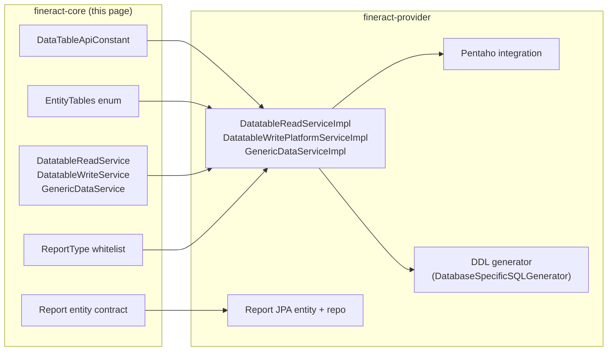

The "stretchy" data‑queries subsystem in Apache Fineract is the bridge
between user‑defined SQL reports, dynamically‑created datatables, and the
domain tables that store the actual lending/savings data. The `fineract-core`
half of this subsystem defines the entity model, the constants, the read DTOs
and the service contracts. The actual SQL execution, the datatable DDL
generation and the export pipeline live in
`fineract-provider/.../infrastructure/dataqueries/`, documented separately
under the provider data‑queries page.

## Layout in `fineract-core`

```text
infrastructure/dataqueries/
├── api/
│   └── DataTableApiConstant.java
├── data/
│   ├── ColumnFilter.java
│   ├── DataTableValidator.java
│   ├── DatatableCheckStatusData.java
│   ├── DatatableChecksData.java
│   ├── DatatableData.java
│   ├── DatatableSearchRequest.java
│   ├── EntityDataTableChecksData.java
│   ├── EntityTables.java
│   ├── GenericResultsetData.java
│   ├── ReportData.java
│   ├── ReportExportType.java
│   ├── ReportParameterData.java
│   ├── ReportParameterJoinData.java
│   ├── ResultsetColumnHeaderData.java
│   ├── ResultsetColumnValueData.java
│   ├── ResultsetRowData.java
│   └── StatusEnum.java
├── domain/
│   └── ReportType.java
├── exception/
│   ├── DatatableEntryRequiredException.java
│   ├── DatatableNotFoundException.java
│   └── DatatableSystemErrorException.java
└── service/
    ├── CleanupService.java
    ├── DatatableKeywordGenerator.java
    ├── DatatableReadService.java
    ├── DatatableWriteService.java
    └── GenericDataService.java
```

The `Report` entity itself lives in `fineract-provider`, under
`infrastructure/dataqueries/domain/`. It is documented here because the
service contracts in `fineract-core` reference its data model.

## The two concepts: Reports vs Datatables

| Concept | Backing table | What it is |
| --- | --- | --- |
| **Report** | `stretchy_report` | A pre‑configured SQL statement (or Pentaho `.prpt` reference) that produces a result set. Reports are categorised, parameterised and reusable. |
| **Datatable** | `x_registered_table` (catalogue) plus one user table per registration | A user‑created table attached to one of the platform's core entities (client, loan, savings, etc.). Provides custom columns without modifying the core schema. |

Both are dynamic in the sense that they are defined by data and executed
against the live DB; both flow through `GenericDataService`'s vendor‑aware
SQL execution. They are not the same thing — reports do `SELECT`, datatables
do `CREATE TABLE`/`INSERT`/`UPDATE`/`SELECT`.

## `Report` — the entity (in fineract-provider)

```java
@Entity
@Table(name = "stretchy_report",
       uniqueConstraints = { @UniqueConstraint(columnNames = { "report_name" }, name = "unq_report_name") })
public final class Report extends AbstractPersistableCustom<Long> {

    @Column(name = "report_name", nullable = false, unique = true) private String reportName;
    @Column(name = "report_type", nullable = false)                private String reportType;
    @Column(name = "report_subtype")                               private String reportSubType;
    @Column(name = "report_category")                              private String reportCategory;
    @Column(name = "description")                                  private String description;
    @Column(name = "core_report", nullable = false)                private boolean coreReport;
    @Column(name = "use_report", nullable = false)                 private boolean useReport;
    @Column(name = "report_sql")                                   private String reportSql;

    @OneToMany(cascade = CascadeType.ALL, mappedBy = "report", orphanRemoval = true, fetch = FetchType.EAGER)
    private Set<ReportParameterUsage> reportParameterUsages = new HashSet<>();

    public static Report fromJson(final JsonCommand command, final Collection<String> reportTypes) { … }
}
```

| Column | Purpose |
| --- | --- |
| `report_name` | Unique name shown in the UI. |
| `report_type` | One of the values whitelisted by the `ReportType` enum (see below). The historical values are `Table`, `Chart`, `Pentaho`, `SMS`. |
| `report_subtype` | Optional subtype (e.g. `Bar`, `Pie` for `Chart`). |
| `report_category` | Free‑form category for grouping in the UI. |
| `core_report` | `true` for reports seeded by Liquibase; protected from edits in some workflows. |
| `use_report` | Whether the report shows up in the reference UI listing. |
| `report_sql` | The actual SQL. May reference `${...}` parameters resolved from `reportParameterUsages`. |
| `reportParameterUsages` | The named parameters this report exposes — joined to `stretchy_report_parameter` rows that describe each parameter and its lookup table. |

### `ReportRepository`

A trivial Spring Data interface that adds no behaviour:

```java
public interface ReportRepository extends JpaRepository<Report, Long>,
                                          JpaSpecificationExecutor<Report> {
    // no added behaviour
}
```

`ReportRepositoryWrapper` (in `fineract-provider`) adds the
`findOneWithNotFoundDetection` pattern used elsewhere in the codebase.

## `ReportType` — security whitelist

`ReportType` lives in `fineract-core`. It is **not** persisted; it is a
runtime whitelist that the report execution path consults to keep
user‑supplied strings out of dynamically built SQL:

```java
public enum ReportType {
    REPORT   ("report"),
    PARAMETER("parameter");

    private static final Set<String> VALID_VALUES =
            Arrays.stream(values()).map(ReportType::getValue).collect(Collectors.toSet());

    public static boolean isValidType(String type) {
        return type != null && !type.trim().isEmpty()
                && VALID_VALUES.contains(type.toLowerCase(Locale.ROOT));
    }
}
```

This is the `?type=` query parameter on `GET /v1/runreports/{name}` — only
`report` or `parameter` are accepted. The class‑level Javadoc is explicit:
"Only these predefined types are allowed in report queries" — it is a
defence against the open‑ended SQL execution surface that reports expose.

## Datatable concepts

### `x_registered_table` — the catalogue

When an operator registers a datatable via
`POST /v1/datatables`, two things happen:

1. The platform creates a physical SQL table (the **datatable**) with the
   declared columns plus an `id` and a foreign key to the parent entity.
2. A row is inserted into `x_registered_table` describing the registration —
   the table name, the entity it is attached to, the category
   (`CATEGORY_DEFAULT = 100`, or `CATEGORY_PPI = 200`) and the application
   table name.

The constants live in `DataTableApiConstant`:

```java
public static final Integer CATEGORY_PPI     = 200;
public static final Integer CATEGORY_DEFAULT = 100;

public static final String TABLE_REGISTERED_TABLE      = "x_registered_table";
public static final String TABLE_COLUMN_CODE_MAPPINGS  = "x_table_column_code_mappings";
public static final String API_PARAM_DATATABLE_NAME    = "datatableName";
public static final String API_PARAM_COLUMNS           = "columns";
public static final String API_PARAM_CHANGECOLUMNS     = "changeColumns";
public static final String API_PARAM_ADDCOLUMNS        = "addColumns";
public static final String API_PARAM_DROPCOLUMNS       = "dropColumns";
public static final String CREATEDAT_FIELD_NAME        = "created_at";
public static final String UPDATEDAT_FIELD_NAME        = "updated_at";
```

There is no `RegisteredTable` JPA entity — datatable metadata is
read via raw JDBC by `DatatableReadServiceImpl` because the schema is
dynamic.

### `EntityTables` — what a datatable can attach to

```java
public enum EntityTables {
    CLIENT             ("m_client",             "client_id",          "id", CREATE, ACTIVATE, CLOSE),
    GROUP              ("m_group",              "group_id",           "id", CREATE, ACTIVATE, CLOSE),
    CENTER             ("m_center", "m_group",  "center_id",          "id"),
    OFFICE             ("m_office",             "office_id",          "id"),
    LOAN_PRODUCT       ("m_product_loan",       "product_loan_id",    "id"),
    LOAN               ("m_loan",               "loan_id",            "id", CREATE, APPROVE, DISBURSE, WITHDRAWN, REJECTED, WRITE_OFF),
    SAVINGS_PRODUCT    ("m_savings_product",    "savings_product_id", "id"),
    SAVINGS            ("m_savings_account",    "savings_account_id", "id", CREATE, APPROVE, ACTIVATE, WITHDRAWN, REJECTED, CLOSE),
    SAVINGS_TRANSACTION("m_savings_account_transaction", "savings_transaction_id", "id"),
    SHARE_PRODUCT      ("m_share_product",      "share_product_id",   "id");
}
```

For each:

| Field | Meaning |
| --- | --- |
| `name` (or `apptableName`) | The application table the datatable attaches to (e.g. `m_client`). |
| `foreignKeyColumnNameOnDatatable` | The FK column the platform adds to every datatable row (e.g. `client_id`). |
| `refColumn` | The column on the application table the FK points at (`id`). |
| `checkStatuses` | `StatusEnum` values that trigger entity‑datatable‑check validation (e.g. `CREATE`, `APPROVE`, `DISBURSE` for `LOAN`). |

`StatusEnum` is the list of state transitions on the parent entity — it
drives the `EntityDatatableChecks` machinery that lets datatables be flagged
as mandatory before a transition can happen.

## DTOs used at runtime

| Class | Carries |
| --- | --- |
| `DatatableData` | One row from `x_registered_table` plus its columns. Used by `GET /v1/datatables`. |
| `DatatableChecksData` / `EntityDataTableChecksData` / `DatatableCheckStatusData` | Configured "must be filled in before transition" rules. |
| `DatatableSearchRequest` | Body for advanced datatable searches (column filters, result columns, pagination). |
| `GenericResultsetData` | The generic SQL result set returned by the datatable engine — `columnHeaders[]` plus `data[]`. |
| `ResultsetColumnHeaderData` | One column descriptor (name, type, nullable, length, code‑value list). |
| `ResultsetColumnValueData` | A typed value within a row. |
| `ResultsetRowData` | One row's worth of column values. |
| `ReportData` | `Report` row + its parameter list, for the `GET /v1/reports` UI. |
| `ReportParameterData` / `ReportParameterJoinData` | Report parameters and the SQL that backs their drop‑downs. |
| `ReportExportType` | Enum — `CSV`, `XLS`, `XLSX`, `PDF`. |
| `ColumnFilter` | One predicate (column, operator, value) used by datatable advanced search. |
| `StatusEnum` | Application‑table state transitions used by datatable checks. |

## Service contracts (declared in fineract-core)

| Interface | Responsibility |
| --- | --- |
| `DatatableReadService` | Reads metadata (`GET /datatables`) and rows (`GET /datatables/{name}/{appTableId}`). Implementations execute raw JDBC against the dynamic table. |
| `DatatableWriteService` | Creates datatables (DDL), registers them in `x_registered_table`, inserts/updates/deletes rows. |
| `GenericDataService` | Vendor‑aware metadata helpers — fetch column headers, coerce row values to typed `ResultsetColumnValueData`. The implementation in `fineract-provider` delegates to `DatabaseSpecificSQLGenerator`. |
| `DatatableKeywordGenerator` | Validates datatable / column names against the reserved‑word lists for MySQL and PostgreSQL so the DDL never collides with reserved identifiers. |
| `CleanupService` | Periodic cleanup of orphaned datatable rows, called from a scheduled job. |

## `DataTableValidator`

Validates inbound advanced search requests for datatables. Verifies that
column names exist on the registered table, that operators are within
`SqlOperator` and that result column lists are non‑empty:

```java
@Component
public class DataTableValidator {
    private final FromJsonHelper fromJsonHelper;
    // validateTableSearch(...) consumes AdvancedQueryRequest / TableQueryData
}
```

The class is a thin wrapper around `DataValidatorBuilder` and the search
parameter constants from `org.apache.fineract.portfolio.search`.

## Exceptions

| Exception | Mapped status |
| --- | --- |
| `DatatableNotFoundException` | `404` (`PlatformResourceNotFoundExceptionMapper`). |
| `DatatableEntryRequiredException` | `403` (`PlatformDomainRuleExceptionMapper`) — the entity transition requires a datatable row that has not been filled in. |
| `DatatableSystemErrorException` | `500` — generic system error during datatable DDL or DML. |

## Where execution actually happens (preview)

For full coverage of how reports are run (Pentaho integration, SQL
templating, parameter substitution, output formatting) and how datatables
are materialised (DDL generation, MySQL vs PostgreSQL differences, code
value JSON columns), see the data‑queries page in the
`fineract-provider` section.



## Related pages

<CardGroup cols={2}>
  <Card title="Database overview" href="/database/overview">
    The `stretchy_report` and `x_registered_table` schemas; vendor differences in dynamic SQL.
  </Card>
  <Card title="DataSource & tenant routing" href="/core/datasource-tenant-routing">
    `DatabaseSpecificSQLGenerator` is what dialect‑aware DDL goes through.
  </Card>
  <Card title="Serialization & JSON" href="/core/serialization-and-json">
    `GenericResultsetData` is serialised via `DefaultToApiJsonSerializer` (no special adapters).
  </Card>
  <Card title="Configuration properties" href="/core/configuration-properties">
    `constraint-approach-for-datatables` selects between code‑value FK constraints and JSON storage.
  </Card>
</CardGroup>
