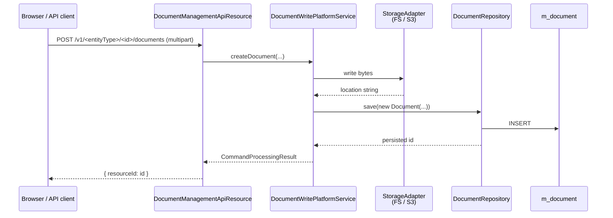

Most Fineract entities — clients, loans, savings accounts, staff — can have **documents** attached to them: scanned IDs, signed forms, payslips, KYC papers. The persistence model is intentionally uniform: every document is a `Document` row that points at a parent entity by `(parentEntityType, parentEntityId)` and holds the file's storage location together with display metadata. The **storage backend** (filesystem, S3, MinIO) is pluggable and decided at runtime by the document storage service in `fineract-document`. This page covers the **core-side** contracts: the `Document` entity, the `DocumentRepository`, the legacy `DocumentCommand` value object, and the `EntityImageIdAdapter` SPI used to decouple entity-thumbnail logic from the entity classes themselves.

<Note>
The `Document` entity lives in **`fineract-document`** (not `fineract-core`) because document storage is an optional module — a deployment that doesn't need attachments can run without `fineract-document` on the classpath. Only `EntityImageIdAdapter` ships in `fineract-core`. See [the documents overview](/documents/overview) for the full storage runtime.
</Note>

## Package layout

| Path                                                                              | Module             | Purpose                                                        |
| --------------------------------------------------------------------------------- | ------------------ | -------------------------------------------------------------- |
| `infrastructure/documentmanagement/adapter/EntityImageIdAdapter.java`             | fineract-core      | SPI to plug entity-image lookups without compile-time coupling |
| `infrastructure/documentmanagement/domain/Document.java`                          | fineract-document  | Spring Data JDBC entity backing `m_document`                  |
| `infrastructure/documentmanagement/domain/DocumentRepository.java`                | fineract-document  | `ListCrudRepository<Document, Long>` + custom finders         |
| `infrastructure/documentmanagement/command/DocumentCommand.java`                  | fineract-document  | Deprecated mutable command carrier (legacy code path)         |

## `Document` — the attachment row

```java
// fineract-document/.../infrastructure/documentmanagement/domain/Document.java
@Table("m_document")
@Getter @Setter @NoArgsConstructor @AllArgsConstructor
@Accessors(chain = true)
@FieldNameConstants
public final class Document implements Serializable {

    @Id @Column("id")
    private Long id;

    @Column("parent_entity_type") private String parentEntityType;
    @Column("parent_entity_id")   private Long   parentEntityId;

    @Column("name")              private String name;
    @Column("file_name")         private String fileName;
    @Column("size")              private Long size;
    @Column("type")              private String type;       // MIME type
    @Column("description")       private String description;
    @Column("location")          private String location;   // storage-backend reference
    @Column("storage_type_enum") private Integer storageType;
}
```

Field semantics:

| Field              | Notes                                                                                                |
| ------------------ | ---------------------------------------------------------------------------------------------------- |
| `parentEntityType` | Uppercase entity name, e.g. `clients`, `loans`, `staff`. Used by the resource path mapping.        |
| `parentEntityId`   | Primary key of the owning row. Combined with `parentEntityType` gives the polymorphic FK.            |
| `name`             | Human-readable label shown in the UI.                                                                |
| `fileName`         | Original filename uploaded by the client.                                                            |
| `size`             | Bytes. Used for quotas and progress bars.                                                            |
| `type`             | MIME content type (e.g. `image/png`, `application/pdf`).                                             |
| `description`      | Free-text caption.                                                                                   |
| `location`         | Backend-specific reference — for `FILE_SYSTEM` an absolute path, for `S3` the key, etc.              |
| `storageType`      | `StorageType` enum value: `1 = FILE_SYSTEM`, `2 = S3`, etc. Decides which storage adapter handles I/O. |

`@FieldNameConstants` generates a `Document.Fields.*` constant pool used by repository custom finders to refer to field names without string magic. Example: `Document.Fields.parentEntityId`.

<Note>
`Document` uses **Spring Data JDBC** (`@Table`, `@Id` from `org.springframework.data.relational`) rather than JPA. This is intentional — the document table is a leaf with no relationships and benefits from the simpler model. The rest of Fineract's entities use JPA via `AbstractPersistableCustom`.
</Note>

## `DocumentRepository` — finders

```java
public interface DocumentRepository
        extends ListCrudRepository<Document, Long>, QueryByExampleExecutor<Document> {

    List<Document> findAllByParentEntityTypeAndParentEntityId(
            String parentEntityType, Long parentEntityId);

    Optional<Document> findByIdAndParentEntityTypeAndParentEntityId(
            Long id, String entityType, Long entityId);
}
```

Spring Data derives both queries from the method names. The second is the canonical "load this attachment for this entity" call — it doubles as an authorisation check, since a document can only be fetched if both `id` **and** `(entityType, entityId)` match. A document attached to client A cannot be loaded by guessing its id while passing client B as the parent.

`QueryByExampleExecutor` is mixed in because the admin UI sometimes searches by description or filename prefix.

## `EntityImageIdAdapter` — pluggable entity image lookup

```java
// fineract-core/.../documentmanagement/adapter/EntityImageIdAdapter.java
@Deprecated
public interface EntityImageIdAdapter {

    boolean accept(String entityType);

    Optional<ImageIdResult> get(Long entityId);

    Optional<ImageIdResult> set(Long entityId, Long imageId);

    @Builder @Data @NoArgsConstructor @AllArgsConstructor
    class ImageIdResult implements Serializable {
        private Long id;
        private String displayName;
    }
}
```

The problem this solves: clients and staff have a dedicated **`image_id`** column pointing to their profile picture, but a uniform "set thumbnail for `clients/{id}`" endpoint shouldn't compile-time depend on `Client.java` or `Staff.java`. Each domain registers an adapter:

```java
@Component
public class ClientImageIdAdapter implements EntityImageIdAdapter {

    private final ClientRepository repo;

    @Override public boolean accept(String entityType) {
        return "clients".equalsIgnoreCase(entityType);
    }

    @Override public Optional<ImageIdResult> get(Long clientId) {
        return repo.findById(clientId).map(c ->
            new ImageIdResult(c.getImage() != null ? c.getImage().getId() : null,
                              c.getDisplayName()));
    }

    @Override public Optional<ImageIdResult> set(Long clientId, Long imageId) {
        return repo.findById(clientId).map(c -> {
            c.setImage(/* load image */);
            repo.save(c);
            return new ImageIdResult(imageId, c.getDisplayName());
        });
    }
}
```

The image service iterates all `EntityImageIdAdapter` beans, calls `accept(entityType)`, and dispatches to the first match. The interface is marked `@Deprecated` because the project intends to consolidate everything under generic `Document` rows; for now it's the bridge for legacy `image_id` columns.

## `DocumentCommand` — legacy mutable carrier

```java
@Deprecated(forRemoval = true)
public class DocumentCommand {

    private final Long id;
    private final String parentEntityType;
    private final Long parentEntityId;
    private final String name;
    private final String description;

    private String fileName;
    private Long size;
    private String type;
    private String location;

    public DocumentCommand(Set<String> modifiedParameters,
            Long id, String parentEntityType, Long parentEntityId,
            String name, String fileName, Long size, String type,
            String description, String location) { ... }

    // getters + setters for the four mutable fields
}
```

A pre-`JsonCommand` style command object: the constructor takes a `Set<String>` of modified parameter names and the new values. It is `@Deprecated(forRemoval = true)` — new code paths use `JsonCommand` directly through the [commands framework](/core/commands-framework). The old object is still present because the file-upload multipart endpoints (which bypass the JSON pipeline) instantiate it manually.

## End-to-end attachment flow



Reading a document is the inverse: `DocumentRepository.findByIdAndParentEntityTypeAndParentEntityId(...)` validates ownership, then the storage adapter streams `location` back to the response writer (typically via [`StreamResponseUtil`](/core/util-helpers#streamresponseutil)).

## Removing a document

The delete path:

1. Verify ownership via the same composite finder.
2. Tell the storage adapter to delete the underlying object (best-effort — failures are logged but don't block the database delete in many implementations).
3. Delete the `m_document` row.

A successful delete fires `DocumentDeletedBusinessEvent` (defined in `fineract-document`, see [Business Events](/core/event-business)) so listeners can clear caches or trigger downstream cleanup.

## Storage adapters (overview)

The storage backend is **not** part of the core contract — `Document.location` is opaque to the entity. The runtime side ships these adapters (in `fineract-document`):

| Storage type enum | Adapter                           | Backend                  |
| ----------------- | --------------------------------- | ------------------------ |
| 1 (`FILE_SYSTEM`) | `FileSystemContentRepository`     | Local disk path          |
| 2 (`S3`)          | `S3ContentRepository`             | Amazon S3 / MinIO API    |

Selection happens through a `ContentRepositoryFactory` keyed on the `storageType` field — different documents in the same database can live on different backends, which is useful when migrating from local disk to object storage.

See [the documents overview](/documents/overview) for a full breakdown of storage adapters and configuration.

## Cross-references

<CardGroup cols={2}>
  <Card title="Document Storage" icon="paperclip" href="/documents/overview">
    Backends, upload pipeline, security, and S3 configuration.
  </Card>
  <Card title="Business Events" icon="bolt" href="/core/event-business">
    `DocumentCreatedBusinessEvent`, `DocumentDeletedBusinessEvent` (in fineract-document).
  </Card>
  <Card title="Commands Framework" icon="terminal" href="/core/commands-framework">
    The non-multipart command path. `DocumentCommand` is the legacy bypass.
  </Card>
  <Card title="Util Helpers" icon="screwdriver-wrench" href="/core/util-helpers">
    `StreamResponseUtil` used to stream document content back to clients.
  </Card>
</CardGroup>
