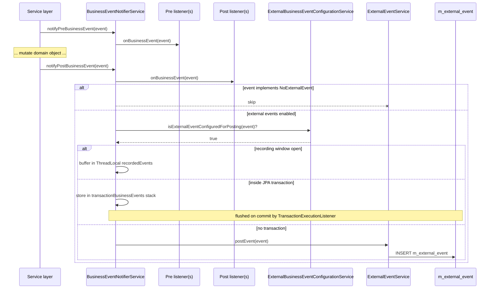

Fineract publishes thousands of domain facts every day — a loan disbursed, a savings withdrawal accepted, a charge waived — and the **business event bus** is the synchronous, in-process channel every other subsystem reads to react to those facts. The contract is small (`BusinessEvent<T>`), the dispatch is direct method calls (no broker), and a separate path forwards selected events to the durable **external event** store so downstream consumers can see them via JMS, Kafka, or polling. This page covers only the producer-side contract that lives in `fineract-core`: the interfaces, the notifier, and the events shipped in the core module. Concrete events for loans, savings, accounting, and so on live in their respective modules and listen via the same SPI.

<Note>
The bus is **in-process and synchronous**. Listeners run on the caller thread, inside the caller's transaction. Throwing from a listener rolls back the business operation. For asynchronous integration, prefer the [external events pipeline](/core/event-external) — `BusinessEventNotifierService` writes a row in `m_external_event` so the **Send Asynchronous Events** job can push it to a broker.
</Note>

## Package layout (fineract-core)

| Path                                                                          | Role                                                                    |
| ----------------------------------------------------------------------------- | ----------------------------------------------------------------------- |
| `infrastructure/event/business/BusinessEventListener.java`                    | Functional interface listeners implement                                |
| `infrastructure/event/business/domain/BusinessEvent.java`                     | Root event SPI — `get()`, `getType()`, `getCategory()`, `aggregateRootId()` |
| `infrastructure/event/business/domain/AbstractBusinessEvent.java`             | Convenience base that stores the payload                                |
| `infrastructure/event/business/domain/BulkBusinessEvent.java`                 | Envelope grouping multiple events for a single aggregate root           |
| `infrastructure/event/business/domain/NoExternalEvent.java`                   | Marker — opt‑out of the external event pipeline                         |
| `infrastructure/event/business/domain/datatable/...`                          | Datatable entry events (the only events shipped in core)                |
| `infrastructure/event/business/service/BusinessEventNotifierService.java`     | Public notifier API used by services                                    |
| `infrastructure/event/business/service/BusinessEventNotifierServiceImpl.java` | Implementation: pre/post dispatch, recording, transactional flushing    |
| `infrastructure/event/business/service/ExternalBusinessEventConfigurationService.java` | Gates events through the `m_external_event_configuration` allow-list  |
| `infrastructure/event/business/service/TransactionHelper.java`                | Detects active transactions so events are deferred until commit         |

## The `BusinessEvent<T>` contract

```java
// fineract-core/src/main/java/org/apache/fineract/infrastructure/event/business/domain/BusinessEvent.java
public interface BusinessEvent<T> {
    T get();
    String getType();
    String getCategory();
    Long getAggregateRootId();
}
```

Four orthogonal pieces of information:

- **`get()`** returns the domain payload (e.g. the `Loan`, `SavingsAccount`, or `DatatableEntryDetails`).
- **`getType()`** is the string used as the message type by the external event publisher and to filter `m_external_event_configuration` rows. It is **not** the Java class name — events sometimes share a category but differ in type to keep payload schemas distinct.
- **`getCategory()`** groups related types (e.g. all loan transaction events share a category). Useful for downstream routing.
- **`getAggregateRootId()`** is the key the external pipeline uses to partition messages so events for the same loan/savings account land in order on the same broker partition.

`AbstractBusinessEvent<T>` provides a `final T value` field via `@RequiredArgsConstructor` so concrete events only declare `getType()`, `getCategory()`, and `getAggregateRootId()`.

### The `NoExternalEvent` marker

```java
public interface NoExternalEvent {}
```

Events implementing this interface short-circuit the external pipeline:

```java
// BusinessEventNotifierServiceImpl#notifyPostBusinessEvent
boolean isExternalEvent = !(businessEvent instanceof NoExternalEvent);
```

The datatable events in core all implement `NoExternalEvent` — datatable mutations are internal infrastructure noise, not domain facts worth shipping.

## Concrete events in fineract-core

Only datatable events live in the core module; loan, savings, accounting, document, and investor events ship with their respective modules. Use `find` to enumerate the full inventory in your tree:

```bash
find . -path '*/event/business/domain/*BusinessEvent.java' -not -name 'Abstract*'
```

The core inventory:

| Event class (under `infrastructure/event/business/domain/datatable/`) | Type string                       | Aggregate root                          |
| --------------------------------------------------------------------- | --------------------------------- | --------------------------------------- |
| `DatatableEntryBusinessEvent` (abstract)                              | `DatatableEntryBusinessEvent`     | n/a                                     |
| `DatatableEntryCreatedBusinessEvent`                                  | `DatatableEntryCreatedBusinessEvent` | `DatatableEntryDetails.entityId`       |
| `DatatableEntryUpdatedBusinessEvent`                                  | `DatatableEntryUpdatedBusinessEvent` | `DatatableEntryDetails.entityId`       |
| `DatatableEntryDeletedBusinessEvent`                                  | `DatatableEntryDeletedBusinessEvent` | `DatatableEntryDetails.entityId`       |

The payload carrier:

```java
// DatatableEntryDetails.java
@Data @RequiredArgsConstructor
public class DatatableEntryDetails {
    private final String datatableName;
    private final EntityTables entityType;
    private final Long entityId;
    private final Long appTableId;
    private final Map<String, Object> data;
}
```

<Note>
All three datatable events implement `NoExternalEvent`, so they never reach the broker — they are only useful to in-VM listeners (audit, cache invalidation).
</Note>

For the larger event catalogue (loan, savings, document, accounting, investor) see the corresponding feature pages — every concrete event still extends `AbstractBusinessEvent<T>` and is fed through this same notifier.

## The `BusinessEventListener<T>` SPI

```java
public interface BusinessEventListener<T extends BusinessEvent<?>> {
    void onBusinessEvent(T event);
}
```

A listener is bound to a specific subtype of `BusinessEvent<?>` at registration time. The notifier walks its registry on every emit and invokes every listener whose registered class is `assignableFrom` the event class — so registering against `LoanBusinessEvent` catches every loan subclass.

## `BusinessEventNotifierService` — the public API

```java
public interface BusinessEventNotifierService {

    void notifyPreBusinessEvent(BusinessEvent<?> businessEvent);
    void notifyPostBusinessEvent(BusinessEvent<?> businessEvent);

    <T extends BusinessEvent<?>> void addPreBusinessEventListener (Class<T> eventType, BusinessEventListener<T> listener);
    <T extends BusinessEvent<?>> void addPostBusinessEventListener(Class<T> eventType, BusinessEventListener<T> listener);

    void startExternalEventRecording();
    void stopExternalEventRecording();
    void resetEventRecording();
}
```

Services typically call:

```java
businessEventNotifierService.notifyPreBusinessEvent(new LoanApprovedBusinessEvent(loan));
// ... mutate the loan, validate, persist ...
businessEventNotifierService.notifyPostBusinessEvent(new LoanApprovedBusinessEvent(loan));
```

**Pre vs post**:

- **Pre** listeners fire before the mutation. They can throw to abort, or do read-only work (e.g. guarantor checks).
- **Post** listeners fire after the mutation. They are the ones that produce side effects: emit external events, send notifications, write audit logs, trigger hooks.

`notifyPreBusinessEvent` propagation is `(none — runs in the caller's transaction)`. `notifyPostBusinessEvent` is annotated `@Transactional(propagation = Propagation.SUPPORTS)` so it inherits the caller's transaction when present and just runs without one otherwise.

### Bulk events are not user-emittable

```java
private void throwExceptionIfBulkEvent(BusinessEvent<?> businessEvent) {
    if (businessEvent instanceof BulkBusinessEvent) {
        throw new IllegalArgumentException("BulkBusinessEvent cannot be raised directly");
    }
}
```

Both `notifyPreBusinessEvent` and `notifyPostBusinessEvent` reject `BulkBusinessEvent`. The notifier constructs bulk envelopes itself during a recording window.

## Listener registration

Listeners register at startup (typically in an `@PostConstruct` or `InitializingBean.afterPropertiesSet`):

```java
@Component
@RequiredArgsConstructor
public class LoanGuarantorListener implements InitializingBean {
    private final BusinessEventNotifierService notifier;
    private final GuarantorService guarantorService;

    @Override
    public void afterPropertiesSet() {
        notifier.addPostBusinessEventListener(
            LoanApprovedBusinessEvent.class,
            event -> guarantorService.blockFunds(event.get())
        );
    }
}
```

Internally, the notifier maintains two `Map<Class, List<BusinessEventListener>>` (one for pre, one for post) and routes via `Class.isAssignableFrom`:

```java
for (Map.Entry<Class, List<BusinessEventListener>> entry : listeners.entrySet()) {
    Class<?> registeredClazz = entry.getKey();
    if (registeredClazz.isAssignableFrom(eventClazz)) {
        result.addAll(entry.getValue());
    }
}
```

So registering once against `LoanBusinessEvent.class` is enough to receive every subclass — useful for cross-cutting concerns like audit logging.

## Emit → listener → external event flow



## Recording windows — `BulkBusinessEvent`

When a service makes many related changes (e.g. loan COB makes per-installment adjustments), publishing one external event per micro-change is noisy. The notifier exposes a **recording window**:

```java
notifier.startExternalEventRecording();
try {
    for (LoanRepaymentScheduleInstallment inst : loan.getRepaymentScheduleInstallments()) {
        // ... mutate, validate ...
        notifier.notifyPostBusinessEvent(new LoanScheduleVariationsAddedBusinessEvent(inst));
    }
} finally {
    notifier.stopExternalEventRecording();
}
```

While recording is active, events that would normally flow to `ExternalEventService` are appended to a `ThreadLocal<List<BusinessEvent<?>>>` instead. `stopExternalEventRecording()`:

- emits **nothing** if the list is empty,
- forwards the **single** event verbatim if only one was recorded,
- otherwise wraps the list in a `BulkBusinessEvent` and posts that.

```java
public BulkBusinessEvent(List<BusinessEvent<?>> value) {
    super(value);
    verifySameAggregate(value);   // throws if multiple aggregateRootIds
}
```

The aggregate-root invariant is enforced — every event in a bulk must concern the **same** root entity. Mixing two loans in one bulk fails fast.

`resetEventRecording()` clears the flag and the buffer without flushing — use it in `finally` blocks of error paths.

<Warning>
Recording state is `ThreadLocal`. If you spawn a new thread inside a recording window the child won't see the flag, won't buffer events, and will publish them eagerly. Use `TaskExecutor` wrappers or copy `FineractContext` (see `ThreadLocalContextUtil`) and propagate explicitly.
</Warning>

## Transaction-aware deferred publication

`BusinessEventNotifierServiceImpl` implements `TransactionExecutionListener`. When `notifyPostBusinessEvent` runs inside an open transaction it does **not** call `ExternalEventService.postEvent` immediately. Instead it pushes a `BusinessEventWithContext` (event + `FineractContext`) onto a `ThreadLocal<Stack<List<BusinessEventWithContext>>>`. The Spring transaction listener callbacks (`afterBegin`, `afterCommit`, `afterCompletion`) flush the stack:

- **Commit** → events are posted to `ExternalEventService` with the captured tenant context.
- **Rollback** → the stack is popped and discarded — no external events are emitted for a rolled-back business operation.

This is critical for consistency: the broker only ever sees facts that survived the database transaction.

## `ExternalBusinessEventConfigurationService` gate

```java
if (externalBusinessEventConfigurationService.isExternalEventConfiguredForPosting(businessEvent)) { ... }
```

Even with external events enabled and the event being non-`NoExternalEvent`, a per-type allow-list (table `m_external_event_configuration`) decides whether to persist. Operators toggle each type via the [external events admin API](/core/event-external#api-and-administration). Disabled types are dropped silently.

## Properties controlling the bus

```yaml
fineract:
  events:
    external:
      enabled: true            # master kill switch (FineractProperties.Events.External#enabled)
```

When `enabled = false`, every external write path is skipped — listeners still run, but the `m_external_event` table stays untouched. The startup log reflects which mode is active:

```
INFO  BusinessEventNotifierServiceImpl - External event posting is enabled
```

## Implementing a new business event

1. **Decide the category**. Reuse a category abstract base where possible (e.g. `LoanBusinessEvent`) so listeners can register once for the family.
2. **Subclass `AbstractBusinessEvent<T>`** with the payload type:

   ```java
   public final class MyEntityCreatedBusinessEvent
           extends AbstractBusinessEvent<MyEntity> {
       public static final String TYPE = "MyEntityCreatedBusinessEvent";
       public MyEntityCreatedBusinessEvent(MyEntity value) { super(value); }
       @Override public String getType()           { return TYPE; }
       @Override public String getCategory()       { return "MyDomain"; }
       @Override public Long getAggregateRootId()  { return get().getId(); }
   }
   ```

3. **If internal only**, also `implements NoExternalEvent`.
4. **Register a default row** in `m_external_event_configuration` (Liquibase changelog) so operators can enable it — types missing from the table behave as disabled.
5. **Emit** via `BusinessEventNotifierService.notifyPostBusinessEvent(...)` from the service layer.

## Cross-references

<CardGroup cols={2}>
  <Card title="External Events" icon="globe" href="/core/event-external">
    The durable side: how `ExternalEventService.postEvent` writes to `m_external_event`, and how the **Send Asynchronous Events** job ships them to JMS or Kafka.
  </Card>
  <Card title="Events Overview" icon="bell" href="/events/overview">
    High-level architecture of the dual-bus design (in-VM + durable) and operational guidance.
  </Card>
  <Card title="Jobs Overview" icon="clock" href="/jobs/overview">
    Scheduled jobs (loan COB, accruals) are the primary callers of `startExternalEventRecording()`.
  </Card>
  <Card title="Hooks" icon="link" href="/core/hooks">
    Hooks observe the same emit points via `HookEvent`s posted in the post-commit phase.
  </Card>
</CardGroup>
