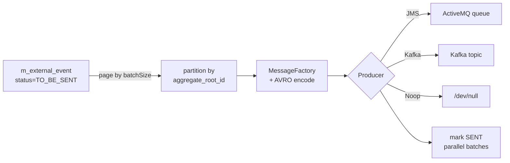

The **external events pipeline** is Fineract's reliable bridge between in-process domain events and downstream systems. Every business fact selected for export is first written as a row in the `m_external_event` outbox inside the same transaction that produced it, then read in batches by the **Send Asynchronous Events** Spring Batch job and pushed to a configured broker — JMS, Kafka, or a no-op sink. The pieces in `fineract-core` are: the JPA entities and repositories, the AVRO serialization layer, the producer SPI plus its no-op default, an admin API for the per-type allow-list, and idempotency-key generation. Active broker integrations live in `fineract-provider` and are linked at the end of this page.

<Note>
External events are the **outbox** pattern: same-transaction write to a relational table, asynchronous publication by a poller. This guarantees at-least-once delivery without distributed transactions, and lets operators replay or audit traffic from SQL.
</Note>

## Package layout

| Subpackage                                                  | Role                                                                   |
| ----------------------------------------------------------- | ---------------------------------------------------------------------- |
| `infrastructure/event/external/api`                         | JAX-RS resources to read & toggle configurations                       |
| `infrastructure/event/external/command`                     | `ExternalConfigurationsUpdateCommand` carried through the command pipeline |
| `infrastructure/event/external/config`                      | `EnableExternalEventQueueCondition`, `…TopicCondition`, `EventTaskExecutorConfig`, `ExternalBusinessEventConfiguration` |
| `infrastructure/event/external/data`                        | DTOs: `ExternalEventResponse`, `ExternalEventConfigurationItemResponse`, update request/response |
| `infrastructure/event/external/exception`                   | `AcknowledgementTimeoutException`, `ExternalEventConfigurationNotFoundException` |
| `infrastructure/event/external/handler`                     | `ExternalEventConfigurationUpdateHandler` (command pipeline handler)  |
| `infrastructure/event/external/jobs`                        | Tasklets for **Send Asynchronous Events** and **Purge External Events** |
| `infrastructure/event/external/producer`                    | `ExternalEventProducer` SPI + `NoopExternalEventProducer`             |
| `infrastructure/event/external/repository`                  | JPA repository, JPQL view, and domain entities                         |
| `infrastructure/event/external/service`                     | `ExternalEventService`, configuration read/write, idempotency, AVRO   |
| `infrastructure/event/external/service/serialization`       | AVRO mappers and `BusinessEventSerializerFactory`                      |
| `infrastructure/event/external/service/message`             | `MessageFactory`, `BulkMessageItemFactory`, message domain values     |
| `infrastructure/event/external/service/validation`          | `ExternalEventSourceProvider` SPI for source filtering                 |
| `infrastructure/event/external/service/support`             | `ByteBufferConverter`                                                  |

## The `ExternalEvent` entity (the outbox row)

```java
// infrastructure/event/external/repository/domain/ExternalEvent.java
@Entity
@Table(name = "m_external_event")
public class ExternalEvent extends AbstractPersistableCustom<Long> {

    @Column(name = "type",           nullable = false)            private String type;
    @Column(name = "category",       nullable = false)            private String category;
    @Column(name = "schema",         nullable = false)            private String schema;
    @Basic(fetch = FetchType.LAZY)
    @Column(name = "data",           nullable = false)            private byte[] data;
    @Column(name = "created_at",     nullable = false)            private OffsetDateTime createdAt;
    @Enumerated(EnumType.STRING)
    @Column(name = "status",         nullable = false)            private ExternalEventStatus status;
    @Column(name = "sent_at",        nullable = true)             private OffsetDateTime sentAt;
    @Column(name = "idempotency_key",nullable = false)            private String idempotencyKey;
    @Column(name = "business_date",  nullable = false)            private LocalDate businessDate;
    @Column(name = "aggregate_root_id", nullable = true)          private Long aggregateRootId;
}
```

Notable fields:

- **`type`** — matches `BusinessEvent.getType()`. Used by `ExternalBusinessEventConfigurationService` to look up whether the event is enabled.
- **`schema`** — fully-qualified AVRO schema name (e.g. `org.apache.fineract.avro.loan.v1.LoanAccountDataV1`). Consumers use it to deserialize.
- **`data`** — AVRO-encoded payload as a byte array (lazy-loaded).
- **`aggregate_root_id`** — used to partition outbound messages so events for the same loan go to the same broker partition (preserves ordering).
- **`idempotency_key`** — unique key generated at insert time. Consumers can de-duplicate.
- **`status`** — `TO_BE_SENT` on insert, `SENT` after the job ships it. The Purge job deletes `SENT` rows older than the retention window.

```java
public enum ExternalEventStatus { TO_BE_SENT, SENT }
```

## The configuration allow-list

```java
@Entity
@Table(name = "m_external_event_configuration")
public class ExternalEventConfiguration {
    @Id @Column(name = "type", nullable = false) private String type;
    @Column(name = "enabled",  nullable = false) private boolean enabled = false;
}
```

`type` is the primary key — one row per known event type. New types ship disabled. Operators flip them on through the API.

`ExternalBusinessEventConfigurationService` (see [Business Events](/core/event-business)) reads this table to decide if a `BusinessEvent` should be written to the outbox.

## Producer SPI

```java
// infrastructure/event/external/producer/ExternalEventProducer.java
public interface ExternalEventProducer {
    void sendEvents(Map<Long, List<byte[]>> partitions) throws AcknowledgementTimeoutException;
}
```

The `Map` key is the aggregate-root id (or `-1L` for events without one); the value is the list of AVRO-encoded `MessageV1` byte arrays for that partition. Implementations are chosen at runtime:

| Implementation                          | Location           | Condition class                       |
| --------------------------------------- | ------------------ | ------------------------------------- |
| `NoopExternalEventProducer`             | `fineract-core`    | `NoopExternalEventEnabled` (default)  |
| JMS / ActiveMQ producer                 | `fineract-provider` | `EnableExternalEventQueueCondition` (`fineract.events.external.producer.jms.enabled=true`) |
| Kafka producer                          | `fineract-provider` | `EnableExternalEventTopicCondition` (`fineract.events.external.producer.kafka.enabled=true`) |

The conditions are mutually exclusive and read from `FineractProperties.Events.External.Producer.{jms,kafka}.enabled`.

```java
@Component
@Conditional(NoopExternalEventEnabled.class)
public class NoopExternalEventProducer implements ExternalEventProducer {
    @Override public void sendEvents(Map<Long, List<byte[]>> messages) {} // drops on the floor
}
```

The no-op exists so internal code can call `producer.sendEvents(...)` unconditionally — useful for development and for read-only / write-only deployments that don't ship events themselves.

## Writing to the outbox — `ExternalEventService`

`ExternalEventService.postEvent(BusinessEvent<T>)` is invoked by the in-process business-event notifier (in the post-commit path or eagerly when no transaction is active).

```java
@Service @RequiredArgsConstructor @Transactional
public class ExternalEventService {

    private final ExternalEventRepository repository;
    private final ExternalEventIdempotencyKeyGenerator idempotencyKeyGenerator;
    private final BusinessEventSerializerFactory serializerFactory;
    private final ByteBufferConverter byteBufferConverter;
    private final BulkMessageItemFactory bulkMessageItemFactory;
    private final DataEnricherProcessor dataEnricherProcessor;

    public <T> void postEvent(BusinessEvent<T> event) {
        entityManager.flush();
        ExternalEvent externalEvent = (event instanceof BulkBusinessEvent)
                ? handleBulkBusinessEvent((BulkBusinessEvent) event)
                : handleRegularBusinessEvent(event);
        repository.save(externalEvent);
    }
}
```

The `entityManager.flush()` is deliberate — JPA changes from the surrounding service must hit the database before the AVRO serializer reads them, otherwise the serialized snapshot can miss freshly-mutated fields.

For a single event, `handleRegularBusinessEvent` calls `BusinessEventSerializerFactory.create(event)` to find the right `BusinessEventSerializer` (one per event type, registered as Spring beans). For a `BulkBusinessEvent`, items are serialized individually and wrapped in a `BulkMessagePayloadV1` AVRO record.

### Idempotency keys

```java
public interface ExternalEventIdempotencyKeyGenerator {
    <T> String generate(BusinessEvent<T> event);
}

@Component
public class DefaultExternalEventIdempotencyKeyGenerator implements ExternalEventIdempotencyKeyGenerator {
    @Override public <T> String generate(BusinessEvent<T> event) {
        return UUID.randomUUID().toString();
    }
}
```

The default is a random UUID — sufficient for downstream de-duplication because the outbox row carries the same key all the way to the broker message. Override the bean to derive deterministic keys (e.g. `type + aggregateRootId + version`) if you want at-least-once semantics with stronger producer de-dup.

## The Send Asynchronous Events job

`SendAsynchronousEventsTasklet` (registered by `SendAsynchronousEventsConfig`) is the worker that drains the outbox:

```java
@Component @RequiredArgsConstructor
public class SendAsynchronousEventsTasklet implements Tasklet {

    @Override
    public RepeatStatus execute(StepContribution contribution, ChunkContext chunkContext) {
        if (isDownstreamChannelEnabled()) {
            List<ExternalEventView> events = getQueuedEventsBatch();
            sendEvents(events);
        }
        return RepeatStatus.FINISHED;
    }

    protected boolean isDownstreamChannelEnabled() {
        return fineractProperties.getEvents().getExternal().getProducer().getJms().isEnabled()
            || fineractProperties.getEvents().getExternal().getProducer().getKafka().isEnabled();
    }
}
```

Algorithm:

1. **Page** rows from `m_external_event` where `status = TO_BE_SENT`, ordered by `business_date, id`, with batch size from `ConfigurationDomainService.retrieveExternalEventBatchSize()`.
2. **Partition** the page by `aggregate_root_id` (null → `-1L`).
3. **Serialize** each event to a `MessageV1` AVRO record via `MessageFactory`, encode to `byte[]`.
4. **Hand off** to `ExternalEventProducer.sendEvents(partitions)` — implementations decide whether to publish to a topic per type or a single queue/topic.
5. **Mark sent** by updating `status = SENT, sent_at = now()` in partitioned batches sized via `fineract.events.external.partitionSize` (default avoids hitting the Postgres 65 535-parameter limit).
6. Mark-sent runs through a `ThreadPoolTaskExecutor` (`EventTaskExecutorConfig`) so the SQL update doesn't block the next batch.



`SchedulerJobRunnerReadService` registers the job as `JobName.SEND_ASYNCHRONOUS_EVENTS` ("Send Asynchronous Events") and the step `StepName.SEND_ASYNCHRONOUS_EVENTS_STEP`.

## Purge External Events job

`PurgeExternalEventsTasklet` (config: `PurgeExternalEventsConfig`) deletes `SENT` rows older than the retention period configured via the platform configuration table:

- `JobName.PURGE_EXTERNAL_EVENTS` → "Purge External Events"
- Runs the SQL deletion in chunks to keep transaction sizes manageable.
- Pair with the [PurgeProcessedCommands](/core/commands-framework#purge-processed-commands) job for full housekeeping.

## API and administration

Two JAX-RS resources expose configuration:

### `ExternalEventConfigurationApiResource`

```java
@Path("/v1/externalevents/configuration")
public class ExternalEventConfigurationApiResource {

    @GET  public ExternalEventConfigurationResponse getExternalEventConfigurations() { ... }
    @PUT  public ExternalEventConfigurationUpdateResponse updateExternalEventConfigurations(
            @Valid ExternalEventConfigurationUpdateRequest request) { ... }
}
```

- `GET /v1/externalevents/configuration` — returns every `ExternalEventConfiguration` row as `ExternalEventConfigurationItemResponse { type, enabled }`.
- `PUT /v1/externalevents/configuration` — batch-toggles types. Body is an `ExternalEventConfigurationUpdateRequest`; the update is dispatched through the [command pipeline](/core/commands-framework) as an `ExternalConfigurationsUpdateCommand` and handled by `ExternalEventConfigurationUpdateHandler`.

### `InternalExternalEventsApiResource`

Internal-only resource exposing `ExternalEventResponse` payloads for replay and inspection. Useful for ops scripts that need to peek at the outbox without direct SQL.

## Configuration properties

| Property                                                        | Effect                                                    |
| --------------------------------------------------------------- | --------------------------------------------------------- |
| `fineract.events.external.enabled`                              | Master switch — when `false`, nothing is written to `m_external_event` |
| `fineract.events.external.producer.jms.enabled`                 | Activates the JMS condition; mark-sent reads this flag    |
| `fineract.events.external.producer.kafka.enabled`               | Activates the Kafka condition                             |
| `fineract.events.external.partitionSize`                        | Chunk size for the `markEventsSent` parameterized DELETE |
| Platform table `c_external_event_configuration` / `c_external_event_purge_retention` | Batch size and retention days (read at job runtime via `ConfigurationDomainService`) |

## `ExternalEventSourceProvider` SPI

```java
public interface ExternalEventSourceProvider {
    ExternalEventSourceData getSourceData(BusinessEvent<?> event);
}
```

Each provider can claim a category and attach `source` metadata (origin office, business date, correlation id) to the AVRO `MessageV1`. `SimpleExternalEventSourceProvider` is the default and emits a constant source name; downstream microservices can plug a more elaborate one through `ExternalEventSourceProviderConfig`.

## AVRO serialization

`BusinessEventSerializer` implementations live next to each event class (in their feature module) and are discovered by `BusinessEventSerializerFactory` via Spring DI. The factory picks the first serializer whose `canSerialize(event)` returns true. Helpers under `service/serialization/mapper/` convert Fineract value types (`MonetaryCurrency`, `ExternalId`, `MonthDay`, `OffsetDateTime`) into their AVRO counterparts so generated AVRO classes stay decoupled from JPA entities.

`ByteBufferConverter` translates `ByteBuffer` to `byte[]` because the AVRO generator returns the former and the JPA column expects the latter.

## Operational checklist

<CardGroup cols={2}>
  <Card title="Replay a single event" icon="rotate-right">
    ```sql
    UPDATE m_external_event
       SET status = 'TO_BE_SENT', sent_at = NULL
     WHERE id = ?;
    ```
    The next run of **Send Asynchronous Events** will re-emit it. Idempotency keys are preserved.
  </Card>
  <Card title="Why is nothing publishing?" icon="bug">
    Check `fineract.events.external.enabled`, the producer flag matching your broker, and that the type rows are `enabled = true`. The job's tasklet logs a count for every cycle.
  </Card>
  <Card title="Outbox bloat" icon="database">
    Ensure **Purge External Events** runs on schedule (`SchedulerJobApi`). Without it, `m_external_event` grows indefinitely.
  </Card>
  <Card title="Ordering" icon="list-ol">
    Within an aggregate root, ordering is `business_date, id`. Across aggregates there is no global ordering guarantee.
  </Card>
</CardGroup>

## Cross-references

<CardGroup cols={2}>
  <Card title="Business Events" icon="bolt" href="/core/event-business">
    Producer side — how `BusinessEventNotifierService` decides what to hand to `ExternalEventService.postEvent`.
  </Card>
  <Card title="Events Overview" icon="bell" href="/events/overview">
    Architecture, broker choice, and consumer guidance.
  </Card>
  <Card title="Jobs Overview" icon="clock" href="/jobs/overview">
    Scheduling and operating the two background jobs that drain and purge the outbox.
  </Card>
  <Card title="Commands Framework" icon="terminal" href="/core/commands-framework">
    Used by the configuration `PUT` endpoint to flow through the command pipeline.
  </Card>
</CardGroup>
