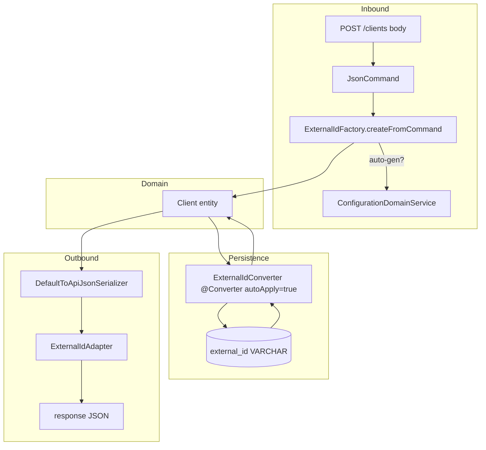

Apache Fineract treats every business resource (client, loan, savings,
journal entry, charge, transfer) as having two identifiers: an internal
auto‑increment `Long` primary key and an opaque, externally visible
`ExternalId`. External IDs let integrators reference resources without
exposing the platform's surrogate keys and they survive data migrations
between environments. This page documents the value object, the factory
that creates it, the Gson adapter that serializes it, and the JPA converter
that persists it.

## The value object: `ExternalId`

```java
package org.apache.fineract.infrastructure.core.domain;

@Getter
@EqualsAndHashCode
public class ExternalId implements Serializable {

    private static final ExternalId empty = new ExternalId();
    private final String value;

    private ExternalId() { this.value = null; }

    public ExternalId(String value) {
        if (StringUtils.isBlank(value)) {
            throw new IllegalArgumentException("error.external.id.cannot.be.blank");
        }
        this.value = value;
    }

    public static ExternalId generate() { return new ExternalId(UUID.randomUUID().toString()); }
    public static ExternalId empty()    { return empty; }
    public boolean isEmpty()            { return value == null; }

    public void throwExceptionIfEmpty() {
        if (isEmpty()) {
            throw new PlatformInternalServerException(
                    "error.external.id.is.not.set",
                    "Internal state violation: External id is not set");
        }
    }
}
```

Key properties:

- **Immutable** — `value` is `final`, the only public constructor is the
  one that takes a `String`, and `empty()` returns a shared singleton.
- **Cannot wrap a blank string** — calling
  `new ExternalId("")` (or `null`, or whitespace) throws
  `IllegalArgumentException`. Code that wants "no external id" uses
  `ExternalId.empty()`.
- **Value‑equality** — `@EqualsAndHashCode` is on the `value` field. Two
  external IDs with the same string are equal.
- **UUID generator** — `generate()` produces a random UUID `String`. The
  platform never assigns sequential external IDs; randomness keeps the IDs
  opaque.
- **`throwExceptionIfEmpty`** — a defensive guard used by serialization code
  paths that must reject an empty value (it would otherwise serialize as
  `JsonNull` and surprise the caller). It throws
  `PlatformInternalServerException`, surfaced by
  [`PlatformInternalServerExceptionMapper`](/core/exception-mappers) as
  `500`.

The `serialVersionUID` is hardcoded to `1` to keep the on‑disk serialised
form stable across releases.

## The factory: `ExternalIdFactory`

`ExternalId` is a value object, so its constructors are simple, but the
*policy* of "should I autogenerate a UUID when the user did not provide one?"
depends on global configuration. That policy lives in `ExternalIdFactory`:

```java
package org.apache.fineract.infrastructure.core.service;

@Component
@RequiredArgsConstructor
public class ExternalIdFactory {

    private final ConfigurationDomainService configurationDomainService;

    public static ExternalId produce(String value) {
        return StringUtils.isBlank(value) ? ExternalId.empty() : new ExternalId(value);
    }

    public static List<ExternalId> produce(List<String> values) {
        Objects.requireNonNull(values, "values must not be null");
        return values.stream().map(ExternalIdFactory::produce).toList();
    }

    public ExternalId createFromCommand(JsonCommand command, final String externalIdKey) {
        String externalIdStr = null;
        if (command.parsedJson() != null) {
            externalIdStr = command.stringValueOfParameterNamedAllowingNull(externalIdKey);
        }
        return create(externalIdStr);
    }

    public ExternalId create(String externalIdStr) {
        if (StringUtils.isBlank(externalIdStr)) {
            if (configurationDomainService.isExternalIdAutoGenerationEnabled()) {
                return ExternalId.generate();
            } else {
                return ExternalId.empty();
            }
        }
        return new ExternalId(externalIdStr);
    }

    public ExternalId create() { return create(null); }
}
```

### The two style of usage

| Method | When to call it |
| --- | --- |
| `ExternalIdFactory.produce(String)` (static) | Read paths and converters where the value is already known. Just wraps the string in an `ExternalId` (or returns `empty()` for blank). |
| `ExternalIdFactory.produce(List<String>)` (static) | Batch processing — converts each string in turn. |
| `factory.createFromCommand(JsonCommand, key)` | Inbound write resource. Reads `externalId` (or another key) from the command body and respects the auto‑generation flag. |
| `factory.create(String)` | When you already extracted the string yourself but want the auto‑generation logic. |
| `factory.create()` | "Generate one if auto‑gen is on, otherwise return empty." Used by domain creators that need an `ExternalId` and don't accept caller input. |

### The auto‑generation flag

`ConfigurationDomainService.isExternalIdAutoGenerationEnabled()` reads the
`enable-auto-generated-external-id` global configuration property (see
[configuration properties](/core/configuration-properties)). When the flag is
on, missing external IDs are minted as UUIDs at write time. When off, they
remain empty and the row stores `NULL` in its `external_id` column.

<Note>
Some entities have their own write handler that does not consult the
factory and instead generates a UUID unconditionally — for example accounts
created by certain workflows. When porting a new entity to external IDs,
default to `ExternalIdFactory.createFromCommand` to keep behaviour
consistent.
</Note>

## The Gson adapter: `ExternalIdAdapter`

`ExternalIdAdapter` is the Gson `JsonSerializer<ExternalId>` registered by
`GoogleGsonSerializerHelper`. It is the reason `"externalId": null` shows up
in responses for resources that don't have one yet, rather than the literal
string `"null"`:

```java
package org.apache.fineract.infrastructure.core.api;

public class ExternalIdAdapter implements JsonSerializer<ExternalId> {

    @Override
    public JsonElement serialize(ExternalId src, Type typeOfSrc, JsonSerializationContext context) {
        if (src == null || src.isEmpty()) {
            return JsonNull.INSTANCE;
        }
        return new JsonPrimitive(src.getValue());
    }
}
```

Important behaviours:

- `null` and `ExternalId.empty()` both serialize to `JsonNull.INSTANCE`. The
  client sees `null`.
- Non‑empty IDs serialize to a JSON string (`JsonPrimitive`). There is no
  wrapping object.
- No deserializer is registered: external IDs come into the platform via
  `JsonCommand.stringValueOfParameterNamed("externalId")` and then through
  `ExternalIdFactory`.

## The JPA converter: `ExternalIdConverter`

Persistence is handled by an `@Converter(autoApply = true)` that lives in
`fineract-provider` (it has to be in the same module as the persistence unit
so the converter is picked up by EclipseLink):

```java
@Converter(autoApply = true)
public class ExternalIdConverter implements AttributeConverter<ExternalId, String> {

    @Override
    public String convertToDatabaseColumn(ExternalId externalId) {
        return externalId != null ? externalId.getValue() : null;
    }

    @Override
    public ExternalId convertToEntityAttribute(String externalId) {
        return StringUtils.isBlank(externalId) ? ExternalId.empty() : ExternalIdFactory.produce(externalId);
    }
}
```

Because of `autoApply = true`, **any** entity field declared as
`private ExternalId externalId` is automatically stored in/from a `VARCHAR`
column. No `@Convert` annotation is needed on the field. `fineract-investor`
ships a parallel `ExternalIdConverter` in its own package so its standalone
persistence path stays self‑contained.

| Direction | Behaviour |
| --- | --- |
| Java → DB | `null` or empty `ExternalId` → stored as `NULL`. Non‑empty `ExternalId` → stored as its `value` string. |
| DB → Java | `NULL` / blank column → `ExternalId.empty()`. Non‑blank → `ExternalIdFactory.produce(value)`. |

## Validating external IDs on the way in

`DataValidatorBuilder` does not have a dedicated `externalId()` rule —
external IDs are validated as strings with the conventional bounds:

```java
final String externalIdParameterName = "externalId";
if (this.fromApiJsonHelper.parameterExists(externalIdParameterName, element)) {
    final String externalId = this.fromApiJsonHelper.extractStringNamed(externalIdParameterName, element);
    baseDataValidator.reset()
            .parameter(externalIdParameterName)
            .value(externalId)
            .ignoreIfNull()
            .notExceedingLengthOf(100);
}
```

The column is typed `VARCHAR(100)` in the schema, and the validator caps it
at 100 characters. Persisting a duplicate external ID triggers a database
unique‑constraint violation that
`DataIntegrityErrorHandler.handleDataIntegrityIssues` converts into a
`PlatformDataIntegrityException` keyed by `"externalId"`:

```java
if (realCause.getMessage().contains("external_id")) {
    final String externalId = command.stringValueOfParameterNamed("externalId");
    throw new PlatformDataIntegrityException(
            "error.msg." + msgType + ".duplicate.externalId",
            msgDescription + ": externalId `" + externalId + "` already exists",
            "externalId", externalId);
}
```

That exception is then projected to `403 Forbidden` by
[`PlatformDataIntegrityExceptionMapper`](/core/exception-mappers).

## Resolving by external ID

Most domain resources expose two equivalent paths:

| URL pattern | Identifier semantics |
| --- | --- |
| `/v1/clients/{id}` | The internal `Long` PK. |
| `/v1/clients/external-id/{externalId}` | The external ID string. |

Resources use `IdTypeResolver` to dispatch to the right repository lookup:

```java
public enum IdTypeResolver {
    INTERNAL_ID,    // /clients/123
    EXTERNAL_ID;    // /clients/external-id/abc-…

    public static IdTypeResolver fromString(final String idType) { … }
}
```

The repository wrapper then calls
`findByExternalIdWithNotFoundDetection(externalId)` which throws
`AbstractPlatformResourceNotFoundException` for missing rows — mapped to
`404` by `PlatformResourceNotFoundExceptionMapper`.

## Where external IDs travel



The flow makes three guarantees:

1. The same value is used by the API, the DB and the audit log — nothing in
   between rewrites it.
2. An empty external ID never accidentally becomes the literal string
   `"null"` or `"undefined"`; it stays as either a NULL column, an
   `ExternalId.empty()` instance, or a `JsonNull` in the response.
3. Whether a missing external ID becomes a UUID or stays NULL is a single
   global configuration flag.

## Behavioural rules summary

| Situation | Result |
| --- | --- |
| Client sends `"externalId": "client-42"` | `ExternalIdFactory.create("client-42")` → wrapped, persisted as `"client-42"`. |
| Client omits `externalId`, auto‑gen on | `ExternalIdFactory.create(null)` → `ExternalId.generate()` (random UUID). |
| Client omits `externalId`, auto‑gen off | `ExternalId.empty()` → DB column `NULL`. |
| Client sends `"externalId": ""` | Treated as blank — same path as "omitted". |
| Duplicate external ID hits DB | Triggers `PlatformDataIntegrityException("duplicate.externalId")` → 403. |
| Empty external ID serialized in response | `ExternalIdAdapter` → `null`. |
| Code calls `externalId.throwExceptionIfEmpty()` when empty | `PlatformInternalServerException` → 500. |

## Related pages

<CardGroup cols={2}>
  <Card title="Serialization & JSON" href="/core/serialization-and-json">
    Where `ExternalIdAdapter` is registered and how it interacts with `JsonCommand`.
  </Card>
  <Card title="Configuration properties" href="/core/configuration-properties">
    The `enable-auto-generated-external-id` flag that drives the factory.
  </Card>
  <Card title="Exception mappers" href="/core/exception-mappers">
    The 403/500 mappings that surface external‑id failures.
  </Card>
  <Card title="Persistence & JPA" href="/core/persistence-and-jpa">
    Where `ExternalIdConverter` plugs into the persistence unit.
  </Card>
</CardGroup>
