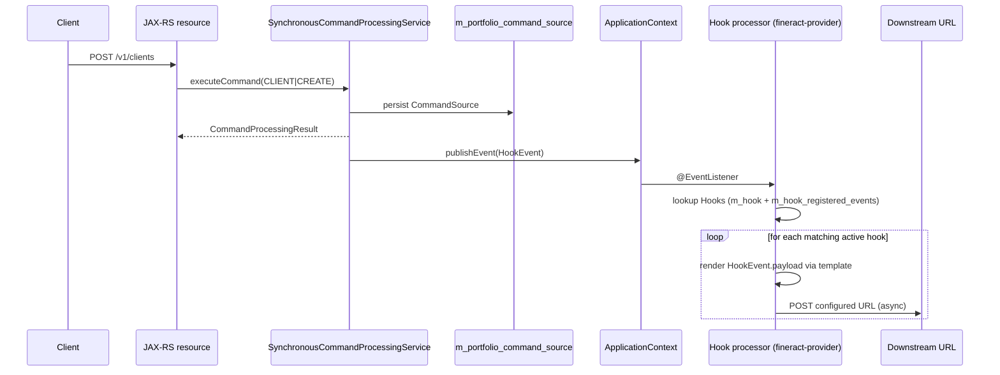

Fineract's **hooks** subsystem lets administrators wire entity+action pairs (e.g. `CLIENT|CREATE`, `LOAN|APPROVE`) to outbound URLs or templated payloads. Every time the [command pipeline](/core/commands-framework) successfully processes a matching command it raises a Spring application event, which the hook processor in `fineract-provider` catches and dispatches to whichever transport (HTTP, JMS, SMS) the operator configured. This page covers the **core-side contracts** that ship in `fineract-core` so any module can plug into the bridge: the `HookEvent` class, its `HookEventSource` key, and the JPA entities that model a hook subscription. The runtime processor, queues, templating, and the REST resource that operators use to manage hooks live in `fineract-provider` (see [hooks overview](/hooks/overview)).

<Note>
The hooks system is **post-commit, fire-and-forget** by design — failures in a downstream URL must not roll back the command that produced the event. In-process listeners that need transactional semantics should use the [business event bus](/core/event-business) instead.
</Note>

## Where the contracts live

| Path                                                                  | Module          | Purpose                                                       |
| --------------------------------------------------------------------- | --------------- | ------------------------------------------------------------- |
| `infrastructure/hooks/event/HookEvent.java`                           | fineract-core   | The Spring `ApplicationEvent` published on every command       |
| `infrastructure/hooks/event/HookEventSource.java`                     | fineract-core   | `(entityName, actionName)` key carried by the event           |
| `infrastructure/hooks/domain/Hook.java`                               | fineract-provider | JPA entity — a registered hook subscription                 |
| `infrastructure/hooks/domain/HookConfiguration.java`                  | fineract-provider | Per-hook key/value configuration (e.g. target URL, token)   |
| `infrastructure/hooks/domain/HookResource.java`                       | fineract-provider | Many-to-many link to `(entityName, actionName)` filters     |
| `infrastructure/hooks/domain/HookConfigurationRepository.java`        | fineract-provider | Spring Data repository for `HookConfiguration` rows         |

The core module is intentionally minimal — anything in `fineract-core` can fire a `HookEvent` without depending on JPA or the processor.

## `HookEventSource` — the routing key

```java
// infrastructure/hooks/event/HookEventSource.java
@RequiredArgsConstructor
@Getter
public class HookEventSource implements Serializable {
    private final String entityName;
    private final String actionName;
}
```

Two strings — `entityName` and `actionName`. The pair must match the same names used by the [`@CommandType`](/core/commands-framework#commandtype-annotation) annotation on command handlers. By convention they are uppercase singulars: `CLIENT`, `LOAN`, `SAVINGSACCOUNT`, `JOURNALENTRY` for entities; `CREATE`, `UPDATE`, `DELETE`, `APPROVE`, `DISBURSE`, `WITHDRAW` for actions.

`HookEventSource` implements `Serializable` because it is the source object of a Spring `ApplicationEvent` and may be queued onto a downstream broker.

## `HookEvent` — the wire event

```java
// infrastructure/hooks/event/HookEvent.java
@Getter
public class HookEvent extends FineractEvent {

    private final String payload;
    private final AppUser appUser;

    public HookEvent(final HookEventSource source,
                     final String payload,
                     final AppUser appUser,
                     FineractContext fineractContext) {
        super(source, fineractContext);
        this.payload = payload;
        this.appUser = appUser;
    }
}
```

`FineractEvent` is the project's base `ApplicationEvent`. `HookEvent` adds three pieces of context:

- **`source`** — the `HookEventSource` used by listeners to decide whether this hook applies.
- **`payload`** — the **already-rendered** JSON the hook should ship. By the time `HookEvent` is published the command has been serialized, masked for sensitive fields, and turned into a string. The hook processor does not have to know about JsonCommand / CommandSource.
- **`appUser`** — the maker who triggered the command. Used by hook templates that need to label outbound calls (`user`, `actor`, etc.).
- **`fineractContext`** (via the superclass) — tenant id, business date, action context. The processor uses it to restore `ThreadLocal` state on the dispatch thread.

### Who publishes

`SynchronousCommandProcessingService` (in `commands/service/`) publishes `HookEvent` after a successful, persisted command:

```java
// SynchronousCommandProcessingService (simplified)
applicationContext.publishEvent(new HookEvent(
    new HookEventSource(wrapper.entityName(), wrapper.actionName()),
    serializedResult,
    user,
    ThreadLocalContextUtil.getContext()
));
```

The publish call is **outside** any maker-checker rollback window — by the time we get here the command has been committed.

## `Hook` JPA entity

```java
// infrastructure/hooks/domain/Hook.java
@Entity @Table(name = "m_hook")
public final class Hook extends AbstractAuditableCustom {

    @Column(name = "name", nullable = false, length = 100)
    private String name;

    @Column(name = "is_active", nullable = false)
    private Boolean isActive;

    @OneToMany(cascade = ALL, mappedBy = "hook", orphanRemoval = true, fetch = EAGER)
    private Set<HookResource> events = new HashSet<>();

    @OneToMany(cascade = ALL, mappedBy = "hook", orphanRemoval = true, fetch = EAGER)
    private Set<HookConfiguration> config = new HashSet<>();

    @ManyToOne @JoinColumn(name = "template_id")
    private HookTemplate template;

    @ManyToOne @JoinColumn(name = "ugd_template_id", nullable = true)
    private Template ugdTemplate;
}
```

- **`template`** — the hook **kind**. Templates are seeded rows (Web, SMS Bridge, etc.) that declare which fields a hook of that kind needs (URL, content type, auth token). The processor uses the template name to pick a `Processor` implementation.
- **`ugdTemplate`** — optional User-defined / Generated Document template that lets operators craft a payload different from the default JSON. Implementations use `freemarker` or `Mustache` against `HookEvent.payload`.
- **`events`** — the set of `(entityName, actionName)` filters. A hook fires only when the incoming event matches at least one row.
- **`config`** — opaque key/value pairs (template-dependent: `URL`, `Authorization`, `Content Type`).

`Hook.fromJson(...)` is the factory used by the create handler — it validates required template fields and lazily attaches `HookConfiguration` and `HookResource` instances before persistence.

## `HookConfiguration` value entity

```java
@Entity @Table(name = "m_hook_configuration")
public class HookConfiguration extends AbstractPersistableCustom<Long> {

    @ManyToOne(optional = false) @JoinColumn(name = "hook_id")
    private Hook hook;

    @Column(name = "field_type",  nullable = false, length = 20)  private String fieldType;
    @Column(name = "field_name",  nullable = false, length = 100) private String fieldName;
    @Column(name = "field_value", nullable = false, length = 100) private String fieldValue;

    public static HookConfiguration createNewWithoutHook(
            String fieldType, String fieldName, String fieldValue) { ... }
}
```

`fieldType` is one of the constants declared in the corresponding template (e.g. `string`, `URL`, `Auth`). `fieldName` is the template's parameter name. The processor reads these into a `Map<String, String>` before calling the transport.

### `HookConfigurationRepository`

A Spring Data `JpaRepository<HookConfiguration, Long>`. Used by the hook processor to look up a hook's transport settings without re-loading the full `Hook` aggregate.

## `HookResource` — the subscription filter row

```java
@Entity @Table(name = "m_hook_registered_events")
public class HookResource extends AbstractPersistableCustom<Long> {

    @ManyToOne(optional = false) @JoinColumn(name = "hook_id")
    private Hook hook;

    @Column(name = "entity_name", nullable = false, length = 45) private String entityName;
    @Column(name = "action_name", nullable = false, length = 45) private String actionName;
}
```

These rows are the inverse index for hook lookup. On dispatch the processor queries:

```sql
SELECT h.* FROM m_hook h
JOIN m_hook_registered_events r ON r.hook_id = h.id
WHERE h.is_active = true
  AND r.entity_name = :entity
  AND r.action_name = :action;
```

Both `entityName` and `actionName` come from the `HookEventSource` of the published event.

## End-to-end flow



## Why the contract lives in core but the runtime doesn't

The hook event must be raisable from anywhere a command runs — including the [batch API](/core/batch-api-internals) and self-service modules — so the event type sits in `fineract-core`. The processor, however, depends on:

- `HookProcessor` SPI (web, JMS, SMS),
- a thread pool (`HookProcessor` is `@Async`),
- a circuit breaker, retry policy, and dead-letter handling,
- the `HookTemplate` seed rows and template engine,

all of which are operational concerns and live in `fineract-provider` so that `fineract-core` stays free of runtime dependencies.

<Warning>
Because the processor is `@Async`, a failing webhook does **not** roll back the originating command. To replay a failed delivery, query the hook history table (in fineract-provider) and re-fire — there is no built-in retry queue in the core contracts. See the implementation page for details.
</Warning>

## Adding a hook for a custom command

1. Make sure your handler is annotated with the right `@CommandType(entity = "FOO", action = "DOTHING")`.
2. No further code is needed — every successful command publishes a `HookEvent` automatically.
3. Operators register the hook via `POST /v1/hooks` with the right template and filter row. See [hooks overview](/hooks/overview) for the API.

## Not in core

The following live in `fineract-provider` and are documented separately:

- `HookResource` (the JAX-RS resource) and `HookApiResource` — administrator API.
- `WebHookProcessor`, `SmsHookProcessor`, `ProcessorHelper` — transport implementations.
- `HookEventProcessor` — the `@EventListener` that consumes `HookEvent`.
- `HookTemplate` seed data and Liquibase changelogs.

## Cross-references

<CardGroup cols={2}>
  <Card title="Hooks Implementation" icon="link" href="/hooks/overview">
    Processors, transports, templating, and admin API.
  </Card>
  <Card title="Commands Framework" icon="terminal" href="/core/commands-framework">
    Where `HookEvent`s are emitted from — `SynchronousCommandProcessingService`.
  </Card>
  <Card title="Business Events" icon="bolt" href="/core/event-business">
    Use these instead when you need synchronous, transactional listeners.
  </Card>
  <Card title="External Events" icon="globe" href="/core/event-external">
    Use these for durable, broker-delivered facts. Hooks are best-effort.
  </Card>
</CardGroup>
