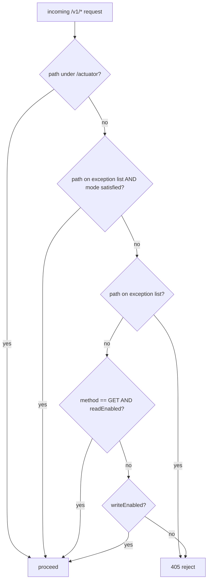

A single Fineract binary can be deployed in four overlapping roles: **read-only**, **write-enabled**, **batch-manager**, and **batch-worker**. The instance-mode filter is what enforces that contract — when a deployment is configured as `read=true, write=false`, every non-GET request below `/v1/...` is rejected with `405 Method Not Allowed` long before it reaches a service or transaction. This page documents the small but load-bearing package `infrastructure/instancemode/` in `fineract-core`: its property constants, the `FineractModeProperties` bean, and the rules implemented in `FineractInstanceModeApiFilter`.

<Note>
Mode flags are **operator-level**. They are independent of user permissions and role-based access. Even a global administrator gets a `405` for a `POST` against a read-only instance — the request is rejected by a servlet filter that runs before Spring Security's authentication chain.
</Note>

## Package layout

| File                                                                                | Purpose                                                                    |
| ----------------------------------------------------------------------------------- | -------------------------------------------------------------------------- |
| `infrastructure/instancemode/api/FineractInstanceModeConstants.java`                | Property-name constants                                                    |
| `infrastructure/instancemode/filter/FineractInstanceModeApiFilter.java`             | The `OncePerRequestFilter` that accepts/rejects requests by mode           |
| `infrastructure/core/config/FineractProperties.FineractModeProperties` (referenced) | `@ConfigurationProperties` bean holding the four mode booleans            |

## The four flags

```java
// FineractProperties.java (excerpt)
public static class FineractModeProperties {
    private boolean readEnabled;
    private boolean writeEnabled;
    private boolean batchWorkerEnabled;
    private boolean batchManagerEnabled;

    public boolean isReadOnlyMode() {
        return readEnabled && !writeEnabled && !batchWorkerEnabled && !batchManagerEnabled;
    }
}
```

Bound from properties:

```yaml
fineract:
  mode:
    read-enabled: true
    write-enabled: true
    batch-worker-enabled: false
    batch-manager-enabled: false
```

Common deployment shapes:

| Shape                          | read | write | batch-manager | batch-worker | Use case                                                                                               |
| ------------------------------ | ---- | ----- | ------------- | ------------ | ------------------------------------------------------------------------------------------------------ |
| **Monolith**                   | true | true  | true          | true         | Single node handles everything (default)                                                              |
| **Read replica**               | true | false | false         | false        | Reporting / dashboards / read-heavy mobile traffic                                                    |
| **Write-only API**             | false| true  | false         | false        | Hot path for command/transaction ingestion, fronted by a queue                                       |
| **Batch manager**              | true | false | true          | false        | Drives the scheduler, dispatches partitioned jobs, accepts `/v1/jobs` and `/v1/scheduler` calls       |
| **Batch worker**               | false| false | false         | true         | Pure compute node consuming partition messages — no public HTTP traffic accepted                     |

The legacy constants in `FineractInstanceModeConstants` are kept for backwards compatibility:

```java
public static final String FINERACT_MODE_READ_ENABLE_PROPERTY  = "fineract.mode.read-enabled";
public static final String FINERACT_MODE_WRITE_ENABLE_PROPERTY = "fineract.mode.write-enabled";
public static final String FINERACT_MODE_BATCH_ENABLE_PROPERTY = "fineract.mode.batch-enabled";
```

The `batch-enabled` property is the **older** flag; new deployments use the `batchManagerEnabled` / `batchWorkerEnabled` pair.

## `FineractInstanceModeApiFilter`

A standard Spring `OncePerRequestFilter` registered on the `/v1/*` dispatcher. Its rules:

1. Requests for `/actuator/*` always pass — health checks must not be blocked.
2. Requests on the **exception list** (defined below) pass if the corresponding mode flag is set.
3. Requests whose path matches an exception list **path** but whose mode flag is unset are **rejected** with 405.
4. Otherwise, `GET` requests pass if `readEnabled = true`; any other method passes if `writeEnabled = true`. Everything else is rejected.

### The exception list

```java
private static final List<ExceptionListItem> EXCEPTION_LIST = List.of(
    item(FineractModeProperties::isBatchManagerEnabled, pi -> pi.startsWith("/v1/jobs")),
    item(FineractModeProperties::isBatchManagerEnabled, pi -> pi.startsWith("/v1/scheduler")),
    item(FineractModeProperties::isBatchManagerEnabled, pi -> pi.startsWith("/v1/loans/catch-up")),
    item(FineractModeProperties::isBatchManagerEnabled, pi -> pi.startsWith("/v1/loans/is-catch-up-running")),
    item(p -> true,                                     pi -> pi.startsWith("/v1/instance-mode")),
    item(p -> true,                                     pi -> pi.startsWith("/v1/batches")));
```

Each entry pairs a **mode predicate** with a **path predicate**:

- **Job / scheduler endpoints** are reserved for `batchManagerEnabled` nodes. A read-write node without `batchManagerEnabled` will reject `POST /v1/jobs/{id}` even though writes are otherwise allowed.
- **`/v1/instance-mode`** is universally accessible — operators must be able to query the current mode from any node.
- **`/v1/batches`** (the [Batch API](/core/batch-api-internals)) is universally permitted at the filter level. Read-only enforcement is delegated to the resource itself, because a batch request may contain `GET` sub-requests that should still succeed in a read-only instance.

### Path semantics

```java
private boolean isOnExceptionList(HttpServletRequest request) {
    return EXCEPTION_LIST.stream()
        .anyMatch(item -> item.getModeFunction().apply(fineractProperties.getMode())
                       && item.getPathFunction().apply(request.getPathInfo()));
}

private boolean isPathOnExceptionList(HttpServletRequest request) {
    return EXCEPTION_LIST.stream()
        .anyMatch(item -> item.getPathFunction().apply(request.getPathInfo()));
}
```

`isOnExceptionList` evaluates both predicates (allow). `isPathOnExceptionList` evaluates only the path (deny when the mode isn't satisfied). The combination means a path on the exception list **must** have its mode bit set to be accepted — it can't fall through to the default read/write rules.

### Reject response

```java
private void reject(HttpServletRequest request, HttpServletResponse response) throws IOException {
    response.setStatus(HttpStatus.SC_METHOD_NOT_ALLOWED);
    ApiGlobalErrorResponse errorResponse = ApiGlobalErrorResponse.invalidInstanceTypeMethod(request.getMethod());
    response.getWriter().write(errorResponse.toJson());
}
```

The response body is the standard Fineract error envelope (`ApiGlobalErrorResponse`) with the error key `error.msg.invalidInstanceTypeMethod` and developer message identifying the method. Clients can recognise the rejection and either route the call elsewhere or surface it to the operator.

## Decision flow



## Interactions with other subsystems

- **`/v1/batches`** — the filter lets the request through. `BatchApiResource` then checks each sub-request against `PlatformSecurityContext` and `FineractProperties.getMode()` to enforce read-only sub-requests, throwing `InvalidInstanceTypeMethodException` if a `POST` sub-request lands on a read-only instance.
- **Scheduler** — when an instance has `batchManagerEnabled = false`, Spring Batch jobs registered by feature modules will still be picked up by the bean registry, but `SchedulerJobRunnerReadService.isUpdatesAllowed()` returns `false` and the scheduler will refuse to schedule new triggers.
- **Spring Batch worker nodes** — typically run with `read=false, write=false, manager=false, worker=true`. They communicate with the manager via JMS/Kafka (see [Spring Batch infra](/core/spring-batch-infra)), so they don't need to accept HTTP traffic at all. The filter ensures any accidental probing is rejected.

## Implementation file

```java
@RequiredArgsConstructor
public class FineractInstanceModeApiFilter extends OncePerRequestFilter {

    private final FineractProperties fineractProperties;

    @Override
    protected void doFilterInternal(HttpServletRequest request,
                                    HttpServletResponse response,
                                    FilterChain filterChain)
            throws ServletException, IOException {
        if (isOnExceptionList(request) || isActuatorApi(request)) {
            proceed(filterChain, request, response);
        } else if (isPathOnExceptionList(request)) {
            reject(request, response);
        } else if (fineractProperties.getMode().isReadEnabled() && isReadMethod(request)) {
            proceed(filterChain, request, response);
        } else if (fineractProperties.getMode().isWriteEnabled()) {
            proceed(filterChain, request, response);
        } else {
            reject(request, response);
        }
    }
    // ...
}
```

The filter is stateless — no caching of routing decisions, no per-tenant overrides. Mode is a static deployment property; if you need per-tenant read-only enforcement, layer it in the application stack (e.g. via a tenant filter that throws after this one).

## Operational guidance

<CardGroup cols={2}>
  <Card title="Verify current mode" icon="circle-check">
    `GET /v1/instance-mode` is on the universal exception list and always returns the four booleans. Use it as a sanity check from a load balancer or smoke test.
  </Card>
  <Card title="Read replicas" icon="copy">
    Run as many `read=true, write=false` instances as needed in front of a read replica DB. Combine with the [tenancy layer](/tenancy/overview) so each picks up the read-replica connection.
  </Card>
  <Card title="Hot path scaling" icon="bolt">
    Front a single write-enabled instance with a queue. The queue consumer is a regular client; the filter does not care about the source.
  </Card>
  <Card title="Disabled instance" icon="circle-pause">
    All four flags `false` causes every public endpoint to reject. Useful for a "maintenance" lifecycle stage: actuator still works, but no business traffic gets through.
  </Card>
</CardGroup>

## Cross-references

<CardGroup cols={2}>
  <Card title="Jobs Overview" icon="clock" href="/jobs/overview">
    Batch-manager and batch-worker semantics — what each runs.
  </Card>
  <Card title="Batch API" icon="list-check" href="/core/batch-api-internals">
    Why `/v1/batches` is universally allowed and how it self-enforces.
  </Card>
  <Card title="Tenancy" icon="building" href="/tenancy/overview">
    Combining instance mode with multi-tenant routing.
  </Card>
  <Card title="Security" icon="lock" href="/security/overview">
    The filter runs **before** authentication; how the two layers interact.
  </Card>
</CardGroup>
