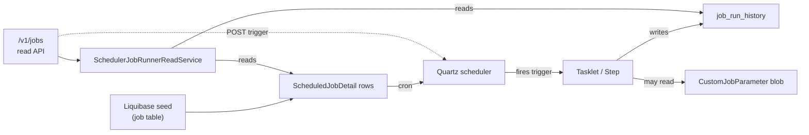

Every recurring background activity in Fineract — accrual posting, loan COB, interest capitalization, external-event drainage, charge ageing — is registered as a **scheduled job** with a unique `JobName`, persisted as a `ScheduledJobDetail` row, and driven by a cron expression that the scheduler service interprets. The model in `fineract-core` defines the names, the parameter envelope, the step identifiers used by Spring Batch, and the read-side service that exposes them. This page is the reference for those types — the scheduler runtime, Quartz integration, and feature-module jobs are documented in [jobs overview](/jobs/overview).

<Note>
Job names are deliberately stable strings. They are referenced by Liquibase changesets (which seed the `job` table on first boot), by partitioned-job properties (`fineract.partitioned-job.partitioned-job-properties[*].jobName`), and by ops tooling. Renaming a `JobName` is a breaking change.
</Note>

## Package layout (fineract-core)

| File                                                             | Purpose                                                                  |
| ---------------------------------------------------------------- | ------------------------------------------------------------------------ |
| `infrastructure/jobs/service/JobName.java`                       | Enum of every job + human-readable display label                         |
| `infrastructure/jobs/service/StepName.java`                      | Spring Batch step identifiers (currently two)                           |
| `infrastructure/jobs/service/SchedulerJobRunnerReadService.java` | Read interface for `JobDetailData`, history, scheduler suspension flag  |
| `infrastructure/jobs/data/JobDetailData.java`                    | Read DTO for `/v1/jobs` GETs                                            |
| `infrastructure/jobs/data/JobDetailHistoryData.java`             | Per-run history record                                                  |
| `infrastructure/jobs/data/JobParameterDTO.java`                  | Name/value pair for ad-hoc parameters                                   |
| `infrastructure/jobs/data/JobParametersDTO.java`                 | Set of `JobParameterDTO` (the request envelope)                         |
| `infrastructure/jobs/domain/CustomJobParameter.java`             | JPA entity persisting one parameter blob per ad-hoc run                |
| `infrastructure/jobs/domain/CustomJobParameterRepository.java`   | Spring Data repository                                                  |
| `infrastructure/jobs/domain/CustomJobParameterRepositoryImpl.java` | Custom implementation                                                  |
| `infrastructure/jobs/exception/JobExecutionException.java`       | Aggregating `MultiException` used by tasklets and steps                |
| `infrastructure/jobs/TenantAwareEqualsHashCodeAdvice.java`       | AspectJ advice that injects tenant id into job-key equality            |

`ScheduledJobDetail` and `SchedulerDetail` themselves live in `fineract-provider` (because they pull in the scheduler runtime) but are central to the model and shown below for completeness.

## `ScheduledJobDetail` — one row per scheduler job

```java
// fineract-provider .../infrastructure/jobs/domain/ScheduledJobDetail.java
@Entity @Table(name = "job", uniqueConstraints = @UniqueConstraint(columnNames = {"short_name"}, name = "job_short_name_key"))
public class ScheduledJobDetail extends AbstractPersistableCustom<Long> {

    @Column(name = "name")                  private String jobName;
    @Column(name = "display_name")          private String jobDisplayName;
    @Column(name = "node_id")               private Integer nodeId;
    @Column(name = "is_mismatched_job")     private boolean isMismatchedJob;
    @Column(name = "cron_expression")       private String cronExpression;
    @Column(name = "create_time")           @Temporal(TIMESTAMP) private Date createTime;
    @Column(name = "task_priority")         private Short taskPriority;
    @Column(name = "group_name")            private String groupName;
    @Column(name = "previous_run_start_time") @Temporal(TIMESTAMP) private Date previousRunStartTime;
    @Column(name = "next_run_time")         @Temporal(TIMESTAMP) private Date nextRunTime;
    @Column(name = "job_key")               private String jobKey;
    // ...
}
```

Highlights:

- **`name`** matches `JobName.name()`. **`displayName`** matches `JobName.toString()` (the human-readable string).
- **`shortName`** is a stable kebab-case key used in URLs (`/v1/jobs/short-name`).
- **`nodeId`** lets the operator pin a job to a specific Fineract node — useful in batch-manager + worker deployments.
- **`isMismatchedJob`** is flagged true when the row's name no longer matches any `JobName` value (after a removal), so ops can clean it up.
- **`cronExpression`** is a Quartz cron string (5 + seconds fields).

A second table, `scheduler_detail` (single row), holds the global scheduler controls:

```java
@Entity @Table(name = "scheduler_detail")
public class SchedulerDetail extends AbstractPersistableCustom<Long> {
    @Column(name = "execute_misfired_jobs")    private boolean executeInstructionForMisfiredJobs;
    @Column(name = "is_suspended")             private boolean suspended;
    @Column(name = "reset_scheduler_on_bootup") private boolean resetSchedulerOnBootup;
}
```

`suspended` is the kill switch: when `true`, all triggers fire but the dispatcher refuses to run the job.

## The `JobName` enum

`JobName` is the canonical registry. Each value is an enum constant with a human-readable display label that becomes the `display_name` column. Tasklets, Liquibase seeds, and partitioned-job configuration all reference `JobName.name()` directly.

| Enum constant                                                                                | Display label                                                              |
| -------------------------------------------------------------------------------------------- | -------------------------------------------------------------------------- |
| `UPDATE_LOAN_ARREARS_AGEING`                                                                 | `Update Loan Arrears Ageing`                                              |
| `APPLY_ANNUAL_FEE_FOR_SAVINGS`                                                               | `Apply Annual Fee For Savings`                                            |
| `APPLY_HOLIDAYS_TO_LOANS`                                                                    | `Apply Holidays To Loans`                                                 |
| `POST_INTEREST_FOR_SAVINGS`                                                                  | `Post Interest For Savings`                                               |
| `TRANSFER_FEE_CHARGE_FOR_LOANS`                                                              | `Transfer Fee For Loans From Savings`                                     |
| `ACCOUNTING_RUNNING_BALANCE_UPDATE`                                                          | `Update Accounting Running Balances`                                      |
| `PAY_DUE_SAVINGS_CHARGES`                                                                    | `Pay Due Savings Charges`                                                 |
| `APPLY_CHARGE_TO_OVERDUE_LOAN_INSTALLMENT`                                                   | `Apply penalty to overdue loans`                                          |
| `EXECUTE_STANDING_INSTRUCTIONS`                                                              | `Execute Standing Instruction`                                            |
| `ADD_ACCRUAL_ENTRIES`                                                                        | `Add Accrual Transactions`                                                |
| `UPDATE_NPA`                                                                                 | `Update Non Performing Assets`                                            |
| `UPDATE_DEPOSITS_ACCOUNT_MATURITY_DETAILS`                                                   | `Update Deposit Accounts Maturity details`                                |
| `TRANSFER_INTEREST_TO_SAVINGS`                                                               | `Transfer Interest To Savings`                                            |
| `ADD_PERIODIC_ACCRUAL_ENTRIES`                                                               | `Add Periodic Accrual Transactions`                                       |
| `RECALCULATE_INTEREST_FOR_LOAN`                                                              | `Recalculate Interest For Loans`                                          |
| `GENERATE_RD_SCEHDULE`                                                                       | `Generate Mandatory Savings Schedule`                                     |
| `GENERATE_LOANLOSS_PROVISIONING`                                                             | `Generate Loan Loss Provisioning`                                         |
| `POST_DIVIDENTS_FOR_SHARES`                                                                  | `Post Dividends For Shares`                                               |
| `UPDATE_SAVINGS_DORMANT_ACCOUNTS`                                                            | `Update Savings Dormant Accounts`                                         |
| `ADD_PERIODIC_ACCRUAL_ENTRIES_FOR_LOANS_WITH_INCOME_POSTED_AS_TRANSACTIONS`                  | `Add Accrual Transactions For Loans With Income Posted As Transactions`   |
| `EXECUTE_REPORT_MAILING_JOBS`                                                                | `Execute Report Mailing Jobs`                                             |
| `UPDATE_SMS_OUTBOUND_WITH_CAMPAIGN_MESSAGE`                                                  | `Update SMS Outbound with Campaign Message`                               |
| `SEND_MESSAGES_TO_SMS_GATEWAY`                                                               | `Send Messages to SMS Gateway`                                            |
| `GET_DELIVERY_REPORTS_FROM_SMS_GATEWAY`                                                      | `Get Delivery Reports from SMS Gateway`                                   |
| `GENERATE_ADHOC_CLIENT_SCHEDULE`                                                             | `Generate AdhocClient Schedule`                                           |
| `UPDATE_EMAIL_OUTBOUND_WITH_CAMPAIGN_MESSAGE`                                                | `Update Email Outbound with campaign message`                             |
| `EXECUTE_EMAIL`                                                                              | `Execute Email`                                                           |
| `UPDATE_TRIAL_BALANCE_DETAILS`                                                               | `Update Trial Balance Details`                                            |
| `EXECUTE_DIRTY_JOBS`                                                                         | `Execute All Dirty Jobs`                                                  |
| `INCREASE_BUSINESS_DATE_BY_1_DAY`                                                            | `Increase Business Date by 1 day`                                         |
| `INCREASE_COB_DATE_BY_1_DAY`                                                                 | `Increase COB Date by 1 day`                                              |
| `LOAN_COB`                                                                                   | `Loan COB`                                                                |
| `LOAN_DELINQUENCY_CLASSIFICATION`                                                            | `Loan Delinquency Classification`                                         |
| `SEND_ASYNCHRONOUS_EVENTS`                                                                   | `Send Asynchronous Events`                                                |
| `PURGE_EXTERNAL_EVENTS`                                                                      | `Purge External Events`                                                   |
| `PURGE_PROCESSED_COMMANDS`                                                                   | `Purge Processed Commands`                                                |
| `ACCRUAL_ACTIVITY_POSTING`                                                                   | `Accrual Activity Posting`                                                |
| `ADD_PERIODIC_ACCRUAL_ENTRIES_FOR_SAVINGS_WITH_INCOME_POSTED_AS_TRANSACTIONS`                | `Add Accrual Transactions For Savings`                                    |
| `JOURNAL_ENTRY_AGGREGATION`                                                                  | `Journal Entry Aggregation`                                               |
| `WORKING_CAPITAL_LOAN_COB_JOB`                                                               | `Working Capital Loan COB`                                                |

```java
public enum JobName {
    UPDATE_LOAN_ARREARS_AGEING("Update Loan Arrears Ageing"),
    // ...
    WORKING_CAPITAL_LOAN_COB_JOB("Working Capital Loan COB");

    private final String name;
    JobName(String name) { this.name = name; }
    @Override public String toString() { return this.name; }
}
```

<Note>
`GENERATE_RD_SCEHDULE` (sic) and `POST_DIVIDENTS_FOR_SHARES` (sic) preserve historical typos to avoid breaking existing migrations. Don't "fix" them.
</Note>

## `StepName` — Spring Batch step identifiers

```java
public enum StepName {
    PURGE_PROCESSED_COMMANDS_STEP,
    SEND_ASYNCHRONOUS_EVENTS_STEP
}
```

Only two steps live in `fineract-core` because only these two jobs ship from core. Feature modules declare their own step names locally (typically as constants on the corresponding `…Config` class).

## `SchedulerJobRunnerReadService`

The read-side service for the [`/v1/jobs`](/jobs/overview) and `/v1/scheduler` APIs:

```java
public interface SchedulerJobRunnerReadService {

    List<JobDetailData> findAllJobDetails();

    JobDetailData retrieveOne(@NonNull IdType idType, String identifier);

    Page<JobDetailHistoryData> retrieveJobHistory(@NonNull IdType idType,
                                                  String identifier,
                                                  SearchParameters searchParameters);

    @NonNull
    Long retrieveId(@NonNull IdType idType, String identifier);

    boolean isUpdatesAllowed();
}
```

`IdType` (from `infrastructure/core/api/IdTypeResolver`) lets callers identify a job by numeric id, name, or short-name — the resource maps `/v1/jobs/{id-or-name}` through `IdTypeResolver` and into this service.

`isUpdatesAllowed()` returns `false` when the global `SchedulerDetail.suspended` flag is set — used by the resource to short-circuit `POST` operations.

## Reading job data — `JobDetailData`

```java
@Data @NoArgsConstructor @Accessors(chain = true)
public class JobDetailData {

    private Long jobId;
    private String displayName;
    private String shortName;
    private Date nextRunTime;
    private String initializingError;
    private String cronExpression;
    private boolean active;
    private boolean currentlyRunning;
    private JobDetailHistoryData lastRunHistory;

    public JobDetailData(Long jobId, String displayName, String shortName, Date nextRunTime,
            String initializingError, String cronExpression, boolean active, boolean currentlyRunning,
            Long version, Date jobRunStartTime, Date jobRunEndTime, String status,
            String jobRunErrorMessage, String triggerType, String jobRunErrorLog) { /* ... */ }
}
```

When `version` is non-null the constructor builds a nested `JobDetailHistoryData` (last run summary). Otherwise `lastRunHistory` stays null — used for "never ran" jobs.

`initializingError` is non-null when the scheduler refused to register the job at startup (e.g. invalid cron) — a useful field to surface in admin UIs.

## Ad-hoc parameters — `JobParameterDTO` / `JobParametersDTO`

```java
@Data @AllArgsConstructor
public class JobParameterDTO {
    private String parameterName;
    private String parameterValue;
}

@Data @AllArgsConstructor
public class JobParametersDTO {
    private Set<JobParameterDTO> jobParameters;
}
```

The Job admin API accepts these when a job is triggered manually with ad-hoc overrides. Each `JobParameterDTO` becomes one entry in the Spring Batch `JobParameters` map.

## `CustomJobParameter` — persisted parameters

Sometimes a job needs a parameter blob larger than a few key/value pairs (e.g. a JSON payload describing which clients to include). `CustomJobParameter` persists that blob and passes its primary key to Spring Batch:

```java
@Entity @Table(name = "batch_custom_job_parameters")
@Getter @Setter @NoArgsConstructor
public class CustomJobParameter extends AbstractPersistableCustom<Long> {

    @Column(name = "parameter_json", nullable = false, columnDefinition = "json")
    private String parameterJson;
}
```

The corresponding constant lives in `SpringBatchJobConstants`:

```java
public abstract class SpringBatchJobConstants {
    public static final String CUSTOM_JOB_PARAMETER_ID_KEY = "CUSTOM_JOB_PARAMETER_ID";
}
```

A job triggered with custom parameters receives `CUSTOM_JOB_PARAMETER_ID=<id>` in its Spring Batch `JobParameters`. The tasklet reads the row at start, deserialises, and proceeds.

`CustomJobParameterRepository` exposes the standard CRUD; the `Impl` adds a tenant-aware accessor used by partitioned jobs to share parameters between manager and worker.

## `JobExecutionException`

```java
public class JobExecutionException extends MultiException {

    public static void throwErrors(@NotNull Map<Throwable, List<String>> errorMap)
            throws JobExecutionException { ... }
}
```

Tasklets collect per-record errors into a `Map<Throwable, List<String>>` (cause → list of failing identifiers) and call `throwErrors` at the end. The exception aggregates them into a single failure with a concise summary message:

```
Job failed on
  NullPointerException:3:loan-123,loan-456,loan-789;
  OptimisticLockException:1:loan-901;
```

Spring Batch records this on the `JobExecution` and the scheduler logs it for ops.

## `TenantAwareEqualsHashCodeAdvice`

```java
public class TenantAwareEqualsHashCodeAdvice { ... }
```

Quartz uses `JobKey` equality to deduplicate scheduled jobs. In a multi-tenant deployment two tenants both running "Loan COB" must not collide. This AspectJ advice augments `equals`/`hashCode` on relevant key classes with the tenant identifier from `ThreadLocalContextUtil`, so identical names in different tenants stay distinct in Quartz's data structures.

## Scheduler data flow



## Cross-references

<CardGroup cols={2}>
  <Card title="Jobs Overview" icon="clock" href="/jobs/overview">
    The scheduler runtime, Quartz integration, COB pipeline, manual trigger flow.
  </Card>
  <Card title="Spring Batch Infra" icon="diagram-project" href="/core/spring-batch-infra">
    How partitioned jobs use `CustomJobParameter`, the manager/worker channels, and `ContextualMessage`.
  </Card>
  <Card title="External Events" icon="globe" href="/core/event-external">
    `SEND_ASYNCHRONOUS_EVENTS` and `PURGE_EXTERNAL_EVENTS` jobs.
  </Card>
  <Card title="Commands Framework" icon="terminal" href="/core/commands-framework">
    `PURGE_PROCESSED_COMMANDS` and how the command source table is drained.
  </Card>
</CardGroup>
