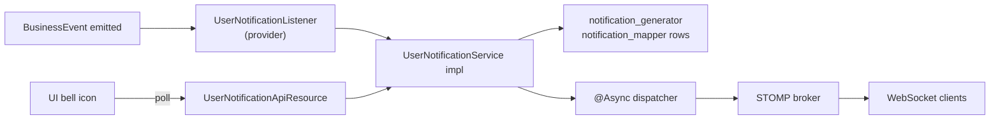
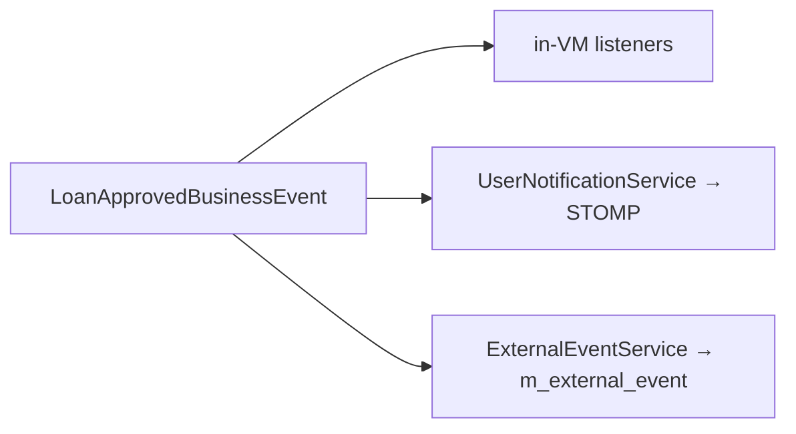

The `notification/` subtree in `fineract-core` is intentionally tiny — two files, one DTO and one interface. It exists so any module can compile against the notification contract without dragging in the full runtime, which depends on a STOMP broker, websockets, an `@Async` thread pool, and the database tables that store unread state. This page documents both files and points at [notification overview](/notification/overview) for the runtime, the database model, and the STOMP/websocket plumbing.

<Note>
"Notifications" in Fineract are **in-product, per-user** messages — the bell icon in the UI, not email or SMS. Email/SMS go through the separate `EXECUTE_EMAIL` and `SEND_MESSAGES_TO_SMS_GATEWAY` jobs documented in [Jobs Overview](/jobs/overview).
</Note>

## Package layout

| File                                                              | Purpose                                              |
| ----------------------------------------------------------------- | ---------------------------------------------------- |
| `notification/data/NotificationData.java`                         | Wire-level DTO carrying one notification             |
| `notification/service/UserNotificationService.java`               | Public service contract — implemented in fineract-provider |

## `NotificationData` — the carrier

```java
// fineract-core/.../notification/data/NotificationData.java
@Data
@NoArgsConstructor
@Accessors(chain = true)
public class NotificationData implements Serializable {

    private static final long serialVersionUID = 1L;

    private Long id;
    private String objectType;          // CLIENT, LOAN, SAVINGSACCOUNT, ...
    private Long objectId;
    private String action;              // CREATE, APPROVE, DISBURSE, ...
    private Long actorId;
    private String content;             // human-readable text
    private boolean isRead;
    private boolean isSystemGenerated;
    private String tenantIdentifier;
    private String createdAt;           // ISO-8601 timestamp string
    private Long officeId;
    private Set<Long> userIds;          // recipients
}
```

The shape mirrors the `notification_mapper` / `notification_generator` JPA entities in `fineract-provider`, with two specifics:

- **`tenantIdentifier`** — included so the STOMP broker can route the message to the correct tenant topic without re-reading thread-local state.
- **`userIds`** — the set of recipient `AppUser.id`. The runtime publisher fans out one row in `notification_mapper` (the "inbox") per recipient.

`Serializable` is required because the runtime may push `NotificationData` onto an in-memory queue or message broker before persistence.

### Lombok-generated helpers

- `@Data` gives full getter/setter/`equals`/`hashCode`.
- `@Accessors(chain = true)` lets you write `new NotificationData().setObjectType("LOAN").setObjectId(42L).setContent("...");`.
- `@NoArgsConstructor` allows JSON deserialisation.

## `UserNotificationService` — the service interface

```java
// fineract-core/.../notification/service/UserNotificationService.java
public interface UserNotificationService {

    void notifyUsers(String permission,
                     String objectType,
                     Long objectIdentifier,
                     String notificationContent,
                     String eventType,
                     Long appUserId,
                     Long officeId);

    boolean hasUnreadUserNotifications(Long appUserId);

    void notifyUsers(NotificationData notificationData);
}
```

Three operations:

| Method                                                 | Use case                                                                                       |
| ------------------------------------------------------ | ---------------------------------------------------------------------------------------------- |
| `notifyUsers(permission, objectType, ...)`             | Lookup-then-fan-out: the runtime resolves every user who **holds** `permission` and pushes a row per user. Used by feature modules. |
| `hasUnreadUserNotifications(appUserId)`                | Cheap unread-count probe used by the UI's bell-icon polling endpoint.                          |
| `notifyUsers(NotificationData)`                        | Explicit fan-out: the caller already knows the recipient set (e.g. on a target group). The DTO carries `userIds`. |

The permission-based variant is the common case — feature services don't know who can see a given loan, so they ask the notification service to figure it out using the permission rules in `m_role_permission` / `m_appuser_role`.

## Typical emission

```java
@Service
@RequiredArgsConstructor
public class LoanApprovalNotifierListener {

    private final UserNotificationService notifier;

    @PostConstruct
    void register() { /* register a BusinessEventListener for LoanApprovedBusinessEvent */ }

    public void onApproved(LoanApprovedBusinessEvent event) {
        Loan loan = event.get();
        notifier.notifyUsers(
            "READ_LOAN",                                       // permission
            "LOAN",                                            // objectType
            loan.getId(),                                      // objectIdentifier
            "Loan #" + loan.getId() + " was approved",         // content
            LoanApprovedBusinessEvent.TYPE,                    // eventType
            loan.getOfficeId(),                                // (officeId — varies)
            loan.getId()
        );
    }
}
```

The implementation (`UserNotificationServiceImpl` in `fineract-provider`) sits between the in-process [business event bus](/core/event-business) and the STOMP broker. It listens for events, builds `NotificationData`, persists the inbox rows, and pushes a websocket message to every connected recipient.

## Runtime architecture (overview)



## Why only DTO + interface in core

`fineract-core` must compile without:

- a websocket dependency (some deployments embed Fineract in a non-Spring context),
- the STOMP broker classes,
- `@Async` configuration,
- the `notification_generator` / `notification_mapper` JPA entities (so deployments that don't need the bell-icon feature can omit them).

By exposing only the carrier and the interface here, feature modules can declare `notifier.notifyUsers(...)` and Spring DI sorts out which implementation (if any) is on the classpath. Deployments that turn off the runtime get a no-op implementation registered as a fallback bean.

## Wire format

When `NotificationData` is serialized to JSON for the STOMP message:

```json
{
  "id": 12345,
  "objectType": "LOAN",
  "objectId": 4711,
  "action": "APPROVE",
  "actorId": 7,
  "content": "Loan #4711 was approved",
  "isRead": false,
  "isSystemGenerated": false,
  "tenantIdentifier": "default",
  "createdAt": "2024-08-12T09:30:00Z",
  "officeId": 1,
  "userIds": [22, 25, 31]
}
```

Note `createdAt` is a string — the DTO doesn't use `OffsetDateTime` to keep it dependency-free across modules.

## Connection between notification, business events, and external events

| Layer                          | Audience                | Durability         |
| ------------------------------ | ----------------------- | ------------------ |
| **Notifications** (this page)  | Individual user inboxes | DB rows + transient STOMP push |
| **Business events**            | In-process listeners    | None (transactional, in-VM)    |
| **External events**            | Downstream systems      | `m_external_event` outbox + broker |

A single domain action (loan approval) can fan out across all three:



## Cross-references

<CardGroup cols={2}>
  <Card title="Notification Runtime" icon="bell" href="/notification/overview">
    Provider-side implementation, STOMP topics, websocket auth, DB schema.
  </Card>
  <Card title="Business Events" icon="bolt" href="/core/event-business">
    The in-process source most notifications listen to.
  </Card>
  <Card title="External Events" icon="globe" href="/core/event-external">
    Durable downstream channel — used when consumers must receive every fact regardless of who is online.
  </Card>
  <Card title="Users Domain" icon="user" href="/core/useradministration-domain">
    `AppUser`, `Permission` — used to resolve "who should see this notification?".
  </Card>
</CardGroup>
