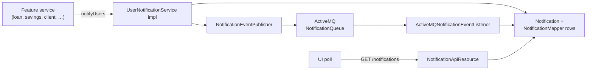
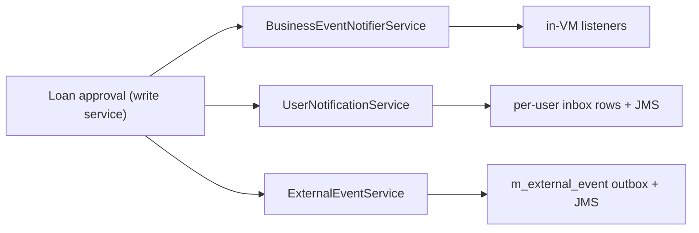

The notification subtree in `fineract-core` is intentionally tiny — two files, one DTO and one service interface. It exists so any module can compile against the in-product notification contract without dragging in the full runtime, which depends on ActiveMQ, an `@Async` thread pool, and the database tables that store unread state. This page documents both files and points at [notification overview](/notification/overview) for the runtime, the database model, and the JMS plumbing.

<Note>
"Notifications" in Fineract are **in-product, per-user** messages — the bell-icon-style inbox that the UI polls, not email or SMS. Email/SMS go through the separate `EXECUTE_EMAIL` and `SEND_MESSAGES_TO_SMS_GATEWAY` jobs and the `m_sms_messages` / `m_email_messages` tables — none of which depend on what's documented here.
</Note>

## Where the files actually live

Despite the rest of the framework living under `org.apache.fineract.infrastructure.*`, the notification carrier and service contract sit at the top of the package tree:

| File                                                                                                  | Purpose                                                                          |
| ----------------------------------------------------------------------------------------------------- | -------------------------------------------------------------------------------- |
| `fineract-core/src/main/java/org/apache/fineract/notification/data/NotificationData.java`             | Wire-level DTO carrying one notification                                         |
| `fineract-core/src/main/java/org/apache/fineract/notification/service/UserNotificationService.java`   | Public service contract — implemented in `fineract-provider`                     |

Everything else in the notification feature — the JPA entities, repositories, JMS publishers/listeners, REST resource, read services — lives in `fineract-provider/src/main/java/org/apache/fineract/notification/**`.

## `NotificationData` — the carrier

```java
// fineract-core/src/main/java/org/apache/fineract/notification/data/NotificationData.java
package org.apache.fineract.notification.data;

import java.io.Serializable;
import java.util.Set;
import lombok.Data;
import lombok.NoArgsConstructor;
import lombok.experimental.Accessors;

@Data
@NoArgsConstructor
@Accessors(chain = true)
public class NotificationData implements Serializable {

    private static final long serialVersionUID = 1L;

    private Long id;
    private String objectType;          // CLIENT, LOAN, SAVINGSACCOUNT, ...
    private Long objectId;
    private String action;              // CREATE, APPROVE, DISBURSE, ...
    private Long actorId;
    private String content;             // human-readable text
    private boolean isRead;
    private boolean isSystemGenerated;
    private String tenantIdentifier;
    private String createdAt;           // ISO-8601 timestamp string
    private Long officeId;
    private Set<Long> userIds;          // recipients
}
```

The shape mirrors the `Notification` and `NotificationMapper` JPA entities in `fineract-provider`. Two fields deserve attention:

- **`tenantIdentifier`** — included so an ActiveMQ consumer running on a different node can resolve the tenant context before persisting the inbox rows. Without it, the consumer can't pick a `RoutingDataSource` to write into.
- **`userIds`** — the resolved set of recipient `AppUser.id`. The runtime fans this out into one row per recipient in `NotificationMapper` (the "inbox"). When `userIds` is empty on the source side, the runtime resolves it from the permission name.

`Serializable` is required because the DTO is shipped through `JmsTemplate.send(...)` as an `ObjectMessage`.

### Lombok-generated helpers

- `@Data` gives full getters/setters, `equals`, `hashCode`, and `toString`.
- `@Accessors(chain = true)` makes setters return `this`, enabling fluent construction:
  ```java
  NotificationData d = new NotificationData()
      .setObjectType("LOAN")
      .setObjectId(42L)
      .setContent("Loan approved");
  ```
- `@NoArgsConstructor` keeps Jackson/JMS deserialisation happy.

There are no static factory methods on the DTO — callers either set fields directly or use the `UserNotificationService.notifyUsers(permission, ...)` convenience overload that builds the object for them.

## `UserNotificationService` — the service interface

```java
// fineract-core/src/main/java/org/apache/fineract/notification/service/UserNotificationService.java
package org.apache.fineract.notification.service;

import org.apache.fineract.notification.data.NotificationData;

public interface UserNotificationService {

    void notifyUsers(String permission, String objectType, Long objectIdentifier,
            String notificationContent, String eventType,
            Long appUserId, Long officeId);

    boolean hasUnreadUserNotifications(Long appUserId);

    void notifyUsers(NotificationData notificationData);
}
```

Three operations:

| Method                                                 | Use case                                                                                       |
| ------------------------------------------------------ | ---------------------------------------------------------------------------------------------- |
| `notifyUsers(permission, objectType, ...)`             | Lookup-then-fan-out: the runtime resolves every user who holds `permission` and inserts a row per user. Used by feature modules that don't know the recipient set up front. |
| `hasUnreadUserNotifications(appUserId)`                | Cheap unread-presence probe used by the UI's polling endpoint.                                 |
| `notifyUsers(NotificationData)`                        | Explicit fan-out: the caller already knows the recipient set (e.g. on a target group). The DTO carries `userIds`. |

The permission-based variant is the common case — feature services don't know who can see a given loan, so they ask the notification service to resolve recipients from the permission rules in `m_role_permission` / `m_appuser_role`.

## Typical emission

Feature code never builds the DTO directly when it can avoid it; it calls the permission-based overload:

```java
@Service
@RequiredArgsConstructor
class LoanApprovalNotifier {

    private final UserNotificationService notifier;

    public void onApproved(Loan loan, Long actorId) {
        notifier.notifyUsers(
            "READ_LOAN",                                       // permission
            "LOAN",                                            // objectType
            loan.getId(),                                      // objectIdentifier
            "Loan #" + loan.getId() + " was approved",         // content
            "APPROVE",                                         // eventType / action
            actorId,                                           // appUserId (the actor)
            loan.getOfficeId());
    }
}
```

The provider-side implementation (`NotificationDomainServiceImpl` and friends in `fineract-provider/.../notification/service/`) resolves the recipient set from the permission name, builds `NotificationData`, persists `Notification` + per-recipient `NotificationMapper` rows, and asks the configured `NotificationEventPublisher` to broadcast the DTO.

## Runtime architecture



The publisher has two interchangeable implementations selected by Spring profile:

- `SpringNotificationEventPublisher` (`@Profile("!activeMqEnabled")`) — fires a Spring `ApplicationEvent` handled in-process by `SpringNotificationEventListener`.
- `ActiveMQNotificationEventPublisher` (`@Profile("activeMqEnabled")`) — pushes an `ObjectMessage` containing `NotificationData` onto an `ActiveMQQueue("NotificationQueue")`; `ActiveMQNotificationEventListener` consumes from the same queue.

Both implementations live in `fineract-provider/.../notification/eventandlistener/` and are gated by `EnableFineractEventsCondition`, so a deployment can disable in-product notifications entirely by setting `fineract.events.notifications.enabled=false`.

## Why only DTO + interface in core

`fineract-core` must compile and run without:

- an ActiveMQ broker (most embedded test setups don't have one),
- the Spring JMS dependency,
- `@Async` configuration,
- the `notification` / `notification_mapper` JPA entities (so deployments that don't need the bell-icon feature can omit them).

By exposing only the carrier and the interface here, feature modules can call `notifier.notifyUsers(...)` and Spring DI resolves the implementation at runtime. Deployments that turn off the runtime get the no-op fallback (`fineract.events.notifications.enabled=false` short-circuits the publisher).

## Wire format

When `NotificationData` is JMS-serialized as an `ObjectMessage` (or marshalled to JSON by `NotificationApiResource`), the shape is:

```json
{
  "id": 12345,
  "objectType": "LOAN",
  "objectId": 4711,
  "action": "APPROVE",
  "actorId": 7,
  "content": "Loan #4711 was approved",
  "isRead": false,
  "isSystemGenerated": false,
  "tenantIdentifier": "default",
  "createdAt": "2024-08-12T09:30:00Z",
  "officeId": 1,
  "userIds": [22, 25, 31]
}
```

Note `createdAt` is a `String` — the DTO deliberately avoids `OffsetDateTime` to keep it free of Jackson `JavaTimeModule` assumptions across modules and to survive a round-trip through a JMS `ObjectMessage` on JREs that disagree about `java.time` serialisation.

## Relationship to business events and external events

A single domain action (loan approval) typically fans out across three independent channels:

| Layer                          | Audience                | Durability                              |
| ------------------------------ | ----------------------- | --------------------------------------- |
| **Notifications** (this page)  | Individual user inboxes | DB rows + transient JMS push            |
| **Business events**            | In-process listeners    | None — transactional, in-VM             |
| **External events**            | Downstream systems      | `m_external_event` outbox + JMS         |



Notifications care about *people*; business events care about *in-process listeners*; external events care about *downstream consumers*. The three are produced independently from the write service — none subscribes to the other.

## Cross-references

<CardGroup cols={2}>
  <Card title="Notification Runtime" icon="bell" href="/notification/overview">
    Provider-side implementation, ActiveMQ wiring, REST resource, DB schema.
  </Card>
  <Card title="Business Events" icon="bolt" href="/core/event-business">
    The in-process bus most domain emissions flow through.
  </Card>
  <Card title="External Events" icon="globe" href="/core/event-external">
    Durable downstream channel — used when consumers must receive every fact regardless of who is online.
  </Card>
  <Card title="Users Domain" icon="user" href="/core/useradministration-domain">
    `AppUser`, `Permission` — used to resolve "who should see this notification?".
  </Card>
</CardGroup>
