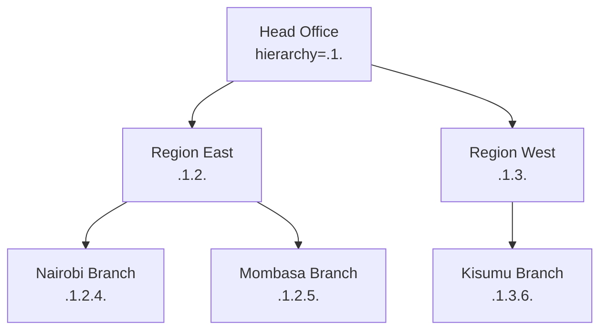

The `organisation/` subtree in `fineract-core` models the **financial institution** itself — branch tree, staff, currencies, holiday calendars, working-day rules, and provisioning categories. Every product transaction is anchored to an `Office` (for branch-level isolation), often tagged to a `Staff` member (the field officer), denominated in an `ApplicationCurrency`, and scheduled against `WorkingDays` and `Holiday` rules. This page is the reference index for those six packages.

<Note>
Unlike `portfolio/`, the organisation entities have **few subclasses or product-specific extensions** — the shapes you see here are exactly what is persisted. The runtime services (read APIs, validators, command handlers) live in `fineract-provider`.
</Note>

## Subpackage map

| Package                            | Role                                                       | Key entities / files                                                                  |
| ---------------------------------- | ---------------------------------------------------------- | ------------------------------------------------------------------------------------- |
| `organisation/office`              | Branch tree, audit, currency reference                     | `Office`, `OfficeRepository`, `OfficeRepositoryWrapper`                              |
| `organisation/staff`               | Employees that own loans / clients                         | `Staff`, `StaffOrganisationalRoleType`, `StaffEnumerations`                          |
| `organisation/monetary`            | Currencies the institution operates in                     | `ApplicationCurrency`, `OrganisationCurrency`, `MonetaryCurrency` (embeddable), `Money` |
| `organisation/holiday`             | Per-office holiday calendars + status enum                 | `Holiday`, `HolidayStatusType`, `RescheduleType`                                      |
| `organisation/workingdays`         | Weekly working-day pattern                                 | `WorkingDays`, `RepaymentRescheduleType`, `WorkingDaysEnumerations`                 |
| `organisation/provisioning`        | Loan loss provisioning categories                          | `ProvisioningCategoryData`, `ProvisioningCategoryReadPlatformService`               |

## `Office` — the branch tree

```java
@Entity
@Table(name = "m_office",
       uniqueConstraints = { @UniqueConstraint(columnNames = {"name"},        name = "name_org"),
                             @UniqueConstraint(columnNames = {"external_id"}, name = "externalid_org") })
public class Office extends AbstractPersistableCustom<Long> { /* ... */ }
```

Key columns (in code):

| Field            | Purpose                                                                |
| ---------------- | ---------------------------------------------------------------------- |
| `name`           | Unique display name (e.g. "Head Office", "Nairobi Branch")             |
| `nameDecorated`  | Pretty name with hierarchy decoration for UIs                          |
| `externalId`     | Stable external identifier (`ExternalId`)                              |
| `hierarchy`      | Materialised path like `.1.4.7.` — used everywhere for office scoping  |
| `parent`         | Self-FK to the parent office                                           |
| `openingDate`    | When the office opened — used for retro-active date validations        |
| `children`       | `@OneToMany` from `parent` for tree traversal                          |

`OfficeRepository` is the Spring Data interface; `OfficeRepositoryWrapper` adds null-safe finders that throw `OfficeNotFoundException`. The wrapper pattern is consistent across organisation entities.

`hierarchy` is **the** column to filter on for office-level access control. `PlatformSecurityContext.validateAccessRights(officeHierarchy)` compares the current user's hierarchy against the resource's — if the user's hierarchy is not a prefix of the resource's, access is denied. See [security services](/core/security-services).

Exceptions in the package:

- `CannotUpdateOfficeWithParentOfficeSameAsSelf` — a self-loop attempt.
- `RootOfficeParentCannotBeUpdated` — the root office must remain root.

## `Staff` — field officers and managers

```java
@Entity
@Table(name = "m_staff", uniqueConstraints = { /* display_name, external_id, mobile_no */ })
public class Staff extends AbstractPersistableCustom<Long> {

    @Column(name = "firstname", length = 50)         private String firstname;
    @Column(name = "lastname",  length = 50)         private String lastname;
    @Column(name = "display_name", length = 100)     private String displayName;
    @Column(name = "mobile_no", length = 50, nullable = false, unique = true) private String mobileNo;
    @ManyToOne @JoinColumn(name = "office_id")        private Office office;
    // is_loan_officer, is_active, joining_date, organisational_role_enum, ...
}
```

`StaffOrganisationalRoleType` enumerates the high-level roles used for reporting:

| Value | Constant                       |
| ----- | ------------------------------ |
| 100   | `PROGRAM_DIRECTOR`             |
| 200   | `BRANCH_MANAGER`               |
| 300   | `FIELD_OFFICER_COORDINATOR`    |
| 400   | `FIELD_OFFICER`                |

`StaffEnumerations` provides the EnumOptionData converter for API responses.

`isLoanOfficer` is the boolean that decides whether the staff member can be assigned to a loan. Loans reference `Staff` via `loan_officer_id`; reassigning fires a `LoanReassignOfficerBusinessEvent`.

## Monetary types

### `ApplicationCurrency` — the system-wide currency catalog

```java
@Entity
@Table(name = "m_currency")
public class ApplicationCurrency extends AbstractPersistableCustom<Long> {

    @Column(name = "code",                       nullable = false, length = 3)  private String code;       // ISO-4217
    @Column(name = "decimal_places",             nullable = false)              private Integer decimalPlaces;
    @Column(name = "currency_multiplesof")                                      private Integer inMultiplesOf;
    @Column(name = "name",                       nullable = false, length = 50) private String name;
    @Column(name = "internationalized_name_code",nullable = false, length = 50) private String nameCode;
    @Column(name = "display_symbol",             length = 10)                   private String displaySymbol;
}
```

System currency catalog seeded by Liquibase from ISO-4217. **Not** per-tenant — every tenant sees the same list.

### `OrganisationCurrency` — currencies enabled for this tenant

A subset of the catalog. Operators promote currencies into `m_organisation_currency` to make them available for products. The `OrganisationCurrencyRepositoryWrapper` enforces uniqueness and provides `findOneByCode(...)`.

### `MonetaryCurrency` — embeddable amount discriminator

```java
@Embeddable
public class MonetaryCurrency {
    @Column(name = "currency_code", length = 3, nullable = false) private String code;
    @Column(name = "currency_digits",            nullable = false) private int digitsAfterDecimal;
    @Column(name = "currency_multiplesof")                         private Integer inMultiplesOf;
}
```

Embedded into entities like `Loan`, `SavingsAccount`, `JournalEntry` so each row carries its own currency without an FK lookup. Loan products use it to pin a currency at creation.

### `Money` — amount value type

```java
public class Money implements Comparable<Money> {
    private final BigDecimal amount;
    private final CurrencyData currency;
    private final transient MathContext mc;

    public static Money of(CurrencyData currency, BigDecimal amount);
    public static Money zero(CurrencyData currency);
    public Money plus(Money other);
    public Money minus(Money other);
    public Money multipliedBy(BigDecimal factor);
    // ...
}
```

Immutable arithmetic helper. **All** product calculations must go through `Money` so the right `MathContext` and rounding rules are applied — multiplying raw `BigDecimal`s is a recipe for fractional-currency leaks. `MoneyHelper` provides convenient `roundingMode()` / `mathContext()` defaults configurable via `FineractProperties`.

## Holidays

```java
@Entity
@Table(name = "m_holiday", uniqueConstraints = @UniqueConstraint(columnNames = {"name", "from_date"}))
public class Holiday extends AbstractPersistableCustom<Long> { /* ... */ }
```

Fields include `name`, `description`, `fromDate`, `toDate`, `repaymentsRescheduledTo` (a `LocalDate` for explicit substitutes), `status` (`HolidayStatusType`), and a `@ManyToMany` to `Office` (each holiday applies to one or more branches).

`HolidayStatusType` lifecycle:

| Value | Constant      | Notes                                                |
| ----- | ------------- | ---------------------------------------------------- |
| 100   | `PENDING_FOR_ACTIVATION` | Created but not yet active            |
| 300   | `ACTIVE`      | Honoured by repayment scheduling                     |
| 400   | `DELETED`     | Soft-deleted                                          |
| 500   | `PROCESSED`   | Applied retroactively to existing schedules          |

`RescheduleType` is the enum used by the holiday APIs to specify which repayments-rescheduled rule applies (move to next working day, specific date, etc.).

## Working days

```java
@Entity
@Table(name = "m_working_days")
@FieldNameConstants
public class WorkingDays extends AbstractPersistableCustom<Long> {

    @Column(name = "recurrence")          private String recurrence;          // RFC 5545 RRULE
    @Column(name = "repayment_rescheduling_enum") private Integer repaymentReschedulingType;
    @Column(name = "extend_term_daily_repayments") private Boolean extendTermForDailyRepayments;
    // ...
}
```

Single row per tenant. `recurrence` is an iCalendar RRULE string that lists the working days of the week — e.g. `FREQ=WEEKLY;INTERVAL=1;BYDAY=MO,TU,WE,TH,FR`. The repayment scheduler reads it for every installment-due-date calculation.

### `RepaymentRescheduleType`

Decides what happens when a repayment falls on a non-working day:

| Value | Constant                                  | Effect                                                  |
| ----- | ----------------------------------------- | ------------------------------------------------------- |
| 1     | `SAME_DAY`                                | Keep the original date (just mark non-working)         |
| 2     | `MOVE_TO_NEXT_WORKING_DAY`                | Walk forward to next listed working day                 |
| 3     | `MOVE_TO_NEXT_REPAYMENT_MEETING_DAY`      | Use the JLG meeting day                                 |
| 4     | `MOVE_TO_PREVIOUS_WORKING_DAY`            | Walk backwards                                          |
| 5     | `MOVE_TO_NEXT_MEETING_DAY`                | Next centre meeting (broader than option 3)             |

`WorkingDaysEnumerations` provides the EnumOptionData adapter.

## Provisioning categories

Loan loss provisioning sorts overdue loans into named categories (e.g. "Standard", "Substandard", "Doubtful", "Loss"). The core ships the read/write platform services and DTOs:

| Class                                            | Purpose                                                                |
| ------------------------------------------------ | ---------------------------------------------------------------------- |
| `ProvisioningCategoryData`                       | Read DTO (`{ id, categoryName, description }`)                        |
| `ProvisioningCategoryReadPlatformService`        | Read interface returning the list of categories                       |
| `ProvisioningCategoryWritePlatformService`       | Write interface (create / update / delete)                            |
| `ProvisioningCriteriaWritePlatformService`       | Write interface for the criteria that map age-buckets to categories  |
| `exception/ProvisioningCategoryNotFoundException`| Lookup miss                                                            |

The category entity itself (`ProvisioningCategory`) and the criteria entities (`ProvisioningCriteria`, `ProvisioningCriteriaDefinitionData`) live in `fineract-provider` because the write-side validation pulls in heavier dependencies.

Used by the `GENERATE_LOANLOSS_PROVISIONING` job — see [Jobs Overview](/jobs/overview).

## Office hierarchy in action



A user assigned to `Region East` (hierarchy `.1.2.`) can access clients whose office hierarchy starts with `.1.2.` — both Nairobi and Mombasa, but not Kisumu. The check is a simple `LIKE` against the materialised path.

## Cross-currency notes

Each `Loan` and `SavingsAccount` row stores its `MonetaryCurrency` independently — a single tenant can run KES loans and USD loans side by side. Transfers between accounts in different currencies require an explicit FX rate; Fineract does not provide an FX engine in core, you wire one in via an extension.

`OrganisationCurrencyRepositoryWrapper.findOneByCode(...)` throws if the currency code isn't enabled for the tenant — a fast guard at command-validation time.

## Cross-references

<CardGroup cols={2}>
  <Card title="Portfolio Shared" icon="folder-tree" href="/core/portfolio-shared-domain">
    `Client`, `Group`, `Calendar`, `Charge`, and how they reference `Office`/`Staff`.
  </Card>
  <Card title="Accounting Shared" icon="calculator" href="/core/accounting-shared-domain">
    `GLAccount`, `JournalEntry`, `FinancialActivityAccount` — every entry is in an `Office` and a currency.
  </Card>
  <Card title="Security Services" icon="lock" href="/core/security-services">
    `validateAccessRights(officeHierarchy)` is how office isolation is enforced.
  </Card>
  <Card title="Users Domain" icon="user" href="/core/useradministration-domain">
    `AppUser.office`, hierarchy inheritance, and how it links to `Staff`.
  </Card>
</CardGroup>
