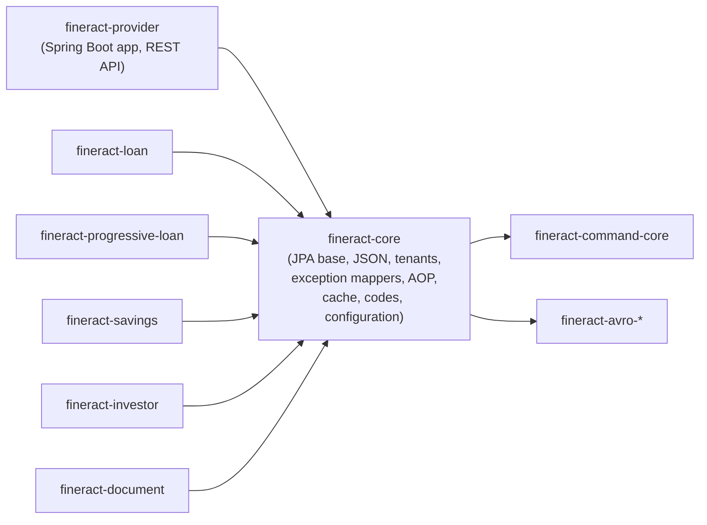

`fineract-core` is the Gradle module at the bottom of the Apache Fineract module
graph. Every other module (`fineract-loan`, `fineract-savings`,
`fineract-investor`, `fineract-progressive-loan`, `fineract-document`, and the
`fineract-provider` web application) compiles against it. It contains the
JPA base classes, the JSON command pipeline, the tenant‑aware routing
`DataSource`, JAX‑RS exception mappers, AOP aspects, shared domain primitives
(`ExternalId`, `FineractPlatformTenant`, `BusinessDate`), and the global
configuration / codes / data‑queries / cache / bulk‑import bootstrap APIs.

This page is the entry point for the `core/*` documentation set. Each subpage
dives into one package or concern; this one explains the module shape and the
top‑level Java packages it exports.

## What lives inside `fineract-core`

The module's Java root is `org.apache.fineract`. From there it owns these
top‑level packages:

| Package                                | Role                                                                                       |
| -------------------------------------- | ------------------------------------------------------------------------------------------ |
| `org.apache.fineract.accounting`       | Chart of accounts, journal entries, financial activity, accrual base types reused by lending and savings modules. |
| `org.apache.fineract.batch`            | Internal batch‑API request types (`BatchRequest`/`BatchResponse`) and the per‑request context used by `BatchRequestContextHolder`. |
| `org.apache.fineract.commands`         | Maker‑checker `CommandWrapper`, `CommandSource`, audit envelopes, and the command‑service interfaces used by every write resource. |
| `org.apache.fineract.infrastructure`   | Core platform plumbing: tenants, business dates, configuration, codes, cache, bulk import, data queries, security primitives, and the JSON / JPA / exception infrastructure detailed in this section. |
| `org.apache.fineract.interoperation`   | Inbound interop (Mojaloop / PHEE) DTOs and shared enums. |
| `org.apache.fineract.notification`     | Notification mappers, event types and persistence base for notifications. |
| `org.apache.fineract.organisation`     | Office, staff, holiday, working‑days, monetary, and currency domain shared across all products. |
| `org.apache.fineract.portfolio`        | Client/group/loan/savings shared domain — interest types, repayment strategies, charges, calendar primitives. |
| `org.apache.fineract.useradministration` | `AppUser`, `Role`, `Permission`, password policy, and the `AppUserRepository` consumed by `AuditorAwareImpl`. |
| `org.apache.fineract.util`             | Pure utility helpers (`MathUtil`, `StringUtil`, `DateUtils`, `JdbcSupport`) imported almost everywhere. |

The bulk of this documentation set focuses on `infrastructure.core`,
`infrastructure.businessdate`, `infrastructure.accountnumberformat`,
`infrastructure.bulkimport`, `infrastructure.codes`,
`infrastructure.configuration`, `infrastructure.cache` and
`infrastructure.dataqueries`. Domain packages (`portfolio`, `accounting`,
`organisation`, `useradministration`) are documented from the consuming modules.

## How `fineract-core` is consumed



Concretely, `fineract-core`:

- exposes [`AbstractPersistableCustom`](/core/persistence-and-jpa) and
  [`AbstractAuditableCustom`](/core/auditing-and-context) as the JPA superclasses
  every entity in the platform extends;
- ships the
  [`RoutingDataSource`](/core/datasource-tenant-routing) that resolves a
  `DataSource` per tenant before every request runs;
- provides the [`FromJsonHelper` / `JsonCommand`](/core/serialization-and-json)
  pipeline that maker‑checker handlers consume;
- exports the [JAX‑RS `ExceptionMapper`](/core/exception-mappers) set the
  Jersey container is auto‑wired with;
- bootstraps the cache catalog
  ([`PlatformCache`](/core/cache-infrastructure)),
  [global configuration](/core/configuration-properties),
  [codes](/core/codes), [business‑date](/core/business-date) state and
  [account‑number formats](/core/account-number-format);
- provides the [`ExternalId`](/core/external-id-and-identifiers) value object and
  its Gson adapter used in every API resource;
- declares the [`infrastructure.core.aop`,
  `infrastructure.core.component`, `infrastructure.core.condition`](/core/aop-and-component-scanning)
  hooks used by Spring auto‑configuration.

## Module relationships at runtime

<Steps>
  <Step title="Build classpath">
    Every module declares `api project(':fineract-core')` (or `implementation`)
    in its `build.gradle`. Generated Avro / OpenAPI clients sit in sibling
    modules but still depend on `fineract-core` for the JSON helpers.
  </Step>
  <Step title="Application context">
    `fineract-provider` is the Spring Boot launcher. Its
    `MainApplicationConfiguration` `@ComponentScan`s the
    `org.apache.fineract` root, so every `@Component`, `@Service`,
    `@Configuration` and `@Repository` declared in `fineract-core` joins the
    same context. Conditions in
    [`infrastructure.core.condition`](/core/aop-and-component-scanning) decide
    which beans actually instantiate (`liquibase-only`, instance‑mode flags,
    profile filters).
  </Step>
  <Step title="Persistence unit">
    A single `entityManagerFactory` is built around the
    [`RoutingDataSource`](/core/datasource-tenant-routing). Entities are
    discovered by package scan; the JPA scanner script
    `scripts/jpa-scanner-grouped.sh` enumerates every `@Entity`,
    `@MappedSuperclass` and `@Converter` across `fineract-core` and the leaf
    modules and is the canonical reference when adding new mapped classes.
  </Step>
  <Step title="Request handling">
    Jersey filters declared in `infrastructure.core.filters` (correlation
    header, batch request preprocessor, caller IP tracking, idempotency store)
    pre‑populate the `ThreadLocal` context held by
    [`ThreadLocalContextUtil`](/core/auditing-and-context). After that, every
    SQL statement issued via `RoutingDataSource` is routed to the tenant
    DataSource, and every JPA insert/update calls `AuditorAwareImpl` to
    populate the `createdBy`/`lastModifiedBy` columns.
  </Step>
</Steps>

## How the core pages relate

The remainder of this section is organised around the **subpackages** of
`org.apache.fineract.infrastructure.core` and the four `infrastructure.*`
catalog packages that live directly in `fineract-core`:

<CardGroup cols={2}>
  <Card title="infrastructure-core" href="/core/infrastructure-core">
    Exhaustive class inventory of `infrastructure/core/*` — what every package and class is for.
  </Card>
  <Card title="Serialization & JSON" href="/core/serialization-and-json">
    Gson plumbing — `FromJsonHelper`, `JsonCommand`, `DefaultToApiJsonSerializer`, `ApiRequestJsonSerializationSettings`.
  </Card>
  <Card title="Persistence & JPA" href="/core/persistence-and-jpa">
    `AbstractPersistableCustom`, EclipseLink static weaving, `ExtendedJpaTransactionManager`, `FlushModeHandler`.
  </Card>
  <Card title="Exception Mappers" href="/core/exception-mappers">
    Every `ExceptionMapper` in `infrastructure.core.exceptionmapper` and the HTTP status it returns.
  </Card>
  <Card title="Auditing & Context" href="/core/auditing-and-context">
    `AbstractAuditableCustom`, `AuditorAwareImpl`, `ThreadLocalContextUtil`, `FineractContext`, batch context holder.
  </Card>
  <Card title="ExternalId & Identifiers" href="/core/external-id-and-identifiers">
    `ExternalId`, `ExternalIdFactory`, `ExternalIdAdapter`, validation rules.
  </Card>
  <Card title="DataSource & Tenant Routing" href="/core/datasource-tenant-routing">
    `RoutingDataSource`, `DataSourcePerTenantServiceFactory`, `JdbcTenantDetailsService`.
  </Card>
  <Card title="Cache Infrastructure" href="/core/cache-infrastructure">
    `PlatformCache`, `RuntimeDelegatingCacheManager`, `CacheApiResource`, cache type enum.
  </Card>
  <Card title="AOP & Component Scanning" href="/core/aop-and-component-scanning">
    `FlushModeAspect`, `@WithFlushMode`, conditional beans, `FineractProfiles`.
  </Card>
  <Card title="Business Date" href="/core/business-date">
    `BusinessDate` entity, `BUSINESS_DATE` vs `COB_DATE`, command handler and jobs that mutate it.
  </Card>
  <Card title="Account Number Format" href="/core/account-number-format">
    `AccountNumberFormat`, `EntityAccountType`, `AccountNumberPrefixType`, `AccountNumberGeneratorService`.
  </Card>
  <Card title="Bulk Import" href="/core/bulkimport">
    Excel / POI ingestion pipeline. Every `*ImportHandler`, populator and constants class.
  </Card>
  <Card title="Codes" href="/core/codes">
    `Code` and `CodeValue` entities, system‑defined codes, `CodesApiResource`.
  </Card>
  <Card title="Configuration Properties" href="/core/configuration-properties">
    `GlobalConfigurationProperty` and the catalog of flags it persists.
  </Card>
  <Card title="Data Queries" href="/core/dataqueries">
    `Report`, `RegisteredTable`, datatable concepts (runtime is in fineract‑provider).
  </Card>
</CardGroup>

## How `fineract-core` integrates with sibling pillars

`fineract-core` is the seam between the platform's other architectural pillars
documented in the wiki. Each of those pillars has its own overview page that
cross‑references the specific `core/*` types involved:

<CardGroup cols={2}>
  <Card title="Database overview" href="/database/overview">
    Liquibase changelogs, table catalog, MySQL vs PostgreSQL specifics — the
    schema that `RoutingDataSource` and `AbstractPersistableCustom` map onto.
  </Card>
  <Card title="Tenancy overview" href="/tenancy/overview">
    Per‑tenant DataSource resolution, `fineract_tenants` database, tenant
    identifier propagation and the `JdbcTenantDetailsService` cache.
  </Card>
  <Card title="Command pipeline overview" href="/command/overview">
    Maker‑checker flow: how a JAX‑RS resource builds a `JsonCommand`, how
    `CommandSource` persists it, and how handlers consume it.
  </Card>
  <Card title="Jobs overview" href="/jobs/overview">
    Spring Batch jobs and the COB / business‑date pipeline that mutates the
    `BusinessDate` rows owned by `fineract-core`.
  </Card>
</CardGroup>

## Source‑level orientation

When you open the source tree on disk:

```text
fineract-core/
├── build.gradle
└── src/main/java/org/apache/fineract/
    ├── accounting/              # shared chart of accounts / journal entries
    ├── batch/                   # internal batch DTOs
    ├── commands/                # CommandWrapper, CommandSource, ...
    ├── infrastructure/
    │   ├── DataIntegrityErrorHandler.java
    │   ├── accountnumberformat/
    │   ├── bulkimport/          # subset (api + handlers live in provider)
    │   ├── businessdate/
    │   ├── cache/
    │   ├── codes/
    │   ├── configuration/
    │   ├── core/                # the bulk of this section's docs
    │   │   ├── annotation/
    │   │   ├── aop/
    │   │   ├── api/
    │   │   ├── boot/
    │   │   ├── component/
    │   │   ├── condition/
    │   │   ├── config/
    │   │   ├── data/
    │   │   ├── diagnostics/
    │   │   ├── domain/
    │   │   ├── exception/
    │   │   ├── exceptionmapper/
    │   │   ├── filters/
    │   │   ├── jersey/
    │   │   ├── jpa/
    │   │   ├── logging/
    │   │   ├── persistence/
    │   │   ├── serialization/
    │   │   ├── service/
    │   │   └── validator/
    │   ├── dataqueries/
    │   └── security/            # password encryptor, SQL validators
    ├── interoperation/
    ├── notification/
    ├── organisation/
    ├── portfolio/
    ├── useradministration/
    └── util/
```

The cross‑module rule is simple: anything that needs to be shared across
loan, savings, accounting, batch jobs, the REST API and worker JVMs lives in
`fineract-core`. Anything that is product‑specific lives in the matching leaf
module (`fineract-loan`, `fineract-savings`, …).

<Tip>
When you add a new shared abstraction — a new audit base class, a new tenant
context attribute, a new Gson adapter — it belongs in `fineract-core`. Do not
introduce upward dependencies from `fineract-core` into `fineract-provider`;
the build will fail because `fineract-provider` is not on the `fineract-core`
classpath.
</Tip>
