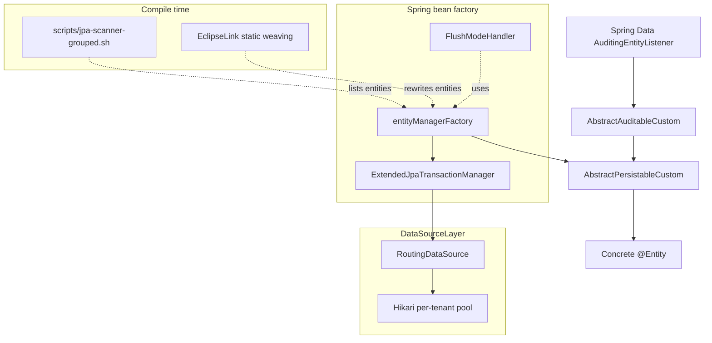

Apache Fineract uses JPA over EclipseLink for every persisted entity. The
`org.apache.fineract.infrastructure.core.persistence`,
`infrastructure.core.domain`, `infrastructure.core.aop` and
`infrastructure.core.annotation` packages provide the shared base classes,
transaction manager extensions and flush‑mode aspect that the rest of the
platform's `@Entity` types rely on. This page is the reference for that JPA
plumbing.

## The two abstract base classes

Every JPA entity in the platform extends one of two `@MappedSuperclass`es from
`infrastructure.core.domain`:

### `AbstractPersistableCustom<T>`

The foundation. Identical in shape to Spring Data JPA's
`AbstractPersistable`, but parameterised on the ID type (almost always
`Long`) and using `GenerationType.IDENTITY` to align with MySQL/PostgreSQL
auto‑increment / serial behaviour. The non‑obvious detail is the
`isNew` flag and the `@PrePersist @PostLoad` callback — it lets
`Persistable.isNew()` return `true` only before insertion, regardless of
whether the entity has an ID assigned.

```java
@MappedSuperclass
@Getter @Setter @NoArgsConstructor
public abstract class AbstractPersistableCustom<T extends Serializable>
        implements Persistable<T>, Serializable {

    @Id
    @GeneratedValue(strategy = GenerationType.IDENTITY)
    @Getter
    private T id;

    @Transient
    @Setter(value = AccessLevel.NONE)
    @Getter
    private boolean isNew = true;

    @PrePersist
    @PostLoad
    void markNotNew() {
        this.isNew = false;
    }
}
```

<Warning>
The class deliberately does **not** override `equals(Object)` / `hashCode()`.
The header comment is explicit: "we end up with issues on OpenJPA". Entities
that need equality semantics implement it themselves on a stable natural key.
</Warning>

### `AbstractAuditableCustom`

Extends `AbstractPersistableCustom<Long>` and implements Spring Data's
`Auditable<Long, Long, LocalDateTime>`. Adds the four classical audit columns:

```java
@Column(name = "createdby_id")
private Long createdBy;

@Column(name = "created_date")
private LocalDateTime createdDate;

@Column(name = "lastmodifiedby_id")
private Long lastModifiedBy;

@Column(name = "lastmodified_date")
private LocalDateTime lastModifiedDate;
```

Spring Data's `AuditingEntityListener` (enabled in
`fineract-provider`'s persistence configuration) populates these from the
`AuditorAwareImpl` documented in [auditing & context](/core/auditing-and-context).

### `AbstractAuditableWithUTCDateTimeCustom<T>`

Same shape but with `OffsetDateTime` UTC columns:

```java
@Column(name = CREATED_BY_DB_FIELD, updatable = false, nullable = false)
private Long createdBy;

@Column(name = CREATED_DATE_DB_FIELD, updatable = false, nullable = false)
private OffsetDateTime createdDate;

@Column(name = LAST_MODIFIED_BY_DB_FIELD, nullable = false)
private Long lastModifiedBy;

@Column(name = LAST_MODIFIED_DATE_DB_FIELD, nullable = false)
private OffsetDateTime lastModifiedDate;
```

Column names come from `AuditableFieldsConstants`: `createdby_id`,
`created_on_utc`, `lastmodifiedby_id`, `lastmodified_on_utc`. Entities that
use this base class store TZ‑aware timestamps and rely on JDBC drivers'
`OffsetDateTime` mapping — the driver converts to UTC at write time and the
DB column type is `TIMESTAMP WITH TIME ZONE` on PostgreSQL or
`TIMESTAMP(6)` on MySQL with UTC normalisation handled in code. `BusinessDate`,
the idempotency rows and the platform's COB tracking tables all extend this
class.

| Base class | Created/Modified type | Use when |
| --- | --- | --- |
| `AbstractPersistableCustom<T>` | none | Entity does not need audit columns. |
| `AbstractAuditableCustom` | `LocalDateTime` | Classic Mifos‑era columns `created_date` / `lastmodified_date`. |
| `AbstractAuditableWithUTCDateTimeCustom<T>` | `OffsetDateTime` | Newer tables — anything created since the UTC‑audit migration. |

## EclipseLink static weaving

The build runs the **EclipseLink static weaving** Gradle task at compile
time. This rewrites every `@Entity` class to add EclipseLink's lazy‑loading
proxies, change‑tracking hooks and indirect collection wrappers before the
JAR is packaged.

Practical consequences:

- `@OneToMany(fetch = FetchType.LAZY)` works without a runtime agent.
- Change tracking is on, so the EntityManager only flushes the columns that
  actually changed when an entity is dirtied.
- Decompiled class files show synthetic `_persistence_*` fields — that is
  expected and should be left alone.
- The Gradle task name is `compileJava` plus a follow‑on `staticWeave` step
  applied to each module's `main` source set.

When you add a new `@Entity`, no manual registration is required — the weaver
scans the compile output. **However** the persistence unit also needs to know
about the class via the JPA scanner. Use the bundled script:

```bash
# from repo root
./scripts/jpa-scanner-grouped.sh
```

It walks `fineract-core/src/main/java` and the leaf modules
(`fineract-loan`, `fineract-savings`, `fineract-progressive-loan`,
`fineract-investor`, `fineract-document`) looking for `@Entity`,
`@MappedSuperclass` and `@Converter`, groups them by package, and prints the
result. The output is the canonical list of mapped classes that the
persistence unit must include. Drop in new entities and re‑run the script to
confirm they were picked up.

## `DatabaseSelectingPersistenceUnitPostProcessor`

EclipseLink needs to know whether it is talking to MySQL or PostgreSQL — the
`eclipselink.target-database` property selects the SQL dialect. Fineract sets
this **at persistence‑unit build time**, not via `persistence.xml`, so the
runtime DB type can be detected from the JDBC URL.

```java
public class DatabaseSelectingPersistenceUnitPostProcessor implements PersistenceUnitPostProcessor {

    private static final Map<DatabaseType, String> TARGET_DATABASE_MAP = Map.of(
            DatabaseType.MYSQL,      TargetDatabase.MySQL,
            DatabaseType.POSTGRESQL, TargetDatabase.PostgreSQL);

    private final DatabaseTypeResolver databaseTypeResolver;

    @Override
    public void postProcessPersistenceUnitInfo(MutablePersistenceUnitInfo pui) {
        DatabaseType databaseType = databaseTypeResolver.databaseType();
        String targetDatabase = TARGET_DATABASE_MAP.get(databaseType);
        if (targetDatabase == null) {
            throw new IllegalStateException("Unsupported database: " + databaseType);
        }
        pui.addProperty(PersistenceUnitProperties.TARGET_DATABASE, targetDatabase);
    }
}
```

The post‑processor is registered with the
`LocalContainerEntityManagerFactoryBean` in `fineract-provider`'s
`JPAConfig`. `DatabaseTypeResolver` reads the active JDBC URL on the tenant
master pool and returns `DatabaseType.MYSQL` or `DatabaseType.POSTGRESQL`.

## `ExtendedJpaTransactionManager`

The platform replaces Spring's `JpaTransactionManager` with an extended
version that adds two behaviours:

1. **Read‑only flush mode**: when the active transaction is `readOnly = true`
   (or the underlying JDBC `Connection.isReadOnly()` returns `true`), the
   `EntityManager` flush mode is forced to `FlushModeType.COMMIT` on begin
   and the persistence context is `clear()`‑ed on commit. This prevents
   accidental DML from leaking through a read replica and avoids dirty
   checking on a read path.
2. **Lifecycle callbacks**: `TransactionLifecycleCallback` beans receive
   `afterBegin`, `afterCommit`, `afterCompletion` notifications. This is the
   hook batch jobs and audit infrastructure use to flush MDC, propagate
   `FineractContext` and reset thread‑local state.

```java
public class ExtendedJpaTransactionManager extends JpaTransactionManager {

    private final List<TransactionLifecycleCallback> lifecycleCallbacks = new CopyOnWriteArrayList<>();

    public ExtendedJpaTransactionManager() {
        setValidateExistingTransaction(true);
    }

    @Override
    protected void doBegin(Object transaction, TransactionDefinition definition) {
        super.doBegin(transaction, definition);
        if (isReadOnlyConnection() || isReadOnlyTx(transaction)) {
            EntityManager entityManager = getCurrentEntityManager();
            if (entityManager != null) {
                entityManager.setFlushMode(FlushModeType.COMMIT);
            }
        }
        invokeLifecycleCallbacks(TransactionLifecycleCallback::afterBegin);
    }

    @Override
    protected void doCommit(DefaultTransactionStatus status) {
        if (isReadOnlyConnection() || isReadOnlyTx(status.getTransaction())) {
            EntityManager entityManager = getCurrentEntityManager();
            if (entityManager != null) {
                entityManager.clear();
            }
        }
        super.doCommit(status);
        invokeLifecycleCallbacks(TransactionLifecycleCallback::afterCommit);
    }
    // ...
}
```

The class also calls `setValidateExistingTransaction(true)`, which makes
Spring complain when a method enters a transaction with incompatible
read‑only / isolation settings — a defensive choice that catches bugs where
a `@Transactional(readOnly = true)` service is wrapped in a writable parent
transaction.

### `TransactionLifecycleCallback`

```java
public interface TransactionLifecycleCallback {
    default void afterBegin() {}
    default void afterCommit() {}
    default void afterCompletion() {}
}
```

Implementations live across `fineract-provider` and the batch modules. The
list is wired in by the configuration that constructs the
`ExtendedJpaTransactionManager` bean via
`setLifecycleCallbacks(List<TransactionLifecycleCallback>)` — the registry is
immutable for the life of the bean. To add a new callback, declare a
`@Component` (or `@Bean`) that implements the interface and update the
configuration that owns the transaction manager to include it in the list.

## `FlushModeHandler` and `@WithFlushMode`

The combination of the `@WithFlushMode` annotation and the
`FlushModeHandler` bean is how the platform lets specific methods opt into a
non‑default flush mode without leaking state.

```java
@Component
public class FlushModeHandler {

    @PersistenceContext
    private EntityManager entityManager;

    public <T> T withFlushMode(FlushModeType flushMode, Supplier<T> supplier) {
        FlushModeType original = entityManager.getFlushMode();
        try {
            entityManager.setFlushMode(flushMode);
            return supplier.get();
        } finally {
            entityManager.setFlushMode(original);
        }
    }

    public void withFlushMode(FlushModeType flushMode, Runnable runnable) {
        withFlushMode(flushMode, () -> { runnable.run(); return null; });
    }
}
```

The `@WithFlushMode` annotation:

```java
@Target({ ElementType.METHOD, ElementType.TYPE })
@Retention(RetentionPolicy.RUNTIME)
public @interface WithFlushMode {
    FlushModeType value() default FlushModeType.AUTO;
}
```

And the aspect that bridges them — `FlushModeAspect` — runs at
`Ordered.LOWEST_PRECEDENCE` so it executes **inside** the transaction
already opened by `@Transactional`. If there is no active transaction the
aspect logs a debug warning and proceeds without changing the flush mode
(setting it would be a no‑op anyway). When a transaction is present it
delegates to `FlushModeHandler.withFlushMode(...)`.

Use cases:

| Annotation | When to use |
| --- | --- |
| `@WithFlushMode(FlushModeType.COMMIT)` | Long read methods that should not trigger spurious flushes between queries (loan schedule recomputation, bulk read paths). |
| `@WithFlushMode(FlushModeType.AUTO)` | Restore default behaviour explicitly for a sub‑section of a method that otherwise lives in a class annotated `COMMIT`. |

## Repositories

The platform follows a `Repository` + `RepositoryWrapper` pattern. The
`Repository` extends Spring Data's `JpaRepository<Entity, ID>` and exposes
the standard derived/JPQL methods. The `RepositoryWrapper` is a
`@Service` that adds the "find or throw" variants used by handlers — for
example `findOneWithNotFoundDetection(id)` throws
`AbstractPlatformResourceNotFoundException` when the row is missing, which is
then mapped to `404` by
[`PlatformResourceNotFoundExceptionMapper`](/core/exception-mappers).

`CriteriaQueryFactory` in `infrastructure.core.jpa` is a tiny façade around
`EntityManager.getCriteriaBuilder()` used by handlers that need
type‑safe dynamic queries.

## Transaction defaults across the platform

- **Read services** are `@Transactional(readOnly = true)` and benefit from
  the `FlushModeType.COMMIT` switch.
- **Write services** are `@Transactional` with default propagation
  (`REQUIRED`). Inside the batch API, `BatchRequestContextHolder` may install
  an enclosing transaction so the per‑sub‑request services join it instead
  of opening their own.
- **Idempotent commands** rely on `@Transactional(propagation =
  REQUIRES_NEW)` to ensure the idempotency row commits separately from the
  business operation.

## Putting it all together



## Related pages

<CardGroup cols={2}>
  <Card title="Auditing & context" href="/core/auditing-and-context">
    How `AuditorAwareImpl` populates the audit columns from the security context.
  </Card>
  <Card title="DataSource & tenant routing" href="/core/datasource-tenant-routing">
    The `RoutingDataSource` that `ExtendedJpaTransactionManager` wraps.
  </Card>
  <Card title="AOP & component scanning" href="/core/aop-and-component-scanning">
    `FlushModeAspect`, conditions and the rest of the AOP layer.
  </Card>
  <Card title="Database overview" href="/database/overview">
    Schema-level view: tables, indexes, vendor differences.
  </Card>
</CardGroup>
