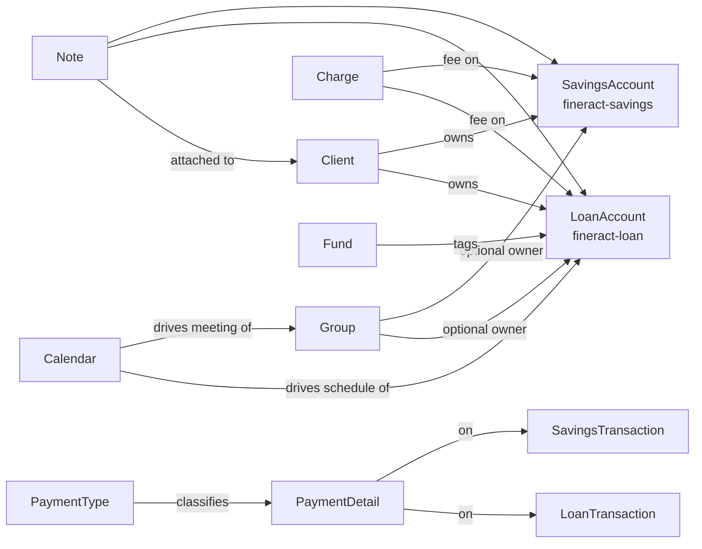

The `portfolio/` package in `fineract-core` is the **shared substrate** every Fineract product builds on: the product-type enum that disambiguates loans from savings from shares, the credit/debit `TransactionEntryType`, and the JPA entities that model clients, groups, calendars, charges, payment details, funds, and the rest of the cross-product domain. Loan and savings runtimes live in their own modules (`fineract-loan`, `fineract-savings`) and consume these core types. This page is an **index**: it lists every subpackage with a one-line role and a key class, with deep dives in the per-product pages.

<Note>
"Shared" here means "used by more than one product" — `Client`, `Calendar`, `PaymentDetail`, `Charge` show up across loans, savings, and accounting. Per-product specifics (loan repayment schedule, savings deposit account on hold rules) live with their product module, not in core.
</Note>

## Top-level enums

### `PortfolioProductType`

```java
public enum PortfolioProductType {
    LOAN(1, "productType.loan"),
    SAVING(2, "productType.saving"),
    CLIENT(5, "productType.client"),
    PROVISIONING(3, "productType.provisioning"),
    SHARES(4, "productType.shares");

    public boolean isSavingProduct();
    public boolean isLoanProduct();
    public boolean isClient();
    public boolean isShareProduct();
}
```

The product discriminator embedded everywhere a polymorphic FK is needed — e.g. `m_portfolio_account_associations`, `m_external_event` filtering, charge product mappings. Note the **gap between 2 (SAVING) and 5 (CLIENT)**: `3` is `PROVISIONING` and `4` is `SHARES`. New product types must pick the next free integer and ship a Liquibase changelog updating any lookup tables.

<Warning>
`PortfolioProductType.toString()` is `name().replace("_", " ")`, **not** the `code`. Use `getCode()` for translation lookups and `name()` for stable serialization.
</Warning>

### `TransactionEntryType`

```java
public enum TransactionEntryType {
    CREDIT(1, "transactionEntryType.credit", "Credit transaction"),
    DEBIT(2, "transactionEntryType.debit",  "Debit transaction");

    public boolean isCredit();
    public boolean isDebit();
    public TransactionEntryType getReversal();
    public EnumOptionData toEnumOptionData();
    public StringEnumOptionData toStringEnumOptionData();
}
```

A debit/credit sign used by savings transactions, journal entries, and standing instructions. `getReversal()` returns the opposite type — useful when generating reversal entries.

## Subpackage map

The table below shows every subpackage under `portfolio/`, its purpose, and a representative class. Each one is a substantial domain in its own right; the per-product overviews link from here.

| Subpackage           | Role                                                                 | Key class / file                                                  |
| -------------------- | -------------------------------------------------------------------- | ----------------------------------------------------------------- |
| `account`            | Cross-product account-type enum and data carriers                    | `account/PortfolioAccountType` (`LOAN`, `SAVINGS`)               |
| `accountdetails`     | Account ownership model (individual / group / JLG / GLIM / GSIM)     | `accountdetails/domain/AccountType`                              |
| `address`            | Client / staff address DTOs                                          | `address/data/AddressData`                                       |
| `calendar`           | Recurring meetings, group calendars, group repayment schedules       | `calendar/domain/Calendar`, `CalendarInstance`                   |
| `charge`             | Charge-time enum + per-charge time/frequency definitions             | `charge/domain/ChargeTimeType`                                   |
| `client`             | The `Client` aggregate, identifiers, status enum, JPA repository     | `client/domain/Client`, `ClientRepository`                       |
| `collateralmanagement` | Collateral DTOs used by loan origination                            | `collateralmanagement/data/...`                                  |
| `collectionsheet`    | Collection sheet (meeting attendance) command carriers               | `collectionsheet/CollectionSheetConstants`                      |
| `common`             | Foundational enums: `DayOfWeekType`, `DaysInYearType`, `ConditionType` | `common/domain/DaysInYearType`, `DayOfWeekType`                 |
| `delinquency`        | Delinquency bucket + range definitions used by loan COB              | `delinquency/domain/DelinquencyBucket`                            |
| `fund`               | Fund (capital source) reference data                                 | `fund/domain/Fund`, `FundRepository`                              |
| `group`              | `Group`, `GroupLevel`, `GroupRole`, grouping-type enums              | `group/domain/Group`, `GroupLevel`                                |
| `loanaccount`        | Cross-module loan helpers — `LoanStatus`, validators, read-svc iface | `loanaccount/domain/LoanStatus`                                  |
| `loanorigination`    | Loan origination data carriers shared with workflow code             | `loanorigination/data/...`                                       |
| `note`               | Notes attached to clients, loans, transactions                       | `note/domain/NoteType`                                            |
| `paymentdetail`      | Optional per-transaction payment metadata                            | `paymentdetail/domain/PaymentDetail`                              |
| `paymenttype`        | Reference: cash, bank transfer, mobile money, ...                    | `paymenttype/domain/PaymentType`                                  |
| `rate`               | Interest rate / fee rate definitions reused by products              | `rate/domain/Rate`                                                |
| `savings`            | Cross-module savings helpers and enums                               | `savings/SavingsAccountTransactionType`, `savings/domain/SavingsAccountStatusType` |
| `search`             | Search constants + DTOs                                              | `search/SearchConstants`, `search/data/...`                       |
| `shareproducts`      | Share product constants                                              | `shareproducts/constants/...`                                     |
| `tax`                | Tax group/component DTOs                                             | `tax/data/...`                                                    |

## Key shared aggregates

### `Client`

```java
@Entity
@Table(name = "m_client")
public class Client extends AbstractAuditableWithUTCDateTimeCustom { /* ... */ }
```

The borrower / depositor aggregate root. Holds office, mobile, gender, KYC fields, status (`ClientStatus`), activation date, and timeline references. `ClientRepository` is the Spring Data interface; `ClientIdentifier` (+ `ClientIdentifierRepository`, `ClientIdentifierStatus`) models national IDs / passports.

See [loan overview](/loan/overview) and savings module for product-specific usage.

### `Group`

```java
@Entity
@Table(name = "m_group")
public class Group extends AbstractPersistableCustom<Long> { /* ... */ }
```

Joint Liability Group / centre / village aggregate. `GroupLevel` describes the hierarchy (1 = Centre, 2 = Group, etc.). `GroupRole` maps users to a group's leadership roles. The grouping-type enums (`GroupingTypeStatus`, `GroupingTypeEnumerations`) encode lifecycle states.

### `Calendar` and `CalendarInstance`

```java
@Entity @Table(name = "m_calendar")
public class Calendar { /* recurrence rule, start date, name, type */ }

@Entity @Table(name = "m_calendar_instance")
public class CalendarInstance { /* link Calendar to a (entityType, entityId) */ }
```

The recurrence engine behind group meeting schedules and JLG loan repayment dates. `CalendarHistory` is the audit table — every reschedule logs a version. `CalendarConstants` declares the entity types (loan, group, savings) eligible to own a calendar.

### `Charge`, `ChargeTimeType`, `ChargeCalculationType`

`ChargeTimeType` is the discriminator that decides **when** a charge fires:

| Value | When                                                          |
| ----- | ------------------------------------------------------------- |
| 1     | DISBURSEMENT (loan)                                           |
| 2     | SPECIFIED_DUE_DATE (loan + savings)                           |
| 3     | SAVINGS_ACTIVATION                                            |
| 4     | SAVINGS_CLOSURE                                               |
| 5     | WITHDRAWAL_FEE                                                |
| 6     | ANNUAL_FEE                                                    |
| 7     | MONTHLY_FEE                                                   |
| 8     | INSTALMENT_FEE (loan)                                         |
| 9     | OVERDUE_INSTALLMENT (loan)                                    |
| 10    | OVERDRAFT_FEE                                                 |
| 11    | WEEKLY_FEE                                                    |
| 12    | TRANCHE_DISBURSEMENT (loan)                                   |
| 13    | SHAREACCOUNT_ACTIVATION                                       |
| 14    | SHARE_PURCHASE                                                |
| 15    | SHARE_REDEEM                                                  |
| 16    | SAVINGS_NOACTIVITY_FEE                                        |

(Numeric values match the `charge_time_enum` column.)

### `PaymentDetail` and `PaymentType`

```java
@Entity @Table(name = "m_payment_detail")
public class PaymentDetail extends AbstractPersistableCustom<Long> {
    @ManyToOne private PaymentType paymentType;
    @Column(name = "account_number")    private String accountNumber;
    @Column(name = "check_number")      private String checkNumber;
    @Column(name = "routing_code")      private String routingCode;
    @Column(name = "receipt_number")    private String receiptNumber;
    @Column(name = "bank_number")       private String bankNumber;
    // ...
}
```

`PaymentDetail` is **optional** metadata attached to a transaction. The `PaymentType` reference says "cash, bank, mobile money, ..."; the strings capture the channel-specific details. `PaymentDetailAssembler` builds it from a `JsonCommand`; the assembler returns `null` when the JSON has no payment-detail fields.

`PaymentType.isCashPayment` decides whether cash drawer entries should be generated.

### `Fund`

```java
@Entity @Table(name = "m_fund")
public class Fund { /* name, externalId */ }
```

Funding source reference data — a label loans can be tagged with for reporting ("World Bank IDA loan", "operator equity"). Optional FK on `m_loan`.

### `Note`

```java
public enum NoteType {
    CLIENT          (100, "noteType.client",        "clients",              "Client note"),
    LOAN            (200, "noteType.loan",          "loans",                "Loan note"),
    LOAN_TRANSACTION(300, "noteType.loan.transaction","loanTransactions",   "Loan transaction note"),
    // ...
}
```

Free-text notes attached to anything in the system. The discriminator says which entity owns the note and which API path serves them.

### `Calendar` common types

`common/domain/`:

- **`DayOfWeekType`** — calendar weekday enum, matching ISO-8601.
- **`DaysInYearType`** — 360 / 365 / 364 / actual day-count conventions.
- **`DaysInMonthType`** — 30 / actual.
- **`ConditionType`** — comparison enum used by criteria-driven evaluations.
- **`DaysInYearCustomStrategyType`** — extension point for non-standard day counts.

### `Delinquency`

`delinquency/domain/`:

- **`DelinquencyBucket`** — named bucket (e.g. "Standard") holding ranges.
- **`DelinquencyRange`** — `[minDays, maxDays]` band with a name and classification number.
- **`DelinquencyAction`** — pause/resume operations.
- **`DelinquencyMinimumPaymentPeriodAndRule`** — variant rules for partial-payment buckets.

Used by the LOAN_DELINQUENCY_CLASSIFICATION job. See [loan overview](/loan/overview) for behaviour.

### Savings cross-module enums

Top-level types under `portfolio/savings/`:

| Type                                                        | Role                                                    |
| ----------------------------------------------------------- | ------------------------------------------------------- |
| `DepositAccountType`                                        | Savings, Fixed Deposit, Recurring Deposit               |
| `DepositAccountOnClosureType`                               | What to do with balance on closure                      |
| `DepositAccountOnHoldTransactionType`                       | Reservation / release types                             |
| `RecurringDepositType`                                      | Recurring deposit subtype                               |
| `SavingsAccountTransactionType`                             | Deposit / withdrawal / interest posting / waive / ...  |
| `SavingsCompoundingInterestPeriodType`                      | Daily / monthly / quarterly compounding                 |
| `SavingsInterestCalculationDaysInYearType`                  | 365 / 360                                              |
| `SavingsInterestCalculationType`                            | Daily balance / average daily balance                  |
| `SavingsPeriodFrequencyType`                                | Days / weeks / months / years                           |
| `SavingsPostingInterestPeriodType`                          | Monthly / quarterly / annually                          |
| `SavingsWithdrawalFeesType`                                 | Flat / percentage                                       |
| `PreClosurePenalInterestOnType`                             | Penalty base                                            |
| `SavingsApiConstants`, `DepositsApiConstants`               | Parameter-name constants                                |

The corresponding `domain/` package holds `SavingsAccountStatusType`, `SavingsAccountSubStatusEnum`, the savings interest helper, and read-side wrappers. Heavy lifting (`SavingsAccount`, `SavingsAccountTransaction`) lives in `fineract-savings`.

## How loans and savings consume this



## Where to go next

<CardGroup cols={2}>
  <Card title="Loan Overview" icon="hand-holding-dollar" href="/loan/overview">
    Loan accounts, repayment schedules, COB, accruals — built on `Client`, `Group`, `Calendar`, `Charge`.
  </Card>
  <Card title="Savings Overview" icon="piggy-bank" href="/savings/overview">
    Savings, fixed and recurring deposits — built on `SavingsAccount*` enums in core.
  </Card>
  <Card title="Organisation Shared" icon="building" href="/core/organisation-shared-domain">
    Office, Staff, Holiday, Working Days, Application Currency.
  </Card>
  <Card title="Accounting Shared" icon="calculator" href="/core/accounting-shared-domain">
    GL accounts, journal entries, product-to-account mapping.
  </Card>
</CardGroup>
