Apache Fineract speaks JSON over JAX‑RS using Google Gson. The serialization
stack is small and opinionated: every inbound request lands in
`FromJsonHelper`, is wrapped into an immutable `JsonCommand`, and is then
projected back out through `DefaultToApiJsonSerializer` controlled by
`ApiRequestJsonSerializationSettings`. This page walks through that pipeline
end‑to‑end and is the reference for the classes under
`org.apache.fineract.infrastructure.core.serialization`,
`infrastructure.core.api` and `infrastructure.core.data`.

<Tip>
The platform deliberately does **not** use Jackson for API bodies. Jackson is
restricted to a few internal places (config properties, `@Jacksonized` value
objects). All public API serialization goes through Gson via the helpers
documented here.
</Tip>

## Architecture at a glance

```mermaid
flowchart LR
    HTTP[HTTP request] --> Filters["Jersey filters<br/>(correlation, batch, idempotency)"]
    Filters --> Resource[JAX-RS resource]
    Resource --> Helper[FromJsonHelper.parse]
    Helper --> Element[JsonElement]
    Element --> Validator[checkForUnsupportedParameters]
    Validator --> Command[JsonCommand.from]
    Command --> Pipeline["CommandWrapper /<br/>PortfolioCommandSource"]
    Pipeline --> Handler[CommandHandler]
    Handler --> Service[Write service]
    Service --> Result[CommandProcessingResult]
    Result --> Serializer[DefaultToApiJsonSerializer]
    Serializer --> Body[Response body JSON]
```



## Inbound: `FromJsonHelper`

`FromJsonHelper` is `@Primary @Component` and is the only inbound JSON entry
point the rest of the platform should depend on. It owns a single
`com.google.gson.Gson` instance and delegates parameter extraction to
`JsonParserHelper`.

```java
// fineract-core/src/main/java/org/apache/fineract/infrastructure/core/serialization/FromJsonHelper.java
@Slf4j
@Primary
@Component
public class FromJsonHelper {

    private final Gson gsonConverter;
    private final JsonParserHelper helperDelegator;

    public FromJsonHelper() {
        this.gsonConverter = new Gson();
        this.helperDelegator = new JsonParserHelper();
    }

    public JsonElement parse(final String json) {
        JsonElement parsedElement = null;
        if (StringUtils.isNotBlank(json)) {
            parsedElement = JsonParser.parseString(json);
        }
        return parsedElement;
    }
    // ...
}
```

### Key methods

| Method | Behaviour |
| --- | --- |
| `parse(String json)` | Returns `JsonElement`, or `null` if the body is blank. Used as the first step in every write resource. |
| `fromJson(json, classOfT)` | Direct Gson deserialization to a Java class. |
| `extractMap`, `extractDataMap`, `extractObjectMap` | Map extraction for ad‑hoc JSON objects (datatables, dynamic field maps). |
| `checkForUnsupportedParameters(typeOfMap, json, supportedParams)` | Compares the top‑level keys of the body against an allowlist. Throws `InvalidJsonException` for blank bodies and `UnsupportedParameterException` for unknown keys. |
| `checkForUnsupportedParameters(JsonObject, Set<String>)` | Same check against an already‑parsed object. |
| `checkForUnsupportedNestedParameters(parent, JsonObject, Set<String>)` | Rewrites the reported keys with a `parent.key` prefix for nested validation. |
| `parameterExists(name, element)` / `parameterHasValue(name, element)` | Existence / non‑blank checks. |
| `extractStringNamed`, `extractLongNamed`, `extractBooleanNamed`, `extractIntegerNamed`, `extractBigDecimalNamed`, `extractLocalDateNamed`, `extractLocalDateTimeNamed`, `extractMonthDayNamed`, `extractJsonArrayNamed`, `extractArrayNamed` | Strongly typed parameter extractors. All delegate to `JsonParserHelper` and accept an optional `Set<String> parametersPassedInRequest` collector for downstream change tracking. |
| `toJson(JsonElement)` / `toJson(Object)` | Convenience wrappers around Gson's `toJson`. |

The `parametersPassedInRequest` collector is the mechanism that lets domain
methods know which fields the caller actually sent — used heavily by
`Code.update`, `CodeValue.update`, `GlobalConfigurationProperty.update`, etc.

## `JsonParserHelper`

The lower‑level workhorse. Reads a `JsonElement` and converts named fields to
`String`, `Long`, `Integer`, `BigDecimal`, `LocalDate`, `LocalDateTime`,
`MonthDay`, `LocalTime`, `Boolean`, arrays and maps. It honours the
`locale` / `dateFormat` parameters embedded in the request body — those are
parsed from the same JSON and threaded through the extraction calls.

Date parsing precedence (for `extractLocalDateNamed`):

1. The caller‑supplied `locale` parameter.
2. The caller‑supplied `dateFormat` parameter.
3. Falls back to `Locale.getDefault()` and ISO‑8601 if neither is set.

If parsing fails, a `PlatformApiDataValidationException` is constructed
carrying an `ApiParameterError` with the parameter name and the supplied
value.

## `AbstractFromApiJsonDeserializer<T>`

Every write resource has a paired deserializer. The base class is trivial:

```java
public abstract class AbstractFromApiJsonDeserializer<T> implements FromApiJsonDeserializer<T> {
    @Override
    public abstract T commandFromApiJson(String json);
}
```

A concrete deserializer:

1. injects a `FromJsonHelper`;
2. defines a `Set<String> supportedParameters`;
3. calls `helper.checkForUnsupportedParameters(typeOfMap, json, supportedParameters)`;
4. builds a `DataValidatorBuilder`;
5. extracts each parameter, validates it, collects `ApiParameterError`s;
6. throws `PlatformApiDataValidationException` if there are any errors;
7. returns the parsed domain command.

Example pattern (paraphrased from `DatatableCommandFromApiJsonDeserializer`):

```java
final Type typeOfMap = new TypeToken<Map<String, Object>>(){}.getType();
fromApiJsonHelper.checkForUnsupportedParameters(typeOfMap, json, SUPPORTED_PARAMS);

final JsonElement element = fromApiJsonHelper.parse(json);
final String name = fromApiJsonHelper.extractStringNamed("datatableName", element);

final List<ApiParameterError> errors = new ArrayList<>();
final DataValidatorBuilder validator = new DataValidatorBuilder(errors).resource("datatable");
validator.reset().parameter("datatableName").value(name).notBlank().notExceedingLengthOf(50);

if (!errors.isEmpty()) {
    throw new PlatformApiDataValidationException(errors);
}
```

## `JsonCommand`: the immutable command envelope

`JsonCommand` lives in `infrastructure.core.api`. It wraps the parsed JSON
together with every contextual identifier the handler might need
(`resourceId`, `groupId`, `clientId`, `loanId`, `savingsId`, `productId`,
`creditBureauId`, `jobName`, `loanExternalId`) and exposes the typed
`stringValueOfParameterNamed` / `integerValueOfParameterNamed` /
`booleanObjectValueOfParameterNamed` / `localDateValueOfParameterNamed`
helpers that domain code uses to read fields without re‑parsing.

### Construction

Resources never call `new JsonCommand(...)` directly. They use the static
factories on the class itself:

```java
public static JsonCommand from(final String jsonCommand,
                               final JsonElement parsedCommand,
                               final FromJsonHelper fromApiJsonHelper,
                               final String entityName,
                               final Long resourceId,
                               final Long subresourceId,
                               final Long groupId,
                               final Long clientId,
                               final Long loanId,
                               final Long savingsId,
                               final String transactionId,
                               final String url,
                               final Long productId,
                               final Long creditBureauId,
                               final Long organisationCreditBureauId,
                               final String jobName,
                               final ExternalId loanExternalId) { ... }

public static JsonCommand fromExistingCommand(final Long commandId, ...);

public static JsonCommand fromJsonElement(final Long resourceId,
                                          final JsonElement parsedCommand);
```

A resource builds the command from the request body like this:

```java
// inbound JAX-RS resource
final String json = apiRequestBodyAsJson;
final JsonElement parsed = fromApiJsonHelper.parse(json);

final JsonCommand command = JsonCommand.from(json, parsed, fromApiJsonHelper,
        /* entityName  */ "CODEVALUE",
        /* resourceId  */ codeValueId,
        /* subresourceId, groupId, clientId, loanId, savingsId, transactionId */
        null, null, null, null, null, null,
        /* url         */ uriInfo.getAbsolutePath().toString(),
        /* productId, creditBureauId, organisationCreditBureauId, jobName, loanExternalId */
        null, null, null, null, ExternalId.empty());
```

The "from existing" variants are how the replay path reconstructs a stored
`CommandSource` row — the persisted JSON, parsed element, IDs and audit
metadata flow back into a `JsonCommand` so a `CommandHandler` can re‑execute
the same operation deterministically.

### Selected accessors

| Method | Returns |
| --- | --- |
| `parsedJson()` | The cached `JsonElement` so domain code can iterate nested objects. |
| `stringValueOfParameterNamed(name)` | Trimmed string, or `null`. |
| `stringValueOfParameterNamedAllowingNull(name)` | Returns `null` if parameter is missing (skips trim). |
| `integerValueOfParameterNamed(name)` | Locale‑aware integer. |
| `integerValueSansLocaleOfParameterNamed(name)` | Locale‑independent integer parse. |
| `bigDecimalValueOfParameterNamed(name)` | Locale‑aware `BigDecimal`. |
| `localDateValueOfParameterNamed(name)` | Honours the `locale`/`dateFormat` fields of the command body. |
| `booleanObjectValueOfParameterNamed(name)` | Returns `Boolean` (nullable). |
| `booleanPrimitiveValueOfParameterNamed(name)` | Returns `boolean` (defaults to `false`). |
| `isChangeInStringParameterNamed(name, current)` | True if the value in the JSON differs from `current`. Used in `*.update(JsonCommand)` methods. |
| `isChangeInBigDecimalParameterNamed(name, current)` / similar | Same for typed fields. |
| `commandId()` | The `m_portfolio_command_source.id` when re‑executing. |
| `getEntityName()` | The `CommandWrapper.entityName`. |
| `getResourceId()`, `getClientId()`, `getLoanId()`, `getSavingsId()`, `getProductId()`, `getCreditBureauId()`, `getOrganisationCreditBureauId()`, `getJobName()`, `getLoanExternalId()` | Contextual identifiers; some are `null` for commands that don't apply. |

## Query‑string parameters: `ApiParameterHelper`

`ApiParameterHelper` is the static helper that pulls flags off the JAX‑RS
`MultivaluedMap<String,String>`. The most commonly used methods are:

| Method | Reads | Default |
| --- | --- | --- |
| `commandId(queryParams)` | `commandId` | `null` |
| `extractFieldsForResponseIfProvided(queryParams)` | `fields=a,b,c` | empty set |
| `extractAssociationsForResponseIfProvided(queryParams)` | `associations=...` | empty set |
| `excludeAssociationsForResponseIfProvided(queryParams, fields)` | `excludeAssociations=...` | no change |
| `extractLocale(queryParams)` | `locale` | platform default |
| `template(queryParams)` | `template=true` | `false` |
| `makerCheckerable(queryParams)` | `makerCheckerable=true` | `false` |
| `includeJson(queryParams)` | `includeJson=true` | `false` |
| `genericResultSet(queryParams)` | `genericResultSet=true` | `false` |
| `parameterType(queryParams)` | `parameterType=true` | `false` |

`commandId` is the field commonly accessed from resources that accept a
`?commandId=N` parameter when replaying a maker‑checker command. Other code
paths build a `CommandWrapper` directly via `CommandWrapperBuilder` without
going through this helper.

### `ApiRequestParameterHelper`

This `@Component` consumes `ApiParameterHelper`'s output and produces an
`ApiRequestJsonSerializationSettings` instance for the outbound serializer:

```java
ApiRequestJsonSerializationSettings settings =
        apiRequestParameterHelper.process(uriInfo.getQueryParameters());
```

`ApiRequestJsonSerializationSettings` is then:

```java
@Getter
@RequiredArgsConstructor
public class ApiRequestJsonSerializationSettings {
    private final Set<String> parametersForPartialResponse;
    private final boolean template;
    private final boolean makerCheckerable;
    private final boolean includeJson;

    public boolean isPartialResponseRequired() {
        return !this.parametersForPartialResponse.isEmpty();
    }
}
```

Used everywhere a resource calls
`toApiJsonSerializer.serialize(settings, result, ALLOWED_RESPONSE_PARAMS)`.

## Outbound: `DefaultToApiJsonSerializer<T>`

```java
@Component
public class DefaultToApiJsonSerializer<T> implements ToApiJsonSerializer<T> {

    private final ExcludeNothingWithPrettyPrintingOffJsonSerializerGoogleGson excludeNothingWithPrettyPrintingOff;
    private final CommandProcessingResultJsonSerializer commandProcessingResultSerializer;
    private final GoogleGsonSerializerHelper helper;

    public String serializeResult(final Object object) {
        return this.commandProcessingResultSerializer.serialize(object);
    }

    public String serialize(final Object object) {
        return this.excludeNothingWithPrettyPrintingOff.serialize(object);
    }

    public String serialize(final ApiRequestJsonSerializationSettings settings,
                            final Collection<T> collection,
                            final Set<String> supportedResponseParameters) {
        final Gson delegatedSerializer = findAppropriateSerializer(settings, supportedResponseParameters);
        // ...
    }
}
```

Three Gson instances live behind this class:

1. **Exclude‑nothing** Gson with pretty‑printing off — the default. Returns
   the full DTO.
2. **Partial‑response** Gson built on the fly from
   `ApiRequestJsonSerializationSettings.parametersForPartialResponse` via
   `ParameterListInclusionStrategy`. Returns only the requested fields.
3. **`CommandProcessingResult` serializer** — preserves the maker‑checker
   envelope (`commandId`, `resourceId`, `changes`, etc.) as defined in
   [the command pipeline](/command/overview).

The behavioural matrix is:

| Caller used | Gson selected |
| --- | --- |
| `serialize(object)` | exclude‑nothing |
| `serialize(settings, collection, supported)` with `fields=` | partial‑response (inclusion strategy) |
| `serialize(settings, collection, supported)` without `fields=` | exclude‑nothing |
| `serializeResult(commandProcessingResult)` | command result serializer |

## `GoogleGsonSerializerHelper` and the adapter set

`GoogleGsonSerializerHelper` builds preconfigured `Gson` instances and
registers every platform adapter in one place:

| Type | Adapter |
| --- | --- |
| `java.time.LocalDate` | `LocalDateAdapter` |
| `java.time.LocalDateTime` | `LocalDateTimeAdapter` |
| `java.time.LocalTime` | `LocalTimeAdapter` |
| `java.time.OffsetDateTime` | `OffsetDateTimeAdapter` |
| `java.util.Date` | `DateAdapter` |
| `org.joda.time.DateTime` | `JodaDateTimeAdapter` (legacy) |
| `org.joda.time.MonthDay` | `JodaMonthDayAdapter` (legacy) |
| `ExternalId` | `ExternalIdAdapter` — `ExternalId.empty()` → `JsonNull`, otherwise the string value |

The adapters consistently use the tenant locale resolved from
`ThreadLocalContextUtil.getClientLocale()`.

## `CommandSerializer` (audit row)

When the maker‑checker pipeline persists a row to
`m_portfolio_command_source`, the JSON it stores is produced by
`CommandSerializer` — by default `CommandSerializerDefaultToJson`. The
"replay" path uses the same Gson configuration to rehydrate that row back
into the immutable `JsonCommand` shown above.

This is intentionally a separate strategy interface so the platform can swap
serializers per tenant (e.g. to redact sensitive fields before storing the
audit trail).

## Edge cases worth knowing

<AccordionGroup>
  <Accordion title="Empty body vs missing body">
    `FromJsonHelper.parse(null)` returns `null`. Calling
    `checkForUnsupportedParameters` on a blank body throws
    `InvalidJsonException` (`400` via `InvalidJsonExceptionMapper`). Resources
    that accept "no body" (typically `DELETE`) skip the helper entirely.
  </Accordion>
  <Accordion title="Locale + dateFormat are part of the body">
    The platform inherits a convention from the old Mifos era: `locale` and
    `dateFormat` are top‑level keys of the JSON body, not query params.
    `JsonParserHelper` honours them when parsing date / number fields.
    Validation explicitly allows them in every supported parameter set.
  </Accordion>
  <Accordion title="ExternalId never serializes as 'null' string">
    `ExternalIdAdapter` returns `JsonNull` when the value is empty, never the
    string `"null"`. On the way in, `ExternalIdFactory.createFromCommand`
    consults `enable-auto-generated-external-id` (a global configuration
    property) to decide whether to mint a UUID instead of returning empty.
  </Accordion>
  <Accordion title="Partial-response performance">
    `ParameterListInclusionStrategy` runs as a Gson `ExclusionStrategy`. Big
    response objects with `?fields=a,b` are still fully assembled by the read
    service — the strategy filters at serialization time. For very large
    payloads prefer a dedicated read query.
  </Accordion>
</AccordionGroup>

## Putting it together: a write request

<Steps>
  <Step title="Resource accepts the body">
    The JAX-RS resource receives `String apiRequestBodyAsJson`. It captures
    the URL via `UriInfo`.
  </Step>
  <Step title="Build JsonElement and JsonCommand">
    The resource (or its `CommandWrapperBuilder`) calls
    `fromApiJsonHelper.parse(body)` and `JsonCommand.from(...)` with the
    entity name and contextual IDs.
  </Step>
  <Step title="Persist + dispatch via PortfolioCommandSource">
    `PortfolioCommandSourceWritePlatformService` stores the command (audit
    row) and invokes the registered `CommandHandler`.
  </Step>
  <Step title="Deserializer validates the body">
    Inside the handler / write service, the matching
    `AbstractFromApiJsonDeserializer<T>` validates the parameter set and
    produces a typed domain command.
  </Step>
  <Step title="Service returns CommandProcessingResult">
    The write service mutates the JPA aggregate, builds a
    `CommandProcessingResultBuilder` and returns a `CommandProcessingResult`.
  </Step>
  <Step title="Resource serializes the result">
    The resource calls
    `toApiJsonSerializer.serializeResult(result)` (or `.serialize(settings,
    result, ALLOWED_PARAMS)` for read responses).
  </Step>
</Steps>

## Related pages

<CardGroup cols={2}>
  <Card title="Command pipeline overview" href="/command/overview">
    How `JsonCommand` is dispatched, audited and replayed.
  </Card>
  <Card title="External IDs" href="/core/external-id-and-identifiers">
    `ExternalIdAdapter` and `ExternalIdFactory` in detail.
  </Card>
  <Card title="Exception mappers" href="/core/exception-mappers">
    What happens when `InvalidJsonException` or `PlatformApiDataValidationException` is thrown.
  </Card>
  <Card title="Infrastructure core inventory" href="/core/infrastructure-core">
    The class list this page expands on.
  </Card>
</CardGroup>
