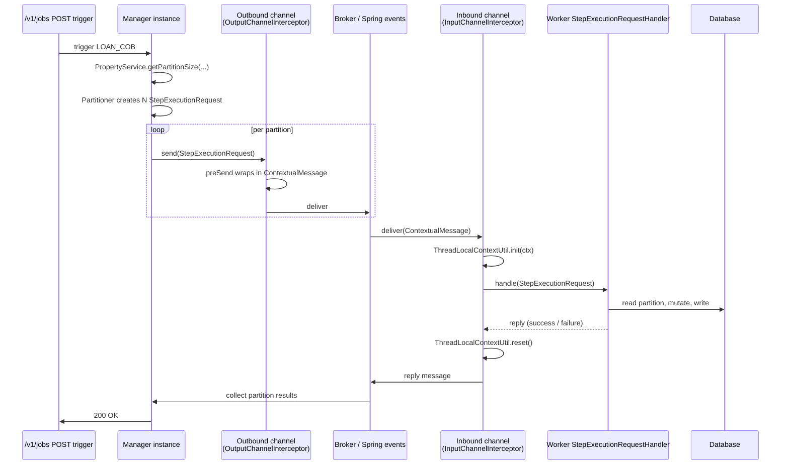

Long-running Fineract jobs (Loan COB, accruals, NPA updates) use **Spring Batch with remote partitioning** so a single "manager" instance can divide a workload into shards and dispatch them to many "worker" instances over a message broker. The model is general — pluggable transports (in-VM Spring events, JMS, Kafka), per-job tuning, and tenant-context propagation across the wire so a worker thread starts with the right `FineractContext` before it touches a JPA repository. This page is the reference for the `springbatch/` package: the constants in `fineract-core`, the `PropertyService` interface, the manager / worker / handler beans in `fineract-provider`, and the channel-interceptor pair that makes ThreadLocal state survive the hop.

<Note>
Partitioned jobs only matter for workloads big enough that a single thread would miss its window. Most Fineract jobs are single-step tasklets and don't use this infrastructure — they run on the scheduler thread and finish. See [Jobs Overview](/jobs/overview) for which jobs partition.
</Note>

## Package layout

| File                                                                                  | Module             | Purpose                                                  |
| ------------------------------------------------------------------------------------- | ------------------ | -------------------------------------------------------- |
| `infrastructure/springbatch/PropertyService.java`                                     | fineract-core      | Per-job tuning lookups (partition size, chunk size, ...) |
| `infrastructure/springbatch/SpringBatchJobConstants.java`                             | fineract-core      | `CUSTOM_JOB_PARAMETER_ID_KEY` constant                   |
| `infrastructure/springbatch/ContextualMessage.java`                                   | fineract-provider  | Wire envelope: `StepExecutionRequest` + `FineractContext` |
| `infrastructure/springbatch/InputChannelInterceptor.java`                             | fineract-provider  | Restores `FineractContext` on worker side                |
| `infrastructure/springbatch/OutputChannelInterceptor.java`                            | fineract-provider  | Captures `FineractContext` on manager side               |
| `infrastructure/springbatch/ManagerConfig.java`                                       | fineract-provider  | Wires the manager-side channels                          |
| `infrastructure/springbatch/WorkerConfig.java`                                        | fineract-provider  | Wires the worker-side channels                           |
| `infrastructure/springbatch/PropertyServiceImpl.java`                                 | fineract-provider  | Implementation reading from `FineractProperties`         |
| `infrastructure/springbatch/messagehandler/MessageHandlerConfig.java`                 | fineract-provider  | Top-level config — picks the active transport           |
| `infrastructure/springbatch/messagehandler/StepExecutionRequestHandler.java`          | fineract-provider  | The worker's request handler                            |
| `infrastructure/springbatch/messagehandler/conditions/{jms,kafka,spring}/...`         | fineract-provider  | `@Conditional` predicates per transport                  |
| `infrastructure/springbatch/messagehandler/jms/...`                                   | fineract-provider  | JMS broker + worker listener config                      |
| `infrastructure/springbatch/messagehandler/kafka/...`                                 | fineract-provider  | Kafka topic + worker listener config                     |
| `infrastructure/springbatch/messagehandler/spring/...`                                | fineract-provider  | In-VM Spring events config (default)                     |

## `PropertyService` — per-job knobs

```java
// fineract-core/.../springbatch/PropertyService.java
public interface PropertyService {

    Integer getPartitionSize(String jobName);
    Integer getChunkSize(String jobName);
    Integer getRetryLimit(String jobName);

    Integer getThreadPoolCorePoolSize(String jobName);
    Integer getThreadPoolMaxPoolSize(String jobName);
    Integer getThreadPoolQueueCapacity(String jobName);

    Integer getPollInterval(String jobName);
}
```

The `PropertyServiceImpl` looks up `jobName` (an entry from `JobName.name()`) in `FineractProperties.PartitionedJobProperty` lists:

```yaml
fineract:
  partitioned-job:
    partitioned-job-properties:
      - jobName: LOAN_COB
        chunkSize: 100
        partitionSize: 1
        threadPoolCorePoolSize: 1
        threadPoolMaxPoolSize: 10
        threadPoolQueueCapacity: 10
        retryLimit: 3
        pollInterval: 500
```

The lookup falls back to platform defaults when a job isn't listed. Manager configurations grow partition/queue sizes; workers grow thread-pool size to consume more in parallel.

## `SpringBatchJobConstants`

```java
public abstract class SpringBatchJobConstants {
    public static final String CUSTOM_JOB_PARAMETER_ID_KEY = "CUSTOM_JOB_PARAMETER_ID";
}
```

The single key used to pass a [`CustomJobParameter`](/core/jobs-domain#customjobparameter--persisted-parameters) primary key from the API layer through `JobParameters` to the tasklet.

## `ContextualMessage` — the wire envelope

```java
// fineract-provider/.../springbatch/ContextualMessage.java
@Data
public class ContextualMessage implements Serializable {

    private StepExecutionRequest stepExecutionRequest;
    private FineractContext context;
}
```

`StepExecutionRequest` is the standard Spring Batch partitioning message — job execution id, step execution id, step name. We wrap it together with the **`FineractContext`** so the worker can rebuild the right tenant identifier, business date, and action context (`ActionContext.COB` for COB jobs) before any code touches a JPA repository.

This object is serialized to the message body (JMS) or Kafka record value. The same shape is used by all three transports so workers can be written once.

## `OutputChannelInterceptor` — manager side

The manager's outbound channel wraps every `StepExecutionRequest` with the current thread's context:

```java
public class OutputChannelInterceptor implements ChannelInterceptor {

    @Override public Message<?> preSend(@NonNull Message<?> message, @NonNull MessageChannel channel) {
        Object payload = message.getPayload();
        if (payload instanceof StepExecutionRequest request) {
            ContextualMessage contextual = new ContextualMessage();
            contextual.setStepExecutionRequest(request);
            contextual.setContext(ThreadLocalContextUtil.getContext());
            return new GenericMessage<>(contextual, message.getHeaders());
        }
        return message;
    }
}
```

Without this, the worker would receive only the raw `StepExecutionRequest` and have no way to know which tenant the job belongs to.

## `InputChannelInterceptor` — worker side

```java
@Slf4j
public class InputChannelInterceptor implements ExecutorChannelInterceptor {

    public StepExecutionRequest beforeHandleMessage(ContextualMessage contextualMessage) {
        log.debug("Initializing ThreadLocal context for message handling: {}", contextualMessage);
        ThreadLocalContextUtil.init(contextualMessage.getContext());
        ThreadLocalContextUtil.setActionContext(ActionContext.COB);
        return contextualMessage.getStepExecutionRequest();
    }

    public void afterHandleMessage() {
        log.debug("Cleaning up ThreadLocal context after message handling");
        ThreadLocalContextUtil.reset();
    }
}
```

The interceptor:

1. Unwraps the `ContextualMessage` into a plain `StepExecutionRequest`.
2. Calls `ThreadLocalContextUtil.init(...)` with the captured `FineractContext`.
3. Sets `ActionContext.COB` so downstream services can branch on "running in batch" semantics.
4. `afterMessageHandled` calls `reset()` regardless of success or failure to avoid leaks across handler invocations.

`beforeHandle` returns a fresh `GenericMessage<>` with the unwrapped payload so the Spring Batch infrastructure sees only `StepExecutionRequest` and works as if it ran locally.

## Transport selection

`MessageHandlerConfig` picks exactly one of three transports based on `FineractProperties.RemoteJobMessageHandler`:

```yaml
fineract:
  remote-job-message-handler:
    spring-events:
      enabled: true     # default
    jms:
      enabled: false
    kafka:
      enabled: false
```

| Transport       | Manager `@Conditional`                    | Worker `@Conditional`                   |
| --------------- | ----------------------------------------- | --------------------------------------- |
| Spring events   | `SpringEventManagerCondition`             | `SpringEventWorkerCondition`            |
| JMS / ActiveMQ  | `JmsManagerCondition`                     | `JmsWorkerCondition`                    |
| Kafka           | `KafkaManagerCondition`                   | `KafkaWorkerCondition`                  |

The conditions check the corresponding `enabled` flag **and** the instance-mode flags (`batchManagerEnabled` / `batchWorkerEnabled`) so a single-mode node only registers the beans it can actually use.

The Spring-events transport is the simplest — manager and worker live in the same JVM and the "broker" is the Spring application context's event multicaster. It is the default for development and single-node deployments.

For JMS, `JmsBrokerConfiguration` and `JmsManagerConfig` set up the queue and `MessageHandler` on the manager side, while `JmsWorkerConfig` + `JmsBatchWorkerMessageListener` wires the listener container on the worker.

For Kafka, `KafkaJobTopicConfig` and `KafkaRemoteJobTopicAutoCreateCondition` ensure the topic exists (configurable), `KafkaManagerConfig` builds the producer, and `KafkaWorkerConfig` + `KafkaRemoteMessageListener` consume.

## Worker side — `StepExecutionRequestHandler`

The handler is the standard Spring Batch one but wired with the **input** channel that goes through `InputChannelInterceptor`. Its job is to look up the local `StepExecution`, execute the step, and report back via the reply channel (which uses `OutputChannelInterceptor` so the manager sees the wrapped context on the way back).

## End-to-end partitioned run



## Spring Batch JobRepository

Fineract uses the standard Spring Batch JPA `JobRepository`. By default it lives in the same schema as the business tables (`BATCH_*` tables, created by Spring Batch's schema scripts at startup). For partitioned deployments, manager and workers **must share the same JobRepository** so step executions are visible across nodes — this is normally the central tenant database.

The COB workflow uses a single Spring Batch job (`LOAN_COB`) with two steps:

1. `LOAN_COB_BUSINESS_STEP_CONFIG` — the partitioned step where each worker processes a batch of loans.
2. A final reconciliation step.

`StepName` (in `fineract-core`) declares step constants only for the events and command-purge jobs that ship from core; feature modules declare their own step constants close to their `…Config` classes.

## Partitioned-job properties recap

```yaml
fineract:
  partitioned-job:
    partitioned-job-properties:
      - jobName: LOAN_COB
        chunkSize: 100                 # PropertyService.getChunkSize
        partitionSize: 4               # PropertyService.getPartitionSize
        threadPoolCorePoolSize: 4      # worker pool floor
        threadPoolMaxPoolSize: 8       # worker pool ceiling
        threadPoolQueueCapacity: 50    # backlog before rejection
        retryLimit: 3                  # PropertyService.getRetryLimit
        pollInterval: 500              # manager poll cadence (ms)
```

Numbers above are illustrative. Production-tune by watching JobExecution histories: if a single worker can sustain the chunk size, raise `partitionSize` first; if workers idle, lower it. `pollInterval` controls how often the manager checks for completion — too low overloads the JobRepository, too high adds latency between partitions.

## Operational guidance

<CardGroup cols={2}>
  <Card title="Single-node testing" icon="vial">
    Leave `spring-events.enabled = true`. Both manager and worker run in the same JVM. Easiest to debug, no broker required.
  </Card>
  <Card title="Production scale" icon="server">
    Use JMS or Kafka. Run multiple instances with `batchWorkerEnabled = true`, one with `batchManagerEnabled = true`. See [Instance Mode](/core/instance-mode).
  </Card>
  <Card title="Hot Quartz key collisions" icon="bug">
    Tenant id is part of equality via `TenantAwareEqualsHashCodeAdvice`. Two tenants running `LOAN_COB` in parallel don't collide.
  </Card>
  <Card title="Worker crash" icon="circle-exclamation">
    Spring Batch retries the partition up to `retryLimit` then marks the step FAILED. Use the JobRepository's RESTART operation to resume.
  </Card>
</CardGroup>

## Cross-references

<CardGroup cols={2}>
  <Card title="Jobs Domain" icon="gears" href="/core/jobs-domain">
    `ScheduledJobDetail`, `JobName`, `CustomJobParameter`, and the read service.
  </Card>
  <Card title="Jobs Overview" icon="clock" href="/jobs/overview">
    Scheduling, Quartz, and the COB pipeline.
  </Card>
  <Card title="Instance Mode" icon="sliders" href="/core/instance-mode">
    Which modes activate which conditions.
  </Card>
  <Card title="External Events" icon="globe" href="/core/event-external">
    The Send Asynchronous Events job uses its own task executor, not partitioning.
  </Card>
</CardGroup>
