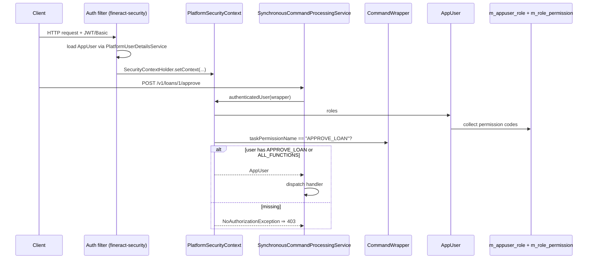

The `useradministration/` subtree in `fineract-core` defines the **identity model**: an `AppUser` belongs to one `Office`, optionally references a `Staff` member, holds a set of `Role`s, and each `Role` carries a set of `Permission`s whose `code` strings (`CREATE_CLIENT`, `APPROVE_LOAN`, …) are what every command and resource ultimately checks. This page is the reference for the entities, DTOs, and the slim `UserDomainService` contract. Authentication filters, password policies, and the JAX-RS user resources live in `fineract-provider` and are documented in [users overview](/users/overview).

<Note>
Permission codes follow the rigid format `ACTION_ENTITY` — e.g. `CREATE_CLIENT`, `READ_LOAN`, `APPROVE_LOAN`. The same format is what `CommandWrapper.taskPermissionName` computes; this is how the [command pipeline](/core/commands-framework) authorises commands without a separate lookup.
</Note>

## Package layout

| Subpackage                  | Purpose                                                              |
| --------------------------- | -------------------------------------------------------------------- |
| `useradministration/api`    | API constants — `PasswordPreferencesApiConstants`                    |
| `useradministration/data`   | DTOs: `AppUserData`, `RoleData`, `PermissionData`, `RolePermissionsData` |
| `useradministration/domain` | JPA entities — `AppUser`, `Role`, `Permission`                       |
| `useradministration/exception` | `UnAuthenticatedUserException`                                   |
| `useradministration/service` | `AppUserConstants` — JSON parameter name constants                 |

## `AppUser` — the principal entity

```java
@Entity
@Table(name = "m_appuser",
       uniqueConstraints = @UniqueConstraint(columnNames = {"username"}, name = "username_org"))
public class AppUser extends AbstractPersistableCustom<Long> implements PlatformUser {

    @Column(name = "email",         length = 100, nullable = false)            private String email;
    @Column(name = "username",      length = 100, nullable = false)            private String username;
    @Column(name = "firstname",     length = 100, nullable = false)            private String firstname;
    @Column(name = "lastname",      length = 100, nullable = false)            private String lastname;
    @Column(name = "password",      nullable = false)                          private String password;

    @Column(name = "nonexpired",                  nullable = false)            private boolean accountNonExpired;
    @Column(name = "nonlocked",                   nullable = false)            private boolean accountNonLocked;
    @Column(name = "failed_login_attempts",       nullable = false)            private int failedLoginAttempts;
    @Column(name = "is_login_retries_enabled",    nullable = false)            private boolean loginRetryLimitEnabled;
    @Column(name = "nonexpired_credentials",      nullable = false)            private boolean credentialsNonExpired;
    @Column(name = "enabled",                     nullable = false)            private boolean enabled;
    @Column(name = "firsttime_login_remaining",   nullable = false)            private boolean firstTimeLoginRemaining;
    @Column(name = "is_deleted",                  nullable = false)            private boolean deleted;

    @ManyToOne @JoinColumn(name = "office_id",   nullable = false)             private Office office;
    @ManyToOne @JoinColumn(name = "staff_id",    nullable = true)              private Staff staff;

    @ManyToMany(fetch = EAGER)
    @JoinTable(name = "m_appuser_role",
               joinColumns        = @JoinColumn(name = "appuser_id"),
               inverseJoinColumns = @JoinColumn(name = "role_id"))
    private Set<Role> roles;

    @Column(name = "last_time_password_updated")  private LocalDate lastTimePasswordUpdated;
    @Column(name = "password_never_expires",       nullable = false)            private boolean passwordNeverExpires;
    @Column(name = "cannot_change_password",       nullable = true)             private Boolean cannotChangePassword;
    @Column(name = "password_reset_required",      nullable = false)            private boolean passwordResetRequired;
}
```

Field highlights:

- **`accountNonExpired` / `accountNonLocked` / `credentialsNonExpired` / `enabled`** — the four booleans Spring Security's `UserDetails` contract requires. Disabling any of them blocks login.
- **`failedLoginAttempts` / `loginRetryLimitEnabled`** — login throttling implementation. Filters in `fineract-security` increment the counter on each failed attempt and lock the account when the per-tenant maximum is reached.
- **`firstTimeLoginRemaining`** — `true` for newly-created users; forces a password change on first login.
- **`passwordResetRequired`** — admin can flip this to force the user to reset the password (e.g. after a leak).
- **`passwordNeverExpires`** — opt-out from the expiry policy (used for service accounts).
- **`cannotChangePassword`** — read-only flag for users whose password is managed externally (LDAP / OAuth).
- **`deleted`** — soft delete. Disabled users remain in tables they own (e.g. as makers on command sources).

### Factory: `AppUser.fromJson(...)`

```java
public static AppUser fromJson(Office userOffice, Staff linkedStaff,
                                Set<Role> allRoles, JsonCommand command) {
    String username = command.stringValueOfParameterNamed("username");
    String password = command.stringValueOfParameterNamed("password");
    Boolean sendPasswordToEmail = command.booleanObjectValueOfParameterNamed("sendPasswordToEmail");

    if (sendPasswordToEmail) {
        password = new RandomPasswordGenerator(13).generate();
    }
    // ... resolve flags and roles, build the Spring User, wrap it as an AppUser
}
```

When `sendPasswordToEmail` is true, the factory generates a 13-character random password (via [`RandomPasswordGenerator`](/core/security-services#randompasswordgenerator)) and the calling write platform service emails it. The user is created with `firstTimeLoginRemaining = true` so they must change it after login.

### Spring Security integration

`AppUser implements PlatformUser` (which extends Spring's `UserDetails`). The class delegates most `UserDetails` methods to its own columns. `getAuthorities()` returns a `Collection<GrantedAuthority>` built from the user's roles' permissions:

```java
@Override
public Collection<GrantedAuthority> getAuthorities() {
    // flatMap roles → permissions → new SimpleGrantedAuthority(permission.code)
}
```

So a permission like `APPROVE_LOAN` shows up as `GrantedAuthority("APPROVE_LOAN")` and Spring Security's `@PreAuthorize("hasAuthority('APPROVE_LOAN')")` annotations would work directly — Fineract doesn't usually use them, preferring the explicit `taskPermissionName` check in the command pipeline.

## `Role`

```java
@Entity
@Table(name = "m_role", uniqueConstraints = @UniqueConstraint(columnNames = {"name"}))
public class Role extends AbstractPersistableCustom<Long> implements Serializable {

    @Column(name = "name", unique = true, nullable = false, length = 100)    private String name;
    @Column(name = "description",         nullable = false, length = 500)    private String description;
    @Column(name = "is_disabled",         nullable = false)                  private Boolean disabled;

    @ManyToMany(fetch = EAGER)
    @JoinTable(name = "m_role_permission",
               joinColumns        = @JoinColumn(name = "role_id"),
               inverseJoinColumns = @JoinColumn(name = "permission_id"))
    private Set<Permission> permissions = new HashSet<>();

    public static Role fromJson(JsonCommand command) {
        String name        = command.stringValueOfParameterNamed("name");
        String description = command.stringValueOfParameterNamed("description");
        return new Role(name, description);
    }
}
```

Roles are **per-tenant** and freely created by administrators. Default seed includes `Super user` (carries every permission). Disabling a role detaches the authority list at next login but doesn't touch existing sessions.

`m_role_permission` is the join table — `INSERT`/`DELETE` rows there to grant/revoke permissions.

## `Permission`

```java
@Entity
@Table(name = "m_permission")
public class Permission extends AbstractPersistableCustom<Long> implements Serializable {

    @Column(name = "grouping",          length = 45,  nullable = false) private String grouping;
    @Column(name = "code",              length = 100, nullable = false) private String code;
    @Column(name = "entity_name",       length = 100)                   private String entityName;
    @Column(name = "action_name",       length = 100)                   private String actionName;
    @Column(name = "can_maker_checker", nullable = false)               private boolean canMakerChecker;

    public Permission(String grouping, String entityName, String actionName) {
        this.grouping = grouping;
        this.entityName = entityName;
        this.actionName = actionName;
        this.code = actionName + "_" + entityName;   // ← the convention
        this.canMakerChecker = false;
    }
}
```

`code` is what `GrantedAuthority` sees and what `CommandWrapper.taskPermissionName` computes. Maintaining the strict `ACTION_ENTITY` pattern is essential — any handler whose `@CommandType(entity="X", action="Y")` doesn't have a corresponding `m_permission` row will be unreachable by anyone except the Super user.

`grouping` is the UI category (e.g. "portfolio", "transaction_loan", "accounting"). `canMakerChecker` flags whether the command is eligible for the maker-checker workflow — if `true` and the user lacks the `CHECKER_*` permission, the command pipeline queues the request instead of executing it.

### Special permissions

- **`ALL_FUNCTIONS`** — wildcard. A role holding it satisfies every `taskPermissionName` check.
- **`CHECKER_<ACTION>_<ENTITY>`** — second-eye permission for maker-checker.
- **`READ_*` permissions** — used by the [notification service](/core/notification-data) to fan out per-permission notifications.

## DTOs

### `AppUserData`

Immutable read DTO assembled by the user read service. Carries `id`, `username`, `officeId`, `officeName`, `firstname`, `lastname`, `email`, `passwordNeverExpires`, `staffId`, plus collections of `OfficeData` (allowed offices), `RoleData` (available + selected), and a nested `StaffData`. Used by `/v1/users` and `/v1/users/template`.

### `RoleData`

`{ id, name, description, disabled }` with a `toRolePermissionData(...)` helper that bolts a `Collection<PermissionData>` onto a denser shape for the role-detail endpoint.

### `PermissionData`

`{ grouping, code, entityName, actionName, selected }`. The `selected` boolean is filled when the DTO is rendered as part of a role's permission grid — `true` means the role currently grants the permission.

### `RolePermissionsData`

The full role detail: `{ id, name, description, disabled, permissionUsageData }`.

## `AppUserConstants`

```java
public final class AppUserConstants {
    public static final String PASSWORD                  = "password";
    public static final String REPEAT_PASSWORD           = "repeatPassword";
    public static final String PASSWORD_NEVER_EXPIRES    = "passwordNeverExpires";
    public static final String IS_LOGIN_RETRIES_ENABLED  = "isLoginRetriesEnabled";
    // ...
}
```

Parameter-name constants used by `AppUser.fromJson(...)` and the user-write platform service. `CommandWrapperBuilder` uses the same names for `withJson(...)` payloads. `PASSWORD` and `REPEAT_PASSWORD` are also referenced by `CommandWrapperBuilder.SENSITIVE_FIELDS` so they are masked in `m_portfolio_command_source.command_as_json`.

## `PasswordPreferencesApiConstants`

The `api/PasswordPreferencesApiConstants.java` file declares constants for the `/v1/passwordpreferences` endpoint — the per-tenant password policy (min length, complexity, expiry days). It also declares the `PASSWORD_PREFERENCES` resource name used by the [hooks](/core/hooks) and [commands](/core/commands-framework) frameworks.

## `UnAuthenticatedUserException`

```java
public class UnAuthenticatedUserException extends RuntimeException {}
```

Thrown by `PlatformSecurityContext.authenticatedUser()` when no Spring Security `Authentication` is in the context. The exception mapper in `fineract-provider` turns it into HTTP 401.

## `UserDomainService`

```java
// fineract-provider/.../useradministration/domain/UserDomainService.java
public interface UserDomainService {
    void create(AppUser appUser, Boolean sendPasswordToEmail);
}
```

A minimal contract carved out of the write platform service so test code and import flows can create users without dragging in the full validator chain. The implementation in `fineract-provider`:

1. Persists the user via the repository.
2. Fires a `HookEvent` for `USER|CREATE`.
3. Optionally enqueues a password-email job via the campaign service.

It is the bridge between batch user-import jobs and the per-user creation path.

## Authorisation flow



## Cross-references

<CardGroup cols={2}>
  <Card title="Users Implementation" icon="user-group" href="/users/overview">
    Authentication filters, JWT, password policy, import flow.
  </Card>
  <Card title="Security Services" icon="lock" href="/core/security-services">
    `PlatformSecurityContext`, `PlatformPasswordEncoder`, `RandomPasswordGenerator`.
  </Card>
  <Card title="Commands Framework" icon="terminal" href="/core/commands-framework">
    How `taskPermissionName` is built from `(entity, action)` and checked.
  </Card>
  <Card title="Organisation Shared" icon="building" href="/core/organisation-shared-domain">
    `Office` hierarchy that scopes `AppUser` and the office-level access check.
  </Card>
</CardGroup>
