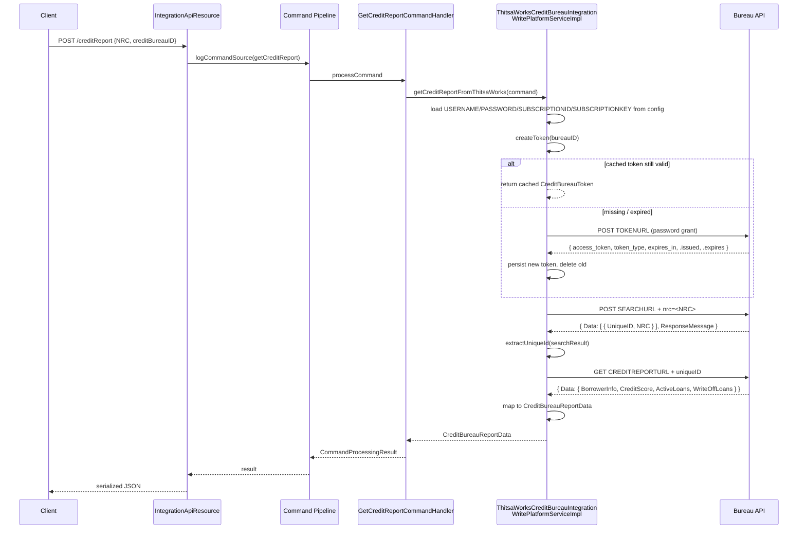

`CreditBureauIntegrationApiResource` is Fineract's runtime interface to a
configured credit bureau. It does **not** itself talk HTTP to the bureau —
instead it builds `CommandWrapper`s and delegates to the provider-specific
write-platform implementation (currently `ThitsaWorksCreditBureauIntegrationWritePlatformServiceImpl`).
That service uses `okhttp3` to perform NRC lookups, fetch credit reports,
and upload files, while caching bearer tokens in `m_creditbureau_token`. The
JAX-RS resource is at `/v1/creditBureauIntegration`.

## Resource summary

Source: `api/CreditBureauIntegrationApiResource.java`.

```java
@Path("/v1/creditBureauIntegration")
@Component
@Tag(name = "Credit Bureau Integration", description = "")
@RequiredArgsConstructor
public class CreditBureauIntegrationApiResource {

    private static final Set<String> RESPONSE_DATA_PARAMETERS =
        new HashSet<>(Arrays.asList("id", "creditBureauId", "nrc", "creditReport"));
```

### Endpoint matrix

| Method | Path | Operation | Command |
| --- | --- | --- | --- |
| `POST` | `/v1/creditBureauIntegration/creditReport` | Fetch report from bureau | `getCreditReport()` |
| `POST` | `/v1/creditBureauIntegration/addCreditReport?creditBureauId=` | Upload loan file (multipart) | (direct service call) |
| `POST` | `/v1/creditBureauIntegration/saveCreditReport?creditBureauId=&nationalId=` | Persist fetched report | `saveCreditReport(creditBureauId, nationalId)` |
| `GET` | `/v1/creditBureauIntegration/creditReport/{creditBureauId}` | List saved reports | (read service) |
| `DELETE` | `/v1/creditBureauIntegration/deleteCreditReport/{creditBureauId}` | Delete saved report | `deleteCreditReport(creditBureauId)` |

## Fetch credit report

```java
@POST
@Path("creditReport")
public String fetchCreditReport(@Context final UriInfo uriInfo,
        @RequestParam("params") final Map<String, Object> params) {

    Gson gson = new Gson();
    final String json = gson.toJson(params);
    final CommandWrapper commandRequest = new CommandWrapperBuilder()
            .getCreditReport().withJson(json).build();

    final CommandProcessingResult result =
            this.commandsSourceWritePlatformService.logCommandSource(commandRequest);
    return this.toCreditReportApiJsonSerializer.serialize(result);
}
```

The request body is an arbitrary `Map<String, Object>` that the
provider-specific handler decodes. The ThitsaWorks handler expects:

```json
{
  "NRC":            "12/MAHANA(N)123456",
  "creditBureauID": "3"
}
```

The command resolves to `GetCreditReportCommandHandler` (`@CommandType(entity =
"CREDIT_REPORT", action = "GET")`), which calls the configured provider
service.

## ThitsaWorks provider flow

Source: `service/ThitsaWorksCreditBureauIntegrationWritePlatformServiceImpl.java`.



### Step 1: load configuration

```java
String userName = getCreditBureauConfiguration(creditBureauId,
        CreditBureauConfigurations.USERNAME.toString());
String password = getCreditBureauConfiguration(creditBureauId,
        CreditBureauConfigurations.PASSWORD.toString());
String subscriptionId = getCreditBureauConfiguration(creditBureauId,
        CreditBureauConfigurations.SUBSCRIPTIONID.toString());
String subscriptionKey = getCreditBureauConfiguration(creditBureauId,
        CreditBureauConfigurations.SUBSCRIPTIONKEY.toString());
```

### Step 2: createToken

```java
CreditBureauToken creditBureauToken = this.tokenRepositoryWrapper.getToken();

if (creditBureauToken != null) {
    LocalDate current = DateUtils.getLocalDateOfTenant();
    LocalDate getExpiryDate = creditBureauToken.getExpires();
    if (DateUtils.isBefore(getExpiryDate, current)) {
        this.tokenRepositoryWrapper.delete(creditBureauToken);
        creditBureauToken = null;
    }
}

if (creditBureauToken == null) {
    String url = getCreditBureauConfiguration(bureauID.intValue(),
            CreditBureauConfigurations.TOKENURL.toString());
    String process = "token";
    String result = this.okHttpConnectionMethod(userName, password,
            subscriptionKey, subscriptionId, url, null, null, null,
            0L, null, process);
    ...
}
```

A new token request body is built in `okHttpConnectionMethod` for the
`"token"` process:

```java
case "token" -> request = createRequest(baseRequestBuilder,
        () -> RequestBody.create(
            "BODY=x-www-form-urlencoded&\r"
            + "grant_type=password&\r"
            + "userName=" + userName + "&\r"
            + "password=" + password + "&\r",
            MediaType.parse("application/x-www-form-urlencoded")),
        (requestBody, builder) -> builder
            .header(CONTENT_TYPE, APPLICATION_FORM_URLENCODED)
            .post(requestBody).build());
```

The token JSON is deserialized by `CreditBureauToken.fromJson` (see
[Configuration API](/creditbureau/configuration-api#creditbureautoken-entity))
and saved through `tokenRepositoryWrapper.save(generatedtoken)`.

### Step 3: NRC search

```java
String process = "NRC";
String url = getCreditBureauConfiguration(creditBureauId,
        CreditBureauConfigurations.SEARCHURL.toString());
String nrcUrl = url + nrcId;
String searchResult = this.okHttpConnectionMethod(userName, password,
        subscriptionKey, subscriptionId, nrcUrl, token, null, null,
        0L, nrcId, process);

Long uniqueID = this.extractUniqueId(searchResult);
```

The "NRC" request body:

```java
case "NRC" -> request = createRequest(baseRequestBuilder,
        () -> RequestBody.create(
            "BODY=x-www-form-urlencoded&nrc=" + nrcId + "&",
            MediaType.parse("application/x-www-form-urlencoded")),
        (requestBody, builder) -> builder
            .header(CONTENT_TYPE, APPLICATION_FORM_URLENCODED)
            .post(requestBody).build());
```

`extractUniqueId` handles three cases on the `Data` JSON array:

- `size() == 1` — single match, return `UniqueID`
- `size() == 0` — no match, throw `RESPONSE_MESSAGE` via
  `handleAPIIntegrityIssues`
- `size() > 1` — multiple NRCs found, throw via `handleMultipleNRC`

### Step 4: credit report fetch

```java
process = "CreditReport";
url = getCreditBureauConfiguration(creditBureauId,
        CreditBureauConfigurations.CREDITREPORTURL.toString());
String creditReportUrl = url + uniqueID;
searchResult = this.okHttpConnectionMethod(userName, password,
        subscriptionKey, subscriptionId, creditReportUrl, token, null, null,
        uniqueID, null, process);
```

`"CreditReport"` is a plain `GET` with header
`Content-Type: application/x-www-form-urlencoded`:

```java
case "CreditReport" -> request = createRequest(baseRequestBuilder,
        builder -> builder.header(CONTENT_TYPE, APPLICATION_FORM_URLENCODED)
                          .get().build());
```

### Step 5: map JSON → CreditBureauReportData

```java
JsonObject reportObject = JsonParser.parseString(searchResult).getAsJsonObject();
Optional<JsonObject> jsonData = Optional.ofNullable(reportObject.get("Data"))
        .filter(JsonElement::isJsonObject).map(JsonElement::getAsJsonObject);

Optional<JsonObject> borrowerInfos = jsonData.map(data -> data.get("BorrowerInfo"))
        .filter(JsonElement::isJsonObject).map(JsonElement::getAsJsonObject);

String borrowerInfo = borrowerInfos.map(data -> new Gson().toJson(data)).orElse(null);
String name        = borrowerInfos.map(d -> d.get("Name"))   .map(JsonElement::toString).orElse(null);
String gender      = borrowerInfos.map(d -> d.get("Gender")) .map(JsonElement::toString).orElse(null);
String address     = borrowerInfos.map(d -> d.get("Address")).map(JsonElement::toString).orElse(null);

String creditScore = getJsonObjectToString("CreditScore", jsonData);

String[] activeLoanStringArray   = ...; // ActiveLoans  -> String[]
String[] writeoffLoanStringArray = ...; // WriteOffLoans -> String[]

return CreditBureauReportData.instance(name, gender, address, creditScore,
        borrowerInfo, activeLoanStringArray, writeoffLoanStringArray);
```

The `CreditBureauReportData` shape is what the API returns to the caller —
it is **not** persisted by this call. To persist, the caller subsequently
hits `saveCreditReport`.

## Upload credit report (multipart)

```java
@POST
@Path("addCreditReport")
@Consumes(MediaType.MULTIPART_FORM_DATA)
public String addCreditReport(@FormDataParam("file") final File creditReport,
        @FormDataParam("file") InputStream uploadedInputStream,
        @FormDataParam("file") final UriInfo uriInfo,
        @FormDataParam("file") FormDataContentDisposition fileDetail,
        @QueryParam("creditBureauId") final Long creditBureauId) {

    final String responseMessage = this.creditReportWritePlatformService
            .addCreditReport(creditBureauId, creditReport, fileDetail);
    return this.toCreditReportApiJsonSerializer.serialize(responseMessage);
}
```

The service implementation reads a custom config row keyed by
`addCreditReporturl`:

```java
CreditBureauConfiguration addReportURL =
    this.configDataRepository.getCreditBureauConfigData(creditBureauId, "addCreditReporturl");
String url = addReportURL.getValue();

return this.okHttpConnectionMethod(userName, password, subscriptionKey,
        subscriptionId, url, token, creditReport, fileDetail, 0L, null,
        UPLOAD_CREDIT_REPORT);
```

The `"UploadCreditReport"` process builds a `MultipartBody`:

```java
case UPLOAD_CREDIT_REPORT ->
    request = createRequest(baseRequestBuilder,
        () -> new MultipartBody.Builder().setType(MultipartBody.FORM)
            .addFormDataPart("file", fileData.getFileName(),
                RequestBody.create(file, MediaType.parse("multipart/form-data")))
            .addFormDataPart("BODY", "formdata")
            .addFormDataPart("userName", userName).build(),
        (requestBody, builder) -> builder.header(CONTENT_TYPE, MULTIPART_FORM_DATA)
            .post(requestBody).build());
```

If the bureau accepts the upload, the response is JSON-parsed and the
`ResponseMessage` is surfaced to the caller via `handleAPIIntegrityIssues`.

## Save credit report (persistence)

```java
@POST
@Path("saveCreditReport")
public String saveCreditReport(final String apiRequestBodyAsJson,
        @QueryParam("creditBureauId") final Long creditBureauId,
        @QueryParam("nationalId") final String nationalId) {

    final CommandWrapper commandRequest = new CommandWrapperBuilder()
            .saveCreditReport(creditBureauId, nationalId)
            .withJson(apiRequestBodyAsJson)
            .build();

    final CommandProcessingResult result =
        this.commandsSourceWritePlatformService.logCommandSource(commandRequest);
    return this.toCreditReportApiJsonSerializer.serialize(result);
}
```

`SaveCreditReportCommandHandler` (`@CommandType(entity = "CREDIT_REPORT",
action = "CREATE")`) delegates to `CreditReportWritePlatformService.saveCreditReport(...)`,
which constructs a `CreditReport` via:

```java
CreditReport.instance(creditBureauId, nationalId, creditReportBytes);
```

The body bytes are typically the previously fetched JSON serialized as
UTF-8 (or a compressed form chosen by the integration). The fact that the
column is `byte[]` allows operators to encrypt at rest if desired.

## List saved reports

```java
@GET
@Path("creditReport/{creditBureauId}")
public String getSavedCreditReport(
        @PathParam("creditBureauId") final Long creditBureauId,
        @Context final UriInfo uriInfo) {

    this.context.authenticatedUser();
    final Collection<CreditReportData> creditReport =
        this.creditReportReadPlatformService.retrieveCreditReportDetails(creditBureauId);
    ...
    return this.toApiJsonSerializer.serialize(settings, creditReport, RESPONSE_DATA_PARAMETERS);
}
```

The `RESPONSE_DATA_PARAMETERS` set restricts the projected fields to
`id, creditBureauId, nrc, creditReport`.

## Delete saved report

```java
@DELETE
@Path("deleteCreditReport/{creditBureauId}")
public String deleteCreditReport(@PathParam("creditBureauId") final Long creditBureauId,
                                 final String apiRequestBodyAsJson) {
    final CommandWrapper commandRequest = new CommandWrapperBuilder()
            .deleteCreditReport(creditBureauId).withJson(apiRequestBodyAsJson)
            .build();
    ...
}
```

Implemented by `DeleteCreditReportCommandHandler`. The body typically
includes the `nationalId` so the right `CreditReport` row is removed.

## HTTP failure handling

The service maps non-200 responses to platform exceptions:

```java
if (responseCode == HttpURLConnection.HTTP_UNAUTHORIZED) {
    String httpResponse = "HTTP_UNAUTHORIZED";
    this.handleAPIIntegrityIssues(httpResponse);
} else if (responseCode == HttpURLConnection.HTTP_FORBIDDEN) {
    String httpResponse = "HTTP_FORBIDDEN";
    this.handleAPIIntegrityIssues(httpResponse);
} else {
    String responseResult = "HTTP Response Code: " + responseCode
        + "/" + "Response Message: " + responseMessage;
    this.handleAPIIntegrityIssues(responseResult);
}
```

`handleAPIIntegrityIssues` ultimately raises a `PlatformDataIntegrityException`
which standard exception mappers convert to a `400` JSON response.

The `CreditBureauLoanProductMapping.skipCreditCheckInFailure` flag (see
[Configuration API](/creditbureau/configuration-api#creditbureauloanproductmapping-entity))
governs whether origination should propagate or swallow the failure.

## Implementing a new provider (TransUnion-style)

To add a new provider, e.g. TransUnion:

1. Insert a `m_creditbureau` row with `implementation_key = "TRANSUNION"`.
2. Insert per-OCB `m_creditbureau_configuration` rows: `USERNAME`,
   `PASSWORD`, `SUBSCRIPTIONID`, `SUBSCRIPTIONKEY`, `TOKENURL`, `SEARCHURL`,
   `CREDITREPORTURL`, plus any provider-specific keys (TransUnion typically
   needs `ENVIRONMENT`, `MEMBER_REF`, etc.).
3. Implement a `TransUnionCreditBureauIntegrationWritePlatformServiceImpl`
   mirroring the ThitsaWorks shape — `getCreditReportFromX(JsonCommand)`,
   `addCreditReport(...)`, `createToken(Long bureauId)` — using `TokenRepositoryWrapper`
   and `CreditBureauConfigurationRepositoryWrapper`.
4. Either branch on `implementationKey` inside `GetCreditReportCommandHandler`
   to pick the right service, or replace the handler entirely with a
   strategy-based dispatcher.
5. The REST surface stays the same; only the back-end provider class changes.

## Permissions

| Operation | Check |
| --- | --- |
| `GET /creditReport/{creditBureauId}` | `authenticatedUser()` only |
| Command writes (`POST` / `DELETE`) | Resolved by `CommandWrapper` / `PortfolioCommandSourceWritePlatformService` against `m_permission` |

The command-based flow integrates with maker-checker — see
[Commands framework](/command/overview).

## See also

- [Configuration API](/creditbureau/configuration-api) — entities and config
  rows used here
- [Credit bureau overview](/creditbureau/overview)
- [Ad-hoc query](/creditbureau/adhoc-query) — related ad-hoc reports module
- [Commands framework](/command/overview)
- [`/api/creditbureau-integration`](/api/creditbureau-integration)
