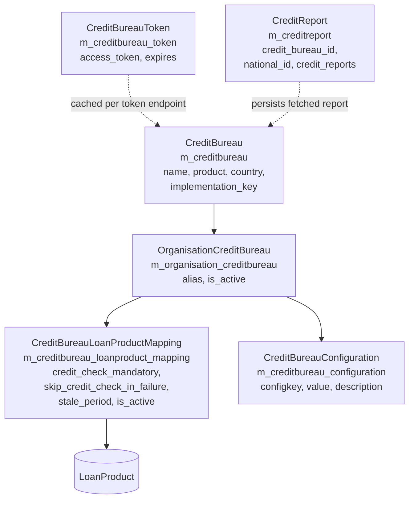

Fineract's credit bureau module under
`org.apache.fineract.infrastructure.creditbureau` provides a generic
framework for binding third-party credit bureaus (e.g. ThitsaWorks /
Myanmar Credit Bureau, TransUnion-style providers) to the tenant. It owns
the configuration of bureau aliases per organisation, the mapping of
bureaus to loan products with mandatory/optional credit-check flags, the
caching of bearer tokens, the persistence of fetched credit reports, and
the REST surfaces consumed by both back-office UIs and loan-origination
flows. The module lives in `fineract-provider`.

## Package layout

| Sub-package | Purpose |
| --- | --- |
| `api/` | JAX-RS resources `CreditBureauConfigurationApiResource` (`/v1/CreditBureauConfiguration`) and `CreditBureauIntegrationApiResource` (`/v1/creditBureauIntegration`) |
| `domain/` | JPA entities: `CreditBureau`, `CreditBureauConfiguration`, `CreditBureauLoanProductMapping`, `OrganisationCreditBureau`, `CreditBureauToken`, `CreditReport` |
| `data/` | DTOs: `CreditBureauData`, `CreditBureauConfigurationData`, `CreditBureauLoanProductMappingData`, `OrganisationCreditBureauData`, `CreditBureauMasterData`, `CreditBureauReportData`, `CreditReportData`, `CreditBureauConfigurations` (enum), `CreditBureauProduct` (enum) |
| `service/` | Read/Write services per resource + `ThitsaWorksCreditBureauIntegrationWritePlatformServiceImpl` |
| `serialization/` | `CreditBureauCommandFromApiJsonDeserializer`, configuration/mapping/token deserializers |
| `handler/` | Command handlers: `AddCreditBureauConfigurationDataCommandHandler`, `AddOrganisationCreditBureauCommandHandler`, `CreateCreditBureauLoanProductMappingCommandHandler`, `UpdateCreditBureauCommandHandler`, `UpdateCreditBureauConfigurationDataCommandHandler`, `UpdateCreditBureauLoanProductMappingCommandHandler`, `GetCreditReportCommandHandler`, `SaveCreditReportCommandHandler`, `DeleteCreditReportCommandHandler` |
| `exception/` | `CreditReportNotFoundException` |

## Entity model



| Entity | Table | PK style | Notes |
| --- | --- | --- | --- |
| `CreditBureau` | `m_creditbureau` | `Long` | The bureau catalogue (one row per bureau implementation, e.g. ThitsaWorks) |
| `OrganisationCreditBureau` | `m_organisation_creditbureau` | `Long` | Bureau bound to the tenant under an `alias` |
| `CreditBureauLoanProductMapping` | `m_creditbureau_loanproduct_mapping` | `Long` | Which loan products require a credit check from which OCB |
| `CreditBureauConfiguration` | `m_creditbureau_configuration` | `Long` | Key/value config rows for an OCB (URLs, credentials) |
| `CreditBureauToken` | `m_creditbureau_token` | `Long` | Cached OAuth-style bearer token |
| `CreditReport` | `m_creditreport` | `Long` | Persisted credit-report payload (`byte[]`) keyed by `(creditBureauId, nationalId)` |

See [Configuration API](/creditbureau/configuration-api) for the entity
internals and [Integration API](/creditbureau/integration-api) for the
provider-specific flow.

## CreditBureauConfigurations keys

Source: `data/CreditBureauConfigurations.java`.

```java
public enum CreditBureauConfigurations {
    THITSAWORKS,
    SUBSCRIPTIONID,
    SUBSCRIPTIONKEY,
    USERNAME,
    PASSWORD,
    TOKENURL,
    SEARCHURL,
    CREDITREPORTURL;
}
```

These enum names are stored verbatim in `m_creditbureau_configuration.configkey`
and looked up by name when integrating with a specific bureau. The token URL
is consumed at login (`createToken`), the search URL at NRC lookup, and the
credit-report URL after the unique ID is extracted.

| Key | Used for |
| --- | --- |
| `USERNAME` / `PASSWORD` | Basic credentials sent on token request |
| `SUBSCRIPTIONID` / `SUBSCRIPTIONKEY` | Headers (`mcix-subscription-id`, `mcix-subscription-key`) sent on every request |
| `TOKENURL` | OAuth-style password-grant token endpoint |
| `SEARCHURL` | NRC (national registration code) lookup endpoint |
| `CREDITREPORTURL` | Credit report fetch endpoint by uniqueId |

## REST endpoint map

| Resource | Method | Path | Purpose |
| --- | --- | --- | --- |
| `CreditBureauConfigurationApiResource` | `GET` | `/v1/CreditBureauConfiguration` | List `CreditBureauData` |
| | `GET` | `/v1/CreditBureauConfiguration/mappings` | List loan-product mappings |
| | `GET` | `/v1/CreditBureauConfiguration/organisationCreditBureau` | List OCBs |
| | `GET` | `/v1/CreditBureauConfiguration/config/{organisationCreditBureauId}` | Configurations for one OCB |
| | `GET` | `/v1/CreditBureauConfiguration/loanProduct` | All mappings + loan products |
| | `GET` | `/v1/CreditBureauConfiguration/loanProduct/{loanProductId}` | Mapping for one loan product |
| | `PUT` | `/v1/CreditBureauConfiguration/organisationCreditBureau` | `UPDATE_CREDITBUREAU` command |
| | `PUT` | `/v1/CreditBureauConfiguration/mappings` | `UPDATE_LOANPRODUCT_MAPPING` command |
| | `POST` | `/v1/CreditBureauConfiguration/organisationCreditBureau/{organisationCreditBureauId}` | Add OCB |
| | `POST` | `/v1/CreditBureauConfiguration/mappings/{organisationCreditBureauId}` | Create mapping |
| | `POST` | `/v1/CreditBureauConfiguration/configuration/{creditBureauId}` | Add config row |
| | `PUT` | `/v1/CreditBureauConfiguration/configuration/{configurationId}` | Update config row |
| `CreditBureauIntegrationApiResource` | `POST` | `/v1/creditBureauIntegration/creditReport` | Fetch credit report from bureau |
| | `POST` | `/v1/creditBureauIntegration/addCreditReport` | Upload report file to bureau |
| | `POST` | `/v1/creditBureauIntegration/saveCreditReport` | Persist fetched report |
| | `GET` | `/v1/creditBureauIntegration/creditReport/{creditBureauId}` | List saved reports |
| | `DELETE` | `/v1/creditBureauIntegration/deleteCreditReport/{creditBureauId}` | Delete saved report |

All writes are dispatched through `PortfolioCommandSourceWritePlatformService.logCommandSource`,
so the [commands framework](/command/overview) audits and (optionally)
maker-checker-approves every change.

## Provider implementations

The framework is pluggable. The currently shipped implementation is
`ThitsaWorksCreditBureauIntegrationWritePlatformServiceImpl` (Myanmar
Credit Bureau). Adding a TransUnion or similar provider follows the same
shape:

1. Insert a new `m_creditbureau` row with a unique `implementation_key`
   (string name).
2. Insert the corresponding `m_creditbureau_configuration` rows for `USERNAME`,
   `PASSWORD`, `SUBSCRIPTIONID`, `SUBSCRIPTIONKEY`, `TOKENURL`, `SEARCHURL`,
   `CREDITREPORTURL`.
3. Implement a service named after the provider that reuses
   `CreditBureauTokenCommandFromApiJsonDeserializer`, `TokenRepositoryWrapper`,
   and `CreditBureauConfigurationRepositoryWrapper`.
4. Bind it as the handler for the `GET_CREDIT_REPORT` command by registering
   under `GetCreditReportCommandHandler` (or branch on `implementation_key`
   inside it).

See [Integration API](/creditbureau/integration-api) for the ThitsaWorks
flow as a worked example.

## Stale-period semantics

Each `CreditBureauLoanProductMapping` carries:

```java
@Column(name = "is_credit_check_mandatory")
private boolean creditCheckMandatory;

@Column(name = "skip_credit_check_in_failure")
private boolean skipCreditCheckInFailure;

@Column(name = "stale_period")
private int stalePeriod;
```

`stalePeriod` is in days. A fetched and persisted credit report is
considered fresh while `(now - report.createdDate) < stalePeriod`.
Origination flows should consult this mapping for the loan product being
considered before deciding whether to refetch.

`creditCheckMandatory` controls whether a missing/stale report blocks
disbursal; `skipCreditCheckInFailure` permits the loan to continue if the
bureau call fails (HTTP 5xx etc.) provided the credit check is not
mandatory.

## Token caching

`CreditBureauToken` (table `m_creditbureau_token`) stores the most recent
token for the active bureau. The `createToken` method on
`ThitsaWorksCreditBureauIntegrationWritePlatformServiceImpl` first checks
the table:

```java
if (creditBureauToken != null) {
    LocalDate current = DateUtils.getLocalDateOfTenant();
    LocalDate getExpiryDate = creditBureauToken.getExpires();
    if (DateUtils.isBefore(getExpiryDate, current)) {
        this.tokenRepositoryWrapper.delete(creditBureauToken);
        creditBureauToken = null;
    }
}
```

When the token is missing or expired, a `password` grant is sent to the
configured `TOKENURL` and the result is deserialized through
`CreditBureauTokenCommandFromApiJsonDeserializer`:

```java
final CreditBureauToken generatedtoken = CreditBureauToken.fromJson(apicommand);

final CreditBureauToken credittoken = this.tokenRepositoryWrapper.getToken();
if (credittoken != null) {
    this.tokenRepositoryWrapper.delete(credittoken);
}
this.tokenRepositoryWrapper.save(generatedtoken);
```

There is a single in-flight token (the old row is deleted before saving the
new one) — this is intentional because the bureau APIs use a tenant-level
service account.

## Credit report persistence

`CreditReport` stores the fetched payload as `byte[]` in
`m_creditreport.credit_reports`:

```java
@Basic(fetch = FetchType.LAZY)
@Column(name = "credit_reports")
private byte[] creditReports;
```

The natural lookup key is `(credit_bureau_id, national_id)`. `byte[]` allows
either compressed/encrypted blobs or raw JSON bytes — the framework does
not enforce a format.

`CreditReportNotFoundException` in
`exception/CreditReportNotFoundException.java` is thrown when a lookup by
`(creditBureauId, nationalId)` returns no rows.

## Command builder hooks

The `CommandWrapperBuilder` defines these methods for credit bureau write
operations:

- `updateCreditBureau()`
- `updateCreditBureauLoanProductMapping()`
- `addOrganisationCreditBureau(Long organisationCreditBureauId)`
- `createCreditBureauLoanProductMapping(Long organisationCreditBureauId)`
- `addCreditBureauConfiguration(Long creditBureauId)`
- `updateCreditBureauConfiguration(Long configurationId)`
- `getCreditReport()`
- `saveCreditReport(Long creditBureauId, String nationalId)`
- `deleteCreditReport(Long creditBureauId)`

Each one wires to a `@CommandType` handler in the `handler/` package. See
[Commands framework](/command/overview) for handler-registry mechanics.

## Permissions

| Resource | Permission key (`RESOURCE_NAME_FOR_PERMISSIONS`) |
| --- | --- |
| `CreditBureauConfigurationApiResource` | `CreditBureau` |
| `CreditBureauIntegrationApiResource` | only `authenticatedUser()` (read), command-based for writes |

Per-action permissions follow the standard
`READ_<resource>` / `CREATE_<entity>` / `UPDATE_<entity>` / `DELETE_<entity>`
pattern. See [user administration domain](/core/useradministration-domain).

## Where to go next

- [Configuration API](/creditbureau/configuration-api) — entity details,
  config keys, OCB lifecycle
- [Integration API](/creditbureau/integration-api) — fetch/submit reports,
  provider flow
- [Ad-hoc query](/creditbureau/adhoc-query) — scheduled SQL queries (related
  module under `org.apache.fineract.adhocquery`)
- [`/api/creditbureau-configuration`](/api/creditbureau-configuration) and
  [`/api/creditbureau-integration`](/api/creditbureau-integration)
- [Commands framework](/command/overview)
