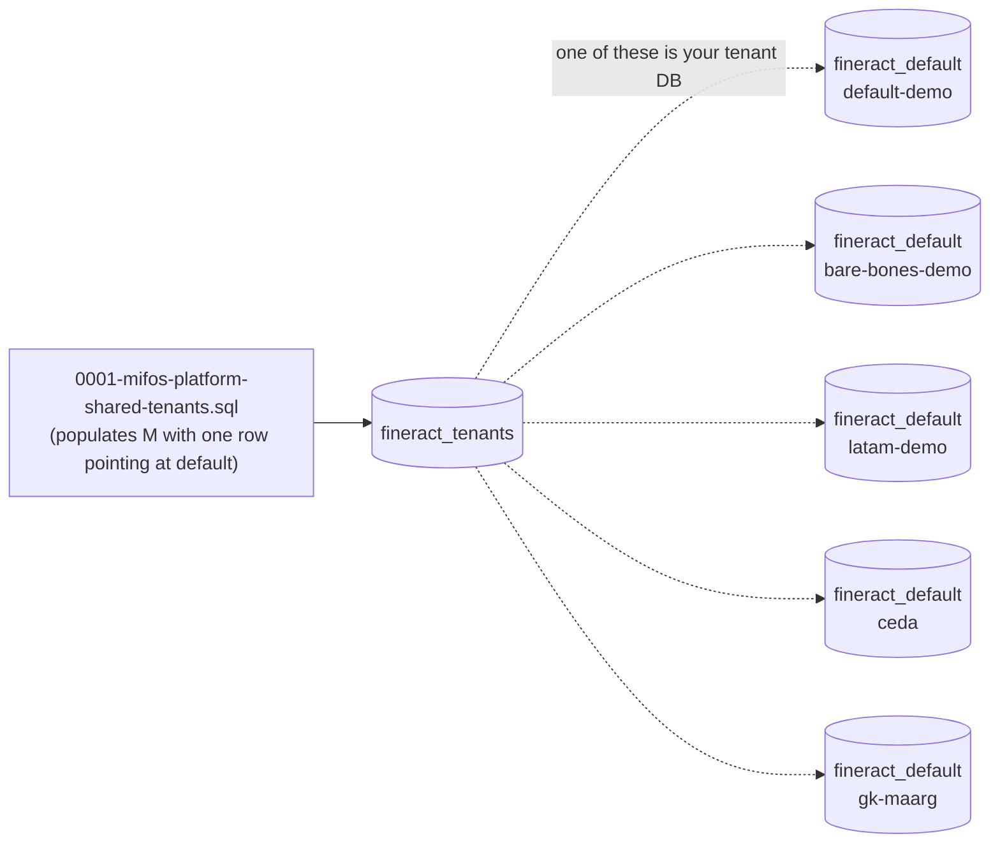

`fineract-db/multi-tenant-demo-backups/` is Apache Fineract's "starter pack" of pre-baked tenant databases. Instead of running Liquibase from empty and clicking through the UI to create offices, currencies, roles, products, and sample clients, developers and demo-runners can import one of these `mysqldump` files and have a fully populated tenant DB in seconds. This page enumerates each demo and explains what they contain, how to load them, and how they relate to the master `fineract_tenants` registry.

## Directory layout

```
fineract-db/multi-tenant-demo-backups/
├── 0001-mifos-platform-shared-tenants.sql       # 108 lines  — master DB with the 'default' tenant row
├── bk_mifostenant_default.sql                   # 1,920 lines — default tenant business DB
├── bare-bones-demo/                             # minimal install, no products / no clients
│   ├── README.md
│   └── bk_bare_bones_demo.sql                   # 1,918 lines
├── ceda/                                        # CEDA Microfinance (Uganda) customisations
│   ├── README.md
│   ├── bk_ceda_trial.sql                        # 1,894 lines
│   ├── bk_core_with_custom_and_coa.sql          # 1,894 lines
│   ├── ceda-schema-customisations.sql           #   361 lines — extra datatables + code values
│   └── ceda-user-office-product-setup.sql       #   123 lines — CEDA users / offices / products
├── default-demo/
│   ├── README.md
│   ├── bk_mifostenant-default.sql               # 1,920 lines — same as top-level default
│   └── extra-datatables-and-code-values.sql     #   240 lines — extra reporting datatables
├── gk-maarg/
│   └── 0001b-gk-datatables.sql                  #    58 lines — Grameen Koota datatables only
└── latam-demo/                                  # Latin America (Spanish-locale) demo
    ├── README.md
    ├── bk_latam.sql                             # 1,832 lines
    └── datatables-on-latam-demo.sql             #    68 lines
```

Total: ~12,336 lines of demo SQL. These are **mysqldump** files frozen at various points between 2013 and the Liquibase cutover; they are **MySQL/MariaDB dialect** only.

## What each demo contains



| Demo | Currency | Office | Default user | Includes |
| ---- | -------- | ------ | ------------ | -------- |
| **default-demo** | INR (default) | Head Office | `mifos` / `password` | Permissions, currencies, sample products, sample clients, sample loans/savings |
| **bare-bones-demo** | USD | "Head Office" | `mifos` / `password` | Permissions only. No products. No clients. No charges. No accounting setup. |
| **latam-demo** | Multiple LATAM currencies | "Latam HO" | `quipo` / `quipo` | Permissions, currencies, Spanish locale, no products, no clients |
| **ceda** | UGX | CEDA Microfinance offices | (CEDA-specific) | Permissions, customisations to `m_code`/`m_code_value`, extra datatables for client/loan data capture, extra reports |
| **gk-maarg** | (not a backup — just `risk_analysis` datatable) | — | — | A single datatable definition (`risk_analysis`) used by Grameen Koota for cash-flow assessment |

### 0001-mifos-platform-shared-tenants.sql

The master-DB seed for these demos. A small `mysqldump` of `fineract_tenants` containing:

```sql
DROP TABLE IF EXISTS `tenants`;
CREATE TABLE `tenants` (
  `id` BIGINT NOT NULL AUTO_INCREMENT,
  `identifier` varchar(100) NOT NULL,
  `name` varchar(100) NOT NULL,
  `schema_name` varchar(100) NOT NULL,
  `timezone_id` varchar(100) NOT NULL,
  `country_id` INT DEFAULT NULL,
  `joined_date` date DEFAULT NULL,
  `created_date` datetime DEFAULT NULL,
  `lastmodified_date` datetime DEFAULT NULL,
  `schema_server` varchar(100) NOT NULL DEFAULT 'localhost',
  `schema_server_port` varchar(10) NOT NULL DEFAULT '3306',
  `schema_username` varchar(100) NOT NULL DEFAULT 'root',
  `schema_password` varchar(100) NOT NULL DEFAULT 'mysql',
  `auto_update` tinyint NOT NULL DEFAULT '1',
  PRIMARY KEY (`id`)
) ENGINE=InnoDB AUTO_INCREMENT=2 DEFAULT CHARSET=UTF8MB4;

INSERT INTO `tenants` VALUES
  (1,'default','Default Demo Tenant','fineract_default','Asia/Kolkata',NULL,NULL,NULL,NULL,
   'localhost','3306','root','mysql',1);
```

Note the **simplified schema** — this is the *very old* shape of `tenants` (single denormalized table, before `tenant_server_connections` was split out as a foreign key in changeset `0001` of the tenant-store changelog). A modern Fineract will refuse to read this — you have to either:

- Start Fineract with the modern Liquibase path (which creates the *modern* `fineract_tenants` schema), then import the per-tenant business DB only, **not** this file. Or
- Use the embedded "create master DB if not exist" workflow and let Liquibase + the `${fineract.tenant.*}` properties create the right master row, then import only the business backup file.

In practice, this file is only useful to remind operators what the historical row layout looked like.

### default-demo / bk_mifostenant-default.sql

The flagship demo. ~1,920 lines, end-to-end populated:

| Subsystem | What's in it |
| --------- | ------------ |
| `m_currency` | All ISO-4217 currencies |
| `m_organisation_currency` | INR enabled |
| `m_office` | One root office: "Head Office" |
| `m_appuser` | `mifos` (password: `password`), in `m_role` `Super user` |
| `m_role`, `m_permission`, `m_role_permission` | Full permission catalog, super-user wired |
| `c_configuration` | `maker-checker` row (off by default) |
| `m_code` / `m_code_value` | `ClientIdentifier` code with values like `Passport number` |
| `r_enum_value` | All enum lookup rows |
| `stretchy_report` / `stretchy_parameter` | The full default report library (~25 reports) |

`default-demo/README.md` states it includes:

> - DDL of latest schema
> - Minimum reference data required for deployment of platform
> - Its mandatory to have one selected currency so we default to several of latin-america currencies
> - Its mandatory to have one root or head office, so we have one created by default called a 'Latam HO'
> - One application user 'quipo' / 'quipo'

(The README appears to be a copy of the latam-demo README — the actual `bk_mifostenant-default.sql` has `mifos`/`password` as the user. The README is stale.)

`extra-datatables-and-code-values.sql` (240 lines) layers additional **datatables** (Fineract's runtime-defined "custom field" mechanism — see `x_registered_table`) and `m_code_value` rows on top. Run order: business backup first, then this overlay.

### bare-bones-demo

The minimal viable tenant. From its README:

> This demo database contains:
> - DDL of latest schema
> - Minimum reference data required for deployment of platform which is:
>   - one selected currency (USD)
>   - one root office ('Head Office')
>   - Permissions
>   - One role ('Super user' with `Full Authorisation`)
>   - One application user 'mifos' / 'password' with Head office + Super user role
> - Configuration: one entry named 'maker-checker' (off by default)
> - One 'code' set up: 'Client Identifier' with default values of {'Passport number'}
> - **No products** (loans, deposit, savings)
> - **No charges**
> - **No staff**
> - **No portfolio data** (no clients, groups, loans, deposits, savings)
> - **No accounting data**

Useful for E2E tests that need predictable empty starting state.

### latam-demo

Spanish-locale demo, Latin America currencies. Single user `quipo` / `quipo`. Same shape as bare-bones but with multiple currencies enabled and Spanish display strings in `m_code_value`. The `datatables-on-latam-demo.sql` overlay adds region-specific datatables.

### ceda — CEDA Microfinance (Kampala, Uganda)

A real customer customisation, included as a sample of how an operator might extend Fineract.

From `ceda/README.md`:

> CEDA Microfinance (Kampala, Uganda)
> ======
> This demo database contains:
> - DDL of latest schema
> - Minimum reference data required for deployment of platform
> - Customisations for CEDA on m_code/m_code_value tables, extra datatables for client and loan data capture
> - Extra reports over and beyond core reports customisation for CEDA operations

The directory has two parallel backups:

- `bk_ceda_trial.sql` — CEDA at a point in time
- `bk_core_with_custom_and_coa.sql` — same but with a Chart of Accounts (CoA) loaded for accounting setup

And two overlay scripts:

- `ceda-schema-customisations.sql` — adds `m_code` rows for `FieldOfEmployment`, `EducationLevel`, `MaritalStatus`, `PovertyStatus` and their `m_code_value` entries, plus extra datatables. Example:
  ```sql
  INSERT INTO `m_code` (`code_name`, `is_system_defined`)
  VALUES
    ('FieldOfEmployment', '0'),
    ('EducationLevel', '0'),
    ('MaritalStatus', '0'),
    ('PovertyStatus', '0');

  INSERT INTO `m_code_value`(`code_id`,`code_value`,`order_position`)
  select mc.id, 'option.Banker', ifnull(max(mv.id), 1)
  from m_code mc
  join m_code_value mv on mv.code_id = mc.id
  where mc.`code_name` = "FieldOfEmployment";
  ```
- `ceda-user-office-product-setup.sql` — CEDA-specific offices, users, products.

This is a working example of how to ship a "Fineract distribution with our customisations baked in" — keep the platform's standard tables untouched, drop your customisations into datatables and `m_code` rows.

### gk-maarg / 0001b-gk-datatables.sql

Not a full backup — just one **datatable definition** for Grameen Koota's risk-analysis form:

```sql
DROP TABLE IF EXISTS `risk_analysis`;
CREATE TABLE `risk_analysis` (
  `client_id` BIGINT NOT NULL,
  `proposed_loan_amount` decimal(19,6) DEFAULT NULL,
  `assets_cash` decimal(19,6) DEFAULT NULL,
  `assets_bank_accounts` decimal(19,6) DEFAULT NULL,
  `assets_accounts_receivable` decimal(19,6) DEFAULT NULL,
  `assets_inventory` decimal(19,6) DEFAULT NULL,
  `assets_total_fixed_business` decimal(19,6) DEFAULT NULL,
  `assets_total_business` decimal(19,6) DEFAULT NULL,
  `assets_total_household` decimal(19,6) DEFAULT NULL,
  ...
  `cashflow_cash_sales` decimal(19,6) DEFAULT NULL,
  `cashflow_cost_goods_sold` decimal(19,6) DEFAULT NULL,
  `cashflow_gross_profit` decimal(19,6) DEFAULT NULL,
  `fi_loan_recommendation` decimal(19,6) DEFAULT NULL,
  `fi_repayment_capacity` decimal(19,6) DEFAULT NULL,
  PRIMARY KEY (`client_id`),
  CONSTRAINT `FK_risk_analysis_1` FOREIGN KEY (`client_id`) REFERENCES `m_client` (`id`)
) ENGINE=InnoDB DEFAULT CHARSET=UTF8MB4;
```

Plus an `INSERT INTO x_registered_table` row to make it visible to the UI as a per-client datatable. A reference example for "how to add a per-client custom form via SQL".

The filename `0001b` (matching the `0001a` of `old-schema-files/`) hints at the historical ordering: the GK datatable was applied after the base DDL.

## Loading a demo

Step-by-step recipe for the **default-demo** on a local MariaDB:

```bash
# 1. Create the schemas (master DB created by Liquibase on next start)
mysql -uroot -pmysql -e "CREATE DATABASE IF NOT EXISTS fineract_tenants CHARACTER SET utf8mb4 COLLATE utf8mb4_unicode_ci;"
mysql -uroot -pmysql -e "CREATE DATABASE IF NOT EXISTS fineract_default CHARACTER SET utf8mb4 COLLATE utf8mb4_unicode_ci;"

# 2. Boot Fineract in liquibase-only mode so the master DB + the empty tenant DB get the right schema first
SPRING_PROFILES_ACTIVE=liquibase-only ./gradlew :fineract-provider:bootRun

# 3. Drop the tenant DB (Liquibase will have populated it; we want the demo state instead)
mysql -uroot -pmysql -e "DROP DATABASE fineract_default;"
mysql -uroot -pmysql -e "CREATE DATABASE fineract_default CHARACTER SET utf8mb4 COLLATE utf8mb4_unicode_ci;"

# 4. Import the demo backup INTO the tenant DB
mysql -uroot -pmysql fineract_default < fineract-db/multi-tenant-demo-backups/default-demo/bk_mifostenant-default.sql

# 5. (Optional) Apply the extra datatables overlay
mysql -uroot -pmysql fineract_default < fineract-db/multi-tenant-demo-backups/default-demo/extra-datatables-and-code-values.sql

# 6. Start Fineract normally
./gradlew :fineract-provider:bootRun

# 7. Log in
curl -k -u mifos:password \
  -H "Fineract-Platform-TenantId: default" \
  https://localhost:8443/fineract-provider/api/v1/users
```

The key insight in step 2-3: Liquibase needs to **create the master DB** first (so `tenant_server_connections` exists pointing at the demo tenant DB), but the tenant DB itself can be replaced with the dump because Liquibase's `databasechangelog` table is included in the dump.

If you skip step 2 and import the demo directly, Liquibase has no tenant row to migrate against. If you skip the drop-and-recreate in step 3, you get DDL conflicts between Liquibase's `databasechangelog` entries and the demo's frozen state.

### "databasechangelog" trap

Demo backups include `databasechangelog` rows at the version they were dumped at — which is usually **older** than the current Liquibase changelog. When you start Fineract after importing:

```
INFO  TenantDatabaseUpgradeService : Upgrade for tenant default has started
INFO  SpringLiquibase : Reading from databasechangelog
INFO  SpringLiquibase : ChangeSet db/changelog/tenant/parts/0050_xyz.xml::1::fineract ran successfully
INFO  SpringLiquibase : ChangeSet db/changelog/tenant/parts/0051_xyz.xml::1::fineract ran successfully
...
```

Liquibase happily catches up the demo from where it was dumped to the current state. This is the **supported path** for demos. The opposite — booting a newer Fineract against an older demo — is also the expected workflow; do not pin Fineract to an old version just because the demos are old.

## Cross-platform compatibility

The demo backups are **MySQL/MariaDB only**. To use them with PostgreSQL:

1. Stand up MariaDB + Fineract pointed at it. Import a demo. Confirm it works.
2. Use `pgloader` or a similar tool to migrate the schema + data to PostgreSQL.
3. Reconfigure Fineract to point at PostgreSQL.

There is no first-party PostgreSQL demo dump. The Liquibase contexts handle dialect translation for *new* schemas, but the demo dumps' INSERT statements use MySQL string-escaping conventions that PostgreSQL parses differently.

## Repository hygiene

These backups are committed to git as plain SQL, ~12k lines total. Note that they:

- Are **not** updated automatically when new Liquibase changesets land. They are snapshots — frozen at the version someone last ran `mysqldump` against a populated demo tenant.
- Are **not** the canonical seed source. New tenants in production are created via Liquibase, not by importing these files.
- Are **not** linked from any runtime code path — `TenantDatabaseUpgradeService` does not know they exist.

They are essentially a curated `test/fixtures` directory that ships with the source for documentation and developer-onboarding purposes.

## When to refresh a demo

If you want to update `bk_mifostenant-default.sql` to reflect a newer schema:

```bash
# 1. Run Fineract against an empty tenant DB
SPRING_PROFILES_ACTIVE=default ./gradlew :fineract-provider:bootRun

# 2. Use the UI / API to populate the demo data you want
#    (offices, users, currencies, products, clients, loans, etc.)

# 3. Dump the tenant DB
mysqldump -uroot -pmysql --single-transaction --routines --triggers fineract_default \
  > fineract-db/multi-tenant-demo-backups/default-demo/bk_mifostenant-default.sql

# 4. Commit
git add fineract-db/multi-tenant-demo-backups/default-demo/bk_mifostenant-default.sql
git commit -m "Refresh default-demo backup to latest schema"
```

In practice this happens rarely — the demos are intentionally pinned to a known-good state so reproducing bugs against them gives stable results.

## Cross-references

- [Database / Overview](/database/overview)
- [Database / SQL and Bootstrap](/database/sql-and-bootstrap)
- [Database / Old Schema Files](/database/old-schema-files)
- [Database / Tenant vs Tenant-Store](/database/tenant-vs-tenant-store)
- [Tenancy / Tenant Store vs Tenant DB](/tenancy/tenant-store-vs-tenant-db)
