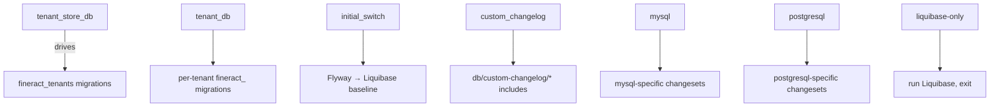

Every schema mutation in Apache Fineract is a `<changeSet>` inside a Liquibase XML file. This page covers the conventions the project follows: how files are named, how the `id` / `author` / `context` attributes are used, the `mysql` vs `postgresql` dual-changeset pattern that keeps the same logical change portable across both engines, the `preConditions` idiom used for data-aware migrations, and the `CustomTaskChange` extension point that runs arbitrary Java when SQL is insufficient.

## File and directory naming

```text
<module-root>/src/main/resources/db/changelog/
├── db.changelog-master.xml             # only in fineract-provider
├── tenant-store/
│   ├── changelog-tenant-store.xml      # post-initial-switch list
│   ├── initial-switch-changelog-tenant-store.xml
│   ├── parts/
│   │   └── NNNN_short_description.xml
│   └── upgrades/
│       └── 0000_upgrade_to_1.6.xml
└── tenant/
    ├── changelog-tenant.xml            # post-initial-switch list
    ├── final-changelog-tenant.xml      # after all module includes
    ├── initial-switch-changelog-tenant.xml
    ├── parts/
    │   └── NNNN_short_description.xml
    ├── upgrades/
    │   ├── 0000_upgrade_to_1.5.xml
    │   └── 0000_upgrade_to_1.6.xml
    └── module/                         # only in non-provider modules
        └── <module-name>/
            ├── module-changelog-master.xml
            └── parts/
                └── NNNN_short_description.xml
```

Convention notes:

- **`parts/NNNN_name.xml`** — the actual change content. NNNN is zero-padded and globally unique *within the directory*. New files always append at the end.
- **`upgrades/0000_upgrade_to_X.Y.xml`** — version-pinned major-version upgrade scripts, separate from `parts/` so they can be conditionally run when migrating from a specific older version.
- **`changelog-tenant.xml` / `changelog-tenant-store.xml`** — list of `<include>` directives that compose the parts in order. Maintained manually; new parts must be appended.
- **`initial-switch-*.xml`** — only includes the first one or two parts (`0001_initial_schema.xml`, `0002_initial_data.xml`). Run under context `initial_switch` for Flyway → Liquibase migration.
- **`final-changelog-tenant.xml`** — runs after every module's master, holds cross-module final constraints (currently only `parts/0146_add_final_constraints.xml`).

The number prefix carries dual meaning:

| Range | Owner |
| ----- | ----- |
| `0001`–`0999` | Provider's main changelog (`tenant/parts/`) or any module that hasn't reserved a range |
| `1000`–`1999` | `fineract-loan` |
| `2000`–`2999` | `fineract-savings` |
| `3000`–`3999` | `fineract-accounting` (reserved, currently empty) |
| `5000`–`5999` | `fineract-progressive-loan` |

The convention is documented as a comment at the top of each module master:

```xml
<!-- Sequence is starting from 2000 to make it easier to move existing liquibase changesets here -->
```

This lets engineers move legacy provider changesets into the new module without renumbering their `id`s.

## changeSet structure

A minimal changeset:

```xml
<changeSet author="fineract" id="1001-1">
    <addColumn tableName="m_loan_charge">
        <column name="created_on_utc" type="DATETIME(6)"/>
        <column name="last_modified_on_utc" type="DATETIME(6)"/>
    </addColumn>
</changeSet>
```

Required attributes per Liquibase: `id` (unique within the file) and `author`. Fineract conventions:

| Attribute | Convention |
| --------- | ---------- |
| `author` | Always `fineract`. Original author identity is irrelevant once merged — every changeset belongs to the project. |
| `id` | `<part-number>-<sub-counter>` (e.g. `1001-1`, `1001-2`). The same `id` may appear twice in one file if it differs by `context` (mysql/postgresql split). |
| `context` | Used for `mysql` / `postgresql` dialect splits, for `tenant_db` vs `tenant_store_db`, and for `initial_switch` baseline. |
| `runAlways` | Rare. Default is run-once. |
| `failOnError` | Defaults to `true`. Rarely overridden. |

### The mysql / postgresql split

When a column type differs between the two engines, Fineract writes **two parallel changesets with the same id**, gated by `context`:

```xml
<changeSet author="fineract" id="1001-1" context="mysql">
    <addColumn tableName="m_loan_charge">
        <column name="created_on_utc" type="DATETIME(6)"/>
        <column name="last_modified_on_utc" type="DATETIME(6)"/>
    </addColumn>
</changeSet>
<changeSet author="fineract" id="1001-1" context="postgresql">
    <addColumn tableName="m_loan_charge">
        <column name="created_on_utc" type="TIMESTAMP WITH TIME ZONE"/>
        <column name="last_modified_on_utc" type="TIMESTAMP WITH TIME ZONE"/>
    </addColumn>
</changeSet>
```

The application is started with **one** of `mysql` or `postgresql` always active in the context list (set by `liquibaseFactory.create(...)` based on `DatabaseTypeResolver.databaseType()`), so exactly one of the two changesets runs and `databasechangelog` gets one row for that id.

Other portable types (`BIGINT`, `VARCHAR(N)`, `BOOLEAN`, plain `DATE`) do not need the split — Liquibase handles them.

### preConditions: data-aware migrations

When a column changes nullability or constraint, Fineract uses `<preConditions>` with `onFail="MARK_RAN"` to skip the changeset cleanly if its precondition fails:

```xml
<changeSet id="1001-4" author="fineract" context="mysql">
    <preConditions onFail="MARK_RAN">
        <sqlCheck expectedResult="0">select count(*) from m_loan_charge</sqlCheck>
    </preConditions>
    <addNotNullConstraint tableName="m_loan_charge" columnName="created_on_utc"
                          columnDataType="DATETIME(6)"/>
    <addNotNullConstraint tableName="m_loan_charge" columnName="last_modified_on_utc"
                          columnDataType="DATETIME(6)"/>
</changeSet>
```

`onFail="MARK_RAN"` means: if the precondition is false (`m_loan_charge` has rows, so we can't safely add NOT NULL without first backfilling), record the changeset as "ran" in `databasechangelog` so it won't be retried. That deliberately *skips* the constraint on existing deployments while still applying it on fresh databases.

The available `onFail` actions:

| Value | Behavior |
| ----- | -------- |
| `HALT` (default) | Throw — Liquibase aborts the migration. Used when the precondition represents an *invariant* that must hold. |
| `MARK_RAN` | Skip + record as ran. Used for "only on fresh DB" idioms. |
| `CONTINUE` | Skip + don't record. Used when the changeset must be retried on subsequent boots until the precondition becomes true. |
| `WARN` | Skip + log warning. Rarely used. |

Common precondition kinds in Fineract:

```xml
<preConditions onFail="MARK_RAN">
    <columnExists tableName="m_loan" columnName="some_column"/>
</preConditions>

<preConditions onFail="MARK_RAN">
    <not><columnExists tableName="m_loan" columnName="some_column"/></not>
</preConditions>

<preConditions onFail="MARK_RAN">
    <sqlCheck expectedResult="0">select count(*) from c_configuration where name = 'foo'</sqlCheck>
</preConditions>

<preConditions onFail="MARK_RAN">
    <indexExists indexName="idx_loan_external_id"/>
</preConditions>
```

These idioms together let one changelog be safely applied to:

- A brand-new empty database (most data preconditions pass, the changeset runs).
- A long-running deployment that already has data (data precondition fails, the changeset is marked-ran).

## Insert seed data

Reference data (permissions, configurations, codes) is inserted with `<insert>`:

```xml
<changeSet id="3" author="fineract">
    <insert tableName="m_permission">
        <column name="grouping" value="organisation"/>
        <column name="code" value="READ_BUSINESS_DATE"/>
        <column name="entity_name" value="BUSINESS_DATE"/>
        <column name="action_name" value="READ"/>
        <column name="can_maker_checker" valueBoolean="false"/>
    </insert>
    <insert tableName="m_permission">
        <column name="grouping" value="organisation"/>
        <column name="code" value="UPDATE_BUSINESS_DATE"/>
        <column name="entity_name" value="BUSINESS_DATE"/>
        <column name="action_name" value="UPDATE"/>
        <column name="can_maker_checker" valueBoolean="false"/>
    </insert>
</changeSet>
```

The typed `value*` attributes (`value`, `valueBoolean`, `valueNumeric`, `valueComputed`, `valueDate`) are explicit so Liquibase generates a typed parameter binding rather than string concatenation.

For dynamic values like `NOW()`, use the portable property aliases declared in the master changelog:

```xml
<column name="created_date" valueComputed="${current_datetime}"/>
<column name="external_id"  valueComputed="${uuid}"/>
```

## Table creation pattern

The typical `createTable` from `0015_add_business_date.xml`:

```xml
<changeSet author="fineract" id="1">
    <createTable tableName="m_business_date">
        <column autoIncrement="true" name="id" type="BIGINT">
            <constraints nullable="false" primaryKey="true"/>
        </column>
        <column name="type" type="VARCHAR(100)">
            <constraints unique="true" nullable="false"/>
        </column>
        <column name="date" type="DATE">
            <constraints unique="false" nullable="false"/>
        </column>
        <column name="createdby_id" type="BIGINT"/>
        <column name="created_date" type="DATETIME "/>
        <column name="version" type="BIGINT">
            <constraints nullable="false"/>
        </column>
        <column defaultValueComputed="NULL" name="lastmodifiedby_id" type="BIGINT"/>
        <column defaultValueComputed="NULL" name="lastmodified_date" type="DATETIME"/>
    </createTable>
</changeSet>
```

Conventions:

- Surrogate PK named `id`, `autoIncrement="true"`, type `BIGINT`.
- Audit fields: `createdby_id` (BIGINT → `m_appuser.id`), `created_date`, `lastmodifiedby_id`, `lastmodified_date`. Newer tables also include `created_on_utc` / `last_modified_on_utc` of type `DATETIME(6)` (MySQL) or `TIMESTAMP WITH TIME ZONE` (PostgreSQL).
- Optimistic locking: `version` column of type `BIGINT NOT NULL`, mapped to `@Version` in JPA.
- Foreign keys are added in a *separate* `<changeSet>` (`addForeignKeyConstraint`), so the table can be created against a DB that doesn't yet have the referenced table.

## addForeignKeyConstraint

```xml
<changeSet author="fineract" id="1001-3">
    <addForeignKeyConstraint baseColumnNames="created_by" baseTableName="m_loan_charge"
                             constraintName="FK_loan_charge_created_by" deferrable="false"
                             initiallyDeferred="false" onDelete="RESTRICT" onUpdate="RESTRICT"
                             referencedColumnNames="id" referencedTableName="m_appuser"
                             validate="true"/>
</changeSet>
```

Conventions:

- `constraintName` is `FK_<table>_<column>` (no `m_` prefix on the constraint name).
- `onDelete`/`onUpdate` are explicit — `RESTRICT` is the safe default for audit FKs.
- `validate="true"` enables PostgreSQL's foreign-key validation on existing rows. For very large tables a `validate="false"` follow-up is sometimes used to add the constraint quickly.

## CustomTaskChange — arbitrary Java

Some migrations cannot be expressed in SQL — encryption rotation, computed UUIDs, multi-table data shuffles. Liquibase's `CustomTaskChange` extension point lets a changeset call into Spring-managed Java:

```xml
<changeSet author="fineract" id="2" context="tenant_store_db">
    <customChange class="org.apache.fineract.infrastructure.core.service.migration.TenantPasswordEncryptionTask"/>
</changeSet>
```

The class implements `liquibase.change.custom.CustomTaskChange`:

```java
@Component
@Order(Ordered.HIGHEST_PRECEDENCE)
public class TenantPasswordEncryptionTask implements CustomTaskChange, ApplicationContextAware {

    private static DatabasePasswordEncryptor databasePasswordEncryptor;

    private Map<String, Boolean> done = new ConcurrentHashMap<>();

    @Override
    public void execute(Database database) throws CustomChangeException {
        JdbcConnection dbConn = (JdbcConnection) database.getConnection();
        try (Statement selectStatement = dbConn.createStatement();
             Statement updateStatement = dbConn.createStatement()) {
            try (ResultSet rs = selectStatement.executeQuery(
                    "SELECT id, schema_password FROM tenant_server_connections")) {
                while (rs.next()) {
                    String id = rs.getString("id");
                    if (!Boolean.TRUE.equals(done.get(id))) {
                        String schemaPassword = rs.getString("schema_password");
                        String encryptedPassword = databasePasswordEncryptor.encrypt(schemaPassword);
                        String updateSql = String.format(
                            "update tenant_server_connections set schema_password = '%s', "
                            + "master_password_hash = '%s' where id = %s",
                            encryptedPassword, databasePasswordEncryptor.getMasterPasswordHash(), id);
                        updateStatement.execute(updateSql);
                        done.put(id, true);
                    }
                }
            }
        } catch (Exception e) {
            throw new CustomChangeException(e);
        }
    }
    ...
}
```

Implementation notes:

| Concern | Solution |
| ------- | -------- |
| Spring injection | `@ApplicationContextAware.setApplicationContext` plus a `static` field. Liquibase instantiates the class itself, bypassing Spring's bean lifecycle. |
| Bean discovery | `TenantDatabaseUpgradeService` accepts `List<CustomTaskChange> customTaskChangesForDependencyInjection` so Spring instantiates every `CustomTaskChange` bean once at startup — this is what wires the static field on each. |
| Double-execution guard | The `done` map handles a known Liquibase bug (issue [#3945](https://github.com/liquibase/liquibase/issues/3945)) where `execute` may be called twice on rollback retries. Each row tracks whether it's been processed in this JVM. |
| Transaction boundary | `JdbcConnection` is the Liquibase wrapper around `java.sql.Connection`. Liquibase manages the transaction; the custom task should not commit. |

Other `CustomTaskChange` implementations in the codebase:

- `TenantPasswordEncryptionTask` — encrypts existing `schema_password` columns and stamps `master_password_hash`.
- `TenantReadOnlyPasswordEncryptionTask` — same for `readonly_schema_password`.

## Liquibase contexts in Fineract



| Context | Source | Used in includes / changesets |
| ------- | ------ | ----------------------------- |
| `tenant_store_db` | `TenantDatabaseUpgradeService.TENANT_STORE_DB_CONTEXT` | Master changelog `<include context="tenant_store_db ...">` |
| `tenant_db` | `TENANT_DB_CONTEXT` | `<include context="tenant_db ...">` |
| `initial_switch` | `INITIAL_SWITCH_CONTEXT` | First-time baseline imports |
| `custom_changelog` | `CUSTOM_CHANGELOG_CONTEXT` | `<includeAll path="db/custom-changelog">` |
| `mysql` / `postgresql` | `LiquibaseFactory` passes the engine type | Per-changeset `context="mysql"` |
| Tenant identifier (e.g. `default`) | `liquibaseFactory.create(..., tenant.getTenantIdentifier())` | Used to defeat Liquibase's per-tenant change caching — see [issue 4.21.0 release note](https://github.com/apache/fineract) |
| `liquibase-only` | Spring profile | Application-level — Liquibase runs, app exits without serving HTTP |

Context expressions like `tenant_db AND !initial_switch` are exactly the syntax Liquibase parses — `AND`, `OR`, `!` for negation, parentheses for grouping.

## Naming a new changeset

Checklist when adding a new file under `parts/`:

1. Pick the next free `NNNN_` prefix in the target directory.
2. Inside, give each changeset a stable `id` (`<prefix>-<n>`) and `author="fineract"`.
3. Use `context="mysql"` / `context="postgresql"` only when types or SQL differ — otherwise leave it unset (the include's outer context still gates it).
4. Wrap data migrations in `preConditions onFail="MARK_RAN"` so existing deployments don't trip.
5. Add a single `<include>` line to the relevant `module-changelog-master.xml` or `changelog-tenant.xml`, **appended at the end**.
6. Do *not* modify any existing `<changeSet>` once it has been merged — Liquibase will reject the changed checksum on the next boot. To "fix" a changeset, write a new one that performs the corrective DDL.

## Validation pre-commit

The `gradle :fineract-provider:test` build runs Liquibase against an embedded DB to confirm the entire changelog applies cleanly. The `liquibase-only` Spring profile combined with a throwaway docker MariaDB is the recommended local check:

```bash
SPRING_PROFILES_ACTIVE=liquibase-only \
  FINERACT_HIKARI_JDBC_URL=jdbc:mariadb://localhost:3306/fineract_tenants \
  ./gradlew bootRun
```

## Cross-references

- [Database / Overview](/database/overview)
- [Database / Per-Module Changelogs](/database/per-module-changelogs)
- [Database / Tenant vs Tenant-Store](/database/tenant-vs-tenant-store)
- [Tenancy / Overview](/tenancy/overview)
- [Config / JDBC Environment Variables](/config/jdbc-env-variables)
