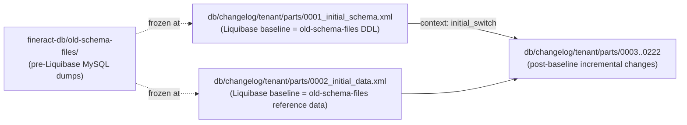

`fineract-db/old-schema-files/` is the Apache Fineract project's archaeology drawer. The four SQL files inside it predate the Flyway → Liquibase migration and represent the *original* Mifos X schema at the time the platform forked into Fineract. They are kept in source control as a historical reference: useful for understanding the genesis of tables, for debugging legacy customer migrations, and for tooling that needs the original Mifos X SQL shape. They are **not** run by the application at startup — every modern bootstrap goes through Liquibase.

## Contents

```text
fineract-db/old-schema-files/
├── 0001a-mifosplatform-core-ddl-latest.sql            # 949 lines  — schema DDL
├── 0002-mifosx-base-reference-data-utf8.sql           # 334 lines  — reference / lookup data
├── 0003-mifosx-permissions-and-authorisation-utf8.sql # 353 lines  — permissions seed
└── 0004-mifosx-core-reports-utf8.sql                  #  30 lines  — Stretchy report seed
```

Total: ~1,666 lines of MySQL-dialect SQL frozen at the Mifos X cutover (circa 2013 based on dump headers). Each file targets the **per-tenant business DB** (`fineract_default` or equivalent), not the master `fineract_tenants`.

| File | Purpose | Today's equivalent (Liquibase) |
| ---- | ------- | ------------------------------ |
| `0001a-mifosplatform-core-ddl-latest.sql` | `CREATE TABLE` for every business table | `db/changelog/tenant/parts/0001_initial_schema.xml` |
| `0002-mifosx-base-reference-data-utf8.sql` | `INSERT INTO m_currency`, `r_enum_value`, `c_configuration` seed | `db/changelog/tenant/parts/0002_initial_data.xml` |
| `0003-mifosx-permissions-and-authorisation-utf8.sql` | `m_permission`, `m_role`, `m_role_permission` seed | `db/changelog/tenant/parts/0002_initial_data.xml` (merged) + many subsequent permission changesets |
| `0004-mifosx-core-reports-utf8.sql` | `stretchy_report`, `stretchy_parameter`, `stretchy_report_parameter` (default reports) | `db/changelog/tenant/parts/0002_initial_data.xml` plus per-feature reporting changesets |

## 0001a-mifosplatform-core-ddl-latest.sql

A flat MySQL DDL file that begins by dropping every legacy table:

```sql
-- drop tables in base-schema
SET foreign_key_checks = 0;

-- drop accounting subsystem
DROP TABLE IF EXISTS `acc_gl_account`;
DROP TABLE IF EXISTS `acc_gl_closure`;
DROP TABLE IF EXISTS `acc_gl_journal_entry`;
DROP TABLE IF EXISTS `acc_product_mapping`;

-- drop portfolio subsystem
DROP TABLE IF EXISTS `c_configuration`;
DROP TABLE IF EXISTS `m_appuser`;
DROP TABLE IF EXISTS `m_appuser_role`;
DROP TABLE IF EXISTS `m_calendar`;
DROP TABLE IF EXISTS `m_calendar_instance`;
DROP TABLE IF EXISTS `m_charge`;
DROP TABLE IF EXISTS `m_client`;
DROP TABLE IF EXISTS `m_client_identifier`;
DROP TABLE IF EXISTS `m_code`;
DROP TABLE IF EXISTS `m_code_value`;
DROP TABLE IF EXISTS `m_currency`;
... (about 50 DROPs)
SET foreign_key_checks = 1;
```

Then proceeds to recreate every table:

```sql
-- DDL for reference/lookup tables
CREATE TABLE `m_currency` (
  `id` BIGINT NOT NULL AUTO_INCREMENT,
  `code` varchar(3) NOT NULL,
  `decimal_places` SMALLINT NOT NULL,
  `display_symbol` varchar(10) DEFAULT NULL,
  `name` varchar(50) NOT NULL,
  `internationalized_name_code` varchar(50) NOT NULL,
  PRIMARY KEY (`id`),
  UNIQUE KEY `code` (`code`)
) ENGINE=InnoDB DEFAULT CHARSET=UTF8MB4;

CREATE TABLE `m_organisation_currency` (
  `id` BIGINT NOT NULL AUTO_INCREMENT,
  ...
);
```

The tables defined here are the historical core set:

| Subsystem | Sample tables |
| --------- | ------------- |
| Accounting | `acc_gl_account`, `acc_gl_closure`, `acc_gl_journal_entry`, `acc_product_mapping` |
| App users / security | `m_appuser`, `m_appuser_role`, `m_role`, `m_role_permission`, `m_permission` |
| Office hierarchy | `m_office`, `m_office_transaction`, `m_staff` |
| Currency | `m_currency`, `m_organisation_currency` |
| Clients | `m_client`, `m_client_identifier`, `m_group`, `m_group_level`, `m_group_client` |
| Codes / lookups | `m_code`, `m_code_value`, `r_enum_value` |
| Loans | `m_product_loan`, `m_product_loan_charge`, `m_loan`, `m_loan_charge`, `m_loan_arrears_aging`, `m_loan_collateral`, `m_loan_officer_assignment_history`, `m_loan_repayment_schedule`, `m_loan_transaction` |
| Savings / deposit | `m_savings_product`, `m_savings_account`, `m_savings_account_transaction`, `m_product_deposit`, `m_deposit_account`, `m_deposit_account_transaction` |
| Calendar / fund | `m_calendar`, `m_calendar_instance`, `m_fund`, `m_charge` |
| Guarantor / notes | `m_guarantor`, `m_note`, `m_document` |
| Command queue | `m_portfolio_command_source` |
| Configuration | `c_configuration`, `x_registered_table` |
| Reporting | `stretchy_report`, `stretchy_parameter`, `stretchy_report_parameter`, `rpt_sequence` |

The DDL uses MySQL-specific syntax — `ENGINE=InnoDB`, `DEFAULT CHARSET=UTF8MB4`, `AUTO_INCREMENT`. There is no PostgreSQL variant in this directory; the PostgreSQL path was added later via Liquibase.

### Why "0001a"?

The leading `0001a` denotes file ordering — `0001a-mifosplatform-core-ddl-latest.sql` must be applied before `0002-mifosx-base-reference-data-utf8.sql`, which depends on the tables existing. The `a` suffix distinguishes the *DDL* from the legacy `0001b-gk-datatables.sql` (see [Demo Backups](/database/demo-backups)) that added extra customer-specific datatables.

## 0002-mifosx-base-reference-data-utf8.sql

The reference-data companion — `INSERT INTO` for everything the platform expects to be pre-populated:

```sql
-- currency symbols may not apply through command line on windows
-- so use a different client like mysql workbench

INSERT INTO `c_configuration`
(`name`, `enabled`)
VALUES
('maker-checker', 0);

INSERT INTO `r_enum_value`
VALUES
('amortization_method_enum',0,'Equal principle payments','Equal principle payments'),
('amortization_method_enum',1,'Equal installments','Equal installments'),
('interest_calculated_in_period_enum',0,'Daily','Daily'),
('interest_calculated_in_period_enum',1,'Same as repayment period','Same as repayment period'),
('interest_method_enum',0,'Declining Balance','Declining Balance'),
('interest_method_enum',1,'Flat','Flat'),
('interest_period_frequency_enum',2,'Per month','Per month'),
('interest_period_frequency_enum',3,'Per year','Per year'),
('loan_status_id',100,'Submitted and awaiting approval','Submitted and awaiting approval'),
('loan_status_id',200,'Approved','Approved'),
('loan_status_id',300,'Active','Active'),
('loan_status_id',400,'Withdrawn by client','Withdrawn by client'),
... (lots more enum rows)
```

Plus `m_currency` (every ISO-4217 currency with symbol and decimal places) and a couple of `m_code` seed values. The `r_enum_value` rows are how Fineract maps integer status codes in `m_loan.loan_status_id` to display strings — every business entity has a parallel set of rows here.

The comment about currency symbols and Windows is a historical reminder — the file uses UTF8 character literals (`$`, `€`, `₹`) that some Windows terminals corrupt; the recommendation is to use MySQL Workbench instead of `mysql < ...`.

## 0003-mifosx-permissions-and-authorisation-utf8.sql

Sets up the entire permission tree plus the bootstrap super-user. The file opens with a warning:

```sql
-- ========= roles and permissions =========

/*
this scripts removes all current m_role_permission and m_permission entries
and then inserts new m_permission entries and just one m_role_permission entry
which gives the role (id 1 - super user) an ALL_FUNCTIONS permission

If you had other roles set up with specific permissions you will have to set up their
permissions again.
*/
```

Then `TRUNCATE`s `m_role_permission` and `m_permission` and re-inserts them — a destructive operation. **This is why this file is dangerous to apply to a non-empty DB.** It is intended for fresh installs only.

After this script, the DB contains:

- The full permission catalog (`READ_*`, `CREATE_*`, `UPDATE_*`, `DELETE_*`, `APPROVE_*`, `REJECT_*`, etc. — hundreds of rows).
- One role: `Super user` (id = 1) with `ALL_FUNCTIONS`.
- The role is linked to one default app user (typically `mifos` / `password`).

Today's Liquibase changesets achieve the same outcome incrementally — every new feature ships a changeset that inserts its specific permissions (e.g. `0011_add_credit_balance_refund_permission.xml`), never a wholesale truncate-and-replace.

## 0004-mifosx-core-reports-utf8.sql

The smallest file, 30 lines. Seeds the **Stretchy reporting** subsystem — Fineract's built-in SQL-template report engine — with the original report library:

```sql
truncate table stretchy_report;
truncate table stretchy_parameter;
truncate table stretchy_report_parameter;

INSERT INTO `stretchy_report` VALUES (1,'Client Listing','Table',NULL,'Client','select ...');
INSERT INTO `stretchy_report` VALUES (2,'Client Loans Listing','Table',NULL,'Client','select ...');
INSERT INTO `stretchy_report` VALUES (5,'Loans Awaiting Disbursal','Table',NULL,'Loan','SELECT ...');
INSERT INTO `stretchy_report` VALUES (6,'Loans Awaiting Disbursal Summary','Table',NULL,'Loan','SELECT ...');
...

INSERT INTO `stretchy_parameter` VALUES (1,'startDateSelect','startDate','startDate','date','date','today',...);
INSERT INTO `stretchy_parameter` VALUES (5,'OfficeIdSelectOne','officeId','Office','select','number','0',...);
INSERT INTO `stretchy_parameter` VALUES (10,'currencyIdSelectAll','currencyId','Currency','select','number','0',...);
...

INSERT INTO `stretchy_report_parameter` VALUES (1,5,NULL),(2,5,NULL),(2,6,NULL),...;

insert into m_permission(grouping, `code`, entity_name, action_name, can_maker_checker)
select 'report', concat('READ_', r.report_name), r.report_name, 'READ', false
from stretchy_report r;
```

The final `INSERT INTO m_permission` is generated programmatically — for every row in `stretchy_report`, create a corresponding `READ_<reportName>` permission. So the reports are dynamically permission-controlled.

The included report library covers the classic microfinance metrics:

- **Client reports**: "Client Listing", "Client Loans Listing"
- **Loan portfolio**: "Loans Awaiting Disbursal", "Loans Pending Approval", "Active Loans - Summary", "Active Loans - Details", "Obligation Met Loans Details", "Obligation Met Loans Summary", "Portfolio at Risk", "Aging Summary (Arrears in Months)"
- **Cash flow**: "Branch Expected Cash Flow", "Expected Payments By Date - Basic", "Expected Payments By Date - Formatted", "Loan Account Schedule"

Each report carries an embedded SQL template with `${parameterName}` placeholders. The runtime engine substitutes parameter values before executing the SQL against the tenant DB.

## How to use these files today

The honest answer: **don't**, unless one of these specific scenarios applies.

| Scenario | What to do |
| -------- | ---------- |
| Fresh install of latest Fineract | Use Liquibase — let the application bootstrap itself. Ignore `old-schema-files/` entirely. |
| Recovering a Mifos X SQL backup taken before the Flyway → Liquibase migration | Restore the backup, then start Fineract pointed at the restored DB. `TenantDatabaseStateVerifier` will detect Flyway-era state and apply `initial_switch` + post-baseline parts. You do not need to re-apply `0001a`. |
| Schema archaeology — "when did column X first appear?" | Search `0001a-mifosplatform-core-ddl-latest.sql` for the column. If present, it predates Liquibase; if absent, search `db/changelog/tenant/parts/` and `db/changelog/tenant/module/*/parts/` chronologically. |
| Stretchy report template reference | Open `0004-mifosx-core-reports-utf8.sql` to see the original SQL bodies. Modern reports may have been modified by later changesets — check the `stretchy_report` table on a live tenant DB for the current versions. |
| Manual bootstrap on a system without Liquibase | Apply in order: `0001a` → `0002` → `0003` → `0004`. Then the DB matches the pre-Liquibase state and Fineract can take it from there. |

## Relationship to Liquibase changesets



The Liquibase initial-switch parts were originally generated by **inlining** the SQL from these files into Liquibase `<sql>` directives. Once a Fineract instance has run the initial-switch path, the `databasechangelog` table records `0001_initial_schema.xml` and `0002_initial_data.xml` as applied, and the old-schema files are no longer consulted by anything.

A practical consequence: every column / row produced by `old-schema-files/` is also present in `db/changelog/tenant/parts/0001_initial_schema.xml` (and `0002_initial_data.xml`) at the byte level. They are duplicates with different formats. If you ever need to debug "why is column X different between the SQL file and what's in my DB", the truth is whatever `0001_initial_schema.xml` says — the SQL files have not been updated since the cutover.

## Compatibility with PostgreSQL

These files are **MySQL-only**. They contain MySQL-specific constructs:

- `ENGINE=InnoDB` storage-engine clauses
- `tinyint` (PostgreSQL uses `BOOLEAN` or `SMALLINT`)
- Backtick-quoted identifiers (`` `m_loan` `` — PostgreSQL uses double-quotes)
- `AUTO_INCREMENT` (PostgreSQL uses `BIGSERIAL` / `IDENTITY`)
- `LOCK TABLES` / `UNLOCK TABLES`
- MySQL session-variable comment hints (`/*!40101 SET ... */`)

To bring a PostgreSQL Fineract instance into being, do not run these files. Use the Liquibase path which handles dialect translation per changeset.

## Cross-references

- [Database / Overview](/database/overview)
- [Database / SQL and Bootstrap](/database/sql-and-bootstrap)
- [Database / Demo Backups](/database/demo-backups)
- [Database / Liquibase Changesets](/database/liquibase-changesets)
- [Database / Per-Module Changelogs](/database/per-module-changelogs)
