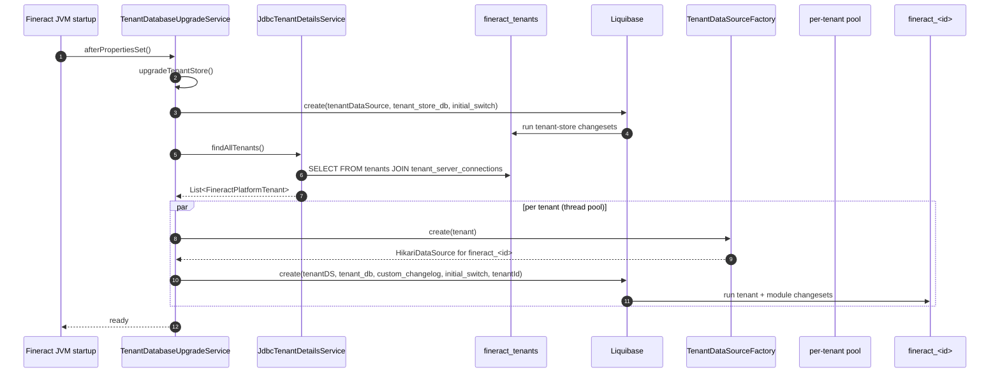

Apache Fineract uses **Liquibase** as the single source of truth for schema evolution. Every column added, table dropped, index created, or seed row inserted goes through a Liquibase changeset. The legacy SQL files under `fineract-db/` are retained for historical reference and demo data only — they are not run by the application at startup. This page is the map: it explains the two-database layout the changelogs target, the per-module structure that splits the master changelog across `fineract-*` Gradle modules, and the bootstrap sequence that ties it all together.

## The two-database split (recap)

Fineract migrates two distinct schemas on every boot:

| DB | Liquibase context | Where it lives | What it stores |
| -- | ----------------- | -------------- | -------------- |
| `fineract_tenants` (master) | `tenant_store_db` | `fineract-provider/src/main/resources/db/changelog/tenant-store/` | `tenants`, `tenant_server_connections`, `timezones` |
| `fineract_<id>` (per tenant) | `tenant_db` | `fineract-provider/.../tenant/` + every `fineract-*/...tenant/module/<name>/` | all business tables (`m_loan`, `m_savings_account`, `m_journal_entry`, etc.) |

A third context, `initial_switch`, gates the one-shot Flyway→Liquibase baseline (`0001_initial_schema.xml`, `0002_initial_data.xml`) for both DBs. A fourth, `custom_changelog`, optionally includes deployment-specific changesets from `db/custom-changelog/`.

```mermaid
flowchart TB
    subgraph master["fineract-provider db.changelog-master.xml"]
        M0[("property: current_date / current_datetime / uuid")]
        M1["tenant-store/initial-switch-changelog-tenant-store.xml<br/>tenant_store_db AND initial_switch"]
        M2["tenant-store/changelog-tenant-store.xml<br/>tenant_store_db AND !initial_switch"]
        M3["tenant/initial-switch-changelog-tenant.xml<br/>tenant_db AND initial_switch"]
        M4["tenant/changelog-tenant.xml<br/>tenant_db AND !initial_switch"]
        M5["db/changelog/tenant/module/loan/module-changelog-master.xml"]
        M6["db/changelog/tenant/module/investor/module-changelog-master.xml"]
        M7["db/changelog/tenant/module/savings/parts/module-changelog-master.xml"]
        M8["db/changelog/tenant/module/progressiveloan/module-changelog-master.xml"]
        M9["db/changelog/tenant/module/loanorigination/module-changelog-master.xml"]
        M10["db/changelog/tenant/module/command/module-changelog-master.xml"]
        M11["db/changelog/tenant/module/workingcapitalloan/module-changelog-master.xml"]
        M12["tenant/final-changelog-tenant.xml<br/>(after modules)"]
    end
    M0 --> M1 --> M2 --> M3 --> M4 --> M5 --> M6 --> M7 --> M8 --> M9 --> M10 --> M11 --> M12
```



The master changelog is located at `fineract-provider/src/main/resources/db/changelog/db.changelog-master.xml` and is referenced from `application.properties`:

```properties
spring.liquibase.enabled=${FINERACT_LIQUIBASE_ENABLED:true}
spring.liquibase.changeLog=classpath:/db/changelog/db.changelog-master.xml
```

## The bootstrap sequence



`TenantDatabaseUpgradeService`'s constants make the contexts explicit:

```java
public static final String TENANT_STORE_DB_CONTEXT = "tenant_store_db";
public static final String INITIAL_SWITCH_CONTEXT = "initial_switch";
public static final String TENANT_DB_CONTEXT = "tenant_db";
public static final String CUSTOM_CHANGELOG_CONTEXT = "custom_changelog";
```

When `TenantDatabaseUpgradeService.afterPropertiesSet()` runs:

1. **Tenant store upgrade.** Single-threaded. If `TenantDatabaseStateVerifier.isFirstLiquibaseMigration(tenantDataSource)` returns `true`, the initial-switch context is added so the Flyway baseline is replayed; otherwise only `tenant_store_db` is active. The changelog runs end-to-end.
2. **Per-tenant upgrades.** `findAllTenants()` returns every row from `tenants ⨝ tenant_server_connections`. A `ThreadPoolTaskExecutor` (sized by `fineract.task-executor.tenant-upgrade-*`) submits one upgrade task per tenant. Each task constructs its own `HikariDataSource` via `TenantDataSourceFactory.create(tenant)` (not the routing pool — Liquibase would hold a connection too long), sets `ThreadLocalContextUtil.setTenant(tenant)`, then runs Liquibase with contexts `tenant_db` + `custom_changelog` + (conditionally) `initial_switch` + the tenant identifier as a context (to defeat changeset caching across tenants).

The whole thing skips if:

- `fineract.mode.write-enabled=false` (read-only or batch-only mode), or
- `spring.liquibase.enabled=false`, or
- The `liquibase-only` profile is active (then Liquibase runs and the app exits).

```java
private boolean notLiquibaseOnlyMode() {
    List<String> activeProfiles = Arrays.asList(environment.getActiveProfiles());
    return !activeProfiles.contains(FineractProfiles.LIQUIBASE_ONLY);
}
```

## Per-module composition

Liquibase changesets live in *multiple* Gradle modules to keep ownership clean. Each module that owns business tables contributes its own `module-changelog-master.xml` and a `parts/` directory:

| Gradle module | Master changelog | Parts | Sequence prefix |
| ------------- | ---------------- | ----- | --------------- |
| `fineract-loan` | `db/changelog/tenant/module/loan/module-changelog-master.xml` | 34 (`1001`–`1034`) | 1000s |
| `fineract-savings` | `db/changelog/tenant/module/savings/parts/module-changelog-master.xml` | 4 (`2001`–`2004`) | 2000s |
| `fineract-accounting` | `jpa/accounting/db/changelog/tenant/module/accounting/module-changelog-master.xml` | 0 (empty placeholder) | 3000s |
| `fineract-investor` | `db/changelog/tenant/module/investor/module-changelog-master.xml` | 22 (`0001`–`0022`) | 0000s |
| `fineract-progressive-loan` | `db/changelog/tenant/module/progressiveloan/module-changelog-master.xml` | 3 (`5001`–`5003`) | 5000s |
| `fineract-loan-origination` | `db/changelog/tenant/module/loanorigination/module-changelog-master.xml` | 4 (`0001`–`0004`) | 0000s |
| `fineract-command` | `db/changelog/tenant/module/command/module-changelog-master.xml` | 2 (`0001`–`0002`) | 0000s |
| `fineract-working-capital-loan` | `db/changelog/tenant/module/workingcapitalloan/module-changelog-master.xml` | 10 (`0001`–`0010`) | 0000s |
| `fineract-branch` | `db/changelog/tenant/module/branch/module-changelog-master.xml` | (placeholder) | — |
| `fineract-charge` | `jpa/charge/db/changelog/tenant/module/charge/module-changelog-master.xml` | (placeholder) | — |
| `fineract-rates` | `jpa/rates/db/changelog/tenant/module/rates/module-changelog-master.xml` | (placeholder) | — |
| `fineract-provider` | `db/changelog/tenant/changelog-tenant.xml` | 222 (`0003`–`0222`) | 0000s |
| `fineract-provider` (store) | `db/changelog/tenant-store/changelog-tenant-store.xml` | 12 (`0001`–`0011`) | 0000s |

See [Per-Module Changelogs](/database/per-module-changelogs) for the file-by-file index.

## How modules are composed at runtime

Liquibase resolves `<include>` directives relative to the *classpath* — every module's JAR contributes its `db/changelog/tenant/module/<name>/` directory to the same classpath path, and the master XML at `fineract-provider/.../db.changelog-master.xml` lists each one by its module-relative path:

```xml
<!-- db/changelog/db.changelog-master.xml -->
<include file="db/changelog/tenant/module/loan/module-changelog-master.xml"
         context="tenant_db AND !initial_switch"/>
<include file="db/changelog/tenant/module/investor/module-changelog-master.xml"
         context="tenant_db AND !initial_switch"/>
<include file="db/changelog/tenant/module/savings/parts/module-changelog-master.xml"
         context="tenant_db AND !initial_switch"/>
<includeAll path="db/custom-changelog" errorIfMissingOrEmpty="false"
            context="tenant_db AND !initial_switch AND custom_changelog"/>
<include file="/db/changelog/tenant/module/progressiveloan/module-changelog-master.xml"
         context="tenant_db AND !initial_switch"/>
<include file="db/changelog/tenant/module/loanorigination/module-changelog-master.xml"
         context="tenant_db AND !initial_switch"/>
<include file="db/changelog/tenant/module/command/module-changelog-master.xml"
         context="tenant_db AND !initial_switch"/>
<include file="db/changelog/tenant/module/workingcapitalloan/module-changelog-master.xml"
         context="tenant_db AND !initial_switch"/>
<include file="tenant/final-changelog-tenant.xml" relativeToChangelogFile="true"
         context="tenant_db AND !initial_switch"/>
```

The comment in the file is intentional and important:

> Add new module to the end of this modules list (to keep the existing auto-increment identifiers)

Liquibase tracks every applied changeset in the `databasechangelog` table by `(id, author, filename)`. Re-ordering existing includes is fine (the rows are addressed by file path, not order), but **inserting a new module in the middle** would change the file paths of subsequent included entries because Liquibase deduplication is by path, breaking idempotency. The convention is to append.

The final include — `tenant/final-changelog-tenant.xml` — is reserved for cross-module constraints that depend on every module's tables existing:

```xml
<!-- final-changelog-tenant.xml -->
<include file="parts/0146_add_final_constraints.xml" relativeToChangelogFile="true"/>
```

## fineract-db: the legacy archive

The `fineract-db` directory at the repository root is not a Gradle module that ships in production — it is a documentation / archival artifact:

```text
fineract-db/
├── mifospltaform-tenants-first-time-install.sql   # legacy MySQL bootstrap of fineract_tenants
├── multi-tenant-demo-backups/                     # opinionated demo tenant DBs
│   ├── 0001-mifos-platform-shared-tenants.sql
│   ├── bare-bones-demo/
│   ├── ceda/
│   ├── default-demo/
│   ├── gk-maarg/
│   └── latam-demo/
└── old-schema-files/                              # pre-Liquibase full DDL dumps
    ├── 0001a-mifosplatform-core-ddl-latest.sql
    ├── 0002-mifosx-base-reference-data-utf8.sql
    ├── 0003-mifosx-permissions-and-authorisation-utf8.sql
    └── 0004-mifosx-core-reports-utf8.sql
```

`old-schema-files/` is the pre-1.0 Mifos X full SQL dump — useful for archaeology and for verifying "what did the schema look like before Liquibase". `multi-tenant-demo-backups/` provides ready-to-load sample data so developers can stand up `bk_mifostenant-default.sql` in seconds. See [Old Schema Files](/database/old-schema-files) and [Demo Backups](/database/demo-backups) for details.

These files are **not** run by `TenantDatabaseUpgradeService`. They are only useful for manual `mysql < ...` imports.

## The `liquibase-only` profile

Setting `SPRING_PROFILES_ACTIVE=liquibase-only` (or `--spring.profiles.active=liquibase-only`) brings up enough of the Spring context to run `TenantDatabaseUpgradeService`, then exits. The matching conditions:

```java
// FineractLiquibaseOnlyApplicationCondition
return activeProfiles.contains(FineractProfiles.LIQUIBASE_ONLY);

// FineractWebApplicationCondition
return !activeProfiles.contains(FineractProfiles.LIQUIBASE_ONLY);
```

Use cases:

- CI pipelines that want to verify the changelog applies cleanly to a fresh DB.
- Production cutover where you run schema migrations as a Kubernetes `Job` separately from the application `Deployment`.
- Local dev where you `./gradlew bootRun --args='--spring.profiles.active=liquibase-only'` to migrate without booting Tomcat.

In `liquibase-only` mode `TenantDatabaseUpgradeService.notLiquibaseOnlyMode()` returns `false`, so the read-only/write-enabled gates do not apply — Liquibase always runs.

## Database type abstraction

Fineract supports **MariaDB/MySQL and PostgreSQL** out of the same changelogs. Two strategies make this work:

1. **Liquibase abstract types.** Most changesets use Liquibase's portable column types (`BIGINT`, `VARCHAR(100)`, `DATETIME`, `BOOLEAN`) which the driver maps to the dialect.
2. **Context-conditional changesets.** When portability isn't enough, two parallel changesets are written with `dbms="mysql"` / `dbms="postgresql"` attributes, e.g. `0003_postgresql_specific_initial_data.xml`.

The master changelog also defines portable property aliases:

```xml
<property name="current_date" value="CURDATE()" context="mysql"/>
<property name="current_date" value="CURRENT_DATE" context="postgresql"/>
<property name="current_datetime" value="NOW()"/>
<property name="uuid" value="uuid()" context="mysql"/>
<property name="uuid" value="uuid_generate_v4()" context="postgresql"/>
```

So a changeset can write `<column name="created_date" valueComputed="${current_datetime}"/>` and stay portable.

`DatabaseTypeResolver` enforces this at runtime: it only accepts the driver class names `org.mariadb.jdbc.Driver`, `com.mysql.jdbc.Driver`, `com.mysql.cj.jdbc.Driver`, and `org.postgresql.Driver`. Anything else throws on startup.

## What this section covers

| Page | Focus |
| ---- | ----- |
| [Liquibase Changesets](/database/liquibase-changesets) | `<changeSet>` structure, file naming, custom precondition / `CustomTaskChange` |
| [Per-Module Changelogs](/database/per-module-changelogs) | Module-by-module file inventory and ordering |
| [Tenant vs Tenant-Store](/database/tenant-vs-tenant-store) | The two changelog roots and how contexts gate them |
| [SQL and Bootstrap](/database/sql-and-bootstrap) | `fineract-db/mifospltaform-tenants-first-time-install.sql` and embedded-server start |
| [Old Schema Files](/database/old-schema-files) | Pre-Liquibase full DDL dumps |
| [Demo Backups](/database/demo-backups) | `multi-tenant-demo-backups/` for quick-start tenants |

## Cross-references

- [Tenancy / Overview](/tenancy/overview)
- [Tenancy / Tenant Store vs Tenant DB](/tenancy/tenant-store-vs-tenant-db)
- [Core / Datasource Tenant Routing](/core/datasource-tenant-routing)
- [Config / JDBC Environment Variables](/config/jdbc-env-variables)
