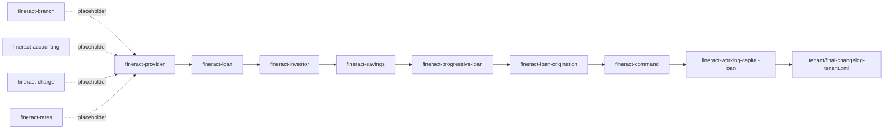

Apache Fineract splits its tenant-database schema across multiple Gradle modules so that each domain (loans, savings, investor, accounting, etc.) owns its tables in source. At runtime Liquibase merges them all into the same tenant database by `<include>`ing each module's `module-changelog-master.xml` from the master changelog in `fineract-provider`. This page is the complete index of every module that contributes changesets, with the file paths, ordering, sequence-number reservation, and a sample of the changesets each module owns.

## Composition in the master file

The master `db.changelog-master.xml` (in `fineract-provider/src/main/resources/db/changelog/`) lists module includes in their canonical order:

```xml
<include file="tenant-store/initial-switch-changelog-tenant-store.xml" relativeToChangelogFile="true"
         context="tenant_store_db AND initial_switch"/>
<include file="tenant-store/changelog-tenant-store.xml" relativeToChangelogFile="true"
         context="tenant_store_db AND !initial_switch"/>
<include file="tenant/initial-switch-changelog-tenant.xml" relativeToChangelogFile="true"
         context="tenant_db AND initial_switch"/>
<include file="tenant/changelog-tenant.xml" relativeToChangelogFile="true"
         context="tenant_db AND !initial_switch"/>
<!-- Add new module to the end of this modules list (to keep the existing auto-increment identifiers) -->
<include file="db/changelog/tenant/module/loan/module-changelog-master.xml"           context="tenant_db AND !initial_switch"/>
<include file="db/changelog/tenant/module/investor/module-changelog-master.xml"       context="tenant_db AND !initial_switch"/>
<include file="db/changelog/tenant/module/savings/parts/module-changelog-master.xml"  context="tenant_db AND !initial_switch"/>
<includeAll path="db/custom-changelog" errorIfMissingOrEmpty="false"
            context="tenant_db AND !initial_switch AND custom_changelog"/>
<include file="/db/changelog/tenant/module/progressiveloan/module-changelog-master.xml" context="tenant_db AND !initial_switch"/>
<include file="db/changelog/tenant/module/loanorigination/module-changelog-master.xml"  context="tenant_db AND !initial_switch"/>
<include file="db/changelog/tenant/module/command/module-changelog-master.xml"          context="tenant_db AND !initial_switch"/>
<include file="db/changelog/tenant/module/workingcapitalloan/module-changelog-master.xml" context="tenant_db AND !initial_switch"/>
<!-- Scripts to run after the modules were initialized -->
<include file="tenant/final-changelog-tenant.xml" relativeToChangelogFile="true"
         context="tenant_db AND !initial_switch"/>
```

The order matters for *new* tables and constraints — once an installation has applied a changeset, the position of its `<include>` is just bookkeeping (Liquibase identifies entries by file path + id + author). The comment "Add new module to the end" is enforced socially.

## Module inventory



### Quick reference

| Module | Master changelog | Sequence | Parts | Style |
| ------ | ---------------- | -------- | ----- | ----- |
| `fineract-provider` (tenant) | `db/changelog/tenant/changelog-tenant.xml` | 0003–0222 | 220 | Main business-DB content |
| `fineract-provider` (tenant-store) | `db/changelog/tenant-store/changelog-tenant-store.xml` | 0003–0011 | 9 | Master DB content |
| `fineract-loan` | `db/changelog/tenant/module/loan/module-changelog-master.xml` | 1001–1034 | 34 | Domain |
| `fineract-investor` | `db/changelog/tenant/module/investor/module-changelog-master.xml` | 0001–0022 | 22 | Domain |
| `fineract-savings` | `db/changelog/tenant/module/savings/parts/module-changelog-master.xml` | 2001–2004 | 4 | Domain |
| `fineract-progressive-loan` | `db/changelog/tenant/module/progressiveloan/module-changelog-master.xml` | 5001–5003 | 3 | Domain |
| `fineract-loan-origination` | `db/changelog/tenant/module/loanorigination/module-changelog-master.xml` | 0001–0004 | 4 | Domain |
| `fineract-command` | `db/changelog/tenant/module/command/module-changelog-master.xml` | 0001–0002 | 2 | Infrastructure |
| `fineract-working-capital-loan` | `db/changelog/tenant/module/workingcapitalloan/module-changelog-master.xml` | 0001–0010 | 10 | Domain |
| `fineract-branch` | `db/changelog/tenant/module/branch/module-changelog-master.xml` | — | 0 | Placeholder |
| `fineract-accounting` | `jpa/accounting/db/changelog/tenant/module/accounting/module-changelog-master.xml` | 3000s reserved | 0 | Placeholder |
| `fineract-charge` | `jpa/charge/db/changelog/tenant/module/charge/module-changelog-master.xml` | — | 0 | Placeholder |
| `fineract-rates` | `jpa/rates/db/changelog/tenant/module/rates/module-changelog-master.xml` | — | 0 | Placeholder |

Placeholder masters exist so that future changesets can be added without touching `db.changelog-master.xml` — they ship today with the comment `<!-- Sequence is starting from N -->` and nothing else.

## fineract-provider (the bulk)

**Tenant DB:** `fineract-provider/src/main/resources/db/changelog/tenant/`

| File | Role |
| ---- | ---- |
| `changelog-tenant.xml` | Lists `parts/0003` through `parts/0222` (220 includes) |
| `initial-switch-changelog-tenant.xml` | Lists `parts/0001_initial_schema.xml` + `parts/0002_initial_data.xml` under context `initial_switch` |
| `final-changelog-tenant.xml` | Includes `parts/0146_add_final_constraints.xml`, run after every module |
| `parts/` | 222 XML files; the actual DDL/DML |
| `upgrades/0000_upgrade_to_1.5.xml`, `0000_upgrade_to_1.6.xml` | One-shot version-pinned migrations from older releases |

Representative parts (sample selection — see the directory for full list of 222 files):

| Part | Topic |
| ---- | ----- |
| `0001_initial_schema.xml` | Flyway baseline — every legacy table at the cutover point |
| `0002_initial_data.xml` | Initial permissions, configuration rows, currency/code tables |
| `0003_postgresql_specific_initial_data.xml` | Reset PostgreSQL sequences to match auto-increment IDs from the initial data |
| `0004_camelcase_column_renaming.xml` | Rename underscore columns to camelCase to match JPA conventions |
| `0015_add_business_date.xml` | `m_business_date` table, `enable_business_date` / `enable_automatic_cob_date_adjustment` configs, READ/UPDATE permissions |
| `0021_add_spring_batch_db_structure.xml` | Spring Batch metadata tables (`batch_job_execution`, etc.) in the tenant DB |
| `0029_add_delinquency_buckets.xml` | Loan delinquency bucket reference data |
| `0146_add_final_constraints.xml` | Cross-table foreign keys gathered at the end |
| `0218_standardize_character_set_and_collation.xml` | Bulk `ALTER TABLE ... CHARACTER SET utf8mb4 COLLATE utf8mb4_unicode_ci` |
| `0220_add_login_retry_configuration.xml` | New `c_configuration` rows for login retry limits |
| `0222_transaction_summary_reports_fix_after_originator_details.xml` | Fix for a report regression |

**Tenant store DB:** `fineract-provider/src/main/resources/db/changelog/tenant-store/`

| File | Role |
| ---- | ---- |
| `changelog-tenant-store.xml` | Lists `parts/0003` through `parts/0011` (9 includes) |
| `initial-switch-changelog-tenant-store.xml` | Lists `parts/0001_initial_schema.xml` + `parts/0002_initial_data.xml` |
| `parts/0001_initial_schema.xml` | `tenants`, `tenant_server_connections`, `timezones` |
| `parts/0002_initial_data.xml` | Default tenant + default connection seeded from `${fineract.tenant.*}` params |
| `parts/0003_reset_postgresql_sequences.xml` | PostgreSQL-only sequence reset |
| `parts/0004_readonly_database_connection.xml` | Add `readonly_schema_*` columns |
| `parts/0005_jdbc_connection_string.xml` | Add `schema_connection_parameters` + `readonly_schema_connection_parameters` |
| `parts/0006_drop_retry_parameter_columns.xml` | Drop unused Hikari retry columns from the connection table |
| `parts/0007_encrypt_existing_tenant_passwords.xml` | Calls `TenantPasswordEncryptionTask` (`CustomTaskChange`) to encrypt `schema_password` |
| `parts/0007_x_extend_tenant_ro_passwords.xml` | Widen `readonly_schema_password` to VARCHAR(255) for encrypted output |
| `parts/0008_encrypt_existing_ro_tenant_passwords.xml` | Calls `TenantReadOnlyPasswordEncryptionTask` |
| `parts/0009_set_and_encrypt_ro_if_not_exists.xml` | Default RO connection to primary if missing |
| `parts/0010_set_datetime_precision.xml` | Standardize datetime precision |
| `parts/0011_standardize_character_set_and_collation.xml` | utf8mb4 for the registry tables |

## fineract-loan

```xml
<!-- module-changelog-master.xml -->
<!-- Sequence is starting from 1000 to make it easier to move existing liquibase changesets here -->
<include file="parts/1001_add_audit_fields_to_loan_charge.xml"/>
<include file="parts/1002_add_payment_allocation_rule.xml"/>
<include file="parts/1003_add_loan_product_auto_repayment_down_payment_configuration.xml"/>
<include file="parts/1004_add_external_event_configuration_for_down_payment_transaction_event.xml"/>
<include file="parts/1005_add_loan_product_repayment_start_date_configuration.xml"/>
<include file="parts/1006_add_downpayment_transaction_enum_permissions.xml"/>
<include file="parts/1007_add_loan_product_schedule_extension_for_down_payment_configuration.xml"/>
<include file="parts/1008_add_loan_installment_delinquency_tag.xml"/>
<include file="parts/1009_refactor_loan_Installment_delinquency_tag.xml"/>
<include file="parts/1010_introduce_loan_schedule_type_configuration.xml"/>
<include file="parts/1011_add_delinquency_actions_table.xml"/>
<include file="parts/1012_introduce_loan_schedule_processing_type_configuration.xml"/>
<include file="parts/1013_add_loan_account_delinquency_pause_changed_event.xml"/>
<include file="parts/1014_add_loan_account_custom_snapshot_event.xml"/>
<include file="parts/1015_remove_disable_schedule_extension_column.xml"/>
<include file="parts/1016_add_credit_allocation_rule.xml"/>
<include file="parts/1017_add_fee_and_penalty_adjustments_to_loan.xml"/>
<include file="parts/1018_rename_credited_principal_back_to_credits_amount.xml"/>
<include file="parts/1019_add_fixed_length.xml"/>
<include file="parts/1020_add_re_aged_flag_to_loan_installment.xml"/>
<include file="parts/1021_add_loan_status_change_history.xml"/>
<include file="parts/1022_add_interest_refund_support.xml"/>
<include file="parts/1023_add_charge_off_behaviour.xml"/>
<include file="parts/1024_accrual_adjustment_transaction_type.xml"/>
<include file="parts/1025_store_pre_closure_strategy_to_loan_level.xml"/>
<include file="parts/1026_add_interest_recognition_flag.xml"/>
<include file="parts/1027_add_capitalized_income_transaction_type.xml"/>
<include file="parts/1028_remove_suboptimal_indexes.xml"/>
<include file="parts/1029_add_installment_amount_in_multiples_of_to_loan.xml"/>
<include file="parts/1030_add_loan_undo_contract_termination_event.xml"/>
<include file="parts/1031_loan_merchant_buy_down_fee.xml"/>
<include file="parts/1032_add_classification_to_loan_transaction.xml"/>
<include file="parts/1033_add_reage_reasons_for_loan.xml"/>
<include file="parts/1034_loan_reamortization_parameters.xml"/>
```

Sequence 1000s. Loan is the most active module — almost every Fineract release adds multiple changesets here. Notable patterns:

- **Audit fields** added per-table (e.g. `1001_add_audit_fields_to_loan_charge.xml`).
- **Payment allocation** (`1002`, `1016`) introduces configurable repayment-rule tables (`m_payment_allocation_rule`, `m_credit_allocation_rule`).
- **Delinquency** (`1008`, `1009`, `1011`) adds delinquency-tag tables and `delinquency_action` for pauses.
- **Transaction types** added one per file (`1023_add_charge_off_behaviour.xml`, `1024_accrual_adjustment_transaction_type.xml`, `1027_add_capitalized_income_transaction_type.xml`, `1031_loan_merchant_buy_down_fee.xml`).

## fineract-investor

```xml
<!-- 0001..0022 -->
<include file="parts/0001_initial_schema.xml"/>
<include file="parts/0002_asset_schemas.xml"/>
<include file="parts/0003_asset_schemas.xml"/>
<include file="parts/0004_change_purchase_price_ratio_type.xml"/>
<include file="parts/0005_add_sale_and_buyback_command.xml"/>
<include file="parts/0006_asset_schemas.xml"/>
<include file="parts/0007_add_external_asset_owner_transfer_details.xml"/>
<include file="parts/0008_add_mappings.xml"/>
<include file="parts/0009_add_loan_ownership_transfer_events.xml"/>
<include file="parts/0010_external_transafer_status_external_transfer_id_constraints.xml"/>
<include file="parts/0011_set_datetime_precision.xml"/>
<include file="parts/0012_add_external_asset_owner_transfer_index.xml"/>
<include file="parts/0013_add_additional_asset_owner_indices.xml"/>
<include file="parts/0014_add_external_asset_owner_loan_product_configurable_attributes.xml"/>
<include file="parts/0015_add_intermediary_sale_command.xml"/>
<include file="parts/0016_add_external_reference_id.xml"/>
<include file="parts/0017_add_external_asset_owner_loan_product_attr_index.xml"/>
<include file="parts/0018_add_external_asset_owner_transfer_outstanding_interest_strategy.xml"/>
<include file="parts/0019_add_configurable_allowed_loan_statuses.xml"/>
<include file="parts/0020_add_previous_owner_reference.xml"/>
<include file="parts/0021_external_owner_reference_in_journal_entry_aggregation.xml"/>
<include file="parts/0022_add_external_asser_owner_create_permission.xml"/>
```

Module sequence starts from `0001` because it was created after the main provider had passed `0150+`. The numbers do not clash because Liquibase identifies changesets by `(id, author, filename)` — the filename includes the module path, so `parts/0001_initial_schema.xml` in `fineract-investor` is distinct from any other `0001_initial_schema.xml`.

The investor module hosts external-asset-owner tables (`m_external_asset_owner`, `m_external_asset_owner_transfer`, `m_external_asset_owner_transfer_details`) plus permissions for SALE, BUYBACK, INTERMEDIARY_SALE commands.

## fineract-savings

```xml
<!-- Sequence starts from 2000 -->
<include file="parts/2001_add_savings_accrual_job.xml"/>
<include file="parts/2002_add_savings_accrual_permission.xml"/>
<include file="parts/2003_add_accrued_till_date_to_savings_account.xml"/>
<include file="parts/2004_add_savings_account_cob_infrastructure.xml"/>
```

Small but evolving — adds accrual-side infrastructure plus the COB plumbing for savings accounts so they participate in the close-of-business workflow.

## fineract-progressive-loan

```xml
<!-- Sequence starts from 5000 -->
<include file="parts/5001_create_progressive_loan_model.xml"/>
<include file="parts/5002_add_contract_termination_transaction.xml"/>
<include file="parts/5003_add_model_version.xml"/>
```

A newer loan-product variant. `5001` creates the progressive-amortization tables; `5002` adds contract-termination transaction support; `5003` versions the model for schema-evolution tracking.

## fineract-loan-origination

```xml
<include file="parts/0001_initial_schema.xml"/>
<include file="parts/0002_permissions.xml"/>
<include file="parts/0003_mapping_permissions.xml"/>
<include file="parts/0004_add_global_config_originator_creation.xml"/>
```

Loan origination workflow tables (`m_loan_application_*`), wired with role-based permissions.

## fineract-command

```xml
<include file="parts/0001_command_init.xml"/>
<include file="parts/0002_command_fix_structure.xml"/>
```

The command-source / command-processor tables for asynchronous command execution.

## fineract-working-capital-loan

```xml
<include file="parts/0001_loan_product.xml"/>
<include file="parts/0002_wc_loan_schema.xml"/>
<include file="parts/0003_working_capital_loan_cob.xml"/>
<include file="parts/0004_extend_working_capital_loan_entity.xml"/>
<include file="parts/0005_alter_wc_loan_add_columns.xml"/>
<include file="parts/0006_wc_loan_disbursement_details.xml"/>
<include file="parts/0007_drop_flat_percentage_amount.xml"/>
<include file="parts/0008_delinquency_for_working_capital_loans.xml"/>
<include file="parts/0009_wc_loan_amortization_model.xml"/>
<include file="parts/0010_loan_account_permissions.xml"/>
```

Working-capital loan product tables, COB integration, delinquency, amortization, permissions.

## Empty / placeholder modules

These ship a master that's intentionally empty so future changesets can be added without editing `db.changelog-master.xml`:

- **`fineract-branch`** — `db/changelog/tenant/module/branch/module-changelog-master.xml`
- **`fineract-accounting`** — `jpa/accounting/db/changelog/tenant/module/accounting/module-changelog-master.xml` (sequence reserved at 3000)
- **`fineract-charge`** — `jpa/charge/db/changelog/tenant/module/charge/module-changelog-master.xml`
- **`fineract-rates`** — `jpa/rates/db/changelog/tenant/module/rates/module-changelog-master.xml`

Note that accounting/charge/rates use the `jpa/<name>/` prefix instead of plain `db/`. The classpath layout still ends up at `db/changelog/tenant/module/<name>/module-changelog-master.xml` (because Gradle copies `src/main/resources/jpa/<name>/db/...` to `db/...` in the JAR — verify by inspecting the built artifact).

## Custom changelog

The master file's `<includeAll>` directive:

```xml
<includeAll path="db/custom-changelog" errorIfMissingOrEmpty="false"
            context="tenant_db AND !initial_switch AND custom_changelog"/>
```

Adds **deployment-specific** changesets. Anything you drop into `db/custom-changelog/` (typically built as an overlay JAR) runs after the loan and investor modules but before progressive-loan, loan-origination, command, and working-capital-loan. The `custom_changelog` context must be added at runtime — `TenantDatabaseUpgradeService` does this automatically when `liquibaseFactory.create(...)` is called for a per-tenant upgrade.

This is the supported extension point for organisations that need their own tables but don't want to fork Fineract.

## When you add a new module

Steps to introduce a new Fineract module that owns tables:

1. Create `fineract-<name>/src/main/resources/db/changelog/tenant/module/<name>/module-changelog-master.xml` with the standard `<!-- Sequence is starting from XXXX -->` comment.
2. Reserve a sequence range. Current allocations: 1000s (loan), 2000s (savings), 3000s (accounting reserved), 4000s (free), 5000s (progressive-loan), 6000s+ free.
3. Add `<include>` lines for each `parts/XXXX_*.xml`.
4. Append a single `<include file="db/changelog/tenant/module/<name>/module-changelog-master.xml" context="tenant_db AND !initial_switch"/>` to `fineract-provider/src/main/resources/db/changelog/db.changelog-master.xml` **at the end** (before `final-changelog-tenant.xml`).
5. Add a Gradle dependency so the new module's resources end up on the runtime classpath of `fineract-provider`.

## Cross-references

- [Database / Overview](/database/overview)
- [Database / Liquibase Changesets](/database/liquibase-changesets)
- [Database / Tenant vs Tenant-Store](/database/tenant-vs-tenant-store)
- [Tenancy / Overview](/tenancy/overview)
