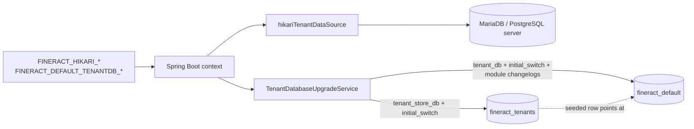

The `fineract-db/` directory at the Apache Fineract repository root is **not** a Gradle module — it is an archival folder that holds legacy SQL bootstrap files and demo data. The most important file is `mifospltaform-tenants-first-time-install.sql`, which is what a fresh MariaDB needed *before* Liquibase took over the master-DB schema. This page documents that legacy file, explains why you almost never need to run it today, and walks through the modern bootstrap path: an empty database server, environment-variable configuration, and the embedded-starter pattern that creates `fineract_tenants` and the first per-tenant DB automatically.

## fineract-db directory

```
fineract-db/
├── mifospltaform-tenants-first-time-install.sql   # legacy master-DB bootstrap (this page)
├── multi-tenant-demo-backups/                     # see /database/demo-backups
└── old-schema-files/                              # see /database/old-schema-files
```

This folder is **not on the runtime classpath**. The Gradle build does not include `fineract-db` as a module dependency of `fineract-provider`. Files here are exclusively for developer convenience — they ship with the source tree but are not packaged into the deployed JAR.

## mifospltaform-tenants-first-time-install.sql

A MySQL dump (`mysqldump 10.13 Distrib 5.1.60`) of the `fineract_tenants` schema and its seed data, frozen at the Flyway-era cutover. It defines three tables:

```sql
-- schema_version is the Flyway tracking table that pre-dated Liquibase
CREATE TABLE `schema_version` (
  `version_rank` INT NOT NULL,
  `installed_rank` INT NOT NULL,
  `version` varchar(50) NOT NULL,
  `description` varchar(200) NOT NULL,
  `type` varchar(20) NOT NULL,
  `script` varchar(1000) NOT NULL,
  `checksum` INT DEFAULT NULL,
  `installed_by` varchar(100) NOT NULL,
  `installed_on` timestamp NOT NULL DEFAULT CURRENT_TIMESTAMP,
  `execution_time` INT NOT NULL,
  `success` tinyint NOT NULL,
  PRIMARY KEY (`version`),
  KEY `schema_version_vr_idx` (`version_rank`),
  KEY `schema_version_ir_idx` (`installed_rank`),
  KEY `schema_version_s_idx` (`success`)
) ENGINE=InnoDB DEFAULT CHARSET=UTF8MB4;

CREATE TABLE `tenants` (
  `id` BIGINT NOT NULL AUTO_INCREMENT,
  `identifier` varchar(100) NOT NULL,
  `name` varchar(100) NOT NULL,
  `schema_name` varchar(100) NOT NULL,
  `timezone_id` varchar(100) NOT NULL,
  `country_id` INT DEFAULT NULL,
  `joined_date` date DEFAULT NULL,
  `created_date` datetime DEFAULT NULL,
  `lastmodified_date` datetime DEFAULT NULL,
  `schema_server` varchar(100) NOT NULL DEFAULT 'localhost',
  `schema_server_port` varchar(10) NOT NULL DEFAULT '3306',
  `schema_connection_parameters` text DEFAULT NULL,
  `schema_username` varchar(100) NOT NULL DEFAULT 'root',
  `schema_password` varchar(100) NOT NULL DEFAULT 'mysql',
  `auto_update` tinyint NOT NULL DEFAULT '1',
  `pool_initial_size` INT DEFAULT 5,
  `pool_validation_interval` INT DEFAULT 30000,
  `pool_remove_abandoned` tinyint DEFAULT 1,
  `pool_remove_abandoned_timeout` INT DEFAULT 60,
  ...
);

CREATE TABLE `timezones` (
  `id` INT NOT NULL AUTO_INCREMENT,
  `country_code` varchar(2) NOT NULL,
  `timezonename` varchar(100) NOT NULL,
  `comments` varchar(150) DEFAULT NULL,
  PRIMARY KEY (`id`)
) ENGINE=InnoDB AUTO_INCREMENT=416 DEFAULT CHARSET=UTF8MB4;
```

And one seed row in `tenants`:

```sql
INSERT INTO `tenants` VALUES
  (1,'default','default','fineract_default','Asia/Kolkata',NULL,NULL,NULL,NULL,
   'localhost','3306',NULL,'root','mysql',1,5,30000,1,60,1,50,1,40,20,10,60,34000,60000);
```

Plus 415 rows in `timezones` covering every IANA zone.

### Why it's named "mifospltaform" (sic)

The legacy filename has a typo (`mifospltaform` instead of `mifosplatform`) that has been preserved for historical compatibility — renaming would break operator scripts that reference the file by path in third-party documentation.

### What this file is NOT

- **Not** the current source of truth for the master schema. That role belongs to `db/changelog/tenant-store/parts/0001_initial_schema.xml`.
- **Not** kept in sync with new tenant-store changesets. After `0007_encrypt_existing_tenant_passwords.xml`, for instance, `schema_password` became a 255-char encrypted column — this file still shows the old VARCHAR(100) cleartext.
- **Not** required for Liquibase to work. Liquibase will happily create the tables itself, given an empty database.

### When it *is* useful

| Scenario | Reason |
| -------- | ------ |
| Migrating from a pre-1.0 Mifos X deployment | The Flyway `schema_version` table is what `TenantDatabaseStateVerifier.isFirstLiquibaseMigration()` looks for to decide whether to run `initial_switch` |
| Reproducing the exact pre-Liquibase initial state for testing | The file is the canonical "Flyway baseline" snapshot |
| Operator runbook reference | "What did the master DB used to look like" |

For greenfield installs, **skip this file entirely** and use the Liquibase path described below.

## The modern bootstrap path

The supported way to bring up a fresh Fineract is:

1. Stand up an empty MariaDB or PostgreSQL server with permissions to `CREATE DATABASE`.
2. Set the `FINERACT_HIKARI_*` environment variables to point at the server (no database needed — just the server, port, and credentials).
3. Set the `FINERACT_DEFAULT_TENANTDB_*` environment variables for the first tenant.
4. Boot the application. `TenantDatabaseUpgradeService` will:
   - Create the `fineract_tenants` schema if missing (with the right driver flags).
   - Run the `initial_switch` Liquibase context to lay down `tenants` + `tenant_server_connections` + `timezones`.
   - Insert the seed row described by `${fineract.tenant.*}` parameters.
   - Run the `tenant_db` `initial_switch` against the new tenant DB.
   - Run every post-baseline part and every module changelog.

The `application.properties` defaults make this work with the local-dev defaults out of the box:

```properties
spring.datasource.hikari.driverClassName=${FINERACT_HIKARI_DRIVER_SOURCE_CLASS_NAME:org.mariadb.jdbc.Driver}
spring.datasource.hikari.jdbcUrl=${FINERACT_HIKARI_JDBC_URL:jdbc:mariadb://localhost:3306/fineract_tenants}
spring.datasource.hikari.username=${FINERACT_HIKARI_USERNAME:root}
spring.datasource.hikari.password=${FINERACT_HIKARI_PASSWORD:mysql}

fineract.tenant.host=${FINERACT_DEFAULT_TENANTDB_HOSTNAME:localhost}
fineract.tenant.port=${FINERACT_DEFAULT_TENANTDB_PORT:3306}
fineract.tenant.username=${FINERACT_DEFAULT_TENANTDB_UID:root}
fineract.tenant.password=${FINERACT_DEFAULT_TENANTDB_PWD:mysql}
fineract.tenant.identifier=${FINERACT_DEFAULT_TENANTDB_IDENTIFIER:default}
fineract.tenant.name=${FINERACT_DEFAULT_TENANTDB_NAME:fineract_default}
```

So a local MariaDB on `localhost:3306` with `root`/`mysql` credentials and the two databases `fineract_tenants` and `fineract_default` is all you need — or just the server, and Liquibase will create both schemas via `createDatabaseIfNotExist=true` in the JDBC URL (`?createDatabaseIfNotExist=true` is a MariaDB driver param the user may add to `schema_connection_parameters`).

### Pre-creating the schemas

For environments where the application's DB user does not have `CREATE DATABASE`, the operator creates the schemas manually:

```sql
-- run as a privileged user
CREATE DATABASE fineract_tenants CHARACTER SET utf8mb4 COLLATE utf8mb4_unicode_ci;
CREATE DATABASE fineract_default CHARACTER SET utf8mb4 COLLATE utf8mb4_unicode_ci;

CREATE USER 'fineract'@'%' IDENTIFIED BY '<password>';
GRANT ALL PRIVILEGES ON fineract_tenants.* TO 'fineract'@'%';
GRANT ALL PRIVILEGES ON fineract_default.* TO 'fineract'@'%';
FLUSH PRIVILEGES;
```

Then the application is started as the `fineract` user; Liquibase only needs the permissions on these two schemas.

### PostgreSQL variant

```sql
CREATE DATABASE fineract_tenants WITH ENCODING 'UTF8';
CREATE DATABASE fineract_default WITH ENCODING 'UTF8';

CREATE ROLE fineract LOGIN PASSWORD '<password>';
GRANT ALL PRIVILEGES ON DATABASE fineract_tenants TO fineract;
GRANT ALL PRIVILEGES ON DATABASE fineract_default TO fineract;
```

With `FINERACT_HIKARI_DRIVER_SOURCE_CLASS_NAME=org.postgresql.Driver` and `FINERACT_HIKARI_JDBC_URL=jdbc:postgresql://...:5432/fineract_tenants`, the PostgreSQL-context-gated changesets (`0003_postgresql_specific_initial_data.xml`, the `context="postgresql"` variants in every part) run instead of the MySQL ones.

## Embedded server starter

Fineract's `fineract-provider` ships a `bootRun` task and an executable WAR that can run with an embedded Tomcat:

```bash
./gradlew :fineract-provider:bootRun
```

Environment-variable configuration:

```bash
export FINERACT_HIKARI_JDBC_URL='jdbc:mariadb://localhost:3306/fineract_tenants'
export FINERACT_HIKARI_USERNAME='root'
export FINERACT_HIKARI_PASSWORD='mysql'
export FINERACT_DEFAULT_TENANTDB_IDENTIFIER='default'
export FINERACT_DEFAULT_TENANTDB_NAME='fineract_default'

./gradlew :fineract-provider:bootRun
```

On startup, `TenantDatabaseUpgradeService.afterPropertiesSet` runs:

```
INFO  TenantDatabaseUpgradeService : Upgrading tenant store DB at localhost:3306
INFO  TenantDatabaseUpgradeService : - fineract.tenant.username: root
INFO  TenantDatabaseUpgradeService : - fineract.tenant.password: ****
INFO  TenantDatabaseUpgradeService : - fineract.tenant.parameters:
INFO  TenantDatabaseUpgradeService : - fineract.tenant.timezone: Asia/Kolkata
INFO  TenantDatabaseUpgradeService : - fineract.tenant.description: Default Demo Tenant
INFO  TenantDatabaseUpgradeService : - fineract.tenant.identifier: default
INFO  TenantDatabaseUpgradeService : - fineract.tenant.name: fineract_default
INFO  SpringLiquibase                : Successfully acquired change log lock
INFO  SpringLiquibase                : Reading from databasechangelog
INFO  SpringLiquibase                : ChangeSet ... ran successfully
...
INFO  TenantDatabaseUpgradeService : Tenant store upgrade finished
INFO  TenantDatabaseUpgradeService : Upgrading all tenants
INFO  TenantDatabaseUpgradeService : Upgrade for tenant default has started
...
INFO  TenantDatabaseUpgradeService : Tenant upgrades have successfully finished
INFO  TomcatWebServer                : Tomcat started on port(s): 8080 (http)
```

Once the log shows `Tomcat started`, the application is ready. First call:

```bash
curl -k -u mifos:password \
  -H "Fineract-Platform-TenantId: default" \
  https://localhost:8443/fineract-provider/api/v1/users
```

## Docker compose

The repo ships a `docker-compose.yml` that wires MariaDB plus the application:

```yaml
services:
  mariadb:
    image: mariadb:10.x
    environment:
      MYSQL_ROOT_PASSWORD: mysql
    ports: ["3306:3306"]

  fineract:
    image: apache/fineract:latest
    depends_on: [mariadb]
    environment:
      FINERACT_HIKARI_JDBC_URL: jdbc:mariadb://mariadb:3306/fineract_tenants?createDatabaseIfNotExist=true
      FINERACT_HIKARI_USERNAME: root
      FINERACT_HIKARI_PASSWORD: mysql
      FINERACT_DEFAULT_TENANTDB_HOSTNAME: mariadb
      ...
```

The `createDatabaseIfNotExist=true` MariaDB driver parameter lets Liquibase implicitly create both schemas on first connection — no manual `CREATE DATABASE` needed.

## The legacy import path (only for migration)

If you are migrating an existing Mifos X deployment whose master DB has the Flyway `schema_version` table populated with rows for `V1__mifos-platform-shared-tenants.sql` and `V2__externalize-connection-properties.sql`, do not start by applying `mifospltaform-tenants-first-time-install.sql` — that would create a fresh empty registry and lose your existing tenants.

Instead:

1. Back up your existing `fineract_tenants` master DB.
2. Run Fineract pointed at it. `TenantDatabaseStateVerifier.isFirstLiquibaseMigration(ds)` will detect the legacy Flyway tables and enable the `initial_switch` context.
3. Liquibase will `MARK_RAN` the initial-switch changesets that match the pre-existing state and then proceed with post-baseline parts.

The `mifospltaform-tenants-first-time-install.sql` file is what your master DB *should look like* before you start, as a sanity check. It is not what you would `mysql < ...` on a live database.

## Putting it together



The takeaway: the legacy SQL file is a frozen reference, not a tool. Modern bootstrap is environment-variable + Liquibase, end to end.

## Cross-references

- [Database / Overview](/database/overview)
- [Database / Tenant vs Tenant-Store](/database/tenant-vs-tenant-store)
- [Database / Old Schema Files](/database/old-schema-files)
- [Database / Demo Backups](/database/demo-backups)
- [Tenancy / Tenant Store vs Tenant DB](/tenancy/tenant-store-vs-tenant-db)
- [Config / JDBC Environment Variables](/config/jdbc-env-variables)
