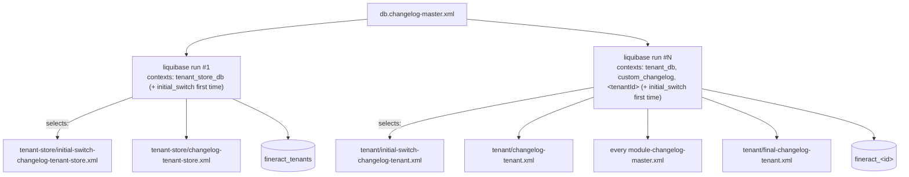

Apache Fineract has two parallel Liquibase changelog trees because it has two parallel schemas: the **per-tenant business DB** (`fineract_<id>`) and the **master tenant-registry DB** (`fineract_tenants`). They share nothing at the table level, evolve at different cadences, and are migrated by two distinct passes inside `TenantDatabaseUpgradeService`. This page contrasts the two trees end-to-end and explains how the `tenant_db` / `tenant_store_db` contexts plus the `liquibase-only` Spring profile orchestrate them.

## Tree side-by-side

```
fineract-provider/src/main/resources/db/changelog/
├── db.changelog-master.xml           # <-- the entry point Spring Liquibase sees
│
├── tenant-store/                     # master DB (fineract_tenants)
│   ├── changelog-tenant-store.xml
│   ├── initial-switch-changelog-tenant-store.xml
│   ├── parts/                        # 12 files: 0001..0011
│   │   ├── 0001_initial_schema.xml
│   │   ├── 0002_initial_data.xml
│   │   ├── 0003_reset_postgresql_sequences.xml
│   │   ├── 0004_readonly_database_connection.xml
│   │   ├── 0005_jdbc_connection_string.xml
│   │   ├── 0006_drop_retry_parameter_columns.xml
│   │   ├── 0007_encrypt_existing_tenant_passwords.xml
│   │   ├── 0007_x_extend_tenant_ro_passwords.xml
│   │   ├── 0008_encrypt_existing_ro_tenant_passwords.xml
│   │   ├── 0009_set_and_encrypt_ro_if_not_exists.xml
│   │   ├── 0010_set_datetime_precision.xml
│   │   └── 0011_standardize_character_set_and_collation.xml
│   └── upgrades/
│       └── 0000_upgrade_to_1.6.xml
│
└── tenant/                           # per-tenant business DB
    ├── changelog-tenant.xml
    ├── final-changelog-tenant.xml
    ├── initial-switch-changelog-tenant.xml
    ├── parts/                        # 222 files: 0001..0222
    │   ├── 0001_initial_schema.xml
    │   ├── 0002_initial_data.xml
    │   ├── ...
    │   └── 0222_transaction_summary_reports_fix_after_originator_details.xml
    └── upgrades/
        ├── 0000_upgrade_to_1.5.xml
        └── 0000_upgrade_to_1.6.xml
```

| Concern | `db/changelog/tenant-store/` | `db/changelog/tenant/` |
| ------- | ---------------------------- | ----------------------- |
| Target DB | One: `fineract_tenants` (master) | Many: one per tenant (`fineract_<id>`) |
| Tables managed | `tenants`, `tenant_server_connections`, `timezones`, Liquibase internal | All business tables (`m_*`, `r_*`, `c_*`, `acc_*`, `mix_*`, etc.) |
| Liquibase context | `tenant_store_db` | `tenant_db` |
| Run by | `TenantDatabaseUpgradeService.upgradeTenantStore()` — single threaded | `TenantDatabaseUpgradeService.upgradeIndividualTenants()` — thread pool |
| Touches CustomTaskChange? | Yes (`TenantPasswordEncryptionTask`, `TenantReadOnlyPasswordEncryptionTask`) | Rarely |
| Module includes? | No, single source tree (in `fineract-provider`) | Yes — modules under `db/changelog/tenant/module/<name>/` |
| Frequency of changes | Low — 12 changesets total | High — 222 changesets in provider alone, plus modules |

## Context dispatch

The master `db.changelog-master.xml` uses Liquibase contexts to ensure each changeset runs against the correct DB:

```xml
<include file="tenant-store/initial-switch-changelog-tenant-store.xml" relativeToChangelogFile="true"
         context="tenant_store_db AND initial_switch"/>
<include file="tenant-store/changelog-tenant-store.xml" relativeToChangelogFile="true"
         context="tenant_store_db AND !initial_switch"/>

<include file="tenant/initial-switch-changelog-tenant.xml" relativeToChangelogFile="true"
         context="tenant_db AND initial_switch"/>
<include file="tenant/changelog-tenant.xml" relativeToChangelogFile="true"
         context="tenant_db AND !initial_switch"/>

<include file="db/changelog/tenant/module/loan/module-changelog-master.xml"
         context="tenant_db AND !initial_switch"/>
... (other modules)
```

So a single physical changelog file (`db.changelog-master.xml`) is used for both DB migrations — the *active context* passed at Liquibase invocation time selects which subset runs.

The constants:

```java
// TenantDatabaseUpgradeService.java
public static final String TENANT_STORE_DB_CONTEXT = "tenant_store_db";
public static final String INITIAL_SWITCH_CONTEXT = "initial_switch";
public static final String TENANT_DB_CONTEXT = "tenant_db";
public static final String CUSTOM_CHANGELOG_CONTEXT = "custom_changelog";
```

And the two upgrade passes:

```java
private void upgradeTenantStore() throws LiquibaseException {
    if (databaseStateVerifier.isFirstLiquibaseMigration(tenantDataSource)) {
        ExtendedSpringLiquibase liquibase = liquibaseFactory.create(
            tenantDataSource, TENANT_STORE_DB_CONTEXT, INITIAL_SWITCH_CONTEXT);
        applyInitialLiquibase(tenantDataSource, liquibase, "tenant store",
            (ds) -> !databaseStateVerifier.isTenantStoreOnLatestUpgradableVersion(ds));
    }
    SpringLiquibase liquibase = liquibaseFactory.create(tenantDataSource, TENANT_STORE_DB_CONTEXT);
    liquibase.afterPropertiesSet();
}

private void upgradeIndividualTenant(FineractPlatformTenant tenant) throws LiquibaseException {
    ThreadLocalContextUtil.setTenant(tenant);
    try (HikariDataSource tenantDataSource = tenantDataSourceFactory.create(tenant)) {
        if (databaseStateVerifier.isFirstLiquibaseMigration(tenantDataSource)) {
            ExtendedSpringLiquibase liquibase = liquibaseFactory.create(tenantDataSource,
                TENANT_DB_CONTEXT, CUSTOM_CHANGELOG_CONTEXT, INITIAL_SWITCH_CONTEXT,
                tenant.getTenantIdentifier());
            applyInitialLiquibase(...);
        }
        // then run again without initial_switch so the post-baseline parts run
        ...
    }
}
```

So the **same** master changelog runs against the **master DB** with `tenant_store_db` active, then against **each tenant DB** with `tenant_db` + tenant identifier active. The `<include context="...">` directives filter accordingly.



## Per-tenant identifier as a context

Note the extra context passed for per-tenant runs:

```java
liquibaseFactory.create(tenantDataSource,
    TENANT_DB_CONTEXT, CUSTOM_CHANGELOG_CONTEXT, INITIAL_SWITCH_CONTEXT,
    tenant.getTenantIdentifier());
```

The tenant identifier (e.g. `default`, `acme`) is added as a Liquibase context. **No changeset uses it for gating**, but its presence on the context list invalidates Liquibase's internal per-process caching of "which changesets have been computed". This was introduced in v4.21.0 to fix a bug where running tenant A's migration first would cache the resolved changeset set, then incorrectly reuse it for tenant B.

You can take advantage of this: a custom changeset with `context="acme"` would only run for the `acme` tenant.

## initial-switch — the Flyway baseline replay

Both DBs were originally migrated with Flyway. The cut-over to Liquibase carried the entire pre-Liquibase state forward as `0001_initial_schema.xml` + `0002_initial_data.xml`, but those baseline files must only run *once* per DB (during the cut-over), not on subsequent boots.

The trick:

```xml
<include file="parts/0001_initial_schema.xml" relativeToChangelogFile="true" context="initial_switch"/>
<include file="parts/0002_initial_data.xml" relativeToChangelogFile="true" context="initial_switch"/>
<!-- The first 2 changelog files are ran with the initial_switch context to handle the Flyway -> Liquibase migration -->
<!-- The rest of the changelogs will not need this context set -->
```

`TenantDatabaseStateVerifier.isFirstLiquibaseMigration(ds)` queries the DB to detect "this is a Flyway DB being upgraded to Liquibase" — either the Flyway `schema_version` table is present, or no `databasechangelog` table exists yet, or `databasechangelog` is empty. When that's true, the initial-switch context is added to the first Liquibase run; subsequent calls do not include it.

After the initial-switch run, `applyInitialLiquibase` is invoked twice — once with the initial-switch context (to apply the baseline), then once without (to apply everything else). The application code:

```java
ExtendedSpringLiquibase liquibase = liquibaseFactory.create(tenantDataSource,
    TENANT_DB_CONTEXT, CUSTOM_CHANGELOG_CONTEXT, INITIAL_SWITCH_CONTEXT,
    tenant.getTenantIdentifier());
applyInitialLiquibase(tenantDataSource, liquibase, tenant.getTenantIdentifier(),
    (ds) -> !databaseStateVerifier.isTenantOnLatestUpgradableVersion(ds));
```

After this, the regular `SpringLiquibase` (without `initial_switch`) runs the post-baseline parts and the module changesets.

## Liquibase tracking tables

Each DB gets its own `databasechangelog` (history of applied changesets) and `databasechangeloglock` (mutex during migration), maintained by Liquibase itself:

| Table | DB | Purpose |
| ----- | -- | ------- |
| `databasechangelog` | master + each tenant | One row per applied changeset; columns include `id`, `author`, `filename`, `dateexecuted`, `orderexecuted`, `exectype`, `md5sum`. |
| `databasechangeloglock` | master + each tenant | A single-row lock to prevent two JVMs from running migrations concurrently against the same DB. |

So a tenant DB has, after a normal boot:

```sql
mysql> SELECT id, filename FROM databasechangelog ORDER BY orderexecuted LIMIT 5;
+----+-----------------------------------------------------------------+
| id | filename                                                        |
+----+-----------------------------------------------------------------+
| 1  | db/changelog/tenant/parts/0001_initial_schema.xml               |
| 1  | db/changelog/tenant/parts/0002_initial_data.xml                 |
| 1  | db/changelog/tenant/parts/0003_postgresql_specific_initial_data.xml |
| 1  | db/changelog/tenant/parts/0004_camelcase_column_renaming.xml    |
| 1  | db/changelog/tenant/parts/0005_savings_transaction_reversal.xml |
+----+-----------------------------------------------------------------+
```

The `filename` is the classpath-relative path of the change file, so changesets from different modules with the same `id` do not collide.

## The liquibase-only profile

For CI and Kubernetes deployments, Fineract supports running just the migration without serving HTTP:

```bash
SPRING_PROFILES_ACTIVE=liquibase-only ./gradlew :fineract-provider:bootRun
```

The profile is wired through two Spring `@Condition` classes:

```java
// FineractLiquibaseOnlyApplicationCondition
public class FineractLiquibaseOnlyApplicationCondition implements Condition {
    @Override
    public boolean matches(ConditionContext context, AnnotatedTypeMetadata metadata) {
        return Arrays.asList(context.getEnvironment().getActiveProfiles())
                     .contains(FineractProfiles.LIQUIBASE_ONLY);
    }
}

// FineractWebApplicationCondition
public class FineractWebApplicationCondition implements Condition {
    @Override
    public boolean matches(ConditionContext context, AnnotatedTypeMetadata metadata) {
        return !Arrays.asList(context.getEnvironment().getActiveProfiles())
                      .contains(FineractProfiles.LIQUIBASE_ONLY);
    }
}
```

Most web beans (`DispatcherServlet`, controllers, scheduler) are gated by `@Conditional(FineractWebApplicationCondition.class)`; the liquibase-only profile suppresses them. Conversely a tiny set of "exit after migration" beans use `@Conditional(FineractLiquibaseOnlyApplicationCondition.class)`.

Inside `TenantDatabaseUpgradeService`, the profile changes one thing: the **read-only guard does not apply**.

```java
@Override
public void afterPropertiesSet() throws Exception {
    if (notLiquibaseOnlyMode()) {
        if (databaseStateVerifier.isLiquibaseDisabled() || !fineractProperties.getMode().isWriteEnabled()) {
            log.warn("Liquibase is disabled. Not upgrading any database.");
            return;
        }
    }
    // ... actually run Liquibase
}

private boolean notLiquibaseOnlyMode() {
    List<String> activeProfiles = Arrays.asList(environment.getActiveProfiles());
    return !activeProfiles.contains(FineractProfiles.LIQUIBASE_ONLY);
}
```

So when the profile is active:

- Even `fineract.mode.write-enabled=false` will not skip Liquibase — it runs unconditionally.
- The application context comes up only as far as needed to run Liquibase, then exits.

This is the recommended pattern for production migration jobs separate from the application deployment:

```yaml
# Kubernetes Job: migrate
- name: fineract-migrate
  image: apache/fineract:latest
  env:
    - { name: SPRING_PROFILES_ACTIVE, value: liquibase-only }
    - { name: FINERACT_HIKARI_JDBC_URL, value: jdbc:mariadb://...:3306/fineract_tenants }
    - { name: FINERACT_HIKARI_USERNAME, value: fineract }
    - { name: FINERACT_HIKARI_PASSWORD, valueFrom: ... }
```

The job runs Liquibase against the master DB and every tenant DB, then exits 0. Only then does the regular `Deployment` (HTTP-serving pods) start.

## Read-only mode interaction

The fully detailed interaction:

| Mode | `liquibase-only` profile | Result |
| ---- | ----------------------- | ------ |
| write-enabled | — | Liquibase runs, app serves HTTP |
| read-only | — | Liquibase **skipped**, app serves read-only HTTP |
| batch-only | — | Liquibase runs, app runs batch only |
| any | active | Liquibase runs, app exits |

`isWriteEnabled()` (= not read-only) is the gate that normally allows Liquibase. The `liquibase-only` profile bypasses it.

## When to use what

| Scenario | Command |
| -------- | ------- |
| Local dev: run schema migrations only | `SPRING_PROFILES_ACTIVE=liquibase-only ./gradlew bootRun` |
| Production: K8s `Job` to migrate before rollout | Same env var on the job pod |
| Fresh master DB only, no tenant yet | Same — the registry initial-switch + the seed `INSERT` will create the first tenant row from `${fineract.tenant.*}` |
| Add a new tenant | Update master DB (`tenant_server_connections` + `tenants` rows), restart the JVM — `TenantDatabaseUpgradeService` picks it up |
| Reset a single tenant DB | Drop the tenant DB, recreate the schema, restart — initial-switch will replay because `databasechangelog` is empty |
| Roll back a changeset | Don't. Write a new "reverse" changeset; Liquibase's rollback feature is not enabled in Fineract |

## Common failure modes

| Symptom | Cause | Fix |
| ------- | ----- | --- |
| `Validation failed: change set ... has been changed since it was applied to the database` | A merged changeset's content was edited | Revert the edit; write a new changeset to apply the corrective change |
| `databasechangeloglock` row is `LOCKED=1` long after a crash | A JVM died mid-migration | Manually `UPDATE databasechangeloglock SET locked=0, lockedby=null, lockgranted=null WHERE id=1` |
| `LiquibaseException: liquibase-core 4.x is incompatible with ...` | Driver version mismatch | Align driver to the version pinned in `gradle/dependencies.gradle` |
| `Tenant upgrades had exceptions` after restart | One tenant's DB unreachable / schema corrupt | Inspect the per-tenant Hikari pool — `TenantDataSourceFactory.create(tenant)` may have failed |

## Cross-references

- [Database / Overview](/database/overview)
- [Database / Liquibase Changesets](/database/liquibase-changesets)
- [Database / Per-Module Changelogs](/database/per-module-changelogs)
- [Tenancy / Tenant Store vs Tenant DB](/tenancy/tenant-store-vs-tenant-db)
- [Config / JDBC Environment Variables](/config/jdbc-env-variables)
