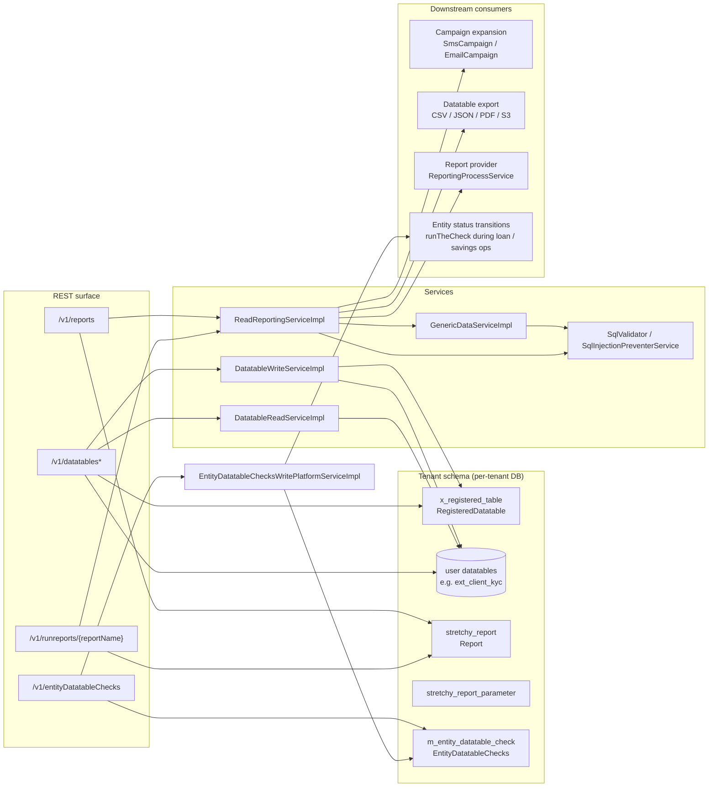

The Apache Fineract **dataqueries** subsystem (`fineract-provider/src/main/java/org/apache/fineract/infrastructure/dataqueries/` plus `fineract-core/.../infrastructure/dataqueries/`) is the platform's "user-defined data" and "user-defined SQL" surface. It owns three closely related features:

- **Datatables** — tenant-owned MySQL/Postgres tables that hang off Fineract's core tables (`m_client`, `m_loan`, …) and are CRUD-accessible through `/v1/datatables`. Definitions live in `x_registered_table` (`RegisteredDatatable`).
- **Entity datatable checks** — declared dependencies that force certain datatables to be filled in for an entity to advance to a given lifecycle status (e.g. "every loan must have a `kyc_extras` row before disbursal"). Stored in `m_entity_datatable_check`.
- **Reports** — stretchy SQL reports and Pentaho `.prpt` reports persisted in `stretchy_report` (`Report`), executable through `/v1/runreports/{reportName}` (`RunreportsApiResource`) and emailable through campaigns and report-mailing jobs.

The same `ReadReportingService` / `GenericDataService` pair that drives `/v1/runreports` also backs **email and SMS campaigns** (see [Campaigns overview](/campaigns/overview)) and the **datatable export** pipeline (CSV / JSON / PDF / S3).

Use this page as the index for the rest of the subsystem:

- [Datatables](/dataqueries/datatables) — registration, schema mutation, row CRUD, `DatatableReadService` / `DatatableWriteServiceImpl`.
- [Entity datatable checks](/dataqueries/entity-datatable-checks) — `EntityDatatableChecks`, `runTheCheck(...)`, REST surface, status enum.
- [Reports](/dataqueries/reports) — `Report` entity, `ReportType` (`PARAMETER`/`REPORT`), `report_type` strings (`Table` / `Chart` / `Pentaho Reports`), `ReportsApiResource`.
- [Run reports](/dataqueries/run-reports) — `RunreportsApiResource`, parameter substitution rules and `SqlValidator`.
- [Datatable export](/dataqueries/datatable-export) — `DatatableExportTargetParameter`, CSV/JSON/PDF/S3 export services, file naming.

## Module layout

```text
fineract-core/src/main/java/org/apache/fineract/infrastructure/dataqueries/
├── api/
│   └── DataTableApiConstant.java            # field names: API_PARAM_DATATABLE_NAME, API_PARAM_COLUMNS, …
├── data/
│   ├── DatatableData.java                   # immutable datatable description (name + columns)
│   ├── DataTableValidator.java              # JSON schema validator for create / update
│   ├── EntityTables.java                    # enum of supported parent tables (CLIENT, LOAN, SAVINGS, …)
│   ├── StatusEnum.java                      # CREATE(100), APPROVE(200), ACTIVATE(300), CLOSE(600), …
│   ├── GenericResultsetData.java            # column headers + row data — universal report payload
│   ├── ResultsetColumnHeaderData.java       # column metadata (type, length, code lookups)
│   ├── ResultsetRowData.java
│   ├── ReportData.java / ReportParameterData.java
│   └── DatatableChecksData.java
├── domain/
│   └── ReportType.java                      # whitelist of report types for SQL injection prevention
├── exception/
└── service/
    ├── DatatableReadService.java
    ├── DatatableWriteService.java
    ├── GenericDataService.java              # row-set helpers used everywhere reports run SQL
    └── DatatableKeywordGenerator.java       # reserved-keyword aware column-name builder

fineract-provider/src/main/java/org/apache/fineract/infrastructure/dataqueries/
├── api/
│   ├── DatatablesApiResource.java           # /v1/datatables
│   ├── EntityDatatableChecksApiResource.java # /v1/entityDatatableChecks
│   ├── ReportsApiResource.java              # /v1/reports
│   └── RunreportsApiResource.java           # /v1/runreports/{reportName}
├── data/                                    # request DTOs and template data
├── domain/                                  # Report, RegisteredDatatable, EntityDatatableChecks, ReportParameter…
├── exception/                               # ReportNotFoundException, DatatableEntryRequiredException, …
├── handler/                                 # CommandHandlers: CreateDatatable, RegisterDatatable, CreateReport, …
├── serialization/
│   └── ReportCommandFromApiJsonDeserializer.java
├── service/
│   ├── DatatableReadServiceImpl.java        # SQL queries with SqlValidator
│   ├── DatatableWriteServiceImpl.java       # DDL + row CRUD; raises DatatableEntryCreated/Updated/DeletedBusinessEvent
│   ├── DatatableUtil.java
│   ├── DatatableRejectionCleanupService.java
│   ├── DatatableReportingProcessService.java # implements ReportingProcessService for stretchy reports
│   ├── EntityDatatableChecksReadPlatformServiceImpl.java
│   ├── EntityDatatableChecksWritePlatformServiceImpl.java
│   ├── GenericDataServiceImpl.java          # row-set materialiser with column-aware coercion
│   ├── ReadReportingServiceImpl.java        # the workhorse: getSql / runs report / SQL substitution
│   ├── ReportWritePlatformServiceImpl.java
│   └── export/                              # CsvDatatableReportExportServiceImpl, JsonDatatableReportExportService,
│                                           # PdfDatatableReportExportService, S3DatatableReportExportServiceImpl,
│                                           # DatatableExportUtil
└── starter/
    └── DataQueriesAutoConfiguration.java    # wires GenericDataService, SqlValidator etc. into the context
```

## System map



## Where things live

| Concept | Table | Entity | Provider class |
|---|---|---|---|
| Registered datatable | `x_registered_table` | `RegisteredDatatable` | `DatatableReadServiceImpl`, `DatatableWriteServiceImpl` |
| User datatable rows | tenant-defined (e.g. `ext_client_kyc`) | none (raw SQL via `JdbcTemplate`) | `DatatableWriteServiceImpl`, `GenericDataServiceImpl` |
| Entity datatable check | `m_entity_datatable_check` | `EntityDatatableChecks` | `EntityDatatableChecksReadPlatformServiceImpl`, `EntityDatatableChecksWritePlatformServiceImpl` |
| Report definition | `stretchy_report` | `Report` | `ReadReportingServiceImpl`, `ReportWritePlatformServiceImpl` |
| Report parameter | `stretchy_report_parameter` | `ReportParameter` | `ReadReportingServiceImpl` |
| Report parameter usage | `stretchy_report_parameter` join | `ReportParameterUsage` | `ReportRepository` |

## REST surface — at a glance

| Resource | Method + path | Notes |
|---|---|---|
| `DatatablesApiResource` | `GET /v1/datatables`, `GET /v1/datatables/{datatable}`, `GET /v1/datatables/{datatable}/{apptableId}` | list / describe / read rows |
| | `POST /v1/datatables`, `PUT /v1/datatables/{datatableName}`, `DELETE /v1/datatables/{datatableName}` | DDL: create / modify columns / drop |
| | `POST /v1/datatables/register/{datatable}/{apptable}`, `POST /v1/datatables/deregister/{datatable}` | register an existing table to an app table |
| | `POST/PUT/DELETE /v1/datatables/{datatable}/{apptableId}[/{datatableId}]` | row CRUD (one-to-one and one-to-many) |
| | `GET /v1/datatables/{datatable}/query`, `POST /v1/datatables/{datatable}/query` | datatable search (`AdvancedQueryData`) |
| `EntityDatatableChecksApiResource` | `GET /v1/entityDatatableChecks`, `GET /v1/entityDatatableChecks/template` | list checks / fetch template |
| | `POST /v1/entityDatatableChecks`, `DELETE /v1/entityDatatableChecks/{id}` | manage checks |
| `ReportsApiResource` | `GET /v1/reports`, `GET /v1/reports/{id}`, `GET /v1/reports/template` | catalogue / template |
| | `POST /v1/reports`, `PUT /v1/reports/{id}`, `DELETE /v1/reports/{id}` | create / mutate / drop a report |
| `RunreportsApiResource` | `GET /v1/runreports/{reportName}?R_…=…` | execute a report; supports HTML / CSV / XLS / PDF output |
| | `GET /v1/runreports/availableExports/{reportName}` | list available export targets |

See the full REST reference at [Reports and data APIs](/api/reports).

## What every report row looks like

The universal payload returned by every report and every datatable read is `GenericResultsetData`:

```java
public final class GenericResultsetData {
    private final List<ResultsetColumnHeaderData> columnHeaders;
    private final List<ResultsetRowData>          data;
}

public final class ResultsetColumnHeaderData {
    private final String  columnName;
    private final JdbcJavaType columnType;       // STRING, DATE, INTEGER, DECIMAL, …
    private final Long    columnLength;
    private final DisplayType columnDisplayType; // CODELOOKUP, DATETIME, INTEGER, DECIMAL, TIME, TEXT, BOOLEAN
    private final boolean isColumnNullable;
    private final boolean isColumnPrimaryKey;
    private final List<ResultsetColumnValueData> columnValues; // for code lookups
    private final String  columnCode;
}
```

`GenericDataServiceImpl.fillGenericResultSet(sql)` is the single entry point — it runs the SQL via `JdbcTemplate.queryForRowSet(...)`, walks the metadata, maps each column to a `DisplayType`, coerces typed values for `DATE` / `DATETIME` / `TIMESTAMP` / `DECIMAL`, and packs the result. Both `ReadReportingService.retrieveGenericResultset(...)` and `DatatableReadService.retrieveDataTableGenericResultSet(...)` lean on this.

## SQL injection prevention

`/v1/runreports/{reportName}` does *not* accept arbitrary SQL; it loads the SQL by report name and substitutes only declared parameters. Two safety nets are wired in:

- **`ReportType` whitelist.** `ReadReportingServiceImpl.getSql(name, type)` validates `type` against the `ReportType` enum (`REPORT(\"report\")`, `PARAMETER(\"parameter\")`) before constructing any SQL. The corresponding table (`stretchy_report` / `stretchy_parameter`) and column names are derived from the validated enum and then **quoted via `SqlInjectionPreventerService.quoteIdentifier(...)`** before the JDBC parameterised lookup runs.
- **`SqlValidator`.** Datatable read and export paths inject `SqlValidator` to validate ad-hoc identifier inputs (column names supplied through the `columnFilter` parameter, etc.) against the SQL injection blacklist before stitching them into queries. See [SQL injection prevention](/security/sql-injection-prevention).

Any path that builds SQL from request input goes through one of these two helpers; `RunreportsApiResource` never calls `JdbcTemplate.queryForRowSet(rawUserInput)`.

## Downstream consumers

| Consumer | What it pulls |
|---|---|
| Email campaign expansion | Reads `EmailCampaign.businessRuleId.reportSql` via `ReadReportingService.retrieveGenericResultset(...)` for recipient + template params; see [Email campaigns](/campaigns/email-campaigns) |
| SMS campaign expansion | Same pattern for `SmsCampaign.businessRuleId`; see [SMS campaigns](/campaigns/sms-campaigns) |
| Report mailing job | Runs the configured stretchy report as a `ByteArrayOutputStream` and ships it as an email attachment; see [Report mailing job](/report/report-mailing-job) |
| Reporting provider | `DatatableReportingProcessService` implements `ReportingProcessService` for the report module; see [Report provider](/report/report-provider) |
| Datatable export | Uses the same `GenericResultsetData` payload and writes CSV / JSON / PDF, or uploads to S3; see [Datatable export](/dataqueries/datatable-export) |
| Loan / savings status transitions | Call `EntityDatatableChecksWritePlatformService.runTheCheck(...)` before disburse / activate / close; see [Entity datatable checks](/dataqueries/entity-datatable-checks) |

## Related references

- The Spring Batch tasklets that run scheduled reports: [Campaign jobs](/campaigns/campaign-jobs).
- The reporting plug-in surface (`ReportingProcessService`, `@ReportService`): [Report provider](/report/report-provider).
- The REST view of all data and reporting endpoints: [Reports and data APIs](/api/reports).
- The SQL injection prevention primitives shared with this subsystem: [SQL injection prevention](/security/sql-injection-prevention).
- The hooks system that fires business events on datatable writes: [Hooks overview](/hooks/overview), [Hooks and messaging APIs](/api/hooks).
