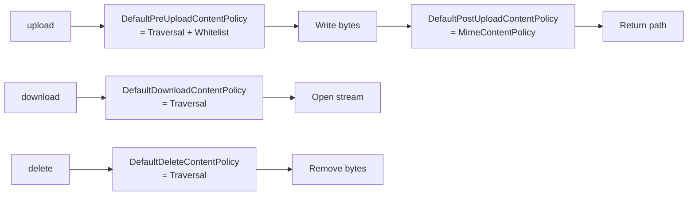

The Apache Fineract `ContentStoreService` is the single SPI through which every byte uploaded to, downloaded from, or deleted out of the platform's file storage flows. It is intentionally narrow — four methods, all working on raw `InputStream` and `String` paths — so backend implementations stay focused on transport mechanics and the higher document/image services own the lifecycle. This page covers the interface, the `ContentStoreType` discriminator persisted on every `Document` / `Image` row, how Spring picks the active implementation via `@ConditionalOnProperty`, and the in-flight path conventions the abstraction enforces.

<Info>
The interface lives at `org.apache.fineract.infrastructure.contentstore.service.ContentStoreService`. Two implementations are shipped: `FileContentStoreService` (filesystem) and `S3ContentStoreService` (AWS S3 / any S3-compatible object store). A historical "database BLOB" backend was removed; the `ContentStoreType` enum no longer carries a `DB` member.
</Info>

## The interface

```java
public interface ContentStoreService {

    String EXTENSION_REGEX = "^.+\\..+$";
    String DELIMITER       = "/";

    InputStream      download(String path);
    String           upload  (String path, InputStream is, String mimeType);
    void             delete  (String path);
    ContentStoreType getType();

    default String getDelimiter() { return DELIMITER; }
}
```

### Method semantics

| Method | Returns | Contract |
| --- | --- | --- |
| `download(path)` | `InputStream` | Open a stream over the bytes at `path`. The caller owns closing it. Implementations apply the **download policy** (`DefaultDownloadContentPolicy`) before opening. |
| `upload(path, is, mimeType)` | `String` | Apply the **pre-upload policy** (`DefaultPreUploadContentPolicy` = traversal + whitelist), persist the bytes, then apply the **post-upload policy** (`DefaultPostUploadContentPolicy` = MIME match). Return the **canonical storage path** that should be persisted on the `Document.location` / `Image.location` column. The returned path may differ from the input path — e.g. the filesystem store inserts a random sub-folder. |
| `delete(path)` | `void` | Apply the **delete policy** (`DefaultDeleteContentPolicy` = traversal) and remove the bytes. Best-effort: a missing key is logged but not re-thrown. |
| `getType()` | `ContentStoreType` | The discriminator persisted onto every row written by this store. Read services use it to route back to the right implementation. |
| `getDelimiter()` | `String` | Default `/`. Concrete implementations may override if they want a different path separator. Used by `DocumentWritePlatformServiceImpl.getPath(...)` when composing the storage key. |

### Constants

- `EXTENSION_REGEX = "^.+\\..+$"` — quick check that a path has *some* dot-separated extension. Used by callers that need a fast pre-filter before invoking a `ContentDetector`.
- `DELIMITER = "/"` — both filesystem (`Path.of("a", "b").toString()` on Linux) and S3 (object key separator) use the same delimiter, so callers can stay agnostic.

## ContentStoreType

```java
public enum ContentStoreType {
    FILE_SYSTEM(1),
    S3(2);

    private final Integer value;
    ContentStoreType(final Integer value) { this.value = value; }
    public Integer getValue() { return this.value; }
}
```

| Constant | Stored value | Implementation |
| --- | --- | --- |
| `FILE_SYSTEM` | `1` | `FileContentStoreService` |
| `S3` | `2` | `S3ContentStoreService` |

The integer is what gets written to `m_document.storage_type_enum` and `m_image.storage_type_enum` at upload time. Picking the right read-side bean is straightforward: each implementation reports its own type via `getType()`, and the read services iterate available beans (`List<ContentStoreService>`) to find the one whose value matches the row's column. Mixing both backends in the same database is supported — older rows keep their original storage type even if the global default flips.

<Warning>
The older Fineract codebase had a third `DB` member that stored bytes as a BLOB in `m_image_blob` / `m_document_blob`. That code has been removed. If you migrate from a very old database with `storage_type_enum = 3` you must convert those rows out first; the current `ContentStoreType.values()` will not match `3` and the row will be unreadable.
</Warning>

## Backend selection — `@ConditionalOnProperty`

```java
@Service
@ConditionalOnProperty(name = "fineract.content.filesystem.enabled", havingValue = "true")
public class FileContentStoreService implements ContentStoreService { ... }

@Service
@ConditionalOnProperty(name = "fineract.content.s3.enabled", havingValue = "true")
public class S3ContentStoreService implements ContentStoreService { ... }
```

The active backend is decided at Spring boot time by the `application.properties` values:

```properties
fineract.content.filesystem.enabled=${FINERACT_CONTENT_FILESYSTEM_ENABLED:true}
fineract.content.s3.enabled=${FINERACT_CONTENT_S3_ENABLED:false}
```

By default, **filesystem is on and S3 is off**. The typical configuration matrix:

| `filesystem.enabled` | `s3.enabled` | Behaviour |
| --- | --- | --- |
| `true` | `false` | All writes go to local filesystem under `fineract.content.filesystem.rootFolder`. Default. |
| `false` | `true` | All writes go to S3 (or S3-compatible) bucket configured under `fineract.content.s3.*`. |
| `true` | `true` | **Both beans active** — `ContentStoreService` injection is ambiguous and Spring will fail to start unless callers explicitly inject by type or use `@Primary`. Avoid. |
| `false` | `false` | No bean — the autowiring of `ContentStoreService` into `DocumentWritePlatformServiceImpl` fails on startup. |

In practice only the first two rows are valid.

## How write services consume the SPI

```java
@Service
public class DocumentWritePlatformServiceImpl implements DocumentWritePlatformService {

    private static final String STORE_PREFIX = "documents";

    private final DocumentRepository documentRepository;
    private final DocumentMapper documentMapper;
    private final ContentStoreService storeService;
    private final BusinessEventNotifierService businessEventNotifierService;
    private final FineractProperties properties;

    @Transactional
    @Override
    public DocumentCreateResponse createDocument(@Valid final DocumentCreateRequest request) {
        // ...
        var path = getPath(STORE_PREFIX,
                           request.getEntityType(),
                           request.getEntityId(),
                           request.getFileName(),
                           storeService.getDelimiter());

        path = storeService.upload(path, request.getStream(), request.getType());

        final var doc = new Document()
                .setParentEntityType(request.getEntityType())
                .setParentEntityId(request.getEntityId())
                .setName(Optional.ofNullable(request.getName()).orElse(request.getFileName()))
                .setFileName(request.getFileName())
                .setSize(request.getSize())
                .setType(request.getType())
                .setDescription(request.getDescription())
                .setLocation(path)
                .setStorageType(storeService.getType().getValue());

        documentRepository.save(doc);
        // ...
    }
}
```

Three things to notice:

1. The proposed path is built by joining `prefix / entityType / entityId / fileName` with `storeService.getDelimiter()` — the service is responsible for the separator, the caller for the layout.
2. The path returned from `upload(...)` is what gets persisted. For filesystem the store inserts a random sub-folder; for S3 the input path is returned verbatim.
3. `storeService.getType().getValue()` is captured at write time. A later download will route based on this column, regardless of the platform default.

## How read services pick the backend

`DocumentReadPlatformServiceImpl.retrieveDocumentContent(...)` (sketched):

```java
final Document doc = documentRepository
        .findByIdAndParentEntityTypeAndParentEntityId(documentId, entityType, entityId)
        .orElseThrow(() -> new DocumentNotFoundException(entityType, entityId, documentId));

final ContentStoreService store = contentStoreServices.stream()
        .filter(s -> s.getType().getValue().equals(doc.getStorageType()))
        .findFirst()
        .orElseThrow(...);

final InputStream stream = store.download(doc.getLocation());

return DocumentContent.builder()
        .stream(stream)
        .contentType(doc.getType())
        .fileName(doc.getFileName())
        .size(doc.getSize())
        .build();
```

The list of available `ContentStoreService` beans is injected; the matching one is picked by comparing `storage_type_enum`. In the dominant single-backend deployment that list has one element.

## Path conventions

The shape of a storage path is always:

```text
{prefix}/{entityType}/{entityId}/{fileName}
```

| Prefix | Used by | Example |
| --- | --- | --- |
| `documents` | `DocumentWritePlatformServiceImpl.STORE_PREFIX` | `documents/clients/42/passport.pdf` |
| `images` | `ImageWritePlatformServiceImpl.STORE_PREFIX` | `images/clients/42/3f5e…b8.jpg` |

When the filesystem store handles a path that does not already exist on disk, it injects a 16-character random alphabetic sub-folder (`DefaultContentPathRandomizer.randomize()` → `RandomStringUtils.secureStrong().randomAlphabetic(16)`) between the entity-id segment and the filename. For S3 no such injection happens — object keys are returned verbatim.

After two uploads:

```text
# filesystem
documents/clients/42/aZxYqLpKjRtNvBmC/passport.pdf
documents/clients/42/QwErTyUiOpAsDfGh/contract.pdf

# s3
documents/clients/42/passport.pdf
documents/clients/42/contract.pdf
```

## Tenant namespace (filesystem only)

`FileContentStoreService.getRootPath()`:

```java
private Path getRootPath() {
    return Path.of(properties.getContent().getFilesystem().getRootFolder(),
            ThreadLocalContextUtil.getTenant().getName().replaceAll(" ", "").trim());
}
```

Each tenant gets its own sub-directory under `rootFolder`, named from the tenant identifier with spaces stripped. So:

```text
${FINERACT_CONTENT_FILESYSTEM_ROOT_FOLDER:~/.fineract}/default/documents/clients/42/...
```

S3 does not partition by tenant — all tenants share the configured bucket and rely on key prefixes for separation. If you need per-tenant S3 buckets, that is currently a manual deployment pattern (run one Fineract instance per tenant).

## Pre / post / download / delete policy hooks

Every method on every implementation runs through the policy chain. The chain is described in detail in [Detector and policies](/document/detector-and-policies); the short version:



A failing post-upload policy (e.g. MIME mismatch between what the client claimed and what Tika sees) causes the just-uploaded bytes to be deleted automatically and a `ContentPolicyException` to be thrown.

## Threading and concurrency

`ContentStoreService` implementations are stateless singletons. Concurrent uploads to different paths are independent — the filesystem store's `Files.createDirectories` is atomic at the directory level, and the S3 store's `PutObject` is serialised by S3's own consistency model. Concurrent uploads to the **same** path require coordination by the caller; neither implementation acquires application-level locks. In practice, two simultaneous `POST` calls to the same `(entityType, entityId)` for a document would both succeed (creating two `m_document` rows pointing at different blobs after the filesystem's random sub-folder injection), or one would overwrite the other for S3.

The `ContentStoreConfig` configuration class provides a cached thread pool used by the asynchronous content processors:

```java
@Configuration
class ContentStoreConfig {
    @Bean(BEAN_NAME_EXECUTOR)
    ExecutorService contentProcessorExecutor() {
        return Executors.newCachedThreadPool();
    }
}
```

This is used by processors that perform off-thread work (e.g. parallel gzip streaming). The pool is unbounded by design; production deployments with high upload throughput should consider replacing it with a bounded `ThreadPoolExecutor` by overriding the bean.

## SPI extension points

If you want a custom backend (e.g. an internal blob store), the recipe is:

1. Implement `ContentStoreService`.
2. Add a new value to `ContentStoreType` (do not reuse `1` or `2` — pick `3`+).
3. Annotate the bean with `@Service` and `@ConditionalOnProperty` so it activates only when your tenant has opted in.
4. Apply the four built-in policies on every method (`DefaultPre/Post/Download/DeleteContentPolicy`). The shipped implementations are good templates.

The existing services do **not** sit behind a `ContentRepositoryFactory` — Spring auto-wiring + `@ConditionalOnProperty` is the entire selection mechanism. The factory pattern referenced in older docs has been replaced by this approach.

## Configuration reference

From `application.properties`:

```properties
fineract.content.regex-whitelist-enabled=${FINERACT_CONTENT_REGEX_WHITELIST_ENABLED:true}
fineract.content.regex-whitelist=${FINERACT_CONTENT_REGEX_WHITELIST:.*\\.pdf$,.*\\.doc,.*\\.docx,.*\\.xls,.*\\.xlsx,.*\\.jpg,.*\\.jpeg,.*\\.png}
fineract.content.mime-whitelist-enabled=${FINERACT_CONTENT_MIME_WHITELIST_ENABLED:true}
fineract.content.mime-whitelist=${FINERACT_CONTENT_MIME_WHITELIST:application/pdf,application/msword,application/vnd.openxmlformats-officedocument.wordprocessingml.document,application/vnd.ms-excel,application/vnd.openxmlformats-officedocument.spreadsheetml.sheet,image/jpeg,image/png}
fineract.content.default-buffer-size=${FINERACT_CONTENT_DEFAULT_BUFFER_SIZE:8192}
fineract.content.filesystem.enabled=${FINERACT_CONTENT_FILESYSTEM_ENABLED:true}
fineract.content.filesystem.rootFolder=${FINERACT_CONTENT_FILESYSTEM_ROOT_FOLDER:${user.home}/.fineract}
fineract.content.s3.enabled=${FINERACT_CONTENT_S3_ENABLED:false}
fineract.content.s3.bucketName=${FINERACT_CONTENT_S3_BUCKET_NAME:}
fineract.content.s3.accessKey=${FINERACT_CONTENT_S3_ACCESS_KEY:}
fineract.content.s3.secretKey=${FINERACT_CONTENT_S3_SECRET_KEY:}
fineract.content.s3.region=${FINERACT_CONTENT_S3_REGION:}
fineract.content.s3.endpoint=${FINERACT_CONTENT_S3_ENDPOINT:}
fineract.content.s3.path-style-addressing-enabled=${FINERACT_CONTENT_S3_PATH_STYLE_ADDRESSING_ENABLED:false}
```

These bind into `FineractProperties.FineractContentProperties` and its `FineractContentFilesystemProperties` / `FineractContentS3Properties` children. See [S3 and filesystem storage](/document/s3-and-filesystem-storage) for the per-backend details.

## Quick reference

| Concern | Filesystem | S3 |
| --- | --- | --- |
| Enabled by | `fineract.content.filesystem.enabled=true` | `fineract.content.s3.enabled=true` |
| Root | `fineract.content.filesystem.rootFolder` | Bucket `fineract.content.s3.bucketName` |
| Tenant scoping | Sub-folder per tenant | Single bucket — keys are tenant-agnostic |
| Path randomisation | `DefaultContentPathRandomizer` inserts 16-char folder | None |
| `ContentStoreType` | `FILE_SYSTEM (1)` | `S3 (2)` |

## Cross-references

- [Document overview](/document/overview) — module file map.
- [Domain model](/document/document-management-domain) — `Document.location` and `storage_type_enum` columns.
- [Document API](/document/document-api) — the resource that ultimately invokes `ContentStoreService.upload`.
- [Images API](/document/images-api) — same SPI from the avatar side.
- [S3 and filesystem storage](/document/s3-and-filesystem-storage) — concrete implementation specifics.
- [Detector and policies](/document/detector-and-policies) — pre / post / download / delete policy chain.
- [API / Document APIs](/api/documents) — published OpenAPI reference.
