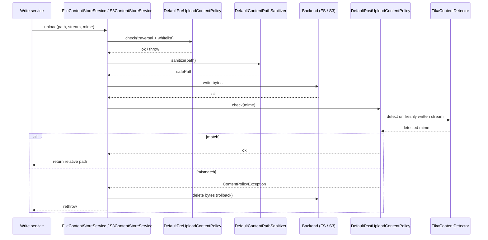
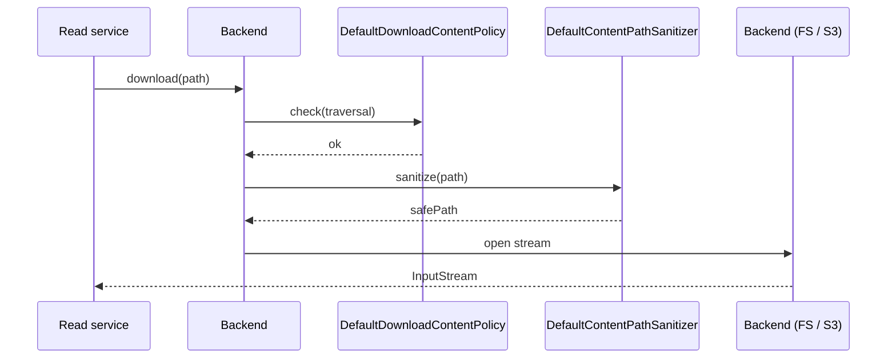
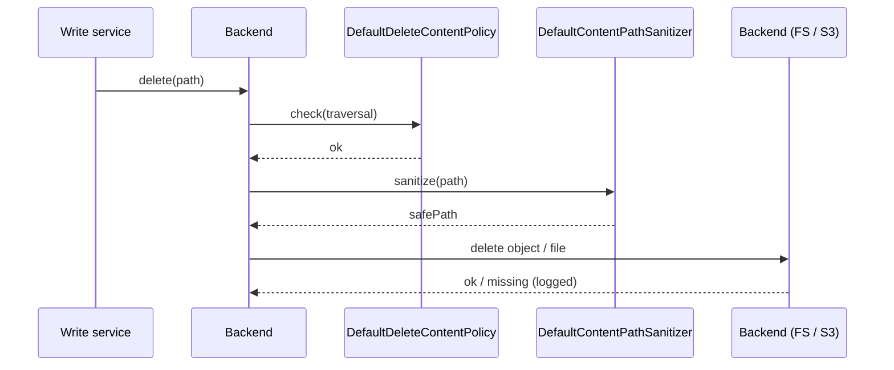

The Apache Fineract content store enforces every upload, download, and delete through three layered safety nets: an Apache Tika-backed **content detector** that derives the true MIME type from filenames or stream contents, a chain of **content policies** that veto operations on policy violations, and a path **sanitizer** that normalises filesystem and S3 keys. This page documents each detector, each policy bean, the order in which they fire on the four major operations, the default whitelists shipped in `application.properties`, and how the size-counting `SizeContentProcessor` augments the chain when callers want size enforcement.

<Info>
Detectors live under `org.apache.fineract.infrastructure.contentstore.detector`, policies under `…contentstore.policy`, and path utilities under `…contentstore.util`. All three are wired in via Spring's component scanning — there is no factory or registration list to maintain.
</Info>

## Detector layer

### Interface

```java
public interface ContentDetector {
    ContentDetectorContext detect(ContentDetectorContext ctx);
}

public interface ContentDetectorManager {
    ContentDetectorContext detect(ContentDetectorContext ctx);
}
```

`ContentDetectorContext`:

```java
@Builder @Data @NoArgsConstructor @AllArgsConstructor
public final class ContentDetectorContext {
    private InputStream inputStream;
    @Builder.Default
    private boolean inputStreamEnabled = false;
    private String  fileName;
    private String  mimeType;     // filled by the detector
    private String  extension;    // filled by the detector
    private String  format;       // filled by the detector (e.g. "pdf")

    public ContentDetectorContext clone(String mimeType, String extension, String format) {
        return new ContentDetectorContext(this.inputStream, this.inputStreamEnabled,
                this.fileName, mimeType, extension, format);
    }
    public ContentDetectorContext clone(InputStream inputStream, String mimeType,
                                        String extension, String format) {
        return new ContentDetectorContext(inputStream, this.inputStreamEnabled,
                this.fileName, mimeType, extension, format);
    }
}
```

`inputStreamEnabled` is a deliberate opt-in: passing an `inputStream` is **not** enough to make Tika sniff it. The caller must also set `inputStreamEnabled = true`. This guards against accidentally exhausting a multipart `InputStream` that downstream code still needs.

### Manager — `DefaultContentDetectorManager`

```java
@Component
public final class DefaultContentDetectorManager implements ContentDetectorManager {

    private final TikaContentDetector tikaContentDetector;

    @Override
    public ContentDetectorContext detect(ContentDetectorContext ctx) {
        return tikaContentDetector.detect(ctx);
    }
}
```

A thin pass-through to `TikaContentDetector`. The manager indirection is kept so a future deployment can swap in a different detector (e.g. a magic-byte sniffer specific to a regulator's filetype whitelist) without touching callers.

### TikaContentDetector

```java
@Component
public final class TikaContentDetector implements ContentDetector {

    private final Tika tika = new Tika();

    @Override
    public ContentDetectorContext detect(ContentDetectorContext ctx) {
        if (ctx.getInputStream() != null && !ctx.isInputStreamEnabled()) {
            log.warn("Input stream provided, but not explicitly enabled for detection. "
                   + "This operation is potentially making the input stream unusable, "
                   + "especially with HTTP multipart streams. Input stream will be ignored!");
        }

        try {
            if (ctx.getInputStream() != null && ctx.isInputStreamEnabled()) {
                final var stream = TikaInputStream.get(ctx.getInputStream());
                final var metadata = new Metadata();
                metadata.set(TikaCoreProperties.RESOURCE_NAME_KEY, ctx.getFileName());

                final var mimeType = tika.detect(stream, metadata);
                final var extension = getExtension(mimeType);

                stream.reset();
                return ctx.clone(mimeType, extension, extension.substring(1));
            } else if (StringUtils.isNotEmpty(ctx.getFileName())) {
                final var mimeType = tika.detect(ctx.getFileName());
                final var extension = getExtension(mimeType);
                return ctx.clone(mimeType, extension, extension.substring(1));
            }
        } catch (Exception e) {
            throw new ContentDetectorException(e);
        }

        throw new ContentDetectorException(new IllegalArgumentException(
                "Could not run detection, because required arguments were missing."));
    }

    private String getExtension(String mimeType) {
        try {
            return Optional.ofNullable(MimeTypes.getDefaultMimeTypes().forName(mimeType))
                    .orElseGet(() -> {
                        try {
                            return MimeTypes.getDefaultMimeTypes().forName(MimeTypes.OCTET_STREAM);
                        } catch (MimeTypeException e) {
                            throw new ContentDetectorException(e);
                        }
                    }).getExtension();
        } catch (Exception e) {
            throw new ContentDetectorException(e);
        }
    }
}
```

Two detection paths:

1. **Stream-driven** (when `inputStream + inputStreamEnabled`): Tika reads up to its default buffer from the stream, derives the MIME type, fills `extension` via `MimeTypes.getDefaultMimeTypes().forName(mimeType).getExtension()`, then calls `stream.reset()`. `TikaInputStream.get(...)` wraps the underlying stream so reset is reliable.
2. **Filename-driven** (when no stream): Tika uses the filename's extension to guess the MIME type. Cheap but trusts the caller.

If both are missing, `ContentDetectorException` is raised. Unknown MIME types fall back to `application/octet-stream` via the `getExtension` Optional cascade.

### FileContentDetector — JDK fallback

```java
@Component
public final class FileContentDetector implements ContentDetector {
    @Override
    public ContentDetectorContext detect(ContentDetectorContext ctx) {
        try {
            final var mimeType = Files.probeContentType(Paths.get(ctx.getFileName()));
            final var format = FilenameUtils.getExtension(ctx.getFileName());
            return ctx.clone(mimeType, "." + format, format);
        } catch (Exception e) {
            throw new ContentDetectorException(e);
        }
    }
}
```

A bean is registered but it is **not** the manager's choice. Use this directly only in test code or in callers that explicitly want JDK's `Files.probeContentType` (much less accurate than Tika but has zero startup cost).

## Policy layer

### Interface

```java
public interface ContentPolicy {
    void check(ContentPolicyContext ctx);
}

@Builder @Data @NoArgsConstructor @AllArgsConstructor
public final class ContentPolicyContext {
    private String      path;
    private Long        size;
    private InputStream inputStream;
    private String      mimeType;
    private String      extension;
}
```

A policy either returns quietly (the operation is allowed) or throws `ContentPolicyException` (HTTP 400 at the API layer).

### TraversalContentPolicy — forbid `../`

```java
@Component
public class TraversalContentPolicy implements ContentPolicy {

    private final Pattern overwriteSiblingsPattern =
            Pattern.compile(".*((\\.)?\\./+)+(/+)?.*");

    private final FineractProperties properties;

    @Override
    public void check(ContentPolicyContext ctx) {
        if (overwriteSiblingsPattern.matcher(ctx.getPath()).matches()) {
            throw new ContentPolicyException(
                String.format("Trying to overwrite a sibling file: %s", ctx.getPath()));
        }
    }
}
```

The regex is `.*((\\.)?\\./+)+(/+)?.*` — it matches any path with one or more `../` (or `./`) segments. Run before every upload, download, and delete. Defends both the filesystem store from escaping the tenant root and the S3 store from oddly-shaped key strings.

### WhitelistContentPolicy — regex + MIME allowlist

```java
@Component
public class WhitelistContentPolicy implements ContentPolicy {

    private final FineractProperties properties;
    private List<Pattern> regexWhitelist;

    @EventListener(ApplicationStartedEvent.class)
    void onStartup() {
        regexWhitelist = properties.getContent().getRegexWhitelist().stream()
                .map(Pattern::compile).toList();
    }

    @Override
    public void check(ContentPolicyContext ctx) {
        if (properties.getContent().isRegexWhitelistEnabled()) {
            final var fileName = FilenameUtils.getName(ctx.getPath());
            boolean matches = regexWhitelist.stream()
                    .anyMatch(p -> p.matcher(fileName).matches());
            if (!matches) {
                throw new ContentPolicyException(
                        String.format("File name not allowed: %s", fileName));
            }
        }

        if (properties.getContent().isMimeWhitelistEnabled()) {
            final var fileName = FilenameUtils.getName(ctx.getPath());
            if (StringUtils.isEmpty(ctx.getMimeType())) {
                throw new ContentPolicyException(
                        String.format("Could not detect mime type for filename %s!", fileName));
            }
            if (!properties.getContent().getMimeWhitelist().contains(ctx.getMimeType())) {
                throw new ContentPolicyException(String.format(
                        "Detected mime type %s for filename %s not allowed!",
                        ctx.getMimeType(), fileName));
            }
        }
    }
}
```

Two independently-toggleable allowlists:

| Toggle | Default property value |
| --- | --- |
| `fineract.content.regex-whitelist-enabled` | `true` |
| `fineract.content.regex-whitelist` | `.*\\.pdf$,.*\\.doc,.*\\.docx,.*\\.xls,.*\\.xlsx,.*\\.jpg,.*\\.jpeg,.*\\.png` |
| `fineract.content.mime-whitelist-enabled` | `true` |
| `fineract.content.mime-whitelist` | `application/pdf, application/msword, application/vnd.openxmlformats-officedocument.wordprocessingml.document, application/vnd.ms-excel, application/vnd.openxmlformats-officedocument.spreadsheetml.sheet, image/jpeg, image/png` |

Both checks compare against the basename only (via `FilenameUtils.getName`), so the storage prefix and entity-id segments don't affect the decision.

The regex list is compiled lazily on `ApplicationStartedEvent` — that lets operators change the property and restart without recompiling.

### MimeContentPolicy — claimed vs detected

```java
@Component
public class MimeContentPolicy implements ContentPolicy {

    private final ContentDetectorManager contentDetectorManager;

    @Override
    public void check(ContentPolicyContext ctx) {
        if (ctx.getInputStream() != null) {
            var result = contentDetectorManager.detect(ContentDetectorContext.builder()
                    .inputStream(ctx.getInputStream())
                    .inputStreamEnabled(true)
                    .build());

            if (!Strings.CI.equals(result.getMimeType(), ctx.getMimeType())) {
                throw new ContentPolicyException(String.format(
                    "Detected file type (%s), but mime type (%s) was provided. Mismatch!",
                    result.getMimeType(), ctx.getMimeType()));
            }
        }
    }
}
```

Runs **after** the upload has hit the store. The freshly written bytes are re-streamed back into Tika; if Tika decides the bytes don't match the claimed `mimeType`, the upload is rolled back (the store deletes the just-written object) and `ContentPolicyException` propagates to the caller.

This is the gate that catches "uploaded a `.exe` masquerading as a `.pdf`" attacks.

### Default policy aggregates

```java
@Component
public class DefaultPreUploadContentPolicy implements ContentPolicy {
    private final WhitelistContentPolicy whitelistContentPolicy;
    private final TraversalContentPolicy traversalContentPolicy;

    @Override
    public void check(ContentPolicyContext ctx) {
        traversalContentPolicy.check(ctx);
        whitelistContentPolicy.check(ctx);
    }
}

@Component
public class DefaultPostUploadContentPolicy implements ContentPolicy {
    private final MimeContentPolicy mimeContentPolicy;
    @Override public void check(ContentPolicyContext ctx) { mimeContentPolicy.check(ctx); }
}

@Component
public class DefaultDownloadContentPolicy implements ContentPolicy {
    private final TraversalContentPolicy traversalContentPolicy;
    private final FineractProperties properties;
    @Override public void check(ContentPolicyContext ctx) { traversalContentPolicy.check(ctx); }
}

@Component
public class DefaultDeleteContentPolicy implements ContentPolicy {
    private final TraversalContentPolicy traversalContentPolicy;
    private final FineractProperties properties;
    @Override public void check(ContentPolicyContext ctx) { traversalContentPolicy.check(ctx); }
}
```

| Operation | Policy chain |
| --- | --- |
| `upload` (pre) | `TraversalContentPolicy` → `WhitelistContentPolicy` |
| `upload` (post) | `MimeContentPolicy` |
| `download` | `TraversalContentPolicy` |
| `delete` | `TraversalContentPolicy` |

These aggregate beans are what the store services inject; each is itself a `ContentPolicy`, so swapping out a custom one is a single Spring bean override.

### Composition for a custom backend

```java
@Component
class StrictPreUploadContentPolicy extends DefaultPreUploadContentPolicy {
    // override check() to add e.g. SizeContentPolicy + a virus scan
}
```

There is no global registry — Spring's bean resolution picks the most specific bean that satisfies the field type.

## Path sanitizer

```java
@Component
public class DefaultContentPathSanitizer implements ContentPathSanitizer {

    private final FineractProperties properties;

    @Override
    public String sanitize(String path) {
        final var sanitizedPath = Path.of(path).normalize().toString();
        if (log.isDebugEnabled()) {
            final var fileName = FilenameUtils.getName(sanitizedPath).toLowerCase();
            log.debug("Path: {} -> {} ({})", path, sanitizedPath, fileName);
        }
        return sanitizedPath;
    }
}
```

`Path.of(...).normalize()` does the heavy lifting — `a/b/../c` becomes `a/c`. This is the secondary line of defence: even if a request slips past `TraversalContentPolicy` (it shouldn't), the sanitized path no longer contains `..` segments by the time it hits `java.nio.file.Files` or the S3 SDK.

The sanitizer is invoked from inside `FileContentStoreService.upload/download/delete` and `S3ContentStoreService.upload/download/delete`.

## Path randomizer

```java
@Component
public class DefaultContentPathRandomizer implements ContentPathRandomizer {

    private final FineractProperties properties;

    @Override
    public String randomize() {
        // TODO: make length configurable
        return RandomStringUtils.secureStrong().randomAlphabetic(16);
    }
}
```

Filesystem-only. Generates a 16-character lowercase + uppercase alphabetic string per upload, inserted as a sub-folder before the filename. Backed by `SecureRandom` (`RandomStringUtils.secureStrong()`).

## Size enforcement via `SizeContentProcessor`

There is no first-class "max size" policy in the shipped policy chain. Instead a `SizeContentProcessor` is available for callers that want to measure or cap upload size by interposing a byte-counting `FilterInputStream`:

```java
@Component
public class SizeContentProcessor implements ContentProcessor {

    private static final String SIZE_PREFIX = "size.";
    public static final String SIZE_RESULT_VALUE = SIZE_PREFIX + "result.value";

    @Override
    public ContentProcessorContext process(ContentProcessorContext ctx) {
        return ctx.clone(new ByteCountingInputStream(ctx));
    }

    private static final class ByteCountingInputStream extends FilterInputStream {

        private final ContentProcessorContext ctx;
        private long byteCount = 0;

        ByteCountingInputStream(ContentProcessorContext ctx) {
            super(ctx.getInputStream());
            this.ctx = ctx;
        }

        @Override public int read() throws IOException {
            int data = in.read();
            if (data != -1) byteCount++;
            return data;
        }

        @Override public int read(byte[] b, int off, int len) throws IOException {
            int count = in.read(b, off, len);
            if (count != -1) byteCount += count;
            return count;
        }

        @Override public void close() throws IOException {
            ctx.setResult(SIZE_RESULT_VALUE, byteCount);
            super.close();
        }
    }
}
```

When `close()` runs, the counted byte total is stored on the `ContentProcessorContext.result` map under `SIZE_RESULT_VALUE = "size.result.value"`. Callers that compose `sizeContentProcessor.then(other)` can then read that value and decide to reject the upload — or, better, integrate it into a custom `ContentPolicy` that throws if the count exceeds a configured maximum.

The platform-level max size is therefore expressed at the **HTTP layer** rather than the policy layer: Spring Boot's `spring.servlet.multipart.max-file-size` and `max-request-size` defaults, plus Jersey's multipart configuration, draw the ultimate limit. There is no `fineract.content.maxSize` property.

## Forbidden by default

The shipped allowlists cover the common KYC and accounting document types. By exclusion, the following are **rejected by default** because they don't match the regex or MIME whitelist:

| Extension / MIME | Why rejected |
| --- | --- |
| `.exe`, `.dll`, `.bat`, `.sh`, `.cmd` | Executables. Not in regex whitelist; MIME `application/x-ms-application` / `application/x-sh` not in MIME whitelist. |
| `.zip`, `.tar.gz`, `.7z` | Archives. Not in regex whitelist; would also fail MIME check. |
| `.html`, `.svg` | XSS vector if served inline. Not in regex whitelist. |
| `.txt` | Plain text deliberately excluded — KYC documents must be a proper form. |
| `.eml`, `.msg` | Email containers. Not in regex whitelist. |

Operators that need any of these for legitimate reasons must extend `fineract.content.regex-whitelist` **and** `fineract.content.mime-whitelist` together — the policy requires the file to pass both.

## Operation timelines

### Upload



### Download



### Delete



## Exception summary

| Exception | Cause | HTTP |
| --- | --- | --- |
| `ContentPolicyException` (Traversal) | Path contains `..` segments. | 400 |
| `ContentPolicyException` (Whitelist regex) | Filename does not match any regex in `fineract.content.regex-whitelist`. | 400 |
| `ContentPolicyException` (Whitelist MIME) | Detected / claimed MIME not in `fineract.content.mime-whitelist`. | 400 |
| `ContentPolicyException` (Mime mismatch) | Tika-detected MIME ≠ claimed MIME after upload. | 400 |
| `ContentDetectorException` | Tika failed (missing args, unreadable stream). | 500 |
| `ContentPathSanitizerException` | Sanitizer rejected the path. | 400 |
| `ContentProcessorException` | A processor (resize, base64) failed mid-pipe. | 500 |
| `ContentStoreException` | Underlying I/O or S3 failure. | 500 |

All seven extend `RuntimeException` so they propagate through the JAX-RS pipeline without needing `throws` clauses.

## Operator checklist

| Concern | Knob |
| --- | --- |
| Allow a new extension | Extend `fineract.content.regex-whitelist`. |
| Allow a new MIME | Extend `fineract.content.mime-whitelist`. |
| Disable whitelisting in dev | Set both `*-enabled` properties to `false`. |
| Reject larger files | Tighten `spring.servlet.multipart.max-file-size`. |
| Verbose path debugging | Set `org.apache.fineract.infrastructure.contentstore.util` log level to `DEBUG`. |

## Cross-references

- [Document overview](overview) — module file map.
- [Content store](content-store) — `ContentStoreService` SPI that runs these policies on every method.
- [S3 and filesystem storage](s3-and-filesystem-storage) — concrete backends that invoke the chain.
- [Document API](document-api) — caller for documents, with `ContentDetectorManager` injected for MIME fallback.
- [Images API](images-api) — caller for avatars, with the data-URL and base64 processors composed alongside.
- [API / Document APIs](/api/document-apis) — published OpenAPI reference.
- [Portfolio / Clients](/portfolio/clients) — typical owning entity for documents and avatars.
