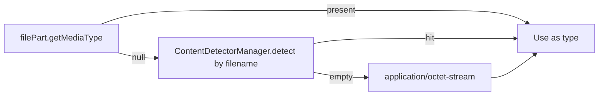
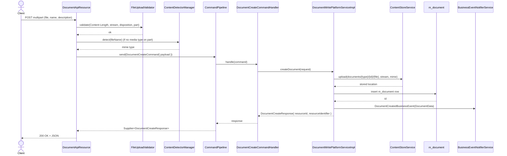

The Apache Fineract `DocumentApiResource` (`fineract-document/src/main/java/org/apache/fineract/infrastructure/documentmanagement/api/DocumentApiResource.java`) is the JAX-RS resource that exposes generic document management at `@Path("/v1/{entityType}/{entityId}/documents")`. A single resource serves every supported entity (`clients`, `loans`, `savings`, `groups`, `staff`, `client_identifiers`) by reading the entity type and id from path variables and persisting them on `m_document.parent_entity_type` / `parent_entity_id`. This page documents every endpoint, the multipart upload shape, the typed request DTOs (`DocumentCreateRequest` etc.), and the `CommandPipeline` integration that bridges the resource to the platform write service.

<Info>
Writes flow through Fineract's modern `CommandPipeline` (`org.apache.fineract.command.core.CommandPipeline`) rather than the legacy `PortfolioCommandSourceWritePlatformService` used by older modules. Reads delegate to `DocumentReadPlatformService`. Both are injected as `final` fields and exposed through Lombok's `@RequiredArgsConstructor`.
</Info>

## Class anatomy

```java
@Slf4j
@Component
@Path("/v1/{entityType}/{entityId}/documents")
@Tag(name = "Documents", description = "...")
@RequiredArgsConstructor
public class DocumentApiResource {

    private final DocumentReadPlatformService documentReadPlatformService;
    private final FileUploadValidator         fileUploadValidator;
    private final ContentDetectorManager      contentDetectorManager;
    private final CommandPipeline             commandPipeline;
}
```

| Collaborator | Role |
| --- | --- |
| `DocumentReadPlatformService` | Powers `GET` endpoints — list, retrieve, content stream. |
| `FileUploadValidator` | Asserts that `Content-Length`, `InputStream`, `FormDataContentDisposition`, and `FormDataBodyPart` are non-null and that `Content-Length > 0`. |
| `ContentDetectorManager` | Used at upload time when the multipart part has no MIME type — defers to Apache Tika via `TikaContentDetector`. |
| `CommandPipeline` | Generic command dispatcher. Each write builds a `Document{Create,Update,Delete}Command`, sets its payload, and invokes `commandPipeline.send(command)`. |

## Path parameters

| Parameter | Constant | Purpose |
| --- | --- | --- |
| `entityType` | `DOCUMENT_API_PARAM_ENTITY_TYPE = "entityType"` | URL slug for the owning entity (`clients` / `loans` / `savings` / `groups` / `staff` / `client_identifiers`). |
| `entityId` | `DOCUMENT_API_PARAM_ENTITY_ID = "entityId"` | Numeric id of the owning entity. |
| `documentId` | `DOCUMENT_API_PARAM_DOCUMENT_ID = "documentId"` | The document's own primary key, for single-resource routes. |

The form-data part names are also held as constants:

| Constant | Value | Used for |
| --- | --- | --- |
| `DOCUMENT_API_PARAM_FILE` | `"file"` | Binary part. |
| `DOCUMENT_API_PARAM_NAME` | `"name"` | Display name. |
| `DOCUMENT_API_PARAM_DESCRIPTION` | `"description"` | Free-text description. |

## Endpoint summary

| Method | Sub-path | Purpose | Consumes | Produces |
| --- | --- | --- | --- | --- |
| `GET` | `/` | List documents on the parent | `application/json` | `application/json` |
| `GET` | `/{documentId}` | Retrieve a document | `application/json` | `application/json` |
| `GET` | `/{documentId}/attachment` | Stream the binary content | `application/json` | `application/octet-stream` |
| `POST` | `/` | Create a document (multipart) | `multipart/form-data` | `application/json` |
| `PUT` | `/{documentId}` | Update a document (multipart) | `multipart/form-data` | `application/json` |
| `DELETE` | `/{documentId}` | Delete a document | — | `application/json` |

## GET / — list

```java
@GET
@Consumes({ MediaType.APPLICATION_JSON })
@Produces({ MediaType.APPLICATION_JSON })
public List<DocumentData> retrieveAllDocuments(
        @PathParam(DOCUMENT_API_PARAM_ENTITY_TYPE) final String entityType,
        @PathParam(DOCUMENT_API_PARAM_ENTITY_ID)   final Long   entityId) {
    return documentReadPlatformService.retrieveAllDocuments(entityType, entityId);
}
```

Example requests from the `@Operation`:

- `GET /v1/clients/1/documents`
- `GET /v1/client_identifiers/1/documents`
- `GET /v1/loans/1/documents?fields=name,description`

The `fields` query parameter is honoured by Fineract's standard JSON serialiser — it filters the projection without affecting the underlying query.

Response is `List<DocumentData>`. The `DocumentReadPlatformService` calls `documentRepository.findAllByParentEntityTypeAndParentEntityId(entityType, entityId)` and maps each row with `DocumentMapper`.

## GET /{documentId} — retrieve

```java
@GET @Path("{documentId}")
public DocumentData getDocument(
        @PathParam(DOCUMENT_API_PARAM_ENTITY_TYPE) final String entityType,
        @PathParam(DOCUMENT_API_PARAM_ENTITY_ID)   final Long   entityId,
        @PathParam(DOCUMENT_API_PARAM_DOCUMENT_ID) final Long   documentId) {
    return documentReadPlatformService.retrieveDocument(entityType, entityId, documentId);
}
```

The read service uses `findByIdAndParentEntityTypeAndParentEntityId(...)` so a document attached to `clients/1` cannot be fetched via `clients/2/documents/{id}` even if the caller knows the id — a `DocumentNotFoundException` is raised instead.

## GET /{documentId}/attachment — stream binary

```java
@GET
@Path("{documentId}/attachment")
@Consumes({ MediaType.APPLICATION_JSON })
@Produces({ MediaType.APPLICATION_OCTET_STREAM })
public Response downloadFile(
        @PathParam(DOCUMENT_API_PARAM_ENTITY_TYPE) final String entityType,
        @PathParam(DOCUMENT_API_PARAM_ENTITY_ID)   final Long   entityId,
        @PathParam(DOCUMENT_API_PARAM_DOCUMENT_ID) final Long   documentId) {

    final var content = documentReadPlatformService.retrieveDocumentContent(
            entityType, entityId, documentId);

    return StreamResponseUtil.ok(StreamResponseUtil.StreamResponseData.builder()
            .type(content.getContentType())
            .fileName(content.getFileName())
            .dispositionType(DISPOSITION_TYPE_ATTACHMENT)
            .stream(content.getStream())
            .size(content.getSize())
            .build());
}
```

The read service loads the `Document` row, picks the `ContentStoreService` that matches its `storage_type_enum`, calls `store.download(location)`, and packages everything as a `DocumentContent` (stream + type + filename + size). The resource then turns that into a JAX-RS `Response` with `Content-Disposition: attachment; filename="..."` so browsers prompt to save rather than render inline. The `StreamResponseUtil` helper handles chunked streaming so the platform never has to buffer the whole file in memory.

## POST / — create (multipart)

```java
@POST
@Consumes({ MediaType.MULTIPART_FORM_DATA })
@Produces({ MediaType.APPLICATION_JSON })
public DocumentCreateResponse createDocument(
        @PathParam(DOCUMENT_API_PARAM_ENTITY_TYPE) final String entityType,
        @PathParam(DOCUMENT_API_PARAM_ENTITY_ID)   final Long   entityId,
        @HeaderParam(CONTENT_LENGTH)               final Long   fileSize,
        @FormDataParam(DOCUMENT_API_PARAM_FILE)        final InputStream                is,
        @FormDataParam(DOCUMENT_API_PARAM_FILE)        final FormDataContentDisposition fileDetails,
        @FormDataParam(DOCUMENT_API_PARAM_FILE)        final FormDataBodyPart           filePart,
        @FormDataParam(DOCUMENT_API_PARAM_NAME)        final String                     name,
        @FormDataParam(DOCUMENT_API_PARAM_DESCRIPTION) final String                     description) {

    fileUploadValidator.validate(fileSize, is, fileDetails, filePart);

    final var command = new DocumentCreateCommand();

    var type = Optional.ofNullable(filePart.getMediaType()).map(MediaType::toString)
            .or(() -> Optional.of(contentDetectorManager
                    .detect(ContentDetectorContext.builder()
                            .fileName(fileDetails.getFileName()).build())
                    .getMimeType()))
            .orElse(APPLICATION_OCTET_STREAM_VALUE);

    command.setPayload(DocumentCreateRequest.builder()
            .entityId(entityId).entityType(entityType)
            .name(name).description(description)
            .fileName(fileDetails.getFileName())
            .size(fileSize).type(type).stream(is)
            .build());

    final Supplier<DocumentCreateResponse> response = commandPipeline.send(command);

    return response.get();
}
```

### Multipart parts

| Part | Required | Notes |
| --- | --- | --- |
| `file` | yes | The actual bytes. Bound three times — as `InputStream`, as `FormDataContentDisposition` (for the filename), and as `FormDataBodyPart` (for the media type). |
| `name` | no | If omitted, server defaults to `fileName` (the create service does that in `Optional.ofNullable(request.getName()).orElse(request.getFileName())`). |
| `description` | yes | Documented as mandatory by the `@Operation`. |

### Type detection cascade



The resource never reads the bytes for type sniffing — only the file extension. The `MimeContentPolicy` post-upload check (run inside the store) re-reads the stream and compares Tika's detected type with the value the API persisted, raising `ContentPolicyException` if they disagree. See [Detector and policies](/document/detector-and-policies).

### Response shape

```json
{
  "resourceId": 42,
  "resourceIdentifier": "clients"
}
```

`DocumentCreateResponse` is built by the write service as `builder().resourceId(doc.getId()).resourceIdentifier(request.getEntityType()).build()`. There is no `officeId` or `changesOnly` — this resource does not use the legacy `CommandProcessingResult` envelope.

## PUT /{documentId} — update (multipart)

```java
@PUT @Path("{documentId}")
@Consumes({ MediaType.MULTIPART_FORM_DATA })
@Produces({ MediaType.APPLICATION_JSON })
public DocumentUpdateResponse updateDocument(... @HeaderParam(CONTENT_LENGTH) final Long fileSize, ...) {

    final var command = new DocumentUpdateCommand();

    final var request = DocumentUpdateRequest.builder()
            .id(documentId).entityId(entityId).entityType(entityType)
            .name(name).description(description).stream(is);

    if (fileDetails != null) {
        request.fileName(fileDetails.getFileName())
               .type(fileDetails.getType())
               .size(fileSize);
    }

    command.setPayload(DocumentUpdateRequest.builder()
            .id(documentId).entityId(entityId).entityType(entityType)
            .name(name).description(description).stream(is).build());

    final Supplier<DocumentUpdateResponse> response = commandPipeline.send(command);

    return response.get();
}
```

The update path supports four modes, mediated by `DocumentWritePlatformServiceImpl.updateDocument(...)`:

| Combination | Behaviour |
| --- | --- |
| `fileName` and `stream` both set | New path computed, old object in the store deleted, new bytes uploaded, `Document.location` and `Document.fileName` rewritten. |
| `stream` set, `fileName` omitted | Re-upload into the existing `location` key (replace bytes, keep filename). |
| `description` / `name` set, no stream | Pure metadata patch. |
| All omitted | No-op. |

A `// TODO` notes that a `DocumentUpdatedBusinessEvent` should fire here but doesn't yet.

<Warning>
The `name` and `type` extraction in the update path uses `fileDetails.getType()` rather than the `Optional.ofNullable(filePart.getMediaType()).orElse(...)` cascade used by `POST`. That means MIME type for PUT is read directly from the `Content-Disposition` header's type attribute, which is generally unreliable. Callers updating the binary should make sure their client sets the part's `Content-Type` header explicitly.
</Warning>

## DELETE /{documentId} — delete

```java
@DELETE @Path("{documentId}")
public DocumentDeleteResponse deleteDocument(
        @PathParam(DOCUMENT_API_PARAM_ENTITY_TYPE) final String entityType,
        @PathParam(DOCUMENT_API_PARAM_ENTITY_ID)   final Long   entityId,
        @PathParam(DOCUMENT_API_PARAM_DOCUMENT_ID) final Long   documentId) {

    final var command = new DocumentDeleteCommand();

    command.setPayload(DocumentDeleteRequest.builder()
            .id(documentId).entityId(entityId).entityType(entityType).build());

    final Supplier<DocumentDeleteResponse> response = commandPipeline.send(command);
    return response.get();
}
```

The write service:

1. Loads the document by id (`findById`) — throws `DocumentNotFoundException` with the entityType / entityId / id in the message on miss.
2. Calls `storeService.delete(doc.getLocation())` to remove the bytes.
3. Calls `documentRepository.deleteById(id)`.
4. Publishes `DocumentDeletedBusinessEvent`.

No soft delete: the row is gone after a successful `DELETE`.

## Multipart upload — curl example

```bash
curl -u mifos:password \
     -H 'Fineract-Platform-TenantId: default' \
     -X POST \
     -F 'name=KYC scan' \
     -F 'description=Scanned passport bio page' \
     -F 'file=@./passport.pdf;type=application/pdf' \
     https://host/fineract-provider/api/v1/clients/42/documents
```

The `;type=application/pdf` annotation on the `-F` part sets `filePart.getMediaType()`, short-circuiting the Tika detection fallback.

## FileUploadValidator

```java
@Component
public class FileUploadValidator {
    public void validate(Long contentLength, InputStream inputStream,
                         FormDataContentDisposition fileDetails, FormDataBodyPart bodyPart) {
        new DataValidatorBuilder().resource("fileUpload").reset()
            .parameter("Content-Length").value(contentLength).notBlank().integerGreaterThanNumber(0).reset()
            .parameter("InputStream").value(inputStream).notNull().reset()
            .parameter("FormDataContentDisposition").value(fileDetails).notNull().reset()
            .parameter("FormDataBodyPart").value(bodyPart).notNull()
            .throwValidationErrors();
    }
}
```

| Check | Required attribute |
| --- | --- |
| `Content-Length` not blank, > 0 | `Content-Length` header on the request |
| `InputStream` not null | `file` part must be present |
| `FormDataContentDisposition` not null | `file` part must carry a `Content-Disposition` |
| `FormDataBodyPart` not null | `file` part must be a real body part |

A miss raises `PlatformApiDataValidationException` (HTTP 400) with a structured body listing the failed validators.

## Error responses

| HTTP | Exception | Cause |
| --- | --- | --- |
| 400 | `PlatformApiDataValidationException` | `FileUploadValidator` failure (missing `Content-Length`, etc.). |
| 400 | `ContentPolicyException` | Whitelist mismatch, traversal attempt, or post-upload MIME mismatch. |
| 400 | `DocumentInvalidRequestException` | Lower-level write failure. |
| 404 | `DocumentNotFoundException` | Bad `documentId` or wrong (entityType, entityId). |
| 500 | `ContentStoreException` | I/O or S3 failure. |

## End-to-end sequence



## Cross-references

- [Document overview](/document/overview) — module file map.
- [Domain model](/document/document-management-domain) — `Document` entity, `DocumentRepository`, request DTOs.
- [Images API](/document/images-api) — sibling resource for avatar images.
- [Content store](/document/content-store) — `ContentStoreService` SPI.
- [Detector and policies](/document/detector-and-policies) — Tika and the policy chain that gate every upload.
- [API / Document APIs](/api/documents) — published OpenAPI reference.
- [Portfolio / Clients](/portfolio/clients) — the most common owning entity.
