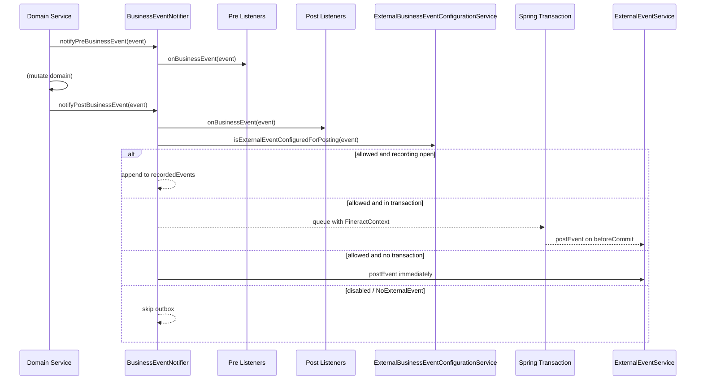

The internal event bus inside Apache Fineract is built on a tiny SPI — `BusinessEvent<T>` for payloads, `BusinessEventListener<T>` for subscribers, and `BusinessEventNotifierService` for dispatch. Domain code calls `notifyPostBusinessEvent(event)` after a successful operation; every listener registered against that event class (or a superclass) is invoked synchronously inside the same transaction. The same call decides whether the event must also be written to the external outbox table. This page documents that SPI in detail, walks through the notifier implementation, lists every published event class (loan, savings, share, client, group, document, journal entry, datatable, investor), and shows the pre/post recording windows the COB pipeline uses to coalesce bulk events.

<Note>
Listeners run on the caller thread inside the caller's transaction. Throwing from a listener rolls back the business operation. Use the external pipeline ([Events Overview](/events/overview)) when you need durable, fan-out delivery to other services.
</Note>

## The contract

```java
// fineract-core/src/main/java/org/apache/fineract/infrastructure/event/business/domain/BusinessEvent.java
public interface BusinessEvent<T> {
    T get();
    String getType();
    String getCategory();
    Long getAggregateRootId();
}
```

| Method              | Used by                                                                                          |
| ------------------- | ------------------------------------------------------------------------------------------------ |
| `get()`             | Listeners (read the actual `Loan`, `SavingsAccount`, `Client`, …)                                |
| `getType()`         | Outbox writer (column `m_external_event.type`), allow-list lookup, `MessageV1.type`              |
| `getCategory()`     | Outbox writer (column `m_external_event.category`), `MessageV1.category`                         |
| `getAggregateRootId()` | Kafka partition key + JMS consistent-hash producer routing; column `m_external_event.aggregate_root_id` |

`AbstractBusinessEvent<T>` provides the boilerplate `get()`:

```java
@RequiredArgsConstructor
public abstract class AbstractBusinessEvent<T> implements BusinessEvent<T> {
    private final T value;
    @Override public T get() { return value; }
}
```

Subclasses then only need to declare `getType()` / `getCategory()` / `getAggregateRootId()`. A typical concrete leaf is one line of state plus a constant `TYPE`:

```java
// fineract-loan/.../domain/loan/LoanApprovedBusinessEvent.java
public class LoanApprovedBusinessEvent extends LoanBusinessEvent {
    private static final String TYPE = "LoanApprovedBusinessEvent";
    public LoanApprovedBusinessEvent(Loan value) { super(value); }
    @Override public String getType() { return TYPE; }
}
```

`LoanBusinessEvent` is the family base — every loan event inherits its category and aggregate-root semantics:

```java
public abstract class LoanBusinessEvent extends AbstractBusinessEvent<Loan> {
    private static final String CATEGORY = "Loan";
    @Override public String getCategory() { return CATEGORY; }
    @Override public Long getAggregateRootId() { return get().getId(); }
}
```

## Listener SPI

```java
public interface BusinessEventListener<T extends BusinessEvent<?>> {
    void onBusinessEvent(T event);
}
```

Listeners are **type-parameterized**. Registration is done at startup (typically inside an `@PostConstruct` of the consuming service) via the notifier:

```java
businessEventNotifier.addPostBusinessEventListener(
    LoanApprovedBusinessEvent.class,
    new MyApprovalListener());
```

Pre and post listeners exist (`notifyPreBusinessEvent` / `notifyPostBusinessEvent`). Only post-listeners receive bulk envelopes, and only post-listeners trigger external event writes.

## `BusinessEventNotifierServiceImpl` — the dispatcher

Source: `fineract-core/src/main/java/org/apache/fineract/infrastructure/event/business/service/BusinessEventNotifierServiceImpl.java`

It implements three roles:

1. **`BusinessEventNotifierService`** — the public dispatch / registration API used by domain services.
2. **`InitializingBean`** — at startup it logs whether external posting is on.
3. **`TransactionExecutionListener`** — Spring 6's hook so the notifier can flush queued events at `beforeCommit` and clear at `afterCommit` / `afterRollback`.

### Fields

| Field                              | Purpose                                                                       |
| ---------------------------------- | ----------------------------------------------------------------------------- |
| `preListeners`                     | `Map<Class, List<BusinessEventListener>>` for pre-dispatch                    |
| `postListeners`                    | Same shape for post-dispatch                                                  |
| `eventRecordingEnabled`            | `ThreadLocal<Boolean>` — true while a bulk-recording window is open           |
| `recordedEvents`                   | `ThreadLocal<List<BusinessEvent<?>>>` — buffer for the open window            |
| `transactionBusinessEvents`        | `ThreadLocal<Stack<List<BusinessEventWithContext>>>` — stack-per-transaction  |
| `externalEventService`             | Writer that creates a `m_external_event` row                                  |
| `externalBusinessEventConfigurationService` | Reads `m_external_event_configuration.enabled` per type                |
| `transactionHelper`                | Wraps `TransactionAspectSupport.currentTransactionStatus().hasTransaction()`  |

### Listener dispatch

`findSuitableListeners(map, eventClazz)` does a polymorphic walk over registered types: if any registered class is `isAssignableFrom(eventClazz)`, all of its listeners fire. So a listener registered for the **abstract** `LoanBusinessEvent.class` will see every concrete subtype.

```java
private List<BusinessEventListener> findSuitableListeners(Map<Class, List<BusinessEventListener>> listeners, Class<?> eventClazz) {
    List<BusinessEventListener> result = new ArrayList<>();
    for (Map.Entry<Class, List<BusinessEventListener>> entry : listeners.entrySet()) {
        Class<?> registeredClazz = entry.getKey();
        if (registeredClazz.isAssignableFrom(eventClazz)) {
            result.addAll(entry.getValue());
        }
    }
    return result;
}
```

### `notifyPostBusinessEvent` — the central method

```java
@Override
@Transactional(propagation = Propagation.SUPPORTS)
public void notifyPostBusinessEvent(BusinessEvent<?> businessEvent) {
    throwExceptionIfBulkEvent(businessEvent);
    boolean isExternalEvent = !(businessEvent instanceof NoExternalEvent);
    List<BusinessEventListener> businessEventListeners =
        findSuitableListeners(postListeners, businessEvent.getClass());
    for (BusinessEventListener eventListener : businessEventListeners) {
        eventListener.onBusinessEvent(businessEvent);
    }
    if (isExternalEvent && isExternalEventPostingEnabled()) {
        if (externalBusinessEventConfigurationService.isExternalEventConfiguredForPosting(businessEvent)) {
            if (isExternalEventRecordingEnabled()) {
                recordedEvents.get().add(businessEvent);
            } else {
                if (transactionHelper.hasTransaction()) {
                    storeTransactionalBusinessEvent(businessEvent);
                } else {
                    externalEventService.postEvent(businessEvent);
                }
            }
        }
    }
}
```

| Decision                                  | Outcome                                                                     |
| ----------------------------------------- | --------------------------------------------------------------------------- |
| `event instanceof BulkBusinessEvent`      | `IllegalArgumentException` — bulk envelopes can only be created internally  |
| `event instanceof NoExternalEvent`        | Listeners still fire, but the outbox is skipped                             |
| `fineract.events.external.enabled = false`| Listeners fire; outbox skipped                                              |
| Per-type `enabled = false` in `m_external_event_configuration` | Listeners fire; outbox skipped                              |
| Recording window open on this thread      | Event buffered into `recordedEvents` (no outbox write yet)                  |
| Active transaction                        | Event buffered with `FineractContext` into `transactionBusinessEvents`, flushed at `beforeCommit` |
| No transaction                            | `externalEventService.postEvent(event)` runs immediately                    |

### `beforeCommit` — flushing transactional events

```java
@Override
public void beforeCommit(@NonNull final TransactionExecution transaction) {
    final List<BusinessEventWithContext> businessEventWithContexts =
        transactionBusinessEvents.get().peek();
    if (businessEventWithContexts.isEmpty()) return;
    final FineractContext originalContext = ThreadLocalContextUtil.getContext();
    businessEventWithContexts.forEach(businessEventWithContext -> {
        final FineractContext currentContext = businessEventWithContext.getFineractContext();
        boolean swappedContext = false;
        try {
            if (!originalContext.equals(currentContext)) {
                swappedContext = true;
                ThreadLocalContextUtil.init(currentContext);
            }
            externalEventService.postEvent(businessEventWithContext.getEvent());
        } finally {
            if (swappedContext) ThreadLocalContextUtil.init(originalContext);
        }
    });
}
```

The captured `FineractContext` is what makes nested-transaction or async-handoff scenarios safe: each event re-establishes the tenant/business-date/user it was originally raised with, even if Spring's commit listener runs in a slightly different context.

### `afterCommit` / `afterRollback`

Both call `cleanup()`, which pops the per-transaction frame. On rollback that means **no outbox row is written** — the business operation that produced the event reverted, so consumers must never see it.

## Recording window — building `BulkBusinessEvent`

```java
public void startExternalEventRecording() { eventRecordingEnabled.set(true); }
public void resetEventRecording()         { eventRecordingEnabled.set(false); recordedEvents.remove(); }

public void stopExternalEventRecording() {
    eventRecordingEnabled.set(false);
    try {
        List<BusinessEvent<?>> recorded = recordedEvents.get();
        if (isExternalEventPostingEnabled()) {
            if (recorded.isEmpty())                  { /* skip */ }
            else if (recorded.size() == 1)           { externalEventService.postEvent(recorded.get(0)); }
            else                                     { externalEventService.postEvent(new BulkBusinessEvent(recorded)); }
        }
    } finally {
        recordedEvents.remove();
    }
}
```

| Recorded count | Result                                                            |
| -------------- | ----------------------------------------------------------------- |
| 0              | No outbox write                                                   |
| 1              | Single event posted directly (no envelope inflation)              |
| 2+             | Wrapped in `BulkBusinessEvent`; all must share `aggregateRootId`  |

`BulkBusinessEvent` itself:

```java
public class BulkBusinessEvent extends AbstractBusinessEvent<List<BusinessEvent<?>>> {
    public static final String TYPE = "BulkBusinessEvent";
    public BulkBusinessEvent(List<BusinessEvent<?>> value) {
        super(value);
        verifySameAggregate(value);
    }
    @Override public String getCategory() { return "Bulk"; }
    @Override public Long getAggregateRootId() { return get().iterator().next().getAggregateRootId(); }
}
```

`verifySameAggregate` builds a set of distinct non-null aggregate IDs from the children; size > 1 throws `IllegalArgumentException`. This guarantee feeds the partitioning in `SendAsynchronousEventsTasklet.generatePartitions` — a bulk envelope only ever shows up in one partition.

## `NoExternalEvent` marker

```java
public interface NoExternalEvent {}
```

Implementing this interface on a `BusinessEvent` subclass makes the post-notifier skip the outbox while still firing listeners. Use it for in-process orchestration signals.

## Event class catalogue

The 140+ concrete event classes live next to their owning aggregates, not under `fineract-core`. Each module (`fineract-loan`, `fineract-investor`, `fineract-document`, `fineract-accounting`, plus `fineract-provider` for the older client/savings/share/group families) ships its own subtree under `infrastructure/event/business/domain/...`.

### Core (datatable only)

`fineract-core/src/main/java/org/apache/fineract/infrastructure/event/business/domain/datatable/`

| Class                                | Aggregate                  | Type string                          |
| ------------------------------------ | -------------------------- | ------------------------------------ |
| `DatatableEntryBusinessEvent`        | abstract base              | —                                    |
| `DatatableEntryCreatedBusinessEvent` | (datatable row identifier) | `DatatableEntryCreatedBusinessEvent` |
| `DatatableEntryUpdatedBusinessEvent` | (datatable row identifier) | `DatatableEntryUpdatedBusinessEvent` |
| `DatatableEntryDeletedBusinessEvent` | (datatable row identifier) | `DatatableEntryDeletedBusinessEvent` |

### Loan family (`fineract-loan`)

Base: `LoanBusinessEvent extends AbstractBusinessEvent<Loan>`, category `Loan`, aggregate ID = `Loan.getId()`.

Lifecycle:

| Class                                            | Fires when                                 |
| ------------------------------------------------ | ------------------------------------------ |
| `LoanCreatedBusinessEvent`                       | Loan application created                   |
| `LoanApplicationModifiedBusinessEvent`           | Application updated pre-approval           |
| `LoanApprovedBusinessEvent`                      | Application approved                       |
| `LoanApprovedAmountChangedBusinessEvent`         | Approved amount changed post-approval      |
| `LoanUndoApprovalBusinessEvent`                  | Approval reversed                          |
| `LoanRejectedBusinessEvent`                      | Application rejected                       |
| `LoanWithdrawnByApplicantBusinessEvent`          | Applicant withdraws application            |
| `LoanDisbursalBusinessEvent`                     | Loan disbursed                             |
| `LoanUndoDisbursalBusinessEvent`                 | Full disbursal reversed                    |
| `LoanUndoLastDisbursalBusinessEvent`             | Last disbursal tranche reversed            |
| `LoanUpdateDisbursementDataBusinessEvent`        | Disbursement schedule edited               |
| `LoanCloseBusinessEvent`                         | Loan closed (paid off / written off / etc.)|
| `LoanCloseAsRescheduleBusinessEvent`             | Closed because rescheduled                 |
| `LoanStatusChangedBusinessEvent`                 | Status transition                          |
| `LoanBalanceChangedBusinessEvent`                | Outstanding balance changed                |
| `LoanReassignOfficerBusinessEvent`               | Loan officer reassignment                  |
| `LoanRemoveOfficerBusinessEvent`                 | Loan officer removed                       |
| `LoanAccountSnapshotBusinessEvent`               | Generic snapshot emitted                   |
| `LoanAccountCustomSnapshotBusinessEvent`         | Snapshot extended with custom data         |
| `LoanAccountDelinquencyPauseChangedBusinessEvent`| Pause period toggled                       |
| `LoanDelinquencyRangeChangeBusinessEvent`        | Delinquency bucket changed                 |
| `LoanInterestRecalculationBusinessEvent`         | Interest recalculation run                 |

Transfers:

| Class                                  | Fires when                                                 |
| -------------------------------------- | ---------------------------------------------------------- |
| `LoanInitiateTransferBusinessEvent`    | Transfer initiated                                         |
| `LoanAcceptTransferBusinessEvent`      | Transfer accepted by receiving office                      |
| `LoanRejectTransferBusinessEvent`      | Transfer rejected                                          |
| `LoanWithdrawTransferBusinessEvent`    | Initiating office withdraws the transfer                   |

Schedule / variation / rescheduling:

| Class                                                | Fires when                          |
| ---------------------------------------------------- | ----------------------------------- |
| `LoanScheduleVariationsAddedBusinessEvent`           | Variation added                     |
| `LoanScheduleVariationsDeletedBusinessEvent`         | Variation removed                   |
| `LoanRescheduledDueAdjustScheduleBusinessEvent`      | Rescheduled (schedule adjust)       |
| `LoanRescheduledDueCalendarChangeBusinessEvent`      | Rescheduled (calendar change)       |
| `LoanRescheduledDueHolidayBusinessEvent`             | Rescheduled (holiday)               |

Charges (`infrastructure/event/business/domain/loan/charge/`):

| Class                                  | Fires when                          |
| -------------------------------------- | ----------------------------------- |
| `LoanChargeBusinessEvent` (base)       | —                                   |
| `LoanAddChargeBusinessEvent`           | Charge added                        |
| `LoanUpdateChargeBusinessEvent`        | Charge updated                      |
| `LoanDeleteChargeBusinessEvent`        | Charge deleted                      |
| `LoanWaiveChargeBusinessEvent`         | Charge waived                       |
| `LoanWaiveChargeUndoBusinessEvent`     | Waiver undone                       |
| `LoanApplyOverdueChargeBusinessEvent`  | Penalty applied due to overdue      |

Repayment installments (`infrastructure/event/business/domain/loan/repayment/`):

| Class                                | Fires when                  |
| ------------------------------------ | --------------------------- |
| `LoanRepaymentBusinessEvent` (base)  | —                           |
| `LoanRepaymentDueBusinessEvent`      | Installment due reminder    |
| `LoanRepaymentOverdueBusinessEvent`  | Installment overdue notice  |

Transactions (`infrastructure/event/business/domain/loan/transaction/`) — generally come in `Pre` / `Post` pairs to give listeners a hook on each side of accrual posting:

| Pair                                                                                       | Transaction kind                |
| ------------------------------------------------------------------------------------------ | ------------------------------- |
| `LoanTransactionMakeRepaymentPreBusinessEvent` / …`Post…`                                   | Repayment                       |
| `LoanTransactionMerchantIssuedRefundPre…` / …`Post…`                                       | Merchant-issued refund          |
| `LoanTransactionPayoutRefundPre…` / …`Post…`                                                | Payout refund                   |
| `LoanTransactionGoodwillCreditPre…` / …`Post…`                                              | Goodwill credit                 |
| `LoanTransactionRecoveryPaymentPre…` / …`Post…`                                             | Recovery payment                |
| `LoanTransactionInterestPaymentWaiverPre…` / …`Post…`                                       | Interest payment waiver         |
| `LoanTransactionInterestRefundPre…` / …`Post…`                                              | Interest refund                 |
| `LoanTransactionDownPaymentPre…` / …`Post…`                                                 | Down payment                    |
| `LoanTransactionAccrualActivityPre…` / …`Post…`                                             | Accrual activity                |
| `LoanChargeAdjustmentPre…` / …`Post…`                                                       | Charge adjustment               |
| `LoanChargePaymentPre…` / …`Post…`                                                          | Charge payment                  |
| `LoanCreditBalanceRefundPre…` / …`Post…`                                                    | Credit balance refund           |
| `LoanRefundPre…` / …`Post…`                                                                 | Refund                          |
| `LoanForeClosurePre…` / …`Post…`                                                            | Foreclosure                     |
| `LoanChargeOffPre…` / …`Post…`                                                              | Charge-off                      |
| `LoanWrittenOffPre…` / …`Post…`                                                             | Write-off                       |

One-off transaction events:

| Class                                                          | Fires when                              |
| -------------------------------------------------------------- | --------------------------------------- |
| `LoanAdjustTransactionBusinessEvent`                           | Existing transaction adjusted           |
| `LoanChargebackTransactionBusinessEvent`                       | Chargeback applied                      |
| `LoanWaiveInterestBusinessEvent`                               | Interest waived (single-sided)          |
| `LoanChargeRefundBusinessEvent`                                | Charge refund                           |
| `LoanAccrualTransactionCreatedBusinessEvent`                   | Accrual posted                          |
| `LoanAccrualAdjustmentTransactionBusinessEvent`                | Accrual adjusted                        |
| `LoanCapitalizedIncomeTransactionCreatedBusinessEvent`         | Capitalized income posted               |
| `LoanCapitalizedIncomeAdjustmentTransactionCreatedBusinessEvent` | Capitalized income adjustment           |
| `LoanCapitalizedIncomeAmortizationTransactionCreatedBusinessEvent` | Capitalized income amortization     |
| `LoanCapitalizedIncomeAmortizationAdjustmentTransactionCreatedBusinessEvent` | Amortization adjustment        |
| `LoanBuyDownFeeTransactionCreatedBusinessEvent`                | Buy-down fee posted                     |
| `LoanBuyDownFeeAdjustmentTransactionCreatedBusinessEvent`      | Buy-down fee adjustment                 |
| `LoanBuyDownFeeAmortizationTransactionCreatedBusinessEvent`    | Buy-down fee amortization               |
| `LoanBuyDownFeeAmortizationAdjustmentTransactionCreatedBusinessEvent` | Amortization adjustment           |
| `LoanTransactionContractTerminationPostBusinessEvent`          | Contract termination posted             |
| `LoanUndoContractTerminationBusinessEvent`                     | Contract termination reversed           |
| `LoanUndoChargeOffBusinessEvent`                               | Charge-off reversed                     |
| `LoanUndoWrittenOffBusinessEvent`                              | Write-off reversed                      |

Re-age / re-amortize (`infrastructure/event/business/domain/loan/reaging/` and `reamortization/`):

| Class                                       | Fires when           |
| ------------------------------------------- | -------------------- |
| `LoanReAgeBusinessEvent`                    | Re-age applied       |
| `LoanReAgeTransactionBusinessEvent`         | Re-age tx posted     |
| `LoanUndoReAgeBusinessEvent`                | Re-age reversed      |
| `LoanUndoReAgeTransactionBusinessEvent`     | Re-age tx reversed   |
| `LoanReAmortizeBusinessEvent`               | Re-amortize applied  |
| `LoanReAmortizeTransactionBusinessEvent`    | Re-amortize tx       |
| `LoanUndoReAmortizeBusinessEvent`           | Re-amortize undone   |
| `LoanUndoReAmortizeTransactionBusinessEvent`| Re-amortize tx undone|

### Savings family (`fineract-provider`)

Base: `SavingsAccountBusinessEvent extends AbstractBusinessEvent<SavingsAccount>`, category `Savings`, aggregate ID = `SavingsAccount.getId()`.

| Class                                       | Fires when                          |
| ------------------------------------------- | ----------------------------------- |
| `SavingsCreateBusinessEvent`                | Account created                     |
| `SavingsApproveBusinessEvent`               | Application approved                |
| `SavingsActivateBusinessEvent`              | Account activated                   |
| `SavingsRejectBusinessEvent`                | Application rejected                |
| `SavingsCloseBusinessEvent`                 | Account closed                      |
| `SavingsPostInterestBusinessEvent`          | Interest posted                     |
| `SavingsAccountForceWithdrawalBusinessEvent`| Force-withdraw triggered            |

Per-transaction (sub-base `SavingsAccountTransactionBusinessEvent`):

| Class                                       | Fires when             |
| ------------------------------------------- | ---------------------- |
| `SavingsDepositBusinessEvent`               | Deposit posted         |
| `SavingsWithdrawalBusinessEvent`            | Withdrawal posted      |

### Fixed deposit / recurring deposit

| Class                                       | Fires when                  |
| ------------------------------------------- | --------------------------- |
| `FixedDepositAccountBusinessEvent` (base)   | —                           |
| `FixedDepositAccountCreateBusinessEvent`    | FD created                  |
| `RecurringDepositAccountBusinessEvent` (base) | —                         |
| `RecurringDepositAccountCreateBusinessEvent`| RD created                  |

### Share family

Base: `ShareAccountBusinessEvent extends AbstractBusinessEvent<ShareAccount>`.

| Class                                       | Fires when           |
| ------------------------------------------- | -------------------- |
| `ShareAccountCreateBusinessEvent`           | Share account created |
| `ShareAccountApproveBusinessEvent`          | Share account approved |
| `ShareProductDividentsCreateBusinessEvent`  | Dividend posted      |

### Client / Group / Center family

| Class                            | Fires when                          |
| -------------------------------- | ----------------------------------- |
| `ClientBusinessEvent` (base, `Client` payload, category `Client`) | —          |
| `ClientCreateBusinessEvent`      | Client onboarded                    |
| `ClientActivateBusinessEvent`    | Client activated                    |
| `ClientRejectBusinessEvent`      | Client rejected                     |
| `GroupsBusinessEvent` (base)     | —                                   |
| `GroupsCreateBusinessEvent`      | Group created                       |
| `CentersCreateBusinessEvent`     | Center created                      |

### Document & accounting

| Class                            | Module                | Fires when                |
| -------------------------------- | --------------------- | ------------------------- |
| `DocumentBusinessEvent` (base)   | `fineract-document`   | —                         |
| `DocumentCreatedBusinessEvent`   | `fineract-document`   | Document uploaded         |
| `DocumentDeletedBusinessEvent`   | `fineract-document`   | Document removed          |
| `JournalEntryBusinessEvent`      | `fineract-accounting` | Journal entry posted      |
| `LoanJournalEntryCreatedBusinessEvent` | `fineract-loan` | Loan-scoped JE posted     |

### Product changes

| Class                                    | Fires when                |
| ---------------------------------------- | ------------------------- |
| `LoanProductBusinessEvent` (base)        | —                         |
| `LoanProductCreateBusinessEvent`         | Loan product created      |

### Investor (`fineract-investor`)

| Class                                | Fires when                          |
| ------------------------------------ | ----------------------------------- |
| `InvestorBusinessEvent` (base)       | —                                   |
| `LoanOwnershipTransferBusinessEvent` | Loan ownership transfer settled     |

See [Investor Events](/investor/investor-events) for the surrounding workflow.

## Discovery commands

```bash
# All concrete event classes
find /repo -name '*BusinessEvent.java' -path '*/domain/*' \
  | grep -v Abstract \
  | awk -F/ '{print $NF}' \
  | sort -u

# Per-module count
find /repo -name '*BusinessEvent.java' -path '*/domain/*' \
  | awk -F/ '{print $(NF-7)"/"$(NF-6)}' \
  | sort | uniq -c
```

## Test-mode introspection

When running under the `TEST` Spring profile, `InternalExternalEventService` exposes a Specification-driven read API to assert what was queued — used by integration tests in `fineract-integration-tests`:

```java
// fineract-core/.../external/service/InternalExternalEventService.java
@Service @Profile(FineractProfiles.TEST)
public class InternalExternalEventService {
    public List<ExternalEventResponse> getAllExternalEvents(String idempotencyKey, String type,
                                                            String category, Long aggregateRootId) {
        // … builds a JpaSpecification, then decodes m_external_event.data via Class.forName(schema)
    }
    public void deleteAllExternalEvents() { externalEventRepository.deleteAll(); }
}
```

This is the bridge between the in-process bus and `InternalExternalEventsApiResource`, the test-only `/v1/internal/externalevents` endpoint.

## Lifecycle diagram



## Related reading

- [Events Overview](/events/overview)
- [Core: Business Events](/core/event-business)
- [Core: External Events](/core/event-external)
- [External Event Domain](/events/external-event-domain)
- [Event Idempotency](/events/event-idempotency)
- [Serialization & Mappers](/events/event-serialization-mappers)
- [Avro Schemas](/events/avro-schemas)
- [Investor Events](/investor/investor-events)
- [External Event Flow](/flows/external-event-flow)
- [Job Names](/jobs/job-names-enumeration)
