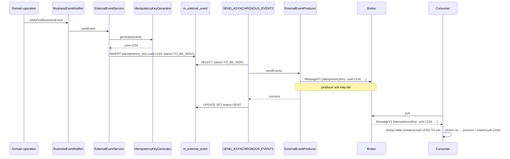

The Apache Fineract outbox guarantees **at-least-once** delivery, never exactly-once. A row in `m_external_event` may be transmitted more than once if the producer succeeds in dispatching to a broker but the application crashes before `markEventsSent` commits, or if a consumer-side commit races with broker retry. To make safe deduplication possible, every outbox row carries a unique `idempotency_key` that flows untouched into `MessageV1.idempotencyKey` on the wire. Consumers are expected to remember which keys they've processed and drop the rest. This page explains how the key is generated, how to swap in a deterministic generator, and the algebra of duplicates the producer side actually creates.

<Note>
There is no producer-side dedup. The send job re-reads any row whose `status` is still `TO_BE_SENT`, no matter how many times that row was already pushed to a broker. The dedup contract is purely consumer-side, keyed on `MessageV1.idempotencyKey`.
</Note>

## The SPI

```java
// fineract-core/src/main/java/org/apache/fineract/infrastructure/event/external/service/idempotency/ExternalEventIdempotencyKeyGenerator.java
public interface ExternalEventIdempotencyKeyGenerator {
    <T> String generate(BusinessEvent<T> event);
}
```

| Method     | Contract                                                                                            |
| ---------- | --------------------------------------------------------------------------------------------------- |
| `generate` | Returns a string uniquely identifying this **post-notification**, called once per outbox row write. |

The default implementation is purposefully oblivious to the event payload:

```java
// fineract-core/.../idempotency/DefaultExternalEventIdempotencyKeyGenerator.java
@Component
public class DefaultExternalEventIdempotencyKeyGenerator implements ExternalEventIdempotencyKeyGenerator {
    @Override
    public <T> String generate(BusinessEvent<T> event) {
        return UUID.randomUUID().toString();
    }
}
```

`UUID.randomUUID()` returns a Version 4 random UUID — collision probability is `~ 2^-122`, which for Fineract's volumes is operationally zero. Critically, **identical re-emissions of the same logical event get different keys** under the default impl. That's deliberate: in Fineract's same-transaction outbox model, an outbox row only exists for a committed operation, so re-emission is downstream-only and the wire key just needs to be unique per row.

## Where the key is set

`ExternalEventService.handleRegularBusinessEvent`:

```java
String idempotencyKey = idempotencyKeyGenerator.generate(event);
// …
return new ExternalEvent(eventType, eventCategory, schema, data, idempotencyKey, aggregateRootId);
```

`ExternalEventService.handleBulkBusinessEvent`:

```java
String idempotencyKey = idempotencyKeyGenerator.generate(bulkBusinessEvent);
// … one ExternalEvent row for the whole bulk
```

The key is then stored in `m_external_event.idempotency_key NOT NULL` and forwarded to the wire by `MessageFactory.createMessage(ExternalEventView)`:

```java
public MessageV1 createMessage(ExternalEventView event) {
    // …
    MessageIdempotencyKey idempotencyKey = new MessageIdempotencyKey(event.getIdempotencyKey());
    // …
    return createMessage(id, source, type, category, createdAt, businessDate, idempotencyKey, dataSchema, data);
}
```

The Avro envelope (`MessageV1.avsc`):

```json
{ "name": "idempotencyKey",
  "doc":  "The idempotency key for this particular event for consumer de-duplication",
  "type": "string" }
```

For a `BulkBusinessEvent`, the **inner items** (`BulkMessageItemV1`) do **not** carry their own idempotency keys — only the outer `MessageV1` does. Consumers therefore dedupe on the whole bulk envelope, then iterate the items.

## Lifecycle



## At-least-once: how duplicates actually arise

The producer side only produces duplicates in three well-defined scenarios:

| Scenario                                                           | Duplicate?                          | Why                                                                                |
| ------------------------------------------------------------------ | ----------------------------------- | ---------------------------------------------------------------------------------- |
| Producer sends OK, `markEventsSent` succeeds                       | No                                  | Row goes to `SENT`; never re-read                                                  |
| Producer throws                                                    | No                                  | `markEventsSent` is **not** called; rows stay `TO_BE_SENT`; nothing was emitted    |
| Producer sends OK, JVM crashes before `markEventsSent`             | **Yes** on next run                 | Row still `TO_BE_SENT`; next send-job iteration re-reads + re-emits                |
| Broker accepts ack then drops the message (unsafe `async-send-enabled`) | (Lost) | Broker never delivers; consumer never sees a duplicate or the original             |
| Send-job partition update fails after producer ack                 | **Yes** on next run                 | Same as JVM crash                                                                  |
| Consumer crashes after broker delivery but before commit           | **Yes** on consumer side            | Broker redelivers; same `idempotencyKey` recurs                                    |

The `markEventsSent` step is intentionally separated from `sendEvents` to widen this small race window — the alternative (commit before send) would risk silent loss. The chosen tradeoff: redelivery on rare crash recovery, with the consumer responsible for dedup.

## Consumer side: how to dedupe

A robust consumer side looks like:

```sql
CREATE TABLE processed_events (
  idempotency_key VARCHAR(64) PRIMARY KEY,
  processed_at    TIMESTAMP NOT NULL DEFAULT now()
);
```

In the consumer's transaction:

```sql
BEGIN;
  INSERT INTO processed_events (idempotency_key) VALUES (?) ON CONFLICT DO NOTHING;
  -- If inserted=0, this is a duplicate. Roll back the consumer's work and ack.
  -- If inserted=1, do the work, then commit + ack.
COMMIT;
```

The `ON CONFLICT DO NOTHING` (or equivalent) primary-key fence is what makes the consumer side exactly-once even though the wire is at-least-once. Some consumers cache the last N keys in memory plus a persistent backstop for restart safety.

Retention of the dedupe table should be at least as long as the broker's redelivery window plus the producer's mean time to a re-emission spike — for Kafka with `log.retention.hours=168` and Fineract's defaults, a week of `processed_events` is conservative.

## Custom generator: deterministic keys

If you want **stable** keys across redeliveries — e.g. you can't keep a server-side dedup table and want to use the key as a write-through token in your downstream — replace the default with a deterministic generator:

```java
@Component
public class StableIdempotencyKeyGenerator implements ExternalEventIdempotencyKeyGenerator {
    @Override
    public <T> String generate(BusinessEvent<T> event) {
        // Example: type|aggregateId|payload-hash
        Long id = event.getAggregateRootId();
        String payloadHash = hash(event.get()); // SHA-256 of a JSON view
        return event.getType() + "|" + id + "|" + payloadHash;
    }
    // …
}
```

Use `@Primary` or override the bean in your own configuration to displace the default `DefaultExternalEventIdempotencyKeyGenerator`. The trade-off:

| Generator              | Key uniqueness                                  | Re-emit-of-same-row gives                       |
| ---------------------- | ----------------------------------------------- | ----------------------------------------------- |
| `DefaultExternal…` (UUID v4) | Unique per **outbox row**                | Different key (broker-level redelivery still recurs, but the **row** is the same so the broker uses message-id matching for ack tracking) |
| Stable hash generator  | Unique per **logical event identity**           | Same key — natural dedup token your downstream can index by      |

Note that under the default, two outbox rows for the same logical fact (e.g. one written via the transactional path + one written manually via test code) get **different** keys; under a stable generator they get the **same** key, which can be either feature or bug depending on your downstream design.

## Test-mode key inspection

Under the `TEST` profile, `InternalExternalEventService.getAllExternalEvents(idempotencyKey, type, category, aggregateRootId)` allows integration tests to look up events by key:

```java
private Specification<ExternalEvent> hasIdempotencyKey(String idempotencyKey) {
    return (root, query, cb) -> cb.equal(root.get("idempotencyKey"), idempotencyKey);
}
```

This is how the `fineract-integration-tests` module asserts that a given operation produced exactly one matching outbox row.

## `MessageV1` envelope reminder

The envelope is the same for every event family. The dedup-relevant fields are:

| Field            | Used for dedup                                                                          |
| ---------------- | --------------------------------------------------------------------------------------- |
| `id`             | Outbox row PK; visible to consumers but should **not** be the dedup key (renumbered after purge) |
| `source`         | Per-JVM UUID; rotates on each restart, useful for correlating producer instances        |
| `idempotencyKey` | **Authoritative dedup key**                                                             |
| `type`           | Coarse routing / filter                                                                 |
| `aggregateRootId`| Per-aggregate dedup table partitioning                                                  |

## Implications for ordering and dedup interaction

Per-aggregate ordering is preserved both in JMS (consistent hash) and Kafka (key-based partition assignment). Combined with dedup, this gives consumers a simple pattern:

```
for each (aggregateRootId, ordered stream of events):
    if seen(idempotencyKey): drop
    else process and remember(idempotencyKey)
```

So you can build a per-aggregate event reducer (e.g. "rebuild loan state") whose checkpoint is the highest `MessageV1.id` per aggregate it has processed — `id` is monotonic within an aggregate because the send job orders by `business_date asc, id asc`.

## What is **not** idempotency-protected

- **In-process listeners**. `BusinessEventListener.onBusinessEvent` runs once per `notifyPostBusinessEvent`. There is no internal idempotency key for in-process listeners — they're synchronous and same-transaction.
- **Bulk inner items**. A `BulkMessageItemV1` has no `idempotencyKey` field; the outer `MessageV1.idempotencyKey` dedups the whole envelope.
- **Pre-notifier events**. `notifyPreBusinessEvent` doesn't write to the outbox at all.
- **`NoExternalEvent` markers**. They're filtered out before the idempotency key is generated.

## Operational considerations

### Renumber / replay

If you replay a backup of `m_external_event` into a downstream that already saw the previous run, the same `idempotency_key` rows will be re-emitted — the consumer's dedup table protects against the double-process.

### Migration to a stable generator

When swapping `DefaultExternalEventIdempotencyKeyGenerator` for a deterministic implementation, **first** add the bean override, **then** clear any consumer-side dedup tables that expect UUIDs. Otherwise mismatched key shapes can let one logical fact through twice (once with UUID, once with hash) during the transition window.

### Consumer-side TTL

Sized as `broker redelivery window` + `outbox SLA`. For default Fineract + Kafka with `log.retention.hours=168` and a daily `PURGE_EXTERNAL_EVENTS`, **7 days** of dedup retention is a safe floor.

## Quick reference

| Question                                                    | Answer                                                                  |
| ----------------------------------------------------------- | ----------------------------------------------------------------------- |
| Where is the key generated?                                 | `ExternalEventService.handleRegularBusinessEvent` / `handleBulkBusinessEvent` |
| Where is it stored?                                         | `m_external_event.idempotency_key NOT NULL`                             |
| Where is it forwarded?                                      | `MessageV1.idempotencyKey` via `MessageFactory.createMessage`           |
| What is the default value shape?                            | `UUID.randomUUID().toString()` (Version 4)                              |
| Can a key recur for the same outbox row?                    | Yes — the same row is re-sent on retry; the key is constant for that row |
| Can a key recur across different rows?                      | Under UUID v4 — practically no; under a custom stable generator — yes by design |
| Does the producer dedupe?                                   | No                                                                       |
| Does the consumer dedupe?                                   | **Must** — that's the contract                                          |
| Is the key opaque?                                          | Yes — consumers should not parse it                                     |
| Are there per-item keys inside a `BulkMessageItemV1`?       | No — only the envelope `MessageV1.idempotencyKey`                       |

## Pseudocode: an end-to-end consumer template

A drop-in Kafka consumer that respects the contract:

```java
@KafkaListener(topics = "external-events", groupId = "billing-replicator",
               containerFactory = "byteArrayContainerFactory")
public void onMessage(ConsumerRecord<Long, byte[]> record, Acknowledgment ack) {
    MessageV1 envelope = MessageV1.fromByteBuffer(ByteBuffer.wrap(record.value()));
    String key = envelope.getIdempotencyKey();
    if (dedup.alreadyProcessed(key)) {
        log.debug("Skipping duplicate {}", key);
        ack.acknowledge();
        return;
    }
    try (var tx = txMgr.begin()) {
        applyDownstreamMutations(envelope);
        dedup.markProcessed(key);
        tx.commit();
        ack.acknowledge();
    }
}
```

The `dedup` component is the consumer's responsibility — typical implementations are a Postgres table with `idempotency_key` PK + a TTL job, Redis with a fixed-size set, or DynamoDB with conditional writes. All of these implement the same contract:

| Method            | Semantics                                                                |
| ----------------- | ------------------------------------------------------------------------ |
| `alreadyProcessed`| Returns true only when a previous run committed; false on first sighting |
| `markProcessed`   | Must commit in the same transaction as the downstream side-effect        |

Without the same-transaction guarantee the dedup is racy: two pods can both pass `alreadyProcessed=false` and both call `applyDownstreamMutations`.

## When idempotency keys are not enough

The wire envelope carries only one dedup key per `MessageV1`. For a `BulkBusinessEvent`, that single key dedupes the **whole** bulk envelope. If the broker redelivers a bulk envelope while the consumer has partially processed it:

| Recovery model                                | Outcome                                                              |
| --------------------------------------------- | -------------------------------------------------------------------- |
| Consumer commits only after entire bulk processed | Safe — redelivery re-applies all items, dedup blocks them all       |
| Consumer commits after each inner item        | **At risk** — a redelivered bulk may re-apply items already processed; the bulk key alone does not protect per-item |
| Consumer commits per-item + uses per-item correlation IDs | Safe — but Fineract doesn't synthesise per-item keys; you must derive your own from the inner payload |

If your downstream cares about per-item exactly-once for bulk envelopes, derive a stable per-item key from the inner content (e.g. `key = sha256(envelope.idempotencyKey + "|" + item.id)`) instead of relying on the envelope key alone.

## Related reading

- [Events Overview](/events/overview)
- [Business Events SPI](/events/business-events)
- [External Event Domain](/events/external-event-domain)
- [Serialization & Mappers](/events/event-serialization-mappers)
- [Avro Schemas](/events/avro-schemas)
- [Event Producer (JMS)](/events/event-producer-jms)
- [Event Producer (Kafka)](/events/event-producer-kafka)
- [Purge & Send Jobs](/events/purge-events-job)
- [Core: External Events](/core/event-external)
- [External Event Flow](/flows/external-event-publishing-flow)
