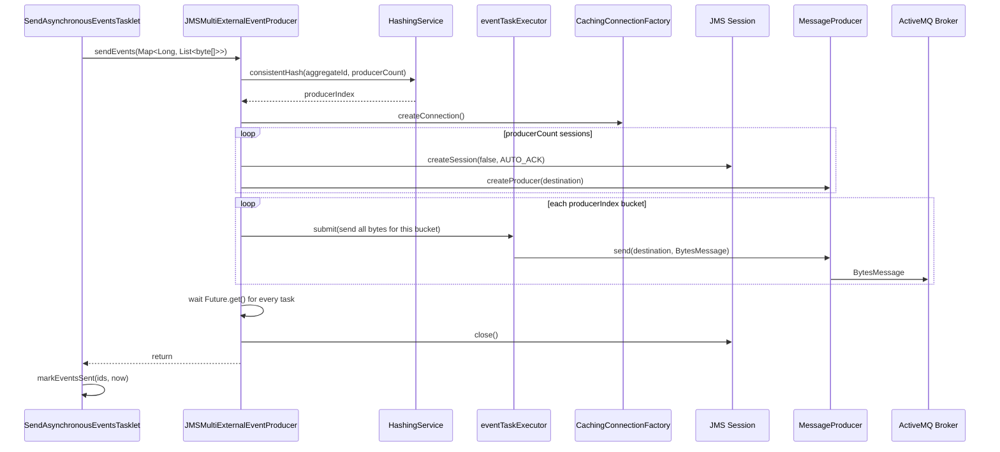

When `fineract.events.external.producer.jms.enabled=true`, the bean `JMSMultiExternalEventProducer` wins the `ExternalEventProducer` slot inside `fineract-provider`. It connects to ActiveMQ via a `CachingConnectionFactory`, fans the per-partition byte arrays across multiple JMS `MessageProducer` instances using a consistent-hash bucket, and waits for all parallel sends to complete before the Spring Batch tasklet marks the rows as `SENT`. Apache Fineract supports both `ActiveMQQueue` and `ActiveMQTopic` destinations — the choice is determined by which `fineract.events.external.producer.jms.event-queue-name` / `event-topic-name` property is non-blank.

<Note>
The JMS path is the legacy / on-prem default. New deployments that need horizontal consumer scaling and partitioned ordering usually prefer Kafka — see [Event Producer (Kafka)](/events/event-producer-kafka). Both producers implement the same `ExternalEventProducer` SPI, so the `SendAsynchronousEventsTasklet` is unaware of the underlying transport.
</Note>

## Conditional activation

```java
// fineract-provider/src/main/java/org/apache/fineract/infrastructure/event/external/producer/jms/JMSMultiExternalEventProducer.java
@Component
@Slf4j
@RequiredArgsConstructor
@ConditionalOnProperty(value = "fineract.events.external.producer.jms.enabled", havingValue = "true")
public class JMSMultiExternalEventProducer implements ExternalEventProducer {
    @Qualifier("externalEventDestination")
    private final Destination destination;

    @Qualifier("externalEventConnectionFactory")
    private final ConnectionFactory connectionFactory;

    private final MessageFactory messageFactory;

    @Qualifier(TaskExecutorConstant.EVENT_TASK_EXECUTOR_BEAN_NAME)
    private final AsyncTaskExecutor taskExecutor;

    private final HashingService hashingService;
    private final FineractProperties fineractProperties;
```

The same `@ConditionalOnProperty` predicate also controls every JMS bean (`ExternalEventJMSConfiguration`, the destination beans, the executor) — flipping the toggle off removes the entire JMS infrastructure from the application context and reactivates the `NoopExternalEventProducer` (or the Kafka producer if its own flag is on).

## Spring wiring

`fineract-provider/.../config/ExternalEventJMSConfiguration.java`:

```java
@Configuration
@ConditionalOnProperty(value = "fineract.events.external.producer.jms.enabled", havingValue = "true")
public class ExternalEventJMSConfiguration {

    @Autowired private FineractProperties fineractProperties;

    @Bean(name = "externalEventConnectionFactory")
    public CachingConnectionFactory connectionFactory() {
        var jmsProps = fineractProperties.getEvents().getExternal().getProducer().getJms();
        ActiveMQConnectionFactory connectionFactory = new ActiveMQConnectionFactory();
        connectionFactory.setBrokerURL(jmsProps.getBrokerUrl());
        connectionFactory.setUseAsyncSend(jmsProps.isAsyncSendEnabled());
        connectionFactory.setTrustAllPackages(true);
        if (jmsProps.isBrokerPasswordProtected()) {
            connectionFactory.setUserName(jmsProps.getBrokerUsername());
            connectionFactory.setPassword(jmsProps.getBrokerPassword());
        }
        CachingConnectionFactory cachingConnectionFactory = new CachingConnectionFactory();
        cachingConnectionFactory.setSessionCacheSize(jmsProps.getProducerCount());
        cachingConnectionFactory.setReconnectOnException(true);
        cachingConnectionFactory.setTargetConnectionFactory(connectionFactory);
        return cachingConnectionFactory;
    }

    @Conditional(EnableExternalEventTopicCondition.class)
    @Bean(name = "externalEventDestination")
    public ActiveMQTopic activeMqTopic() {
        return new ActiveMQTopic(fineractProperties.getEvents().getExternal()
            .getProducer().getJms().getEventTopicName());
    }

    @Conditional(EnableExternalEventQueueCondition.class)
    @Bean(name = "externalEventDestination")
    public ActiveMQQueue activeMqQueue() {
        return new ActiveMQQueue(fineractProperties.getEvents().getExternal()
            .getProducer().getJms().getEventQueueName());
    }

    @Bean(TaskExecutorConstant.EVENT_TASK_EXECUTOR_BEAN_NAME)
    public ThreadPoolTaskExecutor externalEventJmsProducerExecutor() {
        ThreadPoolTaskExecutor threadPoolTaskExecutor = new ThreadPoolTaskExecutor();
        threadPoolTaskExecutor.setCorePoolSize(
            fineractProperties.getEvents().getExternal().getProducer().getJms().getThreadPoolTaskExecutorCorePoolSize());
        threadPoolTaskExecutor.setMaxPoolSize(
            fineractProperties.getEvents().getExternal().getProducer().getJms().getThreadPoolTaskExecutorMaxPoolSize());
        threadPoolTaskExecutor.setThreadNamePrefix("externalEventJms");
        return threadPoolTaskExecutor;
    }
}
```

| Bean                              | Type                                | Purpose                                            |
| --------------------------------- | ----------------------------------- | -------------------------------------------------- |
| `externalEventConnectionFactory`  | `CachingConnectionFactory`          | Wraps `ActiveMQConnectionFactory`; caches sessions with `sessionCacheSize = producerCount`, reconnects on exception |
| `externalEventDestination`        | `ActiveMQTopic` **or** `ActiveMQQueue` | Resolved by which of `event-topic-name` / `event-queue-name` is non-blank |
| `externalEventJmsProducerExecutor`| `ThreadPoolTaskExecutor`            | Worker pool that drives parallel `MessageProducer.send` calls |

### Queue vs topic — the conditional resolution

Two `PropertiesCondition` subclasses decide which destination bean is exposed:

```java
public class EnableExternalEventTopicCondition extends PropertiesCondition {
    @Override
    protected boolean matches(FineractProperties properties) {
        return StringUtils.isNotBlank(properties.getEvents().getExternal()
            .getProducer().getJms().getEventTopicName());
    }
}

public class EnableExternalEventQueueCondition extends PropertiesCondition {
    @Override
    protected boolean matches(FineractProperties properties) {
        return StringUtils.isNotBlank(properties.getEvents().getExternal()
            .getProducer().getJms().getEventQueueName());
    }
}
```

| `event-topic-name` set? | `event-queue-name` set? | Destination wired                                |
| ----------------------- | ----------------------- | ------------------------------------------------ |
| ✅                      | ❌                      | `ActiveMQTopic(eventTopicName)`                  |
| ❌                      | ✅                      | `ActiveMQQueue(eventQueueName)`                  |
| ✅                      | ✅                      | Both beans defined under the same bean name `externalEventDestination` — Spring fails on duplicate. Pick one. |
| ❌                      | ❌                      | No destination bean — `JMSMultiExternalEventProducer` fails to wire. |

For consumer-side semantics:

| Destination | Fan-out                                                            |
| ----------- | ------------------------------------------------------------------ |
| Topic       | Every subscriber receives every message (pub/sub)                  |
| Queue       | Exactly-one consumer drains the queue (work distribution)          |

## Properties

Defaults from `fineract-provider/src/main/resources/application.properties`:

| Property                                                                  | Default                  | Effect                                                                  |
| ------------------------------------------------------------------------- | ------------------------ | ----------------------------------------------------------------------- |
| `fineract.events.external.producer.jms.enabled`                           | `false`                  | Master switch — must be `true` for the bean to exist                    |
| `fineract.events.external.producer.jms.async-send-enabled`                | `false`                  | Sets `ActiveMQConnectionFactory.setUseAsyncSend(...)` — when true, the producer doesn't wait for the broker ack per message |
| `fineract.events.external.producer.jms.event-queue-name`                  | (empty)                  | When non-blank, wires `ActiveMQQueue`                                   |
| `fineract.events.external.producer.jms.event-topic-name`                  | (empty)                  | When non-blank, wires `ActiveMQTopic`                                   |
| `fineract.events.external.producer.jms.broker-url`                        | `tcp://127.0.0.1:61616`  | ActiveMQ broker URL — supports `failover://(tcp://a:61616,tcp://b:61616)?…` |
| `fineract.events.external.producer.jms.broker-username`                   | (empty)                  | Optional ActiveMQ user                                                  |
| `fineract.events.external.producer.jms.broker-password`                   | (empty)                  | Optional ActiveMQ password                                              |
| `fineract.events.external.producer.jms.producer-count`                    | `1`                      | Parallel `MessageProducer` instances per send; drives consistent-hash buckets and session cache size |
| `fineract.events.external.producer.jms.thread-pool-task-executor-core-pool-size` | `10`              | Core threads in the producer executor (overrides the shared `FINERACT_EVENT_TASK_EXECUTOR_CORE_POOL_SIZE`) |
| `fineract.events.external.producer.jms.thread-pool-task-executor-max-pool-size`  | `100`             | Max threads in the producer executor                                    |

`isBrokerPasswordProtected()` returns true when either username or password is non-blank:

```java
public boolean isBrokerPasswordProtected() {
    return StringUtils.isNotBlank(brokerUsername) || StringUtils.isNotBlank(brokerPassword);
}
```

## Send pipeline

```java
@Override
public void sendEvents(Map<Long, List<byte[]>> partitions) throws AcknowledgementTimeoutException {
    Map<Integer, List<byte[]>> indexedPartitions = mapPartitionsToProducers(partitions);
    measure(() -> {
        List<Pair<Session, MessageProducer>> producersWithSessions = obtainProducers();
        List<MessageProducer> producers = producersWithSessions.stream().map(Pair::getRight).collect(toList());
        List<Session> sessions = producersWithSessions.stream().map(Pair::getLeft).collect(toList());
        List<Future<?>> tasks = sendPartitions(indexedPartitions, producers);
        waitForSendingCompletion(tasks);
        closeSessions(sessions);
    }, timeTaken -> {
        if (log.isDebugEnabled()) {
            int eventCount = partitions.values().stream().map(Collection::size).reduce(0, Integer::sum);
            int msgPerSec = (int) (((double) eventCount / timeTaken.toMillis()) * 1000);
            log.debug("Sent messages with {} msg/s", msgPerSec);
        }
    });
}
```

### Step 1 — `mapPartitionsToProducers`

The send job hands the producer a `Map<Long, List<byte[]>>` where the key is `aggregate_root_id` (or `-1L` for `null`). The producer then collapses these per-aggregate buckets onto `producerCount` JMS sessions using consistent hashing:

```java
private Map<Integer, List<byte[]>> mapPartitionsToProducers(Map<Long, List<byte[]>> partitions) {
    Map<Integer, List<byte[]>> indexedPartitions = new HashMap<>();
    for (Map.Entry<Long, List<byte[]>> partition : partitions.entrySet()) {
        Long key = partition.getKey();
        List<byte[]> messages = partition.getValue();
        int producerIndex = hashingService.consistentHash(key, getProducerCount());
        indexedPartitions.putIfAbsent(producerIndex, new ArrayList<>());
        indexedPartitions.get(producerIndex).addAll(messages);
    }
    return indexedPartitions;
}
```

`HashingService.consistentHash(key, buckets)` maps the aggregate ID stably to a producer index — so all events for `loan_id = 17` always go through the same producer / session and arrive at the broker in submission order.

### Step 2 — `obtainProducers`

```java
private List<Pair<Session, MessageProducer>> obtainProducers() {
    List<Pair<Session, MessageProducer>> result = new ArrayList<>();
    int producerCount = getProducerCount();
    try {
        Connection connection = connectionFactory.createConnection();
        for (int i = 0; i < producerCount; i++) {
            // It's crucial to create the session within the loop, otherwise the producers won't be handled as parallel producers
            Session session = connection.createSession(false, Session.AUTO_ACKNOWLEDGE);
            MessageProducer producer = session.createProducer(destination);
            result.add(new ImmutablePair<>(session, producer));
        }
    } catch (JMSException e) {
        throw new RuntimeException("Error while obtaining message producers", e);
    }
    return result;
}
```

- Connection comes from the `CachingConnectionFactory` so it's pooled.
- Sessions are **non-transacted** (`createSession(false, ...)`) with `AUTO_ACKNOWLEDGE` — the broker acknowledges as soon as the message is received.
- The comment in the source code is important: creating the session inside the loop is what makes `producerCount` sessions truly parallel, instead of sharing one session.

### Step 3 — `sendPartitions`

```java
private List<Future<?>> sendPartitions(Map<Integer, List<byte[]>> indexedPartitions, List<MessageProducer> producers) {
    List<Future<?>> tasks = new ArrayList<>();
    for (Map.Entry<Integer, List<byte[]>> entry : indexedPartitions.entrySet()) {
        Integer producerIndex = entry.getKey();
        MessageProducer producer = producers.get(producerIndex);
        List<byte[]> messages = entry.getValue();
        Future<?> future = createSendingTask(producer, messages);
        tasks.add(future);
    }
    return tasks;
}

private Future<?> createSendingTask(MessageProducer messageProducer, List<byte[]> messages) {
    return taskExecutor.submit(() -> {
        for (byte[] message : messages) {
            try {
                messageProducer.send(destination, messageFactory.createByteMessage(message));
            } catch (JMSException e) {
                throw new RuntimeException("Error while sending the message", e);
            }
        }
    });
}
```

Each producer's batch is submitted to `taskExecutor` (the bean `eventTaskExecutor`) as a single task — the worker walks the list and `send`s sequentially **on that producer**. So per-aggregate ordering is preserved while throughput scales with `producer-count`.

### Step 4 — `waitForSendingCompletion` and `closeSessions`

```java
private void waitForSendingCompletion(List<Future<?>> tasks) {
    try {
        for (Future<?> task : tasks) task.get();
    } catch (Exception e) {
        throw new RuntimeException(e);
    }
}

private void closeSessions(List<Session> sessions) {
    // The sessions retrieved from a CachingConnectionFactory needs to be explicitly closed,
    // otherwise we're making orphan sessions, leaking memory
    for (Session session : sessions) {
        try {
            session.close();
        } catch (JMSException e) {
            log.error("Exception while trying to close sessions", e);
        }
    }
}
```

Important details:

- The producer blocks until **every** parallel `send` has returned. The `SendAsynchronousEventsTasklet` is the only call site, and it then runs `markEventsSent(ids, now)`.
- Sessions from `CachingConnectionFactory` look pooled but in fact need explicit `close()` after use — the cache only reuses *closed* sessions. Forgetting this leaks memory in long-running deployments.

## Sequence diagram



## Message body

The byte payload handed to JMS is the `MessageV1` envelope produced by `MessageFactory.createMessage(externalEvent)` and then converted to `byte[]` by `ByteBufferConverter`. The producer wraps that in a JMS `BytesMessage` via `MessageFactory.createByteMessage(byte[])` (the **JMS** `MessageFactory`, not the Avro one — both share the name in different packages).

Inside the envelope (`org.apache.fineract.avro.MessageV1.avsc`):

| Field             | Source                                  |
| ----------------- | --------------------------------------- |
| `id`              | `m_external_event.id`                   |
| `source`          | Per-JVM `UUID.randomUUID()`             |
| `type`            | `m_external_event.type`                 |
| `category`        | `m_external_event.category`             |
| `createdAt`       | `m_external_event.created_at`           |
| `businessDate`    | `m_external_event.business_date`        |
| `tenantId`        | `ThreadLocalContextUtil.getTenant().getTenantIdentifier()` |
| `idempotencyKey`  | `m_external_event.idempotency_key`      |
| `dataschema`      | `m_external_event.schema`               |
| `data`            | `m_external_event.data` (Avro payload bytes) |

Consumers should always parse `MessageV1` first, then resolve `dataschema` to an Avro class to decode the inner record. See [Avro Schemas](/events/avro-schemas).

## Operational sizing guide

The number of parallel sessions per send is `producer-count`, while the executor that runs them has `thread-pool-task-executor-{core,max}-pool-size`. Sensible defaults:

| Scenario                                                  | `producer-count` | Executor core / max |
| --------------------------------------------------------- | ---------------- | ------------------- |
| Single-tenant POC                                         | 1                | 10 / 100            |
| Light SMB deployment                                      | 2–4              | 10 / 100            |
| Heavy multi-tenant production with high COB fan-out       | 8–16             | 32 / 256            |

A `producer-count` larger than the executor's `core-pool-size` is wasteful — extra producers will queue against the executor and not gain parallelism. A larger executor than `producer-count` is also wasteful — there are at most `producer-count` parallel tasks per `sendEvents` call.

## Failure modes

| Scenario                                              | Behaviour                                                                |
| ----------------------------------------------------- | ------------------------------------------------------------------------ |
| Broker unreachable                                    | `Connection.createSession` throws; the tasklet logs and leaves rows `TO_BE_SENT` |
| Broker accepts then crashes mid-batch                 | Some sends throw `JMSException`; `Future.get()` propagates; tasklet logs; rows for the entire batch remain `TO_BE_SENT` until the next run |
| `async-send-enabled = true` and broker silently drops | Producer-side returns quickly; **at-most-once for that subset** — only safe with a durable subscriber |
| Topic vs queue mismatch with consumer                 | Consumer reads zero messages; check `event-topic-name` / `event-queue-name` are aligned across deployments |
| Producer leaks (forgot `closeSessions`)               | Long-running JVM grows JMS session count; not possible in current code (always closed) but a hazard if you fork |

## Related reading

- [Events Overview](/events/overview)
- [External Event Domain](/events/external-event-domain)
- [Event Producer (Kafka)](/events/event-producer-kafka)
- [Purge & Send Jobs](/events/purge-events-job)
- [Avro Schemas](/events/avro-schemas)
- [Core: External Events](/core/event-external)
- [External Event Flow](/flows/external-event-flow)
- [Spring Batch Manager/Worker](/jobs/spring-batch-manager-worker)
